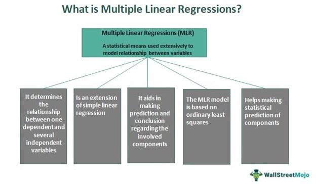

In the fast-paced world of financial analysis and algorithmic trading, understanding key concepts such as valuation metrics and multiple compression is crucial. Financial analysis serves as the backbone of informed investment decisions, guiding traders, investors, and analysts through the complexities of modern markets. Algorithmic trading, characterized by its reliance on computer algorithms to execute trades at speeds and frequencies beyond human capability, has made the comprehension of valuation metrics and market dynamics even more critical.

Valuation metrics are fundamental tools for assessing a company's worth relative to its financial health. These metrics, such as the Price-to-Earnings (P/E) ratio, Enterprise Value to EBITDA (EV/EBITDA), and Price-to-Book (P/B) ratio, provide investors with a quantitative framework for comparing businesses within and across industries.



Multiple compression, on the other hand, refers to scenarios where a company's valuation multiple decreases despite stable or growing earnings. This phenomenon often reflects changes in investor sentiment or broader market trends, making it an essential factor to consider in investment analysis. By recognizing and interpreting instances of multiple compression, investors can better understand potential risks and opportunities in the financial markets.

This article explores the intricacies of these concepts, their significance, and their interplay within financial markets. As valuation metrics and multiple compression form the core of financial evaluation, a thorough understanding of these elements is indispensable for crafting effective trading strategies and navigating the turbulent waters of the investment landscape.

## Table of Contents

## Understanding Valuation Metrics

Valuation metrics are essential instruments employed in financial analysis to gauge a company's value in relation to its financial performance. These metrics serve as a bridge for investors to evaluate and compare companies both within the same industry and across different sectors. By understanding these metrics, investors can make more informed decisions about the potential profitability and viability of their investments.

One of the most prevalent valuation metrics is the Price-to-Earnings (P/E) ratio. This ratio is calculated by dividing a company's current share price by its earnings per share (EPS). The P/E ratio provides insight into how much investors are willing to pay for a dollar of earnings, reflecting market expectations regarding a company's future growth. A higher P/E ratio may suggest that investors anticipate stronger future growth potential, while a lower P/E could indicate that the market views the company as undervalued or facing uncertainties.

Another critical metric is the Enterprise Value to EBITDA (EV/EBITDA) ratio. This ratio compares a company's enterprise value—an aggregate measure of its market capitalization, debt, and cash positions—to its earnings before interest, taxes, depreciation, and amortization. The EV/EBITDA ratio is particularly useful for comparing companies with different capital structures, as it provides a clearer picture of the company's operational performance and value.

The Price-to-Book (P/B) ratio is yet another widely used valuation metric. It is calculated by dividing a company's market capitalization by its book value, or the value of its total assets minus its liabilities. The P/B ratio allows investors to assess how a company's market value stands against its net asset value, offering insights into whether a stock is undervalued or overvalued in relation to its actual net worth.

Each of these valuation metrics serves a unique purpose, and their relevance may vary across industries and market conditions. For instance, while the P/E ratio might be more relevant for companies with significant earnings, the P/B ratio might be more suitable for asset-heavy industries like manufacturing or real estate. Consequently, investors often use a combination of these metrics to obtain a holistic view of a company's financial health and investment potential.

## What is Multiple Compression?

Multiple compression refers to a phenomenon where a company's financial valuation multiple, such as the Price-to-Earnings (P/E) ratio, diminishes even when its earnings remain stable or increase. This occurrence often signals a shift in investor expectations or a broader change in market sentiment. 

To comprehend multiple compression, one must first recognize the significance of financial multiples in valuation. Multiples are ratios derived from a company's financial figures, like earnings or book value, and are used to assess its market value. For instance, the P/E ratio is calculated as:

$$
\text{P/E Ratio} = \frac{\text{Market Price per Share}}{\text{Earnings per Share (EPS)}}
$$

In the case of multiple compression, despite stable or increasing EPS, if investor sentiment shifts negatively or if market conditions change, the market price per share might decrease or increase less proportionally compared to the EPS. This results in a lower P/E ratio, which can reflect a revaluation of the company's perceived growth potential or risk profile.

Multiple compression can serve as an indicator of several underlying factors. It may suggest that investors are anticipating slower future growth, macroeconomic challenges, or industry-specific issues that could affect the company's performance. Alternatively, it could point to broader market trends, such as rising interest rates or increased geopolitical risks, which might lead investors to demand higher returns for the perceived risk, thus lowering the acceptable multiples.

Understanding the drivers behind multiple compression is crucial for investors as it provides critical insights into market conditions and potential investment risks. By recognizing these shifts, investors can make more informed decisions, adapting their strategies to align with changing market dynamics. Such an understanding not only aids in evaluating company performance but also assists in managing portfolio risks by projecting future valuation changes.

## Financial Analysis in the Context of Multiple Compression

Financial analysts utilize valuation metrics to assess how multiple compression affects a company's value. Multiple compression, a phenomenon where a company’s valuation multiple declines despite stable or growing earnings, can significantly influence investment decisions and portfolio management. To evaluate these impacts, analysts consider several critical factors including market trends, company performance, and investor sentiment.

Market trends are a vital component in understanding multiple compression. Analysts examine macroeconomic indicators, industry cycles, and competitive dynamics to predict how these elements might shift investor sentiment and subsequently affect valuation multiples. For instance, if a sector experiences regulatory challenges or a slowdown in growth, even robust companies within that sector might suffer from multiple compression as market sentiment shifts unfavorably.

Company performance is equally crucial. Financial analysts scrutinize a company's revenue growth, profitability margins, and operational efficiency. These financial metrics provide context to valuation multiples and help in identifying whether a decline in multiples is justified by deteriorating performance or if it is an overreaction by the market. For example, a company with consistently increasing revenue and strong cash flow generation might still experience multiple compression due to external market factors, rather than internal weaknesses.

Investor sentiment, often measured through market surveys, stock price [volatility](/wiki/volatility-trading-strategies), and trading volumes, plays a pivotal role in multiple compression. Sentiment analysis tools can parse large datasets from news articles, social media, and financial reports to gauge overall market mood. Past stock market trends have shown that overly optimistic or pessimistic views can lead to temporary mispricing of stocks. Understanding these sentiment dynamics allows analysts to predict possible future shifts in valuation.

The integration of these factors into financial modeling is essential. For analysts looking to quantify the impact of multiple compression, formulas such as:

$$
\text{New Price} = \frac{\text{Current Earnings} \times \text{Old Multiple}}{\text{New Multiple}}
$$

can be used to estimate the potential changes in stock price resulting from fluctuations in earnings multiples. This model provides a structured approach to adjust valuations based on expected changes in market sentiment and performance indicators.

Effective financial analysis in the context of multiple compression is indispensable for making informed investment decisions. It helps in navigating market volatility by allowing investors and portfolio managers to anticipate and respond to shifts in valuation. By maintaining a comprehensive understanding of market trends, company performance, and investor sentiment, stakeholders can better manage the risks associated with multiple compression and optimize their strategies for varied market conditions.

## The Role of Algorithmic Trading

Algorithmic trading employs computer programs engineered to [carry](/wiki/carry-trading) out trades grounded on predefined criteria, with valuation metrics often playing a pivotal role. These programs can analyze vast amounts of financial data at speeds unattainable by human traders, executing trades based on real-time calculations involving metrics such as the Price-to-Earnings (P/E) ratio, Enterprise Value to EBITDA (EV/EBITDA), and other relevant financial indicators.

When considering the phenomenon of multiple compression, [algorithmic trading](/wiki/algorithmic-trading) systems can be fine-tuned to recognize patterns and shifts in these valuation metrics. Multiple compression occurs when a company’s financial multiples, such as the P/E ratio, contract even though earnings remain stable or are on the rise. This situation often suggests shifts in investor outlook or broader market sentiment dynamics.

Integrating insights about multiple compression into algorithmic trading systems can enhance their efficiency and profitability. For example, algorithms can be programmed to identify anomalies or trends in historical data that might precede multiple compression events. By doing so, these algorithms can adjust trading strategies proactively, possibly avoiding adverse market exits or capitalizing on undervalued opportunities.

To harness these insights, developers might use [machine learning](/wiki/machine-learning) techniques or statistical models to augment traditional rule-based trading strategies. For instance, an algorithm could be designed in Python as follows:

```python
import numpy as np
from sklearn.ensemble import RandomForestClassifier

# Sample training data: 'features' could include various valuation metrics
features = np.array([[10, 1.5, 8], [11, 1.7, 7.5], [9, 1.3, 9]])  # P/E, EV/EBITDA, etc.
labels = np.array([0, 1, 0])  # 0 = No compression, 1 = Compression

# Initializing and training the model
model = RandomForestClassifier()
model.fit(features, labels)

# Sample new data point for prediction
new_data = np.array([[10.5, 1.6, 8.5]])
compression_prediction = model.predict(new_data)

if compression_prediction == 1:
    print("Anticipate multiple compression. Adjust trading strategy accordingly.")
else:
    print("No compression detected. Proceed with current strategy.")
```

This script demonstrates a simple framework where an algorithm could predict occurrences of multiple compression, allowing traders to adjust their strategies preemptively.

Incorporating such forward-looking analysis enhances an algorithm’s capability to handle potential value shifts, making trading decisions more strategic and potentially more profitable. By anticipating market conditions and valuation trends, algorithmic trading systems can better navigate the complexities of financial markets, optimizing returns while managing risk adeptly.

## Strategies to Manage Multiple Compression

Investors aiming to manage multiple compression effectively can adopt several strategies, integrating both diversification and adjustments in valuation models. Diversifying portfolios is a foundational approach, spreading investments across various asset classes and sectors to reduce the overall impact of valuation declines in any single area. This strategy not only balances risk but also offers the potential for stable returns when certain sectors or asset classes face compressed multiples.

Adjusting valuation models is another critical strategy. Investors must reassess and recalibrate these models to better reflect current market conditions, investor sentiment, and financial performance. This involves updating the assumptions and inputs used in valuation calculations, such as growth rates, discount rates, and profit margins. For instance, substituting optimistic growth projections with more conservative estimates can provide a more realistic view of a company's value amidst market volatility.

Staying informed about market trends and leveraging advanced analytics are imperative for mitigating risks associated with multiple compression. Continuous monitoring of economic indicators, industry performance, and geopolitical developments can offer early warnings of shifting market sentiments. Employing analytics tools and platforms enhances the ability to process vast amounts of data, uncover hidden patterns, and make data-driven decisions. Analytical frameworks such as regression analysis or machine learning algorithms can forecast potential shifts in market conditions, allowing investors to preemptively adjust their strategies.

Maintaining a balanced approach that integrates quantitative data and qualitative factors is crucial. Quantitative analysis, involving statistical and mathematical tools, helps in deriving objective insights about market trends and valuations. Simultaneously, qualitative analysis, such as evaluating management effectiveness, competitive advantages, and industry positioning, provides a comprehensive understanding of potential risks and opportunities. Combining these perspectives ensures a holistic view, preparing investors to navigate the complexities of financial markets with agility and resilience.

## Conclusion

Understanding valuation metrics and multiple compression is vital for financial analysts, investors, and traders. Valuation metrics like the Price-to-Earnings (P/E) ratio and Enterprise Value to EBITDA (EV/EBITDA) provide essential insights into a company's financial health and market position. When incorporated into comprehensive financial analysis and trading strategies, these metrics allow stakeholders to anticipate potential shifts in a company’s value and market performance, thereby enhancing their decision-making processes. 

Multiple compression presents both challenges and opportunities. It often signals a reassessment in investor expectations or a broader market shift, prompting the need for strategic responsiveness. By recognizing indicators of multiple compression, such as declining P/E ratios during stable earnings periods, professionals can adjust their approaches proactively. This adaptability is crucial for managing potential risks in portfolio management and for refining algorithmic trading systems, where rapid execution of trades based on valuation insights can lead to more profitable outcomes.

Staying informed and agile in response to market changes is key to navigating the complexities of modern financial markets. This involves continually updating valuation models and integrating real-time data analytics to maintain an accurate view of market trends. By embracing a strategy that combines both quantitative data and qualitative analysis, investors can better position themselves amid fluctuating market conditions. Ultimately, the dynamic interplay between valuation metrics and multiple compression requires a nuanced understanding and agile approach to leverage these financial concepts for successful investment and trading outcomes.

## References & Further Reading

[1]: Damodaran, A. (2012). ["Investment Valuation: Tools and Techniques for Determining the Value of Any Asset."](https://archive.org/details/investmentvaluat0000damo_n6k9) John Wiley & Sons.

[2]: ["Algorithmic Trading: Winning Strategies and Their Rationale"](https://www.wiley.com/en-us/Algorithmic+Trading%3A+Winning+Strategies+and+Their+Rationale-p-9781118460146) by Ernie Chan

[3]: Koller, T., Goedhart, M., & Wessels, D. (2020). ["Valuation: Measuring and Managing the Value of Companies."](https://www.mckinsey.com/capabilities/strategy-and-corporate-finance/our-insights/valuation-measuring-and-managing-the-value-of-companies) John Wiley & Sons.

[4]: Asness, C., Frazzini, A., & Pedersen, L. H. (2018). ["Quality Minus Junk."](https://papers.ssrn.com/sol3/papers.cfm?abstract_id=2312432) The Review of Financial Studies, 31(4), 1420-1464.

[5]: ["Equity Valuation and Analysis with EVal"](https://www.amazon.com/Equity-Valuation-Analysis-w-eVal/dp/0073526894) by Russell Lundholm and Richard Sloan