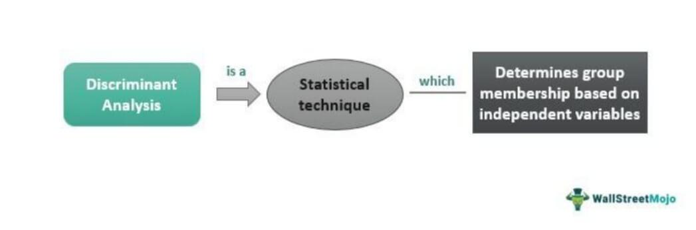

Multiple Discriminant Analysis (MDA) is an essential statistical tool pivotal to enhancing financial analysis and guiding investment decision-making processes. As financial markets continue to grow in complexity, the ability to accurately classify and evaluate multiple variables becomes increasingly important. MDA provides a robust framework for such assessments, particularly in the fields of statistical classification and algorithmic trading.

MDA facilitates the reduction of variance within large datasets of securities, allowing financial analysts to focus on the most pertinent data points. By compressing variance, MDA aids in uncovering the underlying structure of financial data, revealing critical insights that might otherwise remain obscured. This dimension-reduction capability is crucial in contexts where analysts need to distill vast amounts of data into actionable intelligence.



The application of MDA in financial strategies epitomizes the combination of advanced statistical techniques with contemporary investment methodologies. In algorithmic trading, for instance, MDA is employed to increase the accuracy and efficiency of trading algorithms, ensuring they are responsive to rapid changes in market conditions. This underscores the growing significance of MDA in navigating today’s complex financial landscapes, as it offers a mathematical approach that enriches traditional financial analysis.

By exploring the integration of MDA in these domains, this article will provide a comprehensive understanding of how this analytical technique not only sharpens investment evaluation but also enhances the efficacy of modern trading strategies.

## Table of Contents

## Understanding Multiple Discriminant Analysis (MDA)

Multiple Discriminant Analysis (MDA) is a sophisticated statistical technique within the broader category of discriminant analysis, designed to evaluate datasets that encompass multiple variables. The primary objective of MDA is to develop a predictive model that can classify a given set of observations into predefined categories based on their measurements on multiple features. By doing so, MDA achieves a dimension reduction that facilitates clearer categorization of data.

### Core Principles

At its core, MDA operates by identifying a linear combination of variables that maximize the separation between multiple classes. This process involves determining a set of discriminant functions, each of which is a linear function of the variables. Mathematically, a discriminant function can be represented as:

$$

D_k = w_1x_1 + w_2x_2 + ... + w_nx_n 
$$

where $D_k$ represents the kth discriminant function, $x_i$ denotes the values of the independent variables, and $w_i$ are the weights associated with each variable. The coefficients $w_i$ are chosen to maximize the ratio of between-class variance to within-class variance, thereby enhancing the distinction between categories.

### Application in Finance

In financial analysis, MDA is particularly valued for its capacity to manage and interpret large, multidimensional datasets, which is crucial for investment assessments. It aids in reducing the variance among securities by grouping them effectively into homogenous categories based on financial performance metrics. This grouping assists analysts in identifying patterns and trends that might not be evident when examining securities individually.

For financial professionals, MDA's ability to highlight the most informative variables while suppressing those less relevant is crucial. Suppose a financial analyst is evaluating stocks based on multiple factors such as P/E ratio, market cap, and dividend yield. MDA can weigh these variables differently and combine them into a discriminant score, which simplifies the complex dataset into a more understandable form, potentially revealing which stocks are more similar in terms of their investment characteristics.

### Implementation Considerations

Understanding the mechanics of MDA requires acknowledgment of its assumptions and limitations. For effective implementation, practitioners must ensure that the data meets certain prerequisites, such as the multivariate normality of independent variables and homogeneity of covariance matrices. Deviations from these assumptions may affect the reliability and generalizability of the analysis.

In summary, Multiple Discriminant Analysis is a powerful tool for financial analysts aiming to sift through extensive datasets. By classifying and grouping relevant financial metrics, MDA aids in constructing more efficient and insightful investment assessments, establishing a clearer understanding of market behaviors and securities potential.

## Applications of MDA in Financial Analysis

Multiple Discriminant Analysis (MDA) plays a significant role in financial analysis, offering a robust framework for classifying investments based on a multitude of factors. This statistical technique aids in transforming complex financial data into actionable insights, contributing to enhanced decision-making processes.

One of the primary applications of MDA in finance is its employment in constructing Markowitz efficient sets. The Markowitz Efficient Frontier is a fundamental concept in modern portfolio theory, representing portfolios that provide the maximum expected return for a given level of risk. By employing MDA, financial analysts can optimize investment portfolios to achieve a desirable balance between return and risk. MDA helps in differentiating securities that contribute positively to a portfolio's efficiency from those that do not, allowing for the construction of portfolios that align with investors' risk-return profiles. Mathematically, the objective is to maximize the Sharpe Ratio $\frac{E[R_p] - R_f}{\sigma_p}$, where $E[R_p]$ is the expected portfolio return, $R_f$ is the risk-free rate, and $\sigma_p$ is the standard deviation of portfolio returns.

MDA further aids in focusing on critical data points, thereby enhancing the process of selecting securities characterized by favorable [volatility](/wiki/volatility-trading-strategies) and historical performance. Volatility, a measure of risk, is a key [factor](/wiki/factor-investing) in assessing an investment's suitability. By employing MDA, analysts can segregate securities into distinct classes based on their volatility characteristics, thus identifying those with a history of stable yet favorable returns. This capability is particularly valuable in volatile markets, where risk management is as crucial as return generation.

Financial ratios, such as price-to-earnings (P/E), return on equity (ROE), and debt-to-equity (D/E) ratios, can be integrated into MDA to further refine investment evaluations. These ratios provide insights into a company's financial health and operational efficiency. MDA leverages these metrics to classify companies into different categories, facilitating targeted investment strategies. For instance, companies with high ROE and manageable levels of debt may be classified differently from those with lower financial robustness, helping investors to tailor their portfolio compositions according to specific financial strategies.

In practice, implementing MDA involves statistical software tools that can handle multivariate data analysis. Libraries like `scikit-learn` in Python provide functionalities to apply MDA effectively. Below is a simple Python example illustrating the basic application of Linear Discriminant Analysis (LDA), a related technique, to classify investment data:

```python
from sklearn.discriminant_analysis import LinearDiscriminantAnalysis
import numpy as np

# Sample dataset: Features are financial metrics, target is an investment classification
X = np.array([[15, 10, 3],
              [10, 25, 5],
              [22, 28, 8],
              [35, 30, 12],
              [40, 45, 10]])
y = np.array([0, 1, 0, 1, 1])  # Binary classification representing different investment categories

# Initialize LDA model
lda = LinearDiscriminantAnalysis()

# Fit the model
lda.fit(X, y)

# Make predictions
new_data = np.array([[20, 15, 4]])
prediction = lda.predict(new_data)

print(f'Predicted investment category: {prediction[0]}')
```

Through the integration of MDA in financial analysis, professionals can systematically classify investments, optimize portfolios, and derive insights from financial metrics, thereby enabling more informed and strategic investment decisions. As the financial landscape continues to evolve, the applications of MDA are likely to expand, remaining vital to the development of advanced investment methodologies.

## MDA in Algorithmic Trading

Algorithmic trading, characterized by using computer algorithms to execute trades, often involves processing and analyzing extensive datasets to identify trading opportunities. Multiple Discriminant Analysis (MDA), a statistical classification technique, plays a critical role in enhancing the precision and efficiency of these trading algorithms. The principal utility of MDA in this context is its robust classification abilities, which are essential for developing models capable of adapting to dynamic market conditions.

MDA enhances [algorithmic trading](/wiki/algorithmic-trading) systems by performing efficient data compression, enabling rapid analysis of large financial datasets. This compression is achieved through the reduction of dimensionality, where MDA helps to identify and focus on the most significant variables. By compressing variance and emphasizing critical data points, MDA allows trading algorithms to respond promptly to profitable opportunities.

Consider a scenario where an MDA model classifies securities based on various financial indicators, such as moving averages and relative strength indexes. The MDA model assigns each security to distinct groups, identifying those with characteristics indicative of potential growth. This classification helps in predicting favorable market movements and executing trades accordingly.

The integration of MDA in algorithmic trading exemplifies the synergy between advanced statistical analysis and automated trading strategies. By continually updating classifications with market data, MDA-equipped algorithms can swiftly recalibrate to reflect changes in the trading environment. This adaptability is crucial for sustaining performance and managing risks in volatile markets.

In practice, the use of MDA in algorithmic trading necessitates a detailed understanding of trading strategies and market variables. Python, a popular language in finance, can be utilized for implementing MDA models. Here's a simplified example:

```python
from sklearn.discriminant_analysis import LinearDiscriminantAnalysis
import numpy as np

# Example data
features = np.array([[5.1, 3.5, 1.4, 0.2],
                     [4.9, 3.0, 1.4, 0.2],
                     [6.2, 3.4, 5.4, 2.3],
                     [5.9, 3.0, 5.1, 1.8]])
labels = np.array([0, 0, 1, 1])

# Implementing MDA
lda = LinearDiscriminantAnalysis()
lda.fit(features, labels)

# Prediction
new_data = np.array([[5.0, 3.6, 1.4, 0.3]])
predicted_class = lda.predict(new_data)
print(f"Predicted class for the new data point: {predicted_class}")
```

In this code, `LinearDiscriminantAnalysis` from the `sklearn` library simplifies implementing MDA for classification purposes. While the example uses simplified data, similar processes are used for handling complex market datasets, enabling traders to make informed decisions based on rigorous statistical analysis. Differentiating itself from other classification techniques, MDA's effectiveness in algorithmic trading lies in its ability to prioritize relevant data, thereby facilitating swift and accurate trade decisions.

## Challenges and Considerations

Multiple Discriminant Analysis (MDA) is a sophisticated statistical tool that plays an instrumental role in financial analysis, yet its application comes with distinct challenges and considerations. One of the primary challenges in utilizing MDA is avoiding overfitting, a scenario where a model learns not just the genuine signal but also the noise specific to the training data, making it less generalizable to new, unseen data. Overfitting can be mitigated by employing techniques such as cross-validation and regularization, which help maintain a balance between model complexity and predictive power.

The quality and relevancy of input data are pivotal factors influencing the effectiveness of MDA. High-quality data, characterized by accuracy, completeness, and timeliness, ensures that the discriminant functions accurately reflect the true underlying structure of the dataset. Relevancy concerns ensuring that the selected variables for analysis genuinely contribute to distinguishing between groups within the dataset. Irrelevant or noisy variables can lead to poor predictive performance and skewed results, underlining the need for careful data preprocessing and variable selection.

Understanding MDA's inherent limitations is crucial for accurate analysis. One significant limitation is its assumption of multivariate normality and equal covariance matrices across groups, which may not hold in real-world datasets. Violations of these assumptions can lead to biased results and misclassification. Moreover, the potential for data misclassification should not be underestimated, as incorrect classification can lead to erroneous investment decisions. The impact of misclassification error can be reduced by validating the model using a test set and implementing robust evaluation metrics.

The field of MDA is dynamic, with ongoing research continually refining and enhancing its applications. Advancements in computational power and statistical methodologies contribute to the development of more sophisticated MDA techniques capable of handling larger, more complex datasets efficiently. Techniques such as ensemble learning and [machine learning](/wiki/machine-learning) integration are being explored to improve classification accuracy and robustness. Additionally, research into alternative methods for estimating covariance matrices and discriminant functions aims to address the limitations posed by traditional MDA assumptions.

In conclusion, while MDA is a powerful analytical tool in financial contexts, its application necessitates a thorough understanding of its challenges and considerations to yield reliable and actionable insights. Leveraging advancements in statistical techniques and embracing a conscientious approach to data quality and model validation will enable professionals to effectively harness the potential of MDA in financial analysis and decision-making processes.

## Conclusion

Multiple Discriminant Analysis (MDA) remains an essential tool for financial analysts and traders maneuvering through intricate datasets. This technique exhibits considerable adaptability by compressing variance across multiple dimensions and refining classification processes, which in turn supports sound investment decisions. By selecting crucial variables and mitigating the influence of noise or irrelevant data, MDA allows professionals to draw more accurate conclusions from financial analyses. 

As the scope of financial technologies expands, MDA's influence in algorithmic trading and broader investment assessment is poised to grow. Its ability to manage and interpret vast quantities of data efficiently makes it a valuable asset in developing models that react to market dynamics promptly. The confluence of sophisticated statistical methodologies like MDA and automated trading strategies epitomizes the potential for innovative financial tools.

To harness the full potential of MDA, practitioners must deeply understand its underlying principles and apply them judiciously in practice. Acknowledging the prerequisites of MDA, such as the need for high-quality, relevant data and awareness of the risks like overfitting or data misclassification, is vital. As ongoing research and developments in [statistics](/wiki/bayesian-statistics) continue to refine MDA's applicability, its role as a cornerstone technique will likely strengthen.

## References & Further Reading

[1]: Fisher, R. A. (1936). ["The Use of Multiple Measurements in Taxonomic Problems."](https://onlinelibrary.wiley.com/doi/abs/10.1111/j.1469-1809.1936.tb02137.x) Annals of Eugenics.

[2]: Altman, E. I. (1968). ["Financial Ratios, Discriminant Analysis and the Prediction of Corporate Bankruptcy."](https://www.calctopia.com/papers/Altman1968.pdf) The Journal of Finance.

[3]: Rennie, J. D. M. (2005). ["Feature selection for text classification."](https://dspace.mit.edu/handle/1721.1/7074) European Conference on Information Retrieval.

[4]: Hair, J. F., Black, W. C., Babin, B. J., & Anderson, R. E. (2010). ["Multivariate Data Analysis."](https://www.amazon.com/Multivariate-Data-Analysis-Joseph-Hair/dp/0138132631) 7th Edition, Pearson.

[5]: Campbell, R., & Ming, D. (2008). ["The role of machine learning in algorithmic trading."](https://www.researchgate.net/publication/357632509_Machine_Learning_Algorithms_Models_and_Applications) International Journal of Operations Research and Information Systems (IJORIS).

[6]: ["The Black Litterman Model in Detail"](https://datascienceassn.org/sites/default/files/Black-Litterman%20Model%20In%20Detail.pdf) by Thomas Idzorek, CFA Institute Publications.