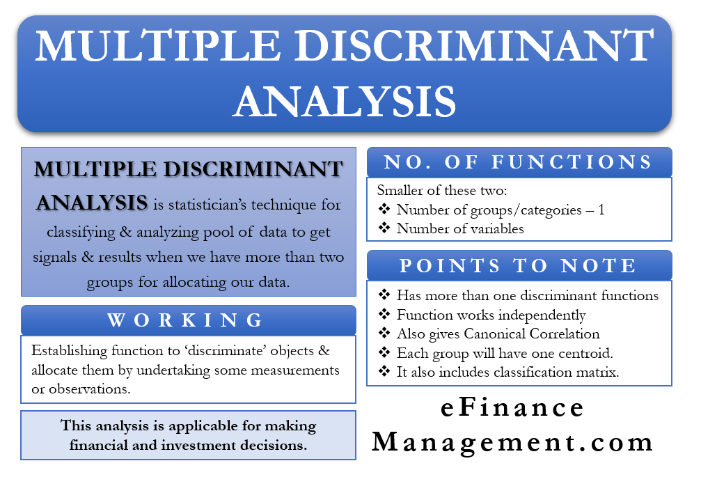

## Table of Contents

## What is Multiple Discriminant Analysis (MDA)?

Multiple Discriminant Analysis (MDA) is a statistical technique used to classify observations into different groups based on multiple variables. It's like sorting different types of fruits into baskets based on their size, color, and weight. MDA helps us find the best way to separate these groups by creating a set of lines or planes that can best distinguish between them. This technique is commonly used in fields like finance, marketing, and biology to make predictions or classifications.

For example, in finance, MDA can be used to predict whether a company will go bankrupt by analyzing its financial ratios. The technique calculates a score for each company based on these ratios, and if the score is below a certain threshold, the company is classified as being at risk of bankruptcy. By using MDA, analysts can make better decisions by understanding which variables are most important in distinguishing between different outcomes.

In summary, MDA is a powerful tool for classification and prediction. It works by finding the best way to separate groups using multiple variables, and it's widely used across various fields to help make informed decisions. Whether it's sorting fruits or predicting company failures, MDA helps us see patterns and make sense of complex data.

## How does MDA differ from other statistical methods like Principal Component Analysis?

Multiple Discriminant Analysis (MDA) and Principal Component Analysis (PCA) are both statistical methods, but they have different goals. MDA is used to classify observations into different groups based on multiple variables. It's like sorting different types of fruits into baskets by looking at their size, color, and weight. MDA finds the best way to separate these groups by creating lines or planes that can best distinguish between them. On the other hand, PCA is used to reduce the number of variables in a dataset while keeping as much information as possible. It's like trying to summarize a long story into a shorter version without losing the main points. PCA finds new variables, called principal components, that are combinations of the original variables and capture the most variation in the data.

The key difference between MDA and PCA lies in their objectives. MDA focuses on classification and prediction, aiming to separate groups as clearly as possible. For example, in finance, MDA can be used to predict if a company will go bankrupt by analyzing its financial ratios. It calculates a score for each company, and if the score is below a certain threshold, the company is classified as being at risk. In contrast, PCA is more about data reduction and understanding the underlying structure of the data. It doesn't aim to classify observations into groups but rather to simplify the data by finding new variables that explain the most variance. This can be useful in many fields, like genetics, where researchers might want to reduce the complexity of genetic data to find patterns more easily.

## What are the basic assumptions required for applying MDA?

Multiple Discriminant Analysis (MDA) works best when certain conditions are met. One important assumption is that the data should be normally distributed within each group. This means that if we look at the data for each group separately, it should follow a bell-shaped curve. Another assumption is that the groups should have the same variance-covariance matrix. This means that the spread and relationships between the variables should be similar across all groups. If these conditions are not met, the results from MDA might not be reliable.

Another key assumption is that the variables used in MDA should be linearly related to the group differences. This means that the lines or planes MDA creates to separate the groups should be straight, not curved. Additionally, the observations should be independent of each other. This means that one observation should not influence another. For example, if we're looking at different companies, the financial data of one company should not affect the data of another company. Meeting these assumptions helps ensure that the classifications and predictions made by MDA are accurate and useful.

## Can you explain the mathematical foundation of MDA?

The mathematical foundation of Multiple Discriminant Analysis (MDA) involves finding linear combinations of variables that best separate different groups. Imagine you have different types of fruits and you want to sort them into baskets based on their size, color, and weight. MDA helps by creating lines or planes that can best distinguish between these groups. These lines or planes are called discriminant functions, and they are calculated using the means and variances of the variables within each group. The goal is to maximize the ratio of between-group variance to within-group variance, which means making the groups as distinct as possible while keeping the spread within each group as small as possible.

To create these discriminant functions, MDA uses a method called eigenvalue decomposition. This method involves finding the eigenvalues and eigenvectors of a matrix that combines the within-group and between-group variance-covariance matrices. The eigenvectors represent the directions of the discriminant functions, while the eigenvalues show how well these functions separate the groups. The larger the eigenvalue, the better the function separates the groups. By selecting the eigenvectors with the largest eigenvalues, MDA creates the best possible lines or planes to classify the observations into their respective groups. This mathematical process helps us understand which variables are most important for distinguishing between the groups and makes it easier to predict or classify new observations.

## How do you prepare data for MDA?

To get your data ready for Multiple Discriminant Analysis (MDA), you first need to make sure your data is clean and complete. This means checking for any missing values and either filling them in or removing them. You also need to check if there are any outliers, which are data points that are very different from the rest. Outliers can mess up your analysis, so you might need to remove them or adjust them. It's also important to make sure your data is in the right format. For MDA, your variables should be numeric, so if you have any categories, like "red" or "blue," you'll need to turn them into numbers, like 1 for "red" and 2 for "blue."

Once your data is clean and formatted correctly, you need to check if it meets the basic assumptions of MDA. One big assumption is that the data in each group should be normally distributed, which means it should follow a bell-shaped curve. You can use tests like the Shapiro-Wilk test to check for normality. Another assumption is that the groups should have the same variance-covariance matrix, which means the spread and relationships between the variables should be similar across all groups. You can use a test called Box's M test to check this. If your data doesn't meet these assumptions, you might need to transform it or use a different method. By making sure your data is ready, you can get the most accurate results from your MDA analysis.

## What are the steps involved in conducting an MDA?

To conduct Multiple Discriminant Analysis (MDA), you first need to prepare your data. Start by cleaning your data, which means checking for and dealing with any missing values or outliers. You might need to fill in missing data or remove it, and decide whether to keep or adjust outliers. Next, make sure your data is in the right format. For MDA, your variables need to be numbers, so if you have categories like "red" or "blue," you'll need to turn them into numbers, like 1 for "red" and 2 for "blue." After that, check if your data meets the basic assumptions of MDA. The data in each group should be normally distributed, which means it should follow a bell-shaped curve. You can use tests like the Shapiro-Wilk test to check this. Also, the groups should have the same variance-covariance matrix, which means the spread and relationships between the variables should be similar across all groups. You can use Box's M test to check this. If your data doesn't meet these assumptions, you might need to transform it or use a different method.

Once your data is ready, you can start the MDA process. First, calculate the means and variances of the variables within each group. Then, use these to find the discriminant functions, which are lines or planes that best separate the groups. This is done using a method called eigenvalue decomposition, which involves finding the eigenvalues and eigenvectors of a matrix that combines the within-group and between-group variance-covariance matrices. The eigenvectors show the directions of the discriminant functions, and the eigenvalues show how well these functions separate the groups. Choose the eigenvectors with the largest eigenvalues to create the best possible lines or planes for classifying the observations into their respective groups. Finally, use these discriminant functions to classify new observations or predict group membership. By following these steps, you can use MDA to understand which variables are most important for distinguishing between groups and make accurate predictions or classifications.

## How do you interpret the results of an MDA?

When you get the results of a Multiple Discriminant Analysis (MDA), you'll see some numbers and graphs that help you understand how well the analysis worked. The most important part is the discriminant functions, which are like lines or planes that separate the groups. The bigger the eigenvalue for a function, the better it separates the groups. You'll also see something called the canonical correlation, which shows how strong the relationship is between the discriminant function and the groups. If the canonical correlation is close to 1, it means the function does a good job separating the groups.

Another thing to look at is the coefficients of the discriminant functions. These numbers tell you which variables are most important for separating the groups. If a variable has a big coefficient, it means that variable is really important for telling the groups apart. You can also look at the group centroids, which are like the average position of each group on the discriminant functions. If the centroids are far apart, it means the groups are well-separated. Finally, you'll see a classification table that shows how well the MDA predicted which group each observation belongs to. If the percentage of correct predictions is high, it means your MDA did a good job.

## What are some common applications of MDA in different fields?

Multiple Discriminant Analysis (MDA) is used a lot in finance to predict if a company might go bankrupt. Analysts look at a company's financial ratios, like how much debt it has compared to its assets, and use MDA to calculate a score. If the score is low, the company is at risk of going bankrupt. This helps investors and bankers make better decisions about where to put their money. MDA is also used in marketing to understand customer behavior. Companies can use it to sort customers into different groups based on things like how much they spend, what they buy, and how often they shop. This helps businesses create targeted ads and promotions that are more likely to work.

In the field of medicine, MDA helps doctors diagnose diseases by looking at different symptoms and test results. For example, it can be used to tell if a patient has one type of cancer or another based on their blood work and other medical data. This makes it easier to choose the right treatment. In biology, scientists use MDA to classify different species or types of plants and animals. They look at things like size, shape, and genetic information to sort them into groups. This helps researchers understand the natural world better and make discoveries about how different species are related.

## How can MDA be used for classification and prediction?

Multiple Discriminant Analysis (MDA) is a tool that helps sort things into different groups. Imagine you have different types of fruits and you want to put them into baskets based on their size, color, and weight. MDA helps by finding the best way to separate these fruits into baskets. It does this by creating lines or planes that can tell the fruits apart. For example, in finance, MDA can look at a company's financial numbers, like how much debt it has, and sort companies into groups like "safe" or "at risk of going bankrupt." By using MDA, you can predict which group a new company might belong to just by looking at its numbers.

MDA is also great for making predictions. Once you have the lines or planes that separate the groups, you can use them to guess where a new observation fits. For instance, in medicine, doctors can use MDA to look at a patient's symptoms and test results to predict if they have one type of disease or another. This helps doctors choose the right treatment. In marketing, businesses can use MDA to predict how customers might behave based on what they buy and how much they spend. This way, companies can create ads that are more likely to work for different groups of customers. By using MDA, you can make smart guesses about new data and make better decisions.

## What are the limitations and potential pitfalls of using MDA?

Multiple Discriminant Analysis (MDA) can be tricky to use because it has some strict rules it needs to follow. One big rule is that the data in each group should be spread out in a certain way, kind of like a bell curve. If the data doesn't follow this rule, the results from MDA might not be right. Another rule is that the way the data is spread out should be the same for all groups. If these rules aren't met, you might need to change your data or use a different method. Also, MDA can be sensitive to outliers, which are data points that are very different from the rest. These outliers can mess up the results, so you need to be careful to check for them and decide what to do with them.

Another problem with MDA is that it can be hard to understand and explain to others. The math behind it can be complicated, and the results might not be easy to put into simple terms. This can make it tough to use MDA in situations where you need to explain your findings to people who aren't experts in [statistics](/wiki/bayesian-statistics). Also, MDA assumes that the lines or planes it creates to separate groups are straight, not curved. If the real relationships between the variables are more complicated, MDA might not work well. So, while MDA can be a powerful tool for sorting things into groups and making predictions, it's important to be aware of its limitations and make sure it's the right choice for your data.

## How does MDA handle multicollinearity and outliers?

Multiple Discriminant Analysis (MDA) can have trouble with multicollinearity, which is when some of the variables you're using are closely related to each other. Imagine you're trying to sort fruits into baskets based on their size, color, and weight, but size and weight are very similar. This can make it hard for MDA to tell which variable is really important for sorting the fruits. To deal with this, you might need to remove some variables or combine them into one. If you don't, the results from MDA might not be as accurate as you'd like.

Outliers, which are data points that are very different from the rest, can also mess up MDA. Think of an apple that's much bigger than all the other apples. This big apple could make it hard for MDA to find the best way to sort the fruits. To handle outliers, you need to check your data carefully and decide what to do with them. You might remove them or adjust them to make sure they don't throw off your results. By taking care of multicollinearity and outliers, you can make sure MDA gives you the best possible results.

## What advanced techniques can be used to enhance the performance of MDA?

To make Multiple Discriminant Analysis (MDA) work better, you can use a technique called regularization. This helps when your data has variables that are closely related to each other, which can make it hard for MDA to sort things into groups. Regularization adds a little bit of extra math to the analysis to make it more stable and accurate. It's like adding a small weight to keep things balanced, so MDA can still find the best way to separate the groups even when the variables are similar.

Another way to improve MDA is by using something called cross-validation. This means you split your data into different parts and use some of it to build the MDA model and the rest to test how well it works. By doing this, you can see if your model is good at sorting new data into the right groups. If it's not, you can make changes to improve it. Cross-validation helps make sure your MDA results are reliable and can be used to make good predictions or classifications.

## What is Understanding Multiple Discriminant Analysis (MDA)?

Multiple Discriminant Analysis (MDA) is a sophisticated statistical technique within the broader category of discriminant analysis, designed to evaluate datasets that encompass multiple variables. The primary objective of MDA is to develop a predictive model that can classify a given set of observations into predefined categories based on their measurements on multiple features. By doing so, MDA achieves a dimension reduction that facilitates clearer categorization of data.

### Core Principles

At its core, MDA operates by identifying a linear combination of variables that maximize the separation between multiple classes. This process involves determining a set of discriminant functions, each of which is a linear function of the variables. Mathematically, a discriminant function can be represented as:

$$

D_k = w_1x_1 + w_2x_2 + ... + w_nx_n 
$$

where $D_k$ represents the kth discriminant function, $x_i$ denotes the values of the independent variables, and $w_i$ are the weights associated with each variable. The coefficients $w_i$ are chosen to maximize the ratio of between-class variance to within-class variance, thereby enhancing the distinction between categories.

### Application in Finance

In financial analysis, MDA is particularly valued for its capacity to manage and interpret large, multidimensional datasets, which is crucial for investment assessments. It aids in reducing the variance among securities by grouping them effectively into homogenous categories based on financial performance metrics. This grouping assists analysts in identifying patterns and trends that might not be evident when examining securities individually.

For financial professionals, MDA's ability to highlight the most informative variables while suppressing those less relevant is crucial. Suppose a financial analyst is evaluating stocks based on multiple factors such as P/E ratio, market cap, and dividend yield. MDA can weigh these variables differently and combine them into a discriminant score, which simplifies the complex dataset into a more understandable form, potentially revealing which stocks are more similar in terms of their investment characteristics.

### Implementation Considerations

Understanding the mechanics of MDA requires acknowledgment of its assumptions and limitations. For effective implementation, practitioners must ensure that the data meets certain prerequisites, such as the multivariate normality of independent variables and homogeneity of covariance matrices. Deviations from these assumptions may affect the reliability and generalizability of the analysis.

In summary, Multiple Discriminant Analysis is a powerful tool for financial analysts aiming to sift through extensive datasets. By classifying and grouping relevant financial metrics, MDA aids in constructing more efficient and insightful investment assessments, establishing a clearer understanding of market behaviors and securities potential.

## References & Further Reading

[1]: Fisher, R. A. (1936). ["The Use of Multiple Measurements in Taxonomic Problems."](https://onlinelibrary.wiley.com/doi/abs/10.1111/j.1469-1809.1936.tb02137.x) Annals of Eugenics.

[2]: Altman, E. I. (1968). ["Financial Ratios, Discriminant Analysis and the Prediction of Corporate Bankruptcy."](https://www.calctopia.com/papers/Altman1968.pdf) The Journal of Finance.

[3]: Rennie, J. D. M. (2005). ["Feature selection for text classification."](https://dspace.mit.edu/handle/1721.1/7074) European Conference on Information Retrieval.

[4]: Hair, J. F., Black, W. C., Babin, B. J., & Anderson, R. E. (2010). ["Multivariate Data Analysis."](https://www.amazon.com/Multivariate-Data-Analysis-Joseph-Hair/dp/0138132631) 7th Edition, Pearson.

[5]: Campbell, R., & Ming, D. (2008). ["The role of machine learning in algorithmic trading."](https://www.researchgate.net/publication/357632509_Machine_Learning_Algorithms_Models_and_Applications) International Journal of Operations Research and Information Systems (IJORIS).

[6]: ["The Black Litterman Model in Detail"](https://datascienceassn.org/sites/default/files/Black-Litterman%20Model%20In%20Detail.pdf) by Thomas Idzorek, CFA Institute Publications.