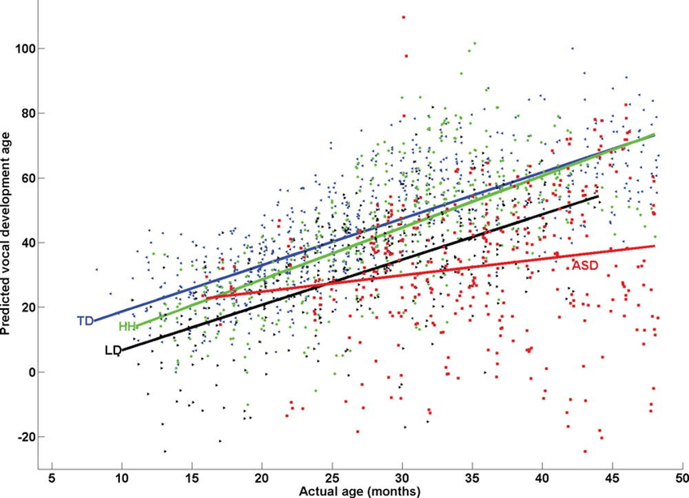

## Table of Contents

## What is multiple linear regression?

Multiple linear regression is a way to figure out how several different things can affect one main thing you're interested in. Imagine you want to predict someone's weight. You might think that their height, age, and how much they exercise could all play a role. Multiple linear regression helps you see how much each of these factors matters and how they work together to influence weight.

In this method, you use a special math formula that looks at all these factors at once. The formula tries to find the best way to combine these factors to make the most accurate prediction. For example, it might show that height has a big impact on weight, while exercise has a smaller but still important effect. By understanding these relationships, you can make better guesses about someone's weight based on their height, age, and exercise habits.

## How does multiple linear regression differ from simple linear regression?

Simple linear regression and multiple linear regression are both ways to predict things, but they use different amounts of information. Simple linear regression looks at just one thing to predict another. For example, if you want to predict how much a house costs, you might use only its size. The idea is to find a straight line that best shows how size affects price. This line helps you guess the price of a house based on its size alone.

On the other hand, multiple linear regression uses more than one thing to make predictions. Using the house price example again, you could look at size, the number of bedrooms, and the age of the house all at once. This method tries to find the best way to combine all these factors to predict the price. It's like using a team of factors instead of just one, which can give you a more accurate prediction because it considers more details about the house.

## What are the key assumptions of multiple linear regression?

Multiple linear regression works best when certain things are true about your data. One big thing is that the relationship between your factors and what you're trying to predict should be a straight line. This means that if you draw a line to show how each factor affects your prediction, that line should be straight, not curved. Also, the factors you use should not be too closely related to each other. If they are, it can mess up your predictions and make it hard to tell which factor is really important.

Another important thing is that the errors, or the difference between your prediction and the actual result, should be spread out evenly. This means that if you look at all the errors, they should be randomly scattered around zero, not bunched up in one place or getting bigger as your prediction gets bigger. Also, these errors should follow a normal pattern, kind of like a bell curve. If these things are true, your multiple linear regression model will be more reliable and give you better predictions.

## How do you interpret the coefficients in a multiple linear regression model?

In a multiple linear regression model, the coefficients tell you how much each factor affects what you're trying to predict. If a coefficient is positive, it means that when that factor goes up, your prediction goes up too. For example, if you're predicting house prices and the coefficient for the number of bedrooms is positive, it means more bedrooms lead to a higher price. On the other hand, if a coefficient is negative, it means that when that factor goes up, your prediction goes down. So, if the coefficient for the age of the house is negative, older houses might be cheaper.

The size of the coefficient also matters. A bigger coefficient means that factor has a stronger effect on your prediction. If the coefficient for house size is much larger than the coefficient for the number of bedrooms, it means that size has a bigger impact on the price than the number of bedrooms. But remember, these coefficients work together. The effect of one factor can change depending on the values of the other factors in the model. So, when you're looking at the coefficients, you're seeing how each factor contributes to your prediction, but you need to consider all of them together to get the full picture.

## What is multicollinearity and how does it affect multiple linear regression?

Multicollinearity happens when two or more of the factors you're using in your multiple linear regression model are too closely related to each other. Imagine you're trying to predict how well students do in school, and you're using both the number of hours they study and the number of pages they read as factors. If students who study more also tend to read more pages, these two factors are closely related, and that's multicollinearity.

When multicollinearity is present, it can make your model less reliable. It becomes hard to tell which of the closely related factors is really affecting your prediction. In our student example, if study hours and pages read are closely related, it's tough to say if it's the studying or the reading that's more important for school performance. This can lead to unstable estimates of the coefficients, making it harder to trust your model's predictions. To deal with multicollinearity, you might need to remove one of the related factors or combine them into a single factor.

## How can you check for multicollinearity in your data?

To check for multicollinearity in your data, one common method is to look at the correlation between your factors. You can make a correlation matrix, which is like a table that shows how closely each pair of factors is related. If you see numbers close to 1 or -1 in this table, it means those factors are very closely related, which could be a sign of multicollinearity. Another way to check is by using a tool called the Variance Inflation Factor (VIF). If the VIF for a factor is high, usually above 5 or 10, it suggests that factor is too closely related to others in your model.

Once you've identified potential multicollinearity, you can take steps to fix it. One simple way is to remove one of the closely related factors from your model. For example, if study hours and pages read are highly correlated, you might choose to keep only one of them. Another option is to combine the related factors into a single new factor. This can help you keep the important information without the problem of multicollinearity. By checking and addressing multicollinearity, you can make your multiple linear regression model more reliable and easier to interpret.

## What are some common methods for selecting variables in multiple linear regression?

One common method for picking which variables to use in multiple linear regression is called stepwise selection. This method starts with no variables and adds them one by one, checking if each new variable makes the model better at predicting. If a variable doesn't help much, it might be taken out. This way, you end up with a model that includes only the most important variables, making your predictions more accurate and easier to understand.

Another method is called forward selection, which is a bit like stepwise but simpler. It begins with no variables and adds them one at a time, always choosing the one that improves the model the most. Once a variable is in, it stays in. This method can be quicker than stepwise selection but might miss out on some important relationships between variables.

Backward elimination is a third method where you start with all the variables and then take them out one by one. You remove the variable that makes the least difference to the model's accuracy. You keep going until removing any more variables would make your predictions worse. This method can be useful when you think most of your variables are important but want to trim down to the essentials.

## How do you evaluate the performance of a multiple linear regression model?

To see how well your multiple linear regression model is doing, one of the first things you can look at is the R-squared value. This number tells you how much of the change in what you're trying to predict can be explained by the factors in your model. A higher R-squared means your model is doing a good job of explaining the data. But, it's important not to just look at R-squared because adding more factors can make it go up even if those factors don't really help with predictions. So, you also want to check the adjusted R-squared, which takes into account the number of factors you're using and gives you a better idea of how well your model is really working.

Another way to check your model's performance is by looking at the residuals, which are the differences between what your model predicts and the actual results. You want these residuals to be spread out evenly and not follow any patterns. If you see patterns, it might mean your model is missing something important. You can also use other measures like the Mean Squared Error (MSE) or the Root Mean Squared Error (RMSE). These tell you how big the average mistake your model makes is. A smaller MSE or RMSE means your model is making smaller mistakes and doing a better job at predicting. By looking at all these things together, you can get a good sense of how well your multiple linear regression model is performing.

## What is the role of dummy variables in multiple linear regression?

Dummy variables are a special kind of variable you use in multiple linear regression when you want to include things that aren't numbers, like whether someone is male or female, or if a house has a garage or not. These things are called categorical variables. To use them in your model, you turn them into numbers. For example, you might say that male is 1 and female is 0. This way, you can include these kinds of details in your model and see how they affect what you're trying to predict.

Using dummy variables helps you understand how different groups or categories impact your predictions. For instance, if you're trying to predict someone's salary and you use a dummy variable for gender, the model can show you if there's a difference in salary between males and females. But you need to be careful not to use too many dummy variables for the same category, because that can cause problems in your model. By using dummy variables the right way, you can make your multiple linear regression model more complete and accurate.

## How can you handle categorical variables in multiple linear regression?

Categorical variables are things like colors, types of animals, or yes/no answers that you can't measure with numbers. In multiple linear regression, you need to turn these into numbers so you can use them in your model. One way to do this is by using dummy variables. For example, if you're looking at whether a house has a garage or not, you can make a new variable where a house with a garage gets a 1 and a house without a garage gets a 0. This way, you can include this information in your model and see how having a garage affects the house price.

When you use dummy variables, you need to be careful about something called the dummy variable trap. This happens if you use too many dummy variables for the same category. For example, if you have a variable for gender with two options - male and female - you should only use one dummy variable, not two. If you use two, like one for male (1 if male, 0 if not) and one for female (1 if female, 0 if not), your model can get confused because it's trying to predict something that's already known. So, you should always leave out one of the categories to avoid this problem. By handling categorical variables the right way, you can make your multiple linear regression model more accurate and useful.

## What advanced techniques can be used to improve multiple linear regression models?

One way to make multiple linear regression models better is by using something called regularization. This helps stop the model from getting too focused on the details of the data it's been given, which can lead to bad predictions when you use it on new data. There are two main types of regularization you can use: Lasso and Ridge. Lasso can even make some of the factors in your model less important or drop them out completely, which is great if you think some of your factors might not be that useful. Ridge, on the other hand, keeps all the factors but makes their effects smaller, which can help if you want to keep all your factors but still improve your model.

Another advanced technique is using interaction terms. Sometimes, the way two factors work together can be more important than looking at them separately. For example, if you're trying to predict how well someone does in school, the effect of studying might be different depending on how much sleep they get. By adding an interaction term that looks at both studying and sleep together, you can see if studying more helps more when someone gets enough sleep. This can make your model more accurate by capturing these kinds of relationships that you might miss otherwise.

Lastly, you can use something called polynomial regression to handle situations where the relationship between your factors and what you're trying to predict isn't a straight line. For instance, if you're predicting plant growth based on sunlight, the growth might speed up a lot more as sunlight increases, not just in a straight line. By adding polynomial terms, like the square or cube of sunlight, you can fit a curved line that better matches how the data behaves. This can make your predictions more accurate when the real world doesn't follow straight lines.

## How do you validate a multiple linear regression model using cross-validation?

Cross-validation is a way to check how good your multiple linear regression model is by seeing how well it works on different parts of your data. Imagine you have a big pile of data. Instead of using all of it to build your model and then hoping it works well on new data, you split your data into smaller pieces. You build your model using all but one of these pieces, and then you use that one piece you left out to see how well your model predicts. You do this over and over, leaving out a different piece each time, until you've used every piece to test your model. This helps you see if your model is good at predicting things it hasn't seen before.

By using cross-validation, you get a better idea of how your model will do with new data. If your model does well on all the different pieces of data, it's a sign that it's reliable. But if it only works well on some pieces and not others, it might mean your model is too focused on the details of the data you used to build it. This can help you make your model better by trying different things, like adding or removing factors, until it works well across all the pieces of your data. Cross-validation is like a safety check that helps make sure your model is ready to use in the real world.

## What is Multiple Linear Regression (MLR) and how can it be understood?

Multiple Linear Regression (MLR) is a statistical technique that analyzes the relationship between one response variable and multiple explanatory variables. The main objective is to derive a linear equation that best fits the relationship between the dependent variable and several independent variables. This method is widely used in econometrics for its ability to make predictions, test hypotheses, and dissect complex relationships.

MLR can be expressed using the following general formula:

$$

Y = \beta_0 + \beta_1X_1 + \beta_2X_2 + \cdots + \beta_pX_p + \epsilon 
$$

where $Y$ is the dependent variable, $X_1, X_2, \ldots, X_p$ are the independent variables, $\beta_0$ is the intercept, $\beta_1, \beta_2, \ldots, \beta_p$ are the regression coefficients that measure the contribution of each independent variable to the prediction, and $\epsilon$ represents the error term.

The MLR model is estimated using methods such as Ordinary Least Squares (OLS), which aims to minimize the sum of the squared differences between observed and predicted values. This minimization process ensures that the linear regression line is the best fit for the data.

The key components of an MLR model include: 

1. **Intercept ($\beta_0$)**: This is the expected mean value of $Y$ when all independent variables are zero. It serves as a baseline level of the dependent variable.

2. **Slope Coefficients ($\beta_1, \beta_2, \ldots, \beta_p$)**: Each coefficient indicates the expected change in the dependent variable for a one-unit change in the corresponding independent variable, assuming all other variables remain constant.

3. **Error Term ($\epsilon$)**: This captures the variability in $Y$ that cannot be explained by the linear relationship with the independent variables. It's an essential part of the model, ensuring that predictions account for random variability in the data.

By incorporating multiple variables, MLR offers a nuanced approach to modeling and prediction, surpassing the limitations of simple linear regression, which only considers a single explanatory variable. This ability makes MLR an invaluable tool for understanding complex data patterns, fostering better decision-making in fields like finance, sociology, and biology.

## What is the MLR Formula?

The general equation for multiple linear regression is expressed as:

$$
Y = \beta_0 + \beta_1 X_1 + \beta_2 X_2 + \ldots + \beta_p X_p + \varepsilon
$$

In this equation, $Y$ represents the dependent variable, which the model aims to predict or explain. The variables $X_1, X_2, \ldots, X_p$ are the independent variables that serve as predictors. Each predictor has an associated coefficient, $\beta_1, \beta_2, \ldots, \beta_p$, which quantifies the influence of that predictor on the dependent variable. The term $\beta_0$ is the intercept, denoting the expected value of $Y$ when all independent variables are zero. The error term, $\varepsilon$, captures the random disturbance or variability in $Y$ that cannot be explained by the predictors.

The Ordinary Least Squares (OLS) method is the most commonly used technique to estimate these coefficients. OLS works by minimizing the sum of squared residuals, which are the differences between the observed and predicted values of the dependent variable. Mathematically, the residual sum of squares (RSS) is minimized:

$$
\text{RSS} = \sum (Y_i - \hat{Y_i})^2
$$

where $Y_i$ is the observed value, and $\hat{Y_i}$ is the predicted value from the model. By minimizing the RSS, OLS ensures that the estimated coefficients provide the best linear unbiased estimates (BLUE) under the Gauss-Markov theorem assumptions. This approach enables the identification of the best-fit line through the data, optimizing the predictive power of the model.

## What is an example of MLR in Action?

To illustrate the use of Multiple Linear Regression (MLR) in predicting the stock price of an oil company such as ExxonMobil, we need to define our dependent and independent variables. The stock price, the dependent variable $Y$, is influenced by several factors, or independent variables. These could include:

1. **S&P 500 Index**: This index is a common benchmark for the U.S. equities market. Its performance often reflects broader economic trends, which could affect oil companies like ExxonMobil. When the S&P 500 index rises, it may indicate a favorable economic environment, potentially leading to higher stock prices for ExxonMobil.

2. **Interest Rates**: Interest rates influence borrowing costs and investment returns. Lower rates generally bolster economic activity and corporate profits, possibly boosting ExxonMobil's stock price.

3. **Oil Prices**: As a primary business driver, fluctuations in oil prices directly impact revenue and profitability for oil companies. An increase in oil prices might lead to a rise in ExxonMobil’s stock price, while a decrease could have the opposite effect.

4. **Futures Contracts**: These can provide insights into market expectations of future oil prices. An upward trend in oil futures might predict rising stock prices for ExxonMobil due to anticipated increased revenues.

Given these explanatory variables, the MLR model can be structured as follows:

$$
Y = \beta_0 + \beta_1 \times (\text{S\&P 500 Index}) + \beta_2 \times (\text{Interest Rates}) + \beta_3 \times (\text{Oil Prices}) + \beta_4 \times (\text{Futures Contracts}) + \epsilon
$$

Where:
- $Y$ is the predicted stock price of ExxonMobil.
- $\beta_0$ is the intercept.
- $\beta_1, \beta_2, \beta_3, \beta_4$ are the coefficients that measure the impact of each independent variable.
- $\epsilon$ is the error term accounting for other factors affecting the stock price.

In practice, the implementation of this MLR model can be performed using Python with libraries such as `NumPy`, `Pandas`, and `Statsmodels`. Here is a simplified example:

```python
import pandas as pd
import statsmodels.api as sm

# Load your dataset
data = pd.read_csv('exxonmobil_stock_data.csv')

# Define dependent and independent variables
X = data[['S&P_500_Index', 'Interest_Rates', 'Oil_Prices', 'Futures_Contracts']]
Y = data['ExxonMobil_Stock_Price']

# Add a constant to the independent variables (intercept)
X = sm.add_constant(X)

# Fit the model
model = sm.OLS(Y, X).fit()

# Print the model summary
print(model.summary())
```

This code assumes that we have a CSV file `exxonmobil_stock_data.csv` containing the relevant historical data for the independent variables and ExxonMobil's stock price. The `sm.add_constant()` function adds an intercept term to the model, necessary for statistical estimation.

By incorporating multiple indicators, traders can develop a more nuanced understanding of market dynamics, thereby improving their predictive accuracy and investment decisions. This example demonstrates how MLR can synthesize diverse financial inputs to generate actionable insights in stock trading.

## References & Further Reading

[1]: ["An Introduction to Statistical Learning"](https://www.statlearning.com/) by Gareth James, Daniela Witten, Trevor Hastie, and Robert Tibshirani.

[2]: ["Applied Regression Analysis"](https://onlinelibrary.wiley.com/doi/book/10.1002/9781118625590) by Norman R. Draper and Harry Smith.

[3]: ["Python for Data Analysis"](https://wesmckinney.com/book/) by Wes McKinney.

[4]: ["The Econometrics of Financial Markets"](https://web.mit.edu/~alo/www/Books/efm_desc.html) by John Y. Campbell, Andrew W. Lo, and A. Craig MacKinlay.

[5]: ["Quantitative Financial Analytics: The Path to Investment Profits"](https://archive.org/details/quantitativefina0000will) by Gerald A. Fleisher.