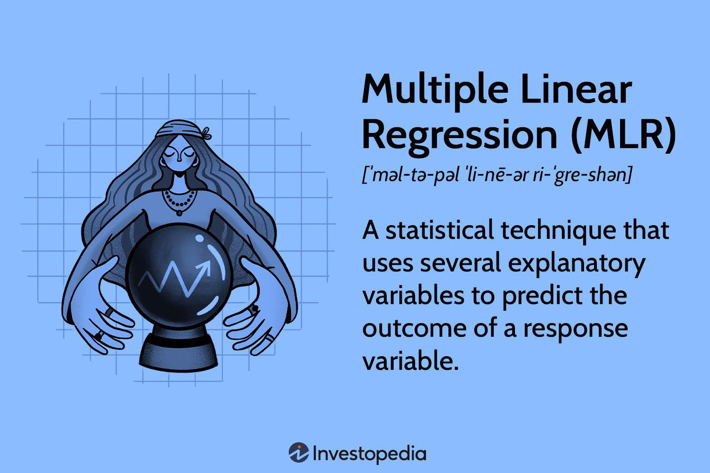

Algorithmic trading has become increasingly prominent in the finance sector, prized for its ability to enhance trading efficiency through the use of sophisticated quantitative models. Within this domain, Multiple Linear Regression (MLR) stands out as a fundamental analytical tool. MLR enables traders to forecast market trends by evaluating multiple variables concurrently, leading to more nuanced insights into market dynamics.

This article aims to investigate the application of MLR in algorithmic trading, emphasizing its core functionalities, its benefits, and providing practical examples to illustrate its use. We will explore how MLR differs from simple linear regression, putting a spotlight on its advantages in dealing with complex trading environments where multiple influencing factors need to be considered and managed effectively. 



Additionally, the discussion will move to a hands-on implementation using Python. This approach ensures that readers are not only familiar with the theoretical aspects but also gain practical skills in applying MLR in their trading strategies. By incorporating code examples and data manipulation techniques, traders can leverage MLR to construct more predictive and strategic market models.

## Table of Contents

## Understanding Multiple Linear Regression (MLR)

Multiple Linear Regression (MLR) is a statistical technique that analyzes the relationship between one response variable and multiple explanatory variables. The main objective is to derive a linear equation that best fits the relationship between the dependent variable and several independent variables. This method is widely used in econometrics for its ability to make predictions, test hypotheses, and dissect complex relationships.

MLR can be expressed using the following general formula:

$$

Y = \beta_0 + \beta_1X_1 + \beta_2X_2 + \cdots + \beta_pX_p + \epsilon 
$$

where $Y$ is the dependent variable, $X_1, X_2, \ldots, X_p$ are the independent variables, $\beta_0$ is the intercept, $\beta_1, \beta_2, \ldots, \beta_p$ are the regression coefficients that measure the contribution of each independent variable to the prediction, and $\epsilon$ represents the error term.

The MLR model is estimated using methods such as Ordinary Least Squares (OLS), which aims to minimize the sum of the squared differences between observed and predicted values. This minimization process ensures that the linear regression line is the best fit for the data.

The key components of an MLR model include: 

1. **Intercept ($\beta_0$)**: This is the expected mean value of $Y$ when all independent variables are zero. It serves as a baseline level of the dependent variable.

2. **Slope Coefficients ($\beta_1, \beta_2, \ldots, \beta_p$)**: Each coefficient indicates the expected change in the dependent variable for a one-unit change in the corresponding independent variable, assuming all other variables remain constant.

3. **Error Term ($\epsilon$)**: This captures the variability in $Y$ that cannot be explained by the linear relationship with the independent variables. It's an essential part of the model, ensuring that predictions account for random variability in the data.

By incorporating multiple variables, MLR offers a nuanced approach to modeling and prediction, surpassing the limitations of simple linear regression, which only considers a single explanatory variable. This ability makes MLR an invaluable tool for understanding complex data patterns, fostering better decision-making in fields like finance, sociology, and biology.

## The MLR Formula

The general equation for multiple linear regression is expressed as:

$$
Y = \beta_0 + \beta_1 X_1 + \beta_2 X_2 + \ldots + \beta_p X_p + \varepsilon
$$

In this equation, $Y$ represents the dependent variable, which the model aims to predict or explain. The variables $X_1, X_2, \ldots, X_p$ are the independent variables that serve as predictors. Each predictor has an associated coefficient, $\beta_1, \beta_2, \ldots, \beta_p$, which quantifies the influence of that predictor on the dependent variable. The term $\beta_0$ is the intercept, denoting the expected value of $Y$ when all independent variables are zero. The error term, $\varepsilon$, captures the random disturbance or variability in $Y$ that cannot be explained by the predictors.

The Ordinary Least Squares (OLS) method is the most commonly used technique to estimate these coefficients. OLS works by minimizing the sum of squared residuals, which are the differences between the observed and predicted values of the dependent variable. Mathematically, the residual sum of squares (RSS) is minimized:

$$
\text{RSS} = \sum (Y_i - \hat{Y_i})^2
$$

where $Y_i$ is the observed value, and $\hat{Y_i}$ is the predicted value from the model. By minimizing the RSS, OLS ensures that the estimated coefficients provide the best linear unbiased estimates (BLUE) under the Gauss-Markov theorem assumptions. This approach enables the identification of the best-fit line through the data, optimizing the predictive power of the model.

## Benefits of Using MLR in Algo Trading

Multiple Linear Regression (MLR) offers significant advantages in [algorithmic trading](/wiki/algorithmic-trading) by integrating multiple predictive variables into a singular model. Unlike simple linear regression, which examines the relationship between two variables, MLR embraces multiple independent variables, facilitating a more nuanced and comprehensive analysis of market trends.

First and foremost, MLR enhances accuracy in market predictions by considering a range of variables simultaneously. This multi-faceted approach allows traders to construct models that capture complex interactions and dependencies between different financial indicators. For instance, trading models can incorporate factors such as interest rates, economic indicators, and historical prices, providing a holistic view of the variables affecting asset prices.

This intricacy is essential in modeling the often intricate dynamics of financial markets. By accounting for multiple factors, traders can devise more robust prediction models, improving the reliability and effectiveness of their trading strategies. For example, when predicting asset price movements, MLR enables traders to adjust for various external influences simultaneously, yielding a more comprehensive understanding of potential future price trends.

Moreover, MLR's capability to isolate the impact of individual variables offers strategic insights. By holding all other variables constant, MLR quantitatively measures the effect of one independent variable on the dependent variable. This functionality aids traders in making informed decisions by highlighting key factors that significantly influence market trends. Such insights are invaluable, as they allow traders to refine strategies and focus on the most impactful variables, contributing to strategic decision-making in fast-paced trading environments.

In summary, the use of MLR in algorithmic trading affords traders the ability to model complex market interactions with greater precision. By systematically quantifying the influence of multiple factors, MLR improves prediction accuracy and fosters a deeper understanding of market dynamics, ultimately enhancing trading efficiency and effectiveness.

## An Example of MLR in Action

To illustrate the use of Multiple Linear Regression (MLR) in predicting the stock price of an oil company such as ExxonMobil, we need to define our dependent and independent variables. The stock price, the dependent variable $Y$, is influenced by several factors, or independent variables. These could include:

1. **S&P 500 Index**: This index is a common benchmark for the U.S. equities market. Its performance often reflects broader economic trends, which could affect oil companies like ExxonMobil. When the S&P 500 index rises, it may indicate a favorable economic environment, potentially leading to higher stock prices for ExxonMobil.

2. **Interest Rates**: Interest rates influence borrowing costs and investment returns. Lower rates generally bolster economic activity and corporate profits, possibly boosting ExxonMobil's stock price.

3. **Oil Prices**: As a primary business driver, fluctuations in oil prices directly impact revenue and profitability for oil companies. An increase in oil prices might lead to a rise in ExxonMobil’s stock price, while a decrease could have the opposite effect.

4. **Futures Contracts**: These can provide insights into market expectations of future oil prices. An upward trend in oil futures might predict rising stock prices for ExxonMobil due to anticipated increased revenues.

Given these explanatory variables, the MLR model can be structured as follows:

$$
Y = \beta_0 + \beta_1 \times (\text{S\&P 500 Index}) + \beta_2 \times (\text{Interest Rates}) + \beta_3 \times (\text{Oil Prices}) + \beta_4 \times (\text{Futures Contracts}) + \epsilon
$$

Where:
- $Y$ is the predicted stock price of ExxonMobil.
- $\beta_0$ is the intercept.
- $\beta_1, \beta_2, \beta_3, \beta_4$ are the coefficients that measure the impact of each independent variable.
- $\epsilon$ is the error term accounting for other factors affecting the stock price.

In practice, the implementation of this MLR model can be performed using Python with libraries such as `NumPy`, `Pandas`, and `Statsmodels`. Here is a simplified example:

```python
import pandas as pd
import statsmodels.api as sm

# Load your dataset
data = pd.read_csv('exxonmobil_stock_data.csv')

# Define dependent and independent variables
X = data[['S&P_500_Index', 'Interest_Rates', 'Oil_Prices', 'Futures_Contracts']]
Y = data['ExxonMobil_Stock_Price']

# Add a constant to the independent variables (intercept)
X = sm.add_constant(X)

# Fit the model
model = sm.OLS(Y, X).fit()

# Print the model summary
print(model.summary())
```

This code assumes that we have a CSV file `exxonmobil_stock_data.csv` containing the relevant historical data for the independent variables and ExxonMobil's stock price. The `sm.add_constant()` function adds an intercept term to the model, necessary for statistical estimation.

By incorporating multiple indicators, traders can develop a more nuanced understanding of market dynamics, thereby improving their predictive accuracy and investment decisions. This example demonstrates how MLR can synthesize diverse financial inputs to generate actionable insights in stock trading.

## MLR in Python: A Practical Guide

Implementing Multiple Linear Regression (MLR) in Python is streamlined by utilizing robust libraries like NumPy, Pandas, and Statsmodels. These tools facilitate the process by providing efficient data manipulation capabilities and comprehensive statistical modeling techniques.

### Data Preparation and Cleaning

Before constructing an MLR model, it is imperative to prepare the dataset. This includes:
- **Handling Missing Values:** Missing values should be addressed, either by filling them with appropriate statistics like mean or median using Pandas functions such as `fillna()` or by removing the affected rows or columns.
- **Encoding Categorical Variables:** If categorical variables exist, they should be converted into numerical format using techniques such as one-hot encoding, achievable with Pandas' `get_dummies()` function.

An example of handling missing values and encoding categorical variables might look like:

```python
import pandas as pd

# Load data
data = pd.read_csv('data.csv')

# Fill missing values with column median
data.fillna(data.median(), inplace=True)

# Encode categorical variables
data = pd.get_dummies(data, drop_first=True)
```

### Setting Up the Model

Once the data is clean, you define your dependent and independent variables. Suppose you have a dataset `data` where 'Y' is the dependent variable, and 'X1', 'X2', ..., 'Xp' are independent variables. This is set up as:

```python
import statsmodels.api as sm

# Define dependent variable
Y = data['Y']

# Define independent variables
X = data[['X1', 'X2', ..., 'Xp']]

# Add constant to the model (intercept)
X = sm.add_constant(X)
```

### Fitting the Model

The next step involves fitting the MLR model using the Ordinary Least Squares (OLS) method provided by Statsmodels:

```python
# Fit the model
model = sm.OLS(Y, X).fit()
```

### Interpreting the Results

After fitting the model, interpreting the results is crucial. You can obtain a summary of the regression results, which provides a detailed statistical analysis of the model, including coefficients, p-values, and R-squared values:

```python
# Print summary of regression results
print(model.summary())
```

This summary enables traders to understand the significance of each predictor variable, inform decisions based on the p-values, and evaluate the goodness of fit through the R-squared value.

### Example Implementation

Consider a practical example where you predict stock prices based on various economic indicators using MLR:

```python
# Example: Predict stock prices
data = pd.read_csv('stock_data.csv')

# Data preparation
data.fillna(data.median(), inplace=True)
data = pd.get_dummies(data, drop_first=True)

# Model setup
Y = data['stock_price']
X = data[['sp500_index', 'interest_rate', 'oil_price', 'futures']]

# Add constant and fit model
X = sm.add_constant(X)
model = sm.OLS(Y, X).fit()

# Interpret results
print(model.summary())
```

This implementation provides a comprehensive approach to constructing an MLR model in Python, allowing traders to incorporate multiple financial indicators, thus enhancing predictive accuracy and strategic trading decisions.

## Conclusion

Multiple Linear Regression (MLR) serves as an essential component in algorithmic trading by enhancing prediction capabilities through the integration of multiple variables. This statistical method allows traders to develop sophisticated models that can capture the complex dynamics of financial markets, leading to more informed and strategic decision-making processes. By quantifying the effect of individual variables on a target market indicator, traders can devise more effective trading strategies.

The increasing accessibility of computational tools and comprehensive datasets has made it feasible for traders to implement advanced statistical models such as MLR. Technologies like Python, with libraries including NumPy, Pandas, and Statsmodels, offer robust frameworks for executing MLR efficiently. These technologies not only support data preprocessing and model fitting but also facilitate the clear interpretation of results, thereby enhancing the trader's ability to make data-driven decisions.

Furthermore, as financial markets become increasingly complex, relying solely on univariate analysis becomes insufficient. MLR provides a way to account for the interplay between multiple market influencers, such as economic indicators, sector-specific data, and broader market trends. This holistic approach aids in constructing predictive models that better align with real-world scenarios, potentially leading to improved investment outcomes.

Overall, the use of MLR in algorithmic trading represents a powerful methodology for leveraging statistical analysis in the pursuit of maximizing trading performance. Traders worldwide can benefit from incorporating MLR into their analytical repertoire, leading to a more precise understanding of market behaviors and more agile responses to financial opportunities.

## References & Further Reading

[1]: ["An Introduction to Statistical Learning"](https://www.statlearning.com/) by Gareth James, Daniela Witten, Trevor Hastie, and Robert Tibshirani.

[2]: ["Applied Regression Analysis"](https://onlinelibrary.wiley.com/doi/book/10.1002/9781118625590) by Norman R. Draper and Harry Smith.

[3]: ["Python for Data Analysis"](https://wesmckinney.com/book/) by Wes McKinney.

[4]: ["The Econometrics of Financial Markets"](https://web.mit.edu/~alo/www/Books/efm_desc.html) by John Y. Campbell, Andrew W. Lo, and A. Craig MacKinlay.

[5]: ["Quantitative Financial Analytics: The Path to Investment Profits"](https://archive.org/details/quantitativefina0000will) by Gerald A. Fleisher.