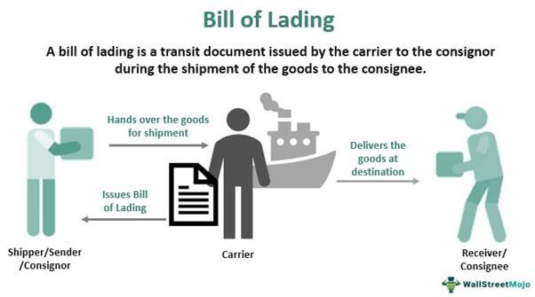

The globalization of trade has significantly increased the complexity of shipping and logistics. This intricate environment is managed through essential documents and techniques, among which the bill of lading and algorithmic trading hold paramount importance. The bill of lading, a cornerstone of the shipping industry, serves as a pivotal tool for facilitating the movement of goods across borders. It acts as a legal document between the shipper and carrier, outlining the specifics of the shipment, thus ensuring the safe and efficient transport of goods. The various types include straight, shipper’s order, clean, and onboard bills of lading, each designed to suit specific transportation needs and security conditions.

Parallelly, algorithmic trading, though primarily linked to financial markets, is increasingly influencing logistics by optimizing shipping routes and schedules. This method leverages algorithms to automate and enhance trading activities, ensuring swift execution and minimal human error. The integration of technology in these processes not only streamlines trading operations but also provides crucial insights for strategic decision-making.

This article aims to explore the significance of the bill of lading in shipping, along with the burgeoning influence of algorithmic trading on financial markets. By focusing on their operational and strategic importance, businesses can better navigate modern commerce challenges. Furthermore, we will examine the technological advancements in these areas and offer an overview of risk management strategies to mitigate potential threats and enhance operational efficiency.

## Table of Contents

## Understanding Bills of Lading

A bill of lading is a critical legal document that establishes the contractual relationship between a shipper and a carrier. It meticulously details the type, quantity, and destination of goods being transported. This document fulfills three essential functions: it serves as a receipt for the shipment, provides evidence of a contract of carriage, and acts as a document of title, enabling the holder to claim the goods upon arrival.

There are two primary types of bills of lading that cater to different modes of transportation: ocean bills of lading and airway bills. Ocean bills of lading are used for maritime shipments, serving the extensive global maritime trade network. In contrast, airway bills are designed for air freight, offering rapid transit but typically involving higher costs.

Understanding the nuances associated with various bills of lading is paramount in safeguarding assets and minimizing risks in international trade. The nuanced classifications include straight bills, shipper’s order bills, clean bills, and onboard bills of lading:

1. **Straight Bill of Lading**: This is non-negotiable and consignment-specific. The named consignee is the only party eligible to receive the goods. It ensures immediate delivery upon arrival but lacks transferability, thereby limiting risk but also flexibility in rerouting or selling goods mid-transit.

2. **Shipper’s Order Bill of Lading**: This negotiable document allows for the transferability of goods, which can be advantageous in financial transactions or sales that occur while the commodities are in transit. This type necessitates endorsement by the holder to transfer ownership.

3. **Clean Bill of Lading**: This indicates that the goods have been loaded in apparent good order and condition, as discerned by the carrier. It offers a level of assurance that the cargo is in suitable state upon departure, impacting both insurance and buyer confidence.

4. **Onboard Bill of Lading**: Issued once the goods are physically loaded onto the vessel, it confirms that the cargo is on board, often triggering payment processes in trade finance, particularly where letters of credit are involved.

The interplay of these documents within trade logistics is vital for preventing asset theft and reducing risks associated with liability, cargo misdelivery, or fraudulent activities. By discerning the specific requirements and implications of each bill type, businesses can enhance security in transactions and optimize the logistics of global trade networks.

## The Original Bill of Lading

An original bill of lading (OBL) is a crucial document in the shipping industry, serving both as a title to the goods being transported and as a contractual agreement between the shipper and carrier. The Original Bill of Lading is traditionally issued in multiple copies, typically three, to facilitate transparency and secure the transaction of goods. This multiplicity ensures that if one document is lost or delayed, the transaction can still proceed using one of the remaining copies.

When handling an OBL, various responsibilities arise for the parties involved. For the importer or their designated agent, signing the document is essential to release the shipment from the carrier. This step confirms receipt of the goods and the fulfillment of the contract agreed upon in the bill of lading.

Despite its importance, the OBL is not without risks. Potential for fraud or unauthorized release of goods is a significant concern, making it imperative for parties to control and issue OBLs meticulously. Unauthorized holders of an OBL can claim ownership of the goods, underscoring the need for stringent verification processes before releasing shipments.

To manage and distribute OBLs securely, companies can adopt several measures:

1. **Digitalization**: Transitioning from physical to electronic bills of lading (eBOLs) can mitigate the risks associated with paper documents. Digital platforms offer encrypted, secure processing and tracking capabilities, reducing the likelihood of document tampering.

2. **Verification Protocols**: Implementing robust verification protocols for document holders can ensure that only authorized individuals have access to the OBL. This includes identity checks and the use of secure channels for document exchanges.

3. **Issuance Control**: Limiting the number of copies issued and maintaining a strict record of where each copy is distributed can help track and control the document's movement.

4. **Training and Awareness**: Regular training sessions for staff involved in handling OBLs can enhance their awareness of potential risks and the importance of secure document management.

By adopting these strategies, businesses can safeguard against unauthorized access and fraud, ensuring the secure transfer and ownership of goods in transit.

## Algorithmic Trading in Shipping

Algorithmic trading involves the use of computer algorithms to execute trading activities efficiently by making decisions based on predefined criteria and market conditions. In the context of shipping logistics, [algorithmic trading](/wiki/algorithmic-trading) can optimize shipping routes and manage fleet schedules in real-time, which is vital for maintaining operational effectiveness and cost efficiency.

In logistics, algorithms analyze numerous variables, such as weather conditions, port congestion, fuel costs, and delivery deadlines, to optimize shipping routes and schedules. This approach not only reduces transportation time and costs but also enhances the reliability of deliveries. For instance, algorithms can predict optimal routes by assessing traffic patterns and weather forecasts to avoid delays.

In the financial markets, algorithmic trading is widely used to enhance trading speed and efficiency. Algorithms can process vast amounts of data and execute trades at speeds unattainable for human traders. This capability is particularly useful in high-frequency trading ([HFT](/wiki/high-frequency-trading-strategies)), where profits depend on the ability to execute transactions faster than competitors. By analyzing historical data and market trends, algorithms can identify opportunities for [arbitrage](/wiki/arbitrage) and execute trades to capitalize on market fluctuations.

Technological innovations such as [machine learning](/wiki/machine-learning) and [artificial intelligence](/wiki/ai-artificial-intelligence) are central to improving decision-making processes in trading. These technologies enable algorithms to learn from data patterns and adapt to changing market conditions, reducing the potential for human error. The implementation of such advanced algorithms allows businesses to make informed decisions quickly and accurately, enhancing their market competitiveness.

Businesses in logistics and finance use algorithms to automate tasks, forecast demand, and manage resources effectively. In logistics, companies employ systems that leverage real-time data to optimize warehouse operations, manage inventory, and predict maintenance needs. This integration of technology not only streamlines operations but also enhances customer satisfaction by ensuring timely deliveries and reducing costs.

In conclusion, the adoption of algorithmic trading in shipping and financial markets has transformed these sectors by increasing efficiency and minimizing risks. The ability to process data and execute decisions rapidly provides businesses with a competitive edge, ensuring they can navigate the complexities of modern commerce successfully. Embracing these technological advancements is crucial for companies aiming to maintain leadership positions in their respective industries.

## Strategies for Risk Management

The increasing complexity of shipping and trading necessitates effective risk management strategies to address threats such as fraud, theft, and market fluctuations. These risks can have significant financial repercussions if not properly managed. Thus, implementing robust and strategic approaches is vital.

A fundamental strategy involves limiting the number of Original Bills of Lading (OBLs) issued. By doing so, businesses can minimize the risk of fraud and unauthorized release of goods. The issuance should be closely monitored and controlled to ensure that only legitimate parties can access and transfer ownership of the cargo. Moreover, implementing secure handling and storage practices for OBLs protects against potential theft or misplacement.

Enhancing digital documentation security is essential. The transition from paper to electronic documentation can significantly reduce the risk of document loss and fraudulent manipulation. Implementing advanced encryption methods and blockchain technology can further improve document security. Both methods ensure data integrity and traceability, providing a secure digital trail that can be audited.

Real-time data analytics play a crucial role in managing risks associated with market fluctuations. By integrating advanced analytics, businesses can gain insights into market trends and potential disruptions, enabling proactive decision-making. Real-time analytics tools monitor variables like demand, pricing, and supply chain disruptions, offering predictive capabilities to anticipate and mitigate adverse impacts.

Building partnerships with trusted carriers and financial institutions adds an additional layer of security to shipping and trading operations. These partnerships are crucial for ensuring the credibility and reliability of transactions. Vetting and collaborating only with established and reputable entities can reduce exposure to fraudulent activities and enhance the overall integrity of operations.

Organizations should also invest in comprehensive training and technology to mitigate risks in algorithmic trading. Employees need to be well-versed in the latest trading algorithms and technology platforms to effectively navigate and respond to market changes. Training programs should focus on risk identification and mitigation strategies, empowering personnel to handle complex trading environments adeptly.

By combining these strategies—controlling OBL issuance, enhancing digital document security, leveraging real-time data analytics, fostering secure partnerships, and investing in training—businesses can safeguard their shipping and trading operations against the multifaceted risks present in today's global commerce landscape.

## Conclusion

The integration of bills of lading and algorithmic trading represents a pivotal development for the shipping and financial sectors. Mastering these elements can help mitigate risks and open up new possibilities for international trade. As these industries evolve, it is crucial for businesses to stay informed and implement robust strategies to maintain their competitive edge. This article's insights serve to empower businesses in navigating modern trade's complexities more efficiently.

The fusion of traditional shipping documents with contemporary trading algorithms can significantly enhance operational efficiency. Bills of lading, a cornerstone in shipping logistics, provide a legal, contractual, and evidential framework for the movement of goods. Their integration with algorithmic trading strategies, which utilize computational algorithms for optimizing and automating trade processes, can yield greater precision, speed, and security in transactions.

Entering this era of rapid technological advancement requires businesses to embrace innovation and flexibility. The adoption of digital technologies in managing bills of lading can reduce fraud and enhance transparency. Similarly, leveraging algorithmic trading can offer superior market analysis and decision-making capabilities, minimizing human error and maximizing trade outcomes.

As global commerce becomes even more interconnected, the ability to quickly adapt to changes, incorporate new technologies, and harness data-driven insights will be paramount. The potential benefits of effectively combining bills of lading and algorithmic trading include reduced operational costs, improved logistical coordination, and the ability to swiftly react to market dynamics.

Finally, businesses that proactively engage with these innovations are likely to discover opportunities for growth, increased efficiency, and enhanced security. As the trade landscape continues to shift, being at the forefront of such advancements will position enterprises to not only survive but thrive in a competitive global economy.

## References & Further Reading

[1]: ["The Bill of Lading: Beyond the Basics"](https://icecargo.com.au/bill-of-lading/) by Adam Hayes, CFA, Investopedia.

[2]: Faria Jr, A. et al. (2020). ["Applying Blockchain Technology in the Management of Electronic Bills of Lading in International Trade."](https://www.sciencedirect.com/science/article/pii/S0263876224007081) IFIP International Conference on Advances in Production Management Systems.

[3]: ["Electronic Bills of Lading: Replacing paper documentation with more efficient technologies"](https://www.icustoms.ai/blogs/paper-to-digital-transformation-to-electronic-bill-of-lading/) by Lloyd’s List.

[4]: Hasbrouck, J. (2004). ["Empirical Market Microstructure: The Institutions, Economics, and Econometrics of Securities Trading."](https://archive.org/details/empiricalmarketm0000hasb).

[5]: Aldridge, I. (2010). ["High-Frequency Trading: A Practical Guide to Algorithmic Strategies and Trading Systems"](https://www.amazon.com/High-Frequency-Trading-Practical-Algorithmic-Strategies/dp/1118343506) by Irene Aldridge.