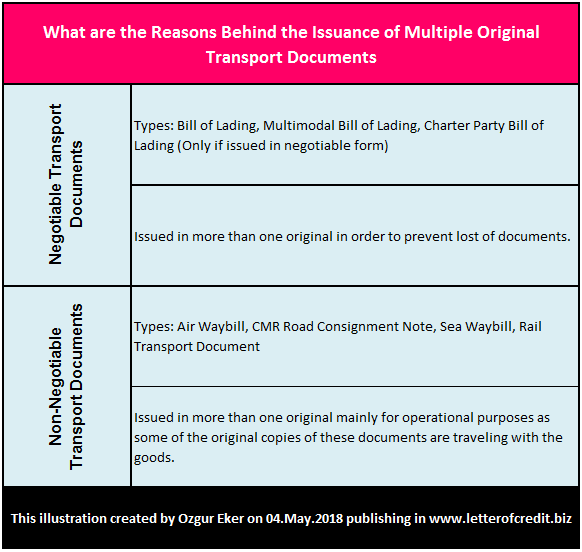

## Table of Contents

## What is a Bill of Lading?

A Bill of Lading is a very important document in shipping. It is like a receipt and a contract between the person sending the goods, the person transporting them, and the person receiving them. It shows that the carrier has received the goods and promises to deliver them to the right place. It also lists details about the goods, like what they are, how many there are, and where they are going.

This document is crucial for international trade because it helps everyone involved know exactly what is being shipped and where it should go. It also acts as a document of title, which means it can be used to prove who owns the goods while they are being shipped. If the goods need to be sold while they are on their way, the Bill of Lading can be transferred to the new owner.

## What is a Multiple Original Bill of Lading?

A Multiple Original Bill of Lading is a type of Bill of Lading where more than one original document is issued. This means that several copies of the Bill of Lading are created, and each copy is considered an original. This is useful because it allows different parties involved in the shipping process to have their own original document. For example, the seller might keep one original, the buyer might get another, and the bank involved in the transaction might hold a third.

These multiple originals are important for international trade because they help ensure that everyone who needs to see or use the Bill of Lading can do so without having to share a single document. Each original must be marked as such, often with a stamp or a note saying "Original" to make it clear that it is not just a copy. This system helps keep the process smooth and secure, making sure that the goods can be tracked and transferred properly from the sender to the receiver.

## Why are Multiple Original Bills of Lading used?

Multiple Original Bills of Lading are used because they help make international shipping easier and safer. When goods are being sent from one country to another, different people need to see or use the Bill of Lading. For example, the person sending the goods, the person buying them, and sometimes a bank that is helping with the payment. By having more than one original document, each of these people can have their own copy without needing to share just one.

This system also helps keep the shipping process smooth. If the goods need to be sold or transferred to someone else while they are on their way, having multiple originals makes it easier. Each original Bill of Lading is marked as such, so everyone knows it is not just a copy. This way, the goods can be tracked and transferred properly, making sure everyone involved in the shipping process is happy and the goods get to where they need to go.

## How does a Multiple Original Bill of Lading differ from a single original?

A Multiple Original Bill of Lading is different from a single original because it has more than one original document. With a single original, only one document is issued, and everyone involved in the shipping process has to share it. But with multiple originals, each important person, like the sender, the buyer, or the bank, can have their own original copy. This makes it easier for them to do what they need to do without waiting for the single document to be passed around.

Having multiple originals also helps if the goods need to be sold or transferred to someone else while they are being shipped. With a single original, this can be hard because only one person can hold the document at a time. But with multiple originals, different people can have their own original, making it easier to transfer the goods. Each original is marked as such, so everyone knows it is not just a copy, which helps keep the shipping process smooth and secure.

## What are the key components of a Multiple Original Bill of Lading?

A Multiple Original Bill of Lading includes several important parts that help everyone involved in shipping know what's going on. It has the names and addresses of the person sending the goods, the person receiving them, and the carrier who is moving the goods. It also lists a detailed description of the goods, like what they are, how many there are, and how much they weigh. This document also shows where the goods are going and any special instructions for handling them.

Another key part is that each original copy is clearly marked as an original. This is important because it means that different people, like the sender, the buyer, or the bank, can each have their own original document. This helps make the shipping process smoother and more secure. Each original must be signed by the carrier to show that they have taken responsibility for the goods and promise to deliver them to the right place.

## How is a Multiple Original Bill of Lading issued?

A Multiple Original Bill of Lading is issued when the person sending the goods asks for more than one original document. They tell the carrier how many originals they need. The carrier then makes several copies of the Bill of Lading, and each copy is marked as an original. These originals are usually stamped or noted with something like "Original" to make it clear they are not just copies. The carrier signs each original to show they have taken responsibility for the goods and promise to deliver them to the right place.

Once the originals are ready, they are given to the person who asked for them. This person can then give the originals to different people who need them, like the buyer or the bank. Having multiple originals helps make sure everyone involved in the shipping process can have their own document. This makes it easier for them to do what they need to do without having to share just one document. It also helps if the goods need to be sold or transferred to someone else while they are being shipped.

## What are the risks associated with Multiple Original Bills of Lading?

One risk with Multiple Original Bills of Lading is that if one of the originals gets lost or stolen, it can cause big problems. If someone who shouldn't have it gets an original, they might try to claim the goods or sell them to someone else. This can lead to confusion and fights over who really owns the goods. To avoid this, it's important to keep the originals safe and make sure they are only given to people who are supposed to have them.

Another risk is that having multiple originals can make it harder to keep track of them. If someone needs to know where all the originals are, it can be tricky if they are spread out among different people. This can slow down the shipping process or cause mistakes if someone thinks they have the only original but there are others out there. It's important for everyone involved to communicate well and keep good records of who has which original to make sure everything goes smoothly.

## How can the authenticity of a Multiple Original Bill of Lading be verified?

To check if a Multiple Original Bill of Lading is real, you can look at the document itself. Each original should be marked clearly as an "Original" and should have the carrier's signature. This signature shows that the carrier has taken responsibility for the goods and promises to deliver them. You can also compare the document with other originals to make sure they all have the same details, like the names and addresses of the sender and receiver, and the description of the goods.

Another way to verify the authenticity is to contact the carrier directly. They can confirm if they issued the document and if it is one of the originals. The carrier can also check their records to see who they gave the originals to. This helps make sure that the person showing you the document is supposed to have it. Keeping good communication with the carrier and all other parties involved can help make sure the Bill of Lading is real and that everything goes smoothly.

## What are the legal implications of using Multiple Original Bills of Lading?

Using Multiple Original Bills of Lading can have important legal effects. Each original is a legal document that shows who owns the goods while they are being shipped. If one of the originals gets lost or stolen, it can cause big problems. Someone who shouldn't have it might try to claim the goods or sell them to someone else. This can lead to legal fights over who really owns the goods. To avoid this, it's important to keep the originals safe and make sure they are only given to people who are supposed to have them.

Another legal issue is that having multiple originals can make it harder to keep track of them. If someone needs to know where all the originals are, it can be tricky if they are spread out among different people. This can slow down the shipping process or cause mistakes if someone thinks they have the only original but there are others out there. It's important for everyone involved to communicate well and keep good records of who has which original to make sure everything goes smoothly and to avoid legal problems.

## How do Multiple Original Bills of Lading affect international trade logistics?

Multiple Original Bills of Lading help make international trade easier. When goods are sent from one country to another, different people need to see or use the Bill of Lading. With multiple originals, the sender, the buyer, and maybe even a bank can each have their own copy. This means they don't have to wait for one document to be passed around. It makes the process smoother and faster because everyone can do their part without delay.

But there are also some challenges. If one of the originals gets lost or stolen, it can cause big problems. Someone might try to claim the goods or sell them to someone else, leading to confusion and legal fights. Also, keeping track of multiple originals can be hard. If they are spread out among different people, it can slow things down or cause mistakes. Good communication and careful record-keeping are important to make sure everything goes smoothly in international trade.

## What are the best practices for managing Multiple Original Bills of Lading?

Managing Multiple Original Bills of Lading well is important for smooth shipping. One good practice is to keep the originals safe. Only give them to people who are supposed to have them, like the buyer or the bank. This helps stop problems if one gets lost or stolen. It's also good to keep good records of who has which original. This way, if someone needs to know where all the originals are, it's easy to find out. Good communication with everyone involved is key to make sure everything goes smoothly.

Another good practice is to check the authenticity of each original. Make sure each one is marked as an "Original" and has the carrier's signature. If you're not sure, you can contact the carrier to confirm if they issued the document and if it's one of the originals. Comparing the document with other originals can also help make sure they all have the same details. By following these practices, you can help make sure the shipping process is secure and efficient, and avoid any legal problems.

## What future trends might impact the use of Multiple Original Bills of Lading?

In the future, technology might change how we use Multiple Original Bills of Lading. Right now, we use paper documents, but soon we might use digital versions instead. This could make things easier because you wouldn't have to worry about losing or stealing paper copies. Instead, everyone could access the document online, making the shipping process faster and safer. Also, using blockchain technology could help make sure the digital documents are safe and can't be changed without everyone knowing.

Another trend that might affect Multiple Original Bills of Lading is the push for more sustainable practices. People are trying to use less paper to help the environment. If we switch to digital documents, it would help reduce paper use. This could make international trade more eco-friendly. But we would need to make sure that everyone, even in countries with less technology, can use these digital systems easily. This way, everyone can benefit from the changes and keep the shipping process smooth.

## References & Further Reading

[1]: ["The Bill of Lading: Beyond the Basics"](https://icecargo.com.au/bill-of-lading/) by Adam Hayes, CFA, Investopedia.

[2]: Faria Jr, A. et al. (2020). ["Applying Blockchain Technology in the Management of Electronic Bills of Lading in International Trade."](https://www.sciencedirect.com/science/article/pii/S0263876224007081) IFIP International Conference on Advances in Production Management Systems.

[3]: ["Electronic Bills of Lading: Replacing paper documentation with more efficient technologies"](https://www.icustoms.ai/blogs/paper-to-digital-transformation-to-electronic-bill-of-lading/) by Lloyd’s List.

[4]: Hasbrouck, J. (2004). ["Empirical Market Microstructure: The Institutions, Economics, and Econometrics of Securities Trading."](https://archive.org/details/empiricalmarketm0000hasb).

[5]: Aldridge, I. (2010). ["High-Frequency Trading: A Practical Guide to Algorithmic Strategies and Trading Systems"](https://www.amazon.com/High-Frequency-Trading-Practical-Algorithmic-Strategies/dp/1118343506) by Irene Aldridge.