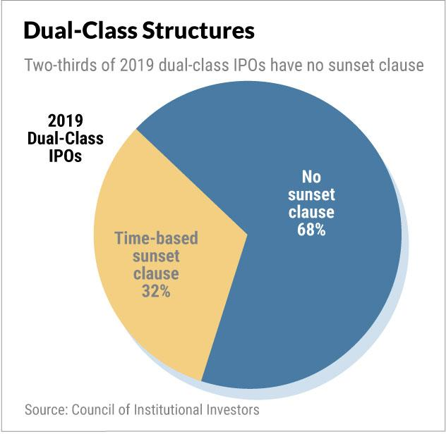

## Table of Contents

## What are multiple share classes?

Multiple share classes are different types of stocks that a company can offer to investors. Each share class has its own set of rights and privileges, like voting power or dividend payments. For example, one class might have more voting rights, while another might offer higher dividends but less voting power. Companies create multiple share classes to attract different types of investors, depending on what they value most.

This system is common in big companies, especially in tech and media. For instance, Google's parent company, Alphabet, has Class A, Class B, and Class C shares. Class A shares have one vote each, Class B shares have ten votes each, and Class C shares have no voting rights. This setup helps the founders keep control of the company even as they raise money from the public. It's a way for companies to balance control with the need to raise capital from a wide range of investors.

## What are super voting shares?

Super voting shares are a type of stock that gives the owner more votes than regular shares. For example, one super voting share might give you 10 votes, while a regular share gives you just one vote. Companies use super voting shares to let founders or key people keep control of the company, even if they don't own most of the shares.

This can be important for companies that want to grow big but still want the original leaders to make the big decisions. It's common in tech companies where the founders have a special vision for the future. But some people worry that super voting shares can be unfair because they give too much power to a few people, even if other shareholders might not agree with their choices.

## How do multiple share classes affect corporate governance?

Multiple share classes can change how a company is run by giving different voting powers to different shareholders. This means that some people can have more say in big decisions, like who sits on the board of directors or whether to approve a merger. If a company has super voting shares, the founders or key people might keep control even if they own less of the company. This can be good because it lets the people who started the company stick to their vision, but it can also be bad because other shareholders might feel left out of important decisions.

This setup can make things tricky for corporate governance. When some shareholders have more votes, it can lead to decisions that favor them over others. This might make other investors less happy and less likely to invest in the company. On the other hand, having multiple share classes can help a company grow big while still letting the original leaders guide it. It's a balancing act between keeping control and making sure everyone feels like their voice matters.

## What is the purpose of having different share classes within a company?

The main reason companies have different share classes is to attract different kinds of investors while keeping control in the hands of founders or key people. For example, some investors might care more about getting money back through dividends, so the company might offer them a share class with higher dividend payments but fewer voting rights. On the other hand, founders or key leaders might want to keep making the big decisions, so they hold onto shares that give them more votes.

This setup helps companies grow big while still sticking to the original vision of the people who started it. It's like having different types of tickets to a concert—some give you a better seat or more perks, while others let you in for less money but with fewer benefits. But it can also cause some problems. If some shareholders have more power, they might make decisions that others don't agree with, which can lead to tension or unhappy investors. It's all about finding a balance between attracting money and keeping control.

## Can you explain the difference between Class A and Class B shares?

Class A and Class B shares are different types of stocks that a company can offer. Usually, Class A shares give you more voting power than Class B shares. For example, one Class A share might give you 10 votes, while one Class B share might give you just one vote. This means that if you own Class A shares, you have a bigger say in how the company is run, like who gets to be on the board of directors or whether to approve a big merger.

Companies use Class A and Class B shares to attract different kinds of investors. Some people might want to invest in the company but don't care as much about voting. They might buy Class B shares because they're often cheaper and still let them own part of the company. On the other hand, founders or key leaders might keep Class A shares to make sure they stay in control, even as the company grows and more people invest in it. This way, the people who started the company can stick to their original vision while still getting money from other investors.

## How do super voting shares impact shareholder voting power?

Super voting shares give some shareholders more votes than others. For example, one super voting share might give you 10 votes, while a regular share gives you just one vote. This means that people who own super voting shares have a lot more say in big decisions, like who sits on the board of directors or whether to approve a merger. Companies often give super voting shares to founders or key leaders so they can keep control of the company, even if they own less of it than other investors.

This can be good because it lets the people who started the company stick to their vision as it grows. But it can also be a problem because other shareholders might feel left out of important decisions. If a few people have most of the voting power, they might make choices that others don't agree with. This can lead to tension or make other investors less happy with the company.

## What are the potential benefits of super voting shares for a company?

Super voting shares can help a company keep its original vision. When founders or key leaders have more votes, they can make sure the company sticks to the plan they started with. This is important for companies that want to grow big but still want the people who started it to be in charge. It's like having a captain who knows the best way to steer the ship, even as more people come on board.

But super voting shares can also make other investors happy. Some people might not care about voting as much as they care about making money. They might buy regular shares that don't have as many votes but could be cheaper or offer other benefits like higher dividends. This way, the company can attract different kinds of investors and still keep control in the hands of the people who know it best.

## What are the criticisms or drawbacks of using super voting shares?

Super voting shares can make some people unhappy. When a few people have most of the votes, they can make big decisions that others might not like. This can make other shareholders feel left out or ignored. They might think it's not fair that some people have so much more power, even if they own less of the company. This can lead to tension and make investors less likely to put their money into the company.

Another problem is that super voting shares can make it hard for the company to change if it needs to. If the founders or key leaders have too much control, they might stick to old ideas even when new ones would be better. This can slow down the company and make it harder to grow or adapt to new situations. It's like having a captain who won't change [course](/wiki/best-algorithmic-trading-courses) even when there's a better way to go.

## How have regulatory bodies responded to the use of multiple share classes and super voting shares?

Regulatory bodies have been looking closely at multiple share classes and super voting shares. They want to make sure that companies are fair to all their investors. Some regulators worry that super voting shares give too much power to a few people, which might not be good for everyone who owns part of the company. They are trying to find a balance between letting companies grow and making sure all shareholders have a say in big decisions.

In some places, like the United States, stock exchanges have rules about how long companies can keep different share classes. For example, the New York Stock Exchange and Nasdaq have rules that say companies can't have multiple share classes forever. After a certain time, usually a few years, all shares have to have the same voting power. This is to make sure that over time, all shareholders get an equal say in how the company is run.

## Can you provide examples of companies that use multiple share classes and super voting shares?

Google's parent company, Alphabet, is a good example of a company that uses multiple share classes and super voting shares. Alphabet has three types of shares: Class A, Class B, and Class C. Class A shares give you one vote each, Class B shares give you ten votes each, and Class C shares don't give you any votes. The founders, Larry Page and Sergey Brin, mostly hold Class B shares, so they can keep making the big decisions even if other people own more of the company.

Another example is Facebook, now known as Meta. They also have different share classes. Mark Zuckerberg, the founder, has Class B shares that give him ten votes each. Other investors have Class A shares that give them just one vote each. This means Mark can control the company even if he doesn't own most of it. This setup helps him stick to his vision for the company as it grows bigger.

## What are the long-term implications of multiple share classes on company valuation and investor interest?

Having multiple share classes can affect how much a company is worth and how interested investors are in it. When a company has different types of shares, like ones with more votes or ones that pay more dividends, it can attract different kinds of investors. Some people might like the idea of having more say in the company's decisions, so they might be willing to pay more for shares with more votes. Others might just want to make money and not care about voting, so they might go for shares that pay higher dividends. This can make the company more valuable because it can appeal to a wider range of investors.

But there can also be problems. If some shareholders have a lot more power because of super voting shares, other investors might feel left out. They might worry that the people with more votes will make decisions that aren't good for everyone. This can make them less interested in investing in the company, which could lower its value over time. It's a tricky balance for companies to keep everyone happy while still sticking to their original vision.

## How might the structure of multiple share classes and super voting shares evolve in the future?

In the future, the way companies use multiple share classes and super voting shares might change because of rules from regulators and what investors want. Right now, some stock exchanges have rules that say companies can't keep different share classes forever. After a few years, all shares have to have the same voting power. This is to make sure everyone gets a fair say in how the company is run. But as more companies grow big and want to keep control, they might push for new rules that let them keep different share classes for longer.

Investors are also becoming more aware of how multiple share classes can affect their power in a company. If they feel like they're being left out of big decisions, they might start to invest in other companies that treat all shareholders more equally. This could make companies think twice about using super voting shares. They might start to find other ways to keep control, like having strong boards of directors or using other kinds of stock that don't give some people more votes. As time goes on, the balance between letting companies grow and making sure all investors feel heard will keep changing.

## References & Further Reading

Bebchuk, L. A., & Kastiel, K. (2017). "The Untenable Case for Perpetual Dual-Class Stock." In this article, the authors explore the implications and challenges associated with maintaining dual-class stock structures indefinitely. They argue that such structures can lead to governance issues and misalignments between shareholders and management. The study is critical for understanding the governance risks posed by super-voting shares in modern corporations.

Admati, A. R., & Pfleiderer, P. (2009). "The Wall Street Walk and Shareholder Activism." This paper examines the role of shareholder activism in corporate governance. It provides insights into how shareholders, through activism and the exercise of voting rights, can influence corporate decision-making and management practices. The article is useful for understanding the dynamics of voting power and shareholder influence.

Shleifer, A., & Vishny, R. W. (1997). "A Survey of Corporate Governance." This comprehensive survey reviews the mechanisms of corporate governance worldwide, evaluating how different systems and structures affect economic outcomes. It is instrumental in understanding how share classes and governance practices impact corporate control and performance.

Malkiel, B. G. (1999). "A Random Walk Down Wall Street." Although primarily a guide to investment strategies and efficient market hypothesis, this book offers relevant insights into market dynamics influenced by investor behavior and decision-making processes. It aids in grasping how various share structures might affect investor perceptions and stock valuations.

Gompers, P. A., Ishii, J. L., & Metrick, A. (2003). "Corporate Governance and Equity Prices." The article investigates the relationship between corporate governance practices and equity prices, using empirical data to demonstrate how governance quality impacts stock performance. This research is crucial for analyzing how different share classes, including those with super-voting rights, impact market valuation and investor returns.

