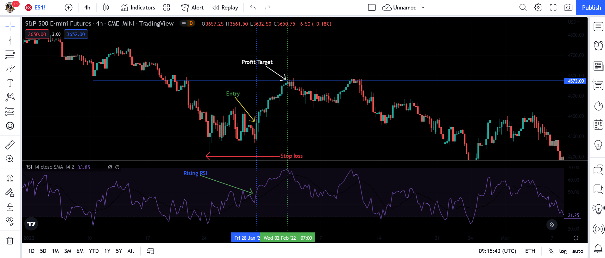

## Table of Contents

## What is a multiple timeframe strategy in trading?

A multiple timeframe strategy in trading is when a trader looks at different time periods on their charts to make better decisions. Instead of just looking at one chart, like a daily chart, they might also look at a weekly chart and an hourly chart. This helps them see the big picture and the smaller details at the same time. By doing this, they can find good times to buy or sell and understand how the market is moving in different ways.

For example, a trader might use a weekly chart to see the overall trend of a stock. If the weekly chart shows the stock is going up, they might decide to buy it. Then, they can use a daily chart to find the best time to buy within that week. They might even use an hourly chart to find the exact moment to enter the trade. This way, they can make sure they are following the big trend but also getting the best price possible.

## Why is it important to use multiple timeframes in trading?

Using multiple timeframes in trading is important because it helps traders see the market from different angles. When you look at just one timeframe, like a daily chart, you might miss important information that you can see on a longer or shorter timeframe. For example, a daily chart might show a stock going up, but a weekly chart could show that it's actually in a long-term downtrend. By looking at multiple timeframes, you get a clearer picture of what's really happening in the market.

This approach also helps traders make better decisions about when to buy or sell. If you're only looking at a short-term chart, you might get in and out of trades too quickly, missing out on bigger moves. But if you also look at a longer-term chart, you can see the bigger trend and wait for the best moment to enter or [exit](/wiki/exit-strategy) a trade. This can lead to more successful trades and better overall results in your trading.

## How do beginners start applying a multiple timeframe strategy?

Beginners can start applying a multiple timeframe strategy by first choosing three different timeframes to look at. A good way to start is by [picking](/wiki/asset-class-picking) a long-term timeframe, like a weekly chart, a medium-term timeframe, like a daily chart, and a short-term timeframe, like an hourly chart. The weekly chart will help you see the big trend, the daily chart will show you what's happening over a few days, and the hourly chart will help you find the best time to buy or sell within those days.

Once you have your charts set up, start by looking at the weekly chart to see if the stock or asset is in an uptrend or a downtrend. If it's in an uptrend, you might want to look for times to buy. Then, use the daily chart to find a good day to buy within that week. Finally, use the hourly chart to find the exact moment to enter your trade. This way, you're making sure you're following the big trend but also getting the best price. As you practice, you'll get better at understanding how the different timeframes work together to help you make smarter trading decisions.

## What are the most common timeframes used in a multiple timeframe strategy?

The most common timeframes used in a multiple timeframe strategy are the weekly, daily, and hourly charts. The weekly chart is the longest timeframe and helps traders see the big picture or the overall trend of a stock or asset. If the weekly chart shows an uptrend, it means the stock has been going up over several weeks, and if it shows a downtrend, it means the stock has been going down. This big picture helps traders decide if they should be buying or selling.

The daily chart is the medium-term timeframe and shows what's happening over a few days. It's useful for finding good days to buy or sell within the bigger weekly trend. For example, if the weekly chart shows an uptrend, the daily chart can help you pick the best day to buy the stock. The hourly chart is the shortest timeframe and helps traders find the exact moment to enter or exit a trade. It's great for fine-tuning your entry and exit points to get the best price possible. By looking at all three timeframes, traders can make better decisions and improve their chances of success.

## How does a multiple timeframe strategy help in identifying trends?

A multiple timeframe strategy helps in identifying trends by allowing traders to see the same asset from different perspectives. By looking at a weekly chart, traders can see the big trend that has been happening over several weeks or months. This helps them understand if the stock or asset is generally going up or down. For example, if the weekly chart shows that the stock has been going up over the last few weeks, it tells the trader that the big trend is an uptrend.

Then, by using a daily chart, traders can see what's happening over a few days within that big trend. The daily chart can help them find good days to buy or sell the stock. If the weekly chart shows an uptrend, the daily chart can help them pick a day when the stock might be cheaper to buy. Finally, the hourly chart helps traders find the exact time to enter or exit a trade. It shows them the small moves happening throughout the day, allowing them to get the best price. By using all these timeframes together, traders can see the big trend and find the best times to act on it.

## What are the key differences between using a single timeframe versus multiple timeframes?

Using a single timeframe means you only look at one chart, like a daily chart, to make trading decisions. This can be simple and quick, but it's like trying to understand a whole story by only reading one page. You might see a stock going up on the daily chart and decide to buy it, but you won't know if it's part of a bigger trend or just a short-term move. This can lead to mistakes because you don't see the full picture.

On the other hand, using multiple timeframes means you look at several charts, like weekly, daily, and hourly charts, to get a better understanding of the market. This is like reading the whole book instead of just one page. By looking at the weekly chart, you see the big trend. The daily chart helps you find the best day to buy or sell within that trend, and the hourly chart helps you pick the exact moment to make your trade. This way, you make more informed decisions and increase your chances of success because you see how the market is moving in different time periods.

## How can traders align entry and exit points using multiple timeframes?

Traders can align entry and exit points using multiple timeframes by first looking at the weekly chart to see the big trend. If the weekly chart shows that the stock is going up, traders know they should be looking for a good time to buy. Then, they can use the daily chart to find a day when the stock might be cheaper within that big uptrend. For example, if the daily chart shows the stock going down a bit but still within the uptrend, that could be a good day to buy. Finally, traders use the hourly chart to find the exact moment to enter the trade. They might see that the stock is going up on the hourly chart and decide to buy right then.

Once they are in the trade, traders can use the same multiple timeframes to decide when to sell. They keep an eye on the weekly chart to make sure the big trend is still going up. If it changes to a downtrend, they might want to sell. The daily chart helps them find a good day to sell within that trend. If the daily chart shows the stock starting to go down, that could be a good day to sell. The hourly chart then helps them find the exact moment to exit the trade, maybe when the stock is going down on the hourly chart. By using all three timeframes, traders can make sure they are entering and exiting their trades at the best possible times.

## What are the potential pitfalls of using a multiple timeframe strategy?

Using a multiple timeframe strategy can be tricky because it can be confusing to look at so many charts at once. It's easy to get overwhelmed by all the different information. If you're new to trading, it might be hard to understand how the weekly, daily, and hourly charts all fit together. You might see different signals on each chart, and it can be tough to decide which one to follow. This can lead to making bad trading decisions because you're not sure which timeframe is most important.

Another problem is that you might miss out on good trades if you wait too long for all the timeframes to line up perfectly. Sometimes, the market moves quickly, and if you're waiting for the weekly, daily, and hourly charts to all show the same thing, you might miss your chance. It can also be hard to stick to your trading plan if you're always switching between different timeframes. You might end up changing your mind a lot, which can make your trading less successful. So, while using multiple timeframes can help you make better decisions, it also comes with these challenges that you need to be aware of.

## How can advanced traders optimize their multiple timeframe strategy?

Advanced traders can optimize their multiple timeframe strategy by focusing on a few key areas. First, they should choose the right timeframes that match their trading style and goals. For example, a swing trader might use weekly, daily, and 4-hour charts, while a day trader might use daily, 1-hour, and 15-minute charts. By picking the best timeframes for their needs, traders can make sure they're looking at the most useful information. They should also pay attention to how the different timeframes interact. For instance, if the weekly chart shows an uptrend, they can use the daily chart to find pullbacks within that trend, and the hourly chart to enter at the best moment during those pullbacks.

Another way to optimize a multiple timeframe strategy is by using technical indicators on each timeframe. Advanced traders can use moving averages, RSI, or MACD on the weekly chart to confirm the big trend, and then use the same or different indicators on the daily and hourly charts to fine-tune their entry and exit points. They should also set clear rules for how they will act on signals from each timeframe. For example, they might decide to only enter a trade when the weekly and daily charts both show a buy signal, and use the hourly chart to find the best entry price. By setting these rules and sticking to them, advanced traders can make their multiple timeframe strategy more effective and less confusing.

## What role do indicators play in a multiple timeframe strategy?

Indicators help traders make better decisions when using a multiple timeframe strategy. They give extra information about what's happening on each chart. For example, on a weekly chart, a trader might use a moving average to see the big trend. If the price is above the moving average, it means the stock is going up over time. On the daily chart, the same trader might use the RSI to see if the stock is overbought or oversold. This can help them find good days to buy or sell within the big trend. On the hourly chart, they might use the MACD to find the best moment to enter or exit a trade. By using indicators on all three timeframes, traders get a clearer picture of when to act.

Using indicators this way helps traders line up their entry and exit points. If the weekly chart shows an uptrend and the moving average confirms it, the trader knows they should be looking to buy. The daily chart's RSI can tell them if the stock is a good buy on a particular day. Then, the hourly chart's MACD can help them find the exact time to make the trade. By combining these indicators across different timeframes, traders can make more informed decisions and improve their chances of success. It's like using a map and a compass together to find the best route on a journey.

## How can a multiple timeframe strategy be integrated with other trading strategies?

A multiple timeframe strategy can be mixed with other trading strategies to make your trading better. For example, if you use a trend-following strategy, you can use multiple timeframes to see the big trend on a weekly chart and then find the best times to buy or sell on daily and hourly charts. This way, you can follow the trend but also get good prices. Another way is to use a [breakout](/wiki/breakout-trading) strategy, where you wait for the price to break out of a range. You can use the weekly chart to see if the breakout is part of a bigger move, the daily chart to confirm the breakout, and the hourly chart to enter the trade at the right time.

You can also mix a multiple timeframe strategy with a mean reversion strategy, where you buy when the price is low and sell when it's high. The weekly chart can help you see if the stock is in a range, the daily chart can show you when it's at the bottom of that range, and the hourly chart can help you buy at the best moment. By using multiple timeframes with other strategies, you get a fuller picture of what's happening in the market. This can help you make smarter trades and improve your chances of making money.

## What are some case studies or examples of successful multiple timeframe strategy applications?

One example of a successful multiple timeframe strategy is a trader who used it to trade Apple stock. They looked at the weekly chart and saw that Apple was in a strong uptrend. They then used the daily chart to find a good day to buy within that trend. They noticed that the stock had pulled back a bit, but the daily chart still showed it was going up. Finally, they used the hourly chart to find the exact time to buy. They saw that the stock was starting to go up on the hourly chart and bought it right then. This helped them get in at a good price and ride the big trend up, making a nice profit.

Another example is a trader who used multiple timeframes to trade [forex](/wiki/forex-system). They looked at the weekly chart of the EUR/USD pair and saw it was in a downtrend. They then used the daily chart to find a good day to sell. The daily chart showed that the pair had a small uptick but was still going down overall. They used the hourly chart to find the best time to enter their sell trade. They saw that the pair was starting to go down on the hourly chart and sold it at that moment. This allowed them to catch the bigger downtrend and make a good trade.

## What are the indicators and tools used for multiple time frame analysis?

Multiple time frame analysis employs a suite of indicators that assists traders in identifying both long-term trends and short-term price movements. Among the most commonly used tools are moving averages, the Moving Average Convergence Divergence (MACD), stochastic oscillators, and the Relative Strength Index (RSI). Each of these indicators serves distinct purposes within the multiple time frame framework, providing valuable insights into market dynamics.

Moving averages are often utilized to smooth out price data, creating a clearer perspective of trend direction over a specific period. For example, a trader might use a simple moving average (SMA) or an exponential moving average (EMA) on a daily chart to discern the prevailing trend. The formula for a simple moving average over $n$ periods is given by:

$$
SMA = \frac{P_1 + P_2 + \cdots + P_n}{n}
$$

where $P$ represents the price at each period. The EMA, which gives more weight to recent prices, is computed using:

$$
EMA_t = \alpha \times (P_t) + (1 - \alpha) \times EMA_{t-1}
$$

with $\alpha$ being the smoothing factor.

The MACD is another versatile tool that highlights changes in the strength, direction, [momentum](/wiki/momentum), and duration of a trend. It is calculated by subtracting the 26-period EMA from the 12-period EMA. The result is the MACD line, which is frequently analyzed alongside a nine-day EMA of the MACD line, known as the signal line.

Stochastic oscillators, conversely, measure the location of the closing price relative to the high-low range over a specific period. This oscillator operates on the assumption that during an upward trend, prices tend to close near their high, and conversely, during a downward trend, prices close near the low. The primary calculation is:

$$
\%K = \frac{(C - L14)}{(H14 - L14)} \times 100
$$

where $C$ is the most recent closing price, $L14$ is the lowest price traded over the last 14 trading sessions, and $H14$ is the highest price traded over the same period.

The RSI is another momentum oscillator that measures the speed and change of price movements. It operates on a scale of 0 to 100, with levels typically set at 70 and 30 to determine overbought or oversold conditions. The RSI is calculated through:

$$
RSI = 100 - \left( \frac{100}{1 + RS} \right)
$$

where $RS$ is the average gain divided by the average loss over the defined period.

Aligning these indicators across multiple time frames can significantly enhance trade execution strategies. For instance, a trader may establish the overall trend direction on a daily chart using a moving average, while simultaneously utilizing a stochastic oscillator on an hourly chart to pinpoint optimal entry points. Such a combination ensures that the trader's actions are synchronized with the broader market trend, thereby optimizing trade timing and potentially increasing profitability. Proper coordination of these indicators is key to extracting actionable insights from the market and maximizing the efficacy of trades executed through [algorithmic trading](/wiki/algorithmic-trading) systems.

## References & Further Reading

[1]: Bergstra, J., Bardenet, R., Bengio, Y., & Kégl, B. (2011). ["Algorithms for Hyper-Parameter Optimization."](https://dl.acm.org/doi/10.5555/2986459.2986743) Advances in Neural Information Processing Systems 24.

[2]: ["Advances in Financial Machine Learning"](https://www.amazon.com/Advances-Financial-Machine-Learning-Marcos/dp/1119482089) by Marcos Lopez de Prado

[3]: ["Evidence-Based Technical Analysis: Applying the Scientific Method and Statistical Inference to Trading Signals"](https://www.amazon.com/Evidence-Based-Technical-Analysis-Scientific-Statistical/dp/0470008741) by David Aronson

[4]: ["Machine Learning for Algorithmic Trading"](https://github.com/stefan-jansen/machine-learning-for-trading) by Stefan Jansen

[5]: ["Quantitative Trading: How to Build Your Own Algorithmic Trading Business"](https://books.google.com/books/about/Quantitative_Trading.html?id=j70yEAAAQBAJ) by Ernest P. Chan