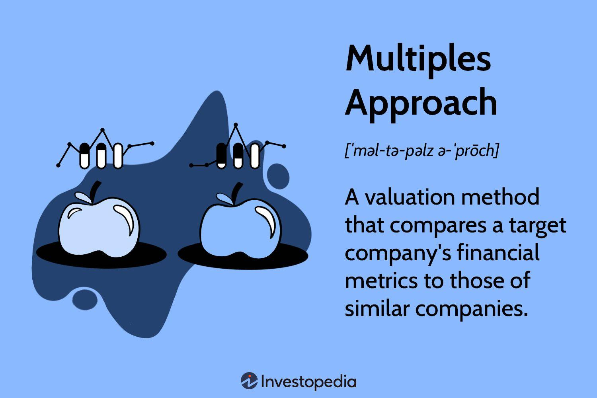

## Table of Contents

## What is the multiples approach in finance?

The multiples approach in finance is a way to figure out how much a company is worth by comparing it to other similar companies. It's like looking at the price tags of similar houses in a neighborhood to guess the value of a house you're interested in. In finance, this method uses numbers called multiples, which are ratios that show how a company's value compares to things like its earnings, sales, or book value. For example, if a company's stock price is $50 and its earnings per share are $5, the price-to-earnings (P/E) multiple would be 10. This means investors are willing to pay $10 for every dollar of the company's earnings.

To use the multiples approach, you first pick a multiple that makes sense for the industry you're looking at. Common multiples include the P/E ratio, the price-to-sales (P/S) ratio, and the enterprise value-to-EBITDA (EV/EBITDA) ratio. Once you choose a multiple, you find the average multiple for similar companies in the same industry. Then, you apply this average multiple to the financial metric of the company you're valuing. For instance, if the average P/E ratio in an industry is 15 and the company you're valuing has earnings per share of $4, you would estimate its stock price to be $60 (15 times $4). This method is popular because it's quick and easy, but it can be less accurate if the companies being compared are not truly similar or if market conditions change rapidly.

## How does the multiples approach differ from other valuation methods?

The multiples approach is different from other valuation methods because it focuses on comparing a company to others in the same industry, rather than looking at the company's own financial details in depth. For example, when using the discounted cash flow (DCF) method, you predict how much money a company will make in the future and figure out what that money is worth now. This can be very detailed and specific to the company. On the other hand, the multiples approach uses a simpler formula. It looks at ratios like price-to-earnings or price-to-sales and compares them to the industry average. This makes it quicker and easier to use, but it might not capture all the unique aspects of the company being valued.

Another key difference is that the multiples approach relies heavily on market data and the performance of similar companies, while other methods like the asset-based approach focus on the company's own assets and liabilities. The asset-based approach adds up what the company owns and subtracts what it owes to find its value. This method can be more thorough but might not reflect the company's earning potential or market position as well as the multiples approach does. The multiples approach can give a good snapshot of how the market views a company compared to its peers, but it might miss important details if the companies being compared are not truly similar or if the market is going through unusual changes.

## What are the most common multiples used in financial analysis?

The most common multiples used in financial analysis are the price-to-earnings (P/E) ratio, the price-to-sales (P/S) ratio, and the enterprise value-to-EBITDA (EV/EBITDA) ratio. The P/E ratio compares a company's stock price to its earnings per share. It shows how much investors are willing to pay for each dollar of the company's earnings. The P/S ratio compares the company's market value to its revenue. This is useful for companies that might not have profits yet but are growing their sales. The EV/EBITDA ratio looks at a company's total value, including debt, compared to its earnings before interest, taxes, depreciation, and amortization. This multiple is helpful for comparing companies with different levels of debt or different tax situations.

Each of these multiples helps analysts understand different aspects of a company's value. The P/E ratio is widely used because it's easy to understand and directly relates to a company's profitability. However, it can be less useful for companies that are not yet profitable. The P/S ratio is good for looking at growth companies, as it focuses on revenue rather than profits. The EV/EBITDA ratio is often used in mergers and acquisitions because it gives a clearer picture of a company's operating performance by removing the effects of financing and accounting decisions. By using these multiples, analysts can quickly compare a company to its peers and get a sense of whether it's overvalued or undervalued in the market.

## Can you explain how to calculate the Price-to-Earnings (P/E) ratio?

To calculate the Price-to-Earnings (P/E) ratio, you need two pieces of information: the stock price of the company and its earnings per share (EPS). The stock price is what you would pay to buy one share of the company's stock. The EPS is the company's total earnings divided by the number of shares it has. To find the P/E ratio, you simply divide the stock price by the EPS. For example, if a company's stock is trading at $50 per share and its EPS is $5, the P/E ratio would be $50 divided by $5, which equals 10. This means investors are willing to pay $10 for every dollar of the company's earnings.

The P/E ratio is a useful tool because it helps investors understand how much they are paying for a company's earnings. A high P/E ratio might mean that investors expect the company to grow a lot in the future, so they are willing to pay more for its earnings. On the other hand, a low P/E ratio might mean that the company is not expected to grow much, or it could be seen as undervalued. It's important to compare the P/E ratio of a company to other companies in the same industry, because different industries can have very different average P/E ratios. By comparing, you can get a better idea of whether a company's stock is a good value or not.

## What industries typically use the Enterprise Value to EBITDA multiple?

The Enterprise Value to EBITDA multiple is often used in industries where companies have a lot of debt or where they spend a lot on things like buildings and machines. This multiple is helpful because it looks at a company's value including its debt, and it takes away the costs of interest, taxes, and the wear and tear on buildings and machines. Industries like energy, where companies build oil rigs and pipelines, and telecom, where companies set up networks, often use this multiple. It helps them compare companies that might have different amounts of debt or different ways of paying taxes.

Another industry that commonly uses the Enterprise Value to EBITDA multiple is the manufacturing sector. In manufacturing, companies often have big factories and lots of equipment, so the costs of these things can make it hard to compare companies just by looking at their profits. The EV/EBITDA multiple helps because it focuses on the company's operating performance, without the distractions of how they are financed or how much they pay in taxes. This makes it easier to see which companies are doing well at making money from their main business activities.

## How do you select comparable companies for multiples analysis?

To select comparable companies for multiples analysis, you first need to look at companies that are in the same industry as the company you want to value. This means finding companies that do similar things and sell similar products or services. For example, if you're valuing a car company, you would look at other car companies. It's also important to consider the size of the companies. A small startup might not be a good comparison for a big, established company, even if they are in the same industry. So, you should try to find companies that are similar in size and business model.

Next, you should think about where these companies operate. If the company you're valuing mostly does business in one country, it's best to compare it to other companies that also focus on that country. This is because economic conditions can be different in different places, and that can affect how much a company is worth. Also, you might want to look at how fast these companies are growing and how profitable they are. Companies that are growing quickly or making a lot of money might have different multiples than companies that are not doing as well. By choosing companies that are similar in these ways, you can get a better idea of what multiples to use for your valuation.

## What adjustments should be made when using multiples for valuation?

When using multiples for valuation, you might need to make some changes to get a fair comparison. One big adjustment is to make sure the financial numbers you're using are the same across all the companies you're looking at. For example, if one company has a lot of debt and another doesn't, you might want to add back the interest payments to the earnings of the company with debt. This way, you're comparing the companies based on their core business performance, not their financing choices. Another thing to consider is non-recurring items. If a company had a one-time expense or income, you should take that out of the earnings to get a clearer picture of what the company usually makes.

It's also important to think about the timing of the financial data you're using. If one company's numbers are from a year ago and another's are from last month, the comparison might not be fair because things can change quickly in business. You might need to adjust the older numbers to make them more current. Also, different accounting methods can affect how companies report their earnings, so you might need to make adjustments to make sure everyone's numbers are calculated the same way. By making these adjustments, you can get a better, more accurate comparison of the companies and a more reliable valuation.

## How can the multiples approach be used to assess a company's growth prospects?

The multiples approach can help you understand a company's growth prospects by comparing it to other companies in the same industry. If a company has a higher multiple than its peers, it might mean that investors think it will grow faster in the future. For example, if a company's price-to-earnings (P/E) ratio is much higher than the average for its industry, it could be a sign that investors are expecting big growth. By looking at these multiples, you can get a sense of how the market views a company's future compared to its competitors.

However, it's important to be careful when using multiples to assess growth. Just because a company has a high multiple doesn't always mean it will grow a lot. Sometimes, a high multiple can be a sign that the company is overvalued, and its stock price might be too high compared to its actual earnings. To get a better idea of growth prospects, you should look at other things too, like the company's past growth rates, its business plans, and what analysts are saying about its future. By combining the multiples approach with other information, you can make a more informed guess about how much a company might grow.

## What are the limitations of using multiples for company valuation?

Using multiples for company valuation can be tricky because it depends a lot on finding the right companies to compare. If the companies you pick aren't really similar, your valuation might not be accurate. For example, if you're comparing a small tech startup to a big, established tech company, the multiples might not give you a fair picture. Also, multiples don't take into account all the unique things about a company, like its business model or how it manages its money. So, while multiples are quick and easy to use, they can miss important details that affect a company's true value.

Another problem with using multiples is that they are based on current market conditions, which can change quickly. If the market goes up or down, the multiples can change too, making your valuation outdated. Also, multiples don't tell you about a company's future growth or risks. They just show you what investors are willing to pay right now. So, while multiples can give you a quick snapshot of how a company is valued compared to others, they might not give you the full story. It's best to use multiples along with other valuation methods to get a more complete picture.

## How does the choice of multiple affect the valuation outcome?

The choice of multiple can really change how much a company seems to be worth. Different multiples focus on different parts of a company's finances. For example, the price-to-earnings (P/E) ratio looks at how much investors are willing to pay for each dollar of the company's earnings. If you use a P/E ratio that's too high compared to the industry average, the company might look more valuable than it really is. On the other hand, if you use a P/E ratio that's too low, the company might seem undervalued. So, picking the right multiple is important to get a fair valuation.

Also, different multiples can tell different stories about a company. The price-to-sales (P/S) ratio might be better for a company that's growing fast but not making profits yet, because it focuses on revenue instead of earnings. The enterprise value-to-EBITDA (EV/EBITDA) ratio is good for comparing companies with different levels of debt or different tax situations, because it looks at the company's total value and operating performance. If you choose the wrong multiple for the company you're valuing, you might miss important details about its financial health or growth potential. That's why it's crucial to pick a multiple that matches the company's situation and the industry it's in.

## Can you discuss a case study where the multiples approach led to an accurate valuation?

In 2016, when Microsoft wanted to buy LinkedIn, they used the multiples approach to figure out how much LinkedIn was worth. They looked at similar companies in the tech and social media industry. Microsoft used the enterprise value-to-revenue (EV/Revenue) multiple because LinkedIn was growing fast but not making huge profits yet. They found that the average EV/Revenue multiple for similar companies was around 7. Microsoft then applied this multiple to LinkedIn's revenue, which was about $3 billion at the time. This calculation suggested that LinkedIn was worth around $21 billion. Microsoft ended up buying LinkedIn for $26.2 billion, which was a bit higher but still in the same ballpark. This shows that the multiples approach can give a good estimate of a company's value when you choose the right multiple and compare it to the right companies.

The multiples approach worked well in this case because Microsoft picked a multiple that made sense for LinkedIn's situation. They chose the EV/Revenue multiple because it focused on LinkedIn's strong revenue growth, which was more important than its current profits. By comparing LinkedIn to other tech and social media companies, Microsoft got a fair idea of what investors were willing to pay for similar businesses. This helped them make a smart decision about how much to offer for LinkedIn. The fact that the final purchase price was close to the valuation from the multiples approach shows that this method can be accurate when used correctly.

## What advanced techniques can be applied to refine the multiples approach in complex valuation scenarios?

In complex valuation scenarios, one advanced technique to refine the multiples approach is to use a combination of different multiples. Instead of relying on just one multiple like the price-to-earnings ratio, you might use a blend of multiples such as price-to-sales, enterprise value-to-EBITDA, and price-to-book value. By combining these, you can get a more complete picture of the company's value, capturing different aspects of its financial health and market position. For example, if a company has high growth potential but low current profits, using both the price-to-sales and price-to-earnings multiples can help balance the valuation and make it more accurate.

Another technique is to adjust the multiples based on specific company characteristics or market conditions. This might involve making adjustments for things like different growth rates, profit margins, or levels of debt. For instance, if a company is growing faster than its peers, you might use a higher multiple to reflect its better growth prospects. Additionally, you can use regression analysis to find out how different factors affect the multiples of comparable companies. This can help you fine-tune the multiple you use for the company you're valuing, making the valuation more precise and tailored to the company's unique situation.

## What is the Understanding Multiples Approach Valuation?

The multiples approach valuation is a key comparative methodology employed to assess a company's worth by examining its financial metrics relative to competitors. This technique provides a practical and efficient method for analyzing a firm's market position and potential investment value.

At its core, the multiples approach involves the use of various financial ratios to compare companies within the same industry. The most commonly utilized multiples are the Price-to-Earnings (P/E) ratio and the Enterprise Value to Earnings Before Interest, Taxes, Depreciation, and Amortization (EV/EBITDA) ratio.

The P/E ratio is calculated by dividing the market value per share by the earnings per share (EPS). It is expressed as follows:

$$
\text{P/E Ratio} = \frac{\text{Market Value per Share}}{\text{Earnings per Share (EPS)}}
$$

This metric indicates how much investors are willing to pay for a dollar of earnings, providing insights into market expectations and company growth prospects. A high P/E ratio might suggest that a company is overvalued, or that investors anticipate significant future growth. Conversely, a low P/E ratio could indicate undervaluation or potential issues with the company's financial health.

Similarly, the EV/EBITDA ratio provides insight into a company's valuation by comparing its enterprise value (EV) to its EBITDA:

$$
\text{EV/EBITDA} = \frac{\text{Enterprise Value}}{\text{EBITDA}}
$$

Enterprise value encompasses the company's market capitalization, debt, and cash, presenting a holistic view of its market valuation. By mitigating differences in capital structure and tax rates, the EV/EBITDA ratio is particularly valuable when comparing firms with varying levels of debt.

Practitioners favor the multiples approach due to its simplicity and ability to quickly provide a snapshot of a firm's standing within its industry. It allows investors to gauge whether a company is undervalued or overvalued in the context of prevailing market conditions. When a company's multiples diverge significantly from its peers, it may signify an investment opportunity or warn of potential risks.

The application of multiples is not without challenges. Factors such as economic cycles, industry trends, and accounting differences can influence ratios, necessitating careful interpretation. Therefore, while multiples serve as a helpful preliminary tool, they are often used in conjunction with more detailed analysis to validate investment decisions.

## References & Further Reading

[1]: ["Valuation: Measuring and Managing the Value of Companies"](https://www.amazon.com/Valuation-Measuring-Managing-Companies-Finance/dp/1119610885) by McKinsey & Company Inc.

[2]: Chan, Ernest P. ["Algorithmic Trading: Winning Strategies and Their Rationale"](https://github.com/ftvision/quant_trading_echan_book).

[3]: ["High-Frequency Trading: A Practical Guide to Algorithmic Strategies and Trading Systems"](https://www.ahmetbeyefendi.com/wp-content/uploads/2020/07/High-Frequency-Trading-Irene-Aldridge.pdf) by Irene Aldridge

[4]: ["Trading and Exchanges: Market Microstructure for Practitioners"](https://www.amazon.com/Trading-Exchanges-Market-Microstructure-Practitioners/dp/0195144708) by Larry Harris

[5]: Poon, Ser-Huang. ["Algorithmic and High-Frequency Trading"](https://assets.cambridge.org/97811070/91146/frontmatter/9781107091146_frontmatter.pdf). Cambridge University Press.

[6]: ["Principles of Quantitative Equity Investing: A Complete Guide to Creating, Evaluating, and Implementing Trading Strategies"](https://ptgmedia.pearsoncmg.com/images/9780134192796/samplepages/9780134192796.pdf) by Sugata Ray