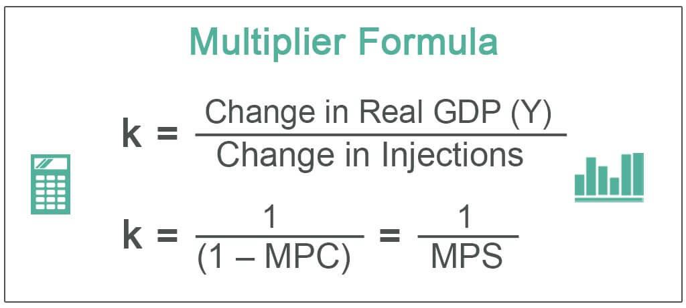

In today's interconnected financial markets, a comprehensive understanding of economic concepts is crucial for both investors and traders. Central to economic theory is the economic multiplier—an influential concept capable of amplifying financial movements throughout an economy. This article examines the intricacies of the economic formula, concentrating specifically on the multiplier effect, and evaluates its relevance within the ever-evolving domain of algorithmic trading.

At its core, the economic multiplier captures the process by which an initial increase in spending results in an amplified increase in overall economic output. This phenomenon occurs because the initial expenditure leads to increased income for others, who then spend a portion of this income, thus creating a ripple effect throughout the economy. The greater the propensity to consume, the stronger this multiplier effect becomes, significantly influencing market dynamics.



In algorithmic trading—a field characterized by the use of computer programs to execute trades based on predefined criteria—understanding economic principles like the multiplier effect can be instrumental. Algorithms, equipped with the ability to analyze vast datasets at speeds unattainable by human traders, can leverage these economic insights to optimize trading strategies and outcomes. By integrating economic principles into trading algorithms, traders and investors are better equipped to make informed decisions, anticipate market movements, and maintain a competitive edge in the financial markets.

The ensuing sections of this article will navigate through these fundamental concepts, exploring how they can be applied in algorithmic trading strategies to maximize trading efficacy and success in contemporary financial markets.

## Table of Contents

## Understanding the Economic Formula

The economic formula is integral to deciphering the complexities of economic activities and predicting their implications. At its core, this formula quantifies the intricate relationships between income, spending, and production, creating a framework for understanding the flow of financial resources within an economy. Specifically, key variables of the economic formula include consumption (C), investment (I), government spending (G), and net exports (NX), commonly expressed as:

$$

GDP = C + I + G + (X - M) 
$$

Where GDP represents the Gross Domestic Product, X stands for exports, and M for imports. Each of these components serves a distinct role in determining the overall economic activity. 

Consumption is the expenditure by households on goods and services, representing a significant portion of GDP. Investment refers to the purchase of capital goods that can contribute to future production capabilities. Government spending includes all government consumption and investment expenditures. Lastly, net exports denote the difference between a country's exports and imports, reflecting its economic transactions with the rest of the world.

By analyzing these components, one can gain insights into how resources circulate in the economy. This understanding is paramount for identifying demand and supply shifts, inflationary pressures, and potential growth areas. Economists and policymakers use these insights to anticipate market trends and formulate appropriate fiscal and monetary policies. 

Furthermore, the economic formula aids in understanding how changes in one variable, such as an increase in government spending, can ripple through the economy, affecting other variables and resulting in a multiplier effect. Recognizing such interactions is crucial for anticipating how policy decisions or economic events can influence broader market dynamics.

In conclusion, mastering the economic formula is essential for anyone looking to comprehend market movements and economic trends. By focusing on the relationships between consumption, investment, government spending, and net exports, one gains a comprehensive understanding of how various factors interplay to shape the economic landscape.

## The Multiplier Effect

The multiplier effect describes how an initial change in economic activity, such as an increase in spending, translates into a larger cumulative impact on total economic output. This phenomenon occurs because spending by one party becomes income for another, who then spends a portion of that income, creating successive rounds of spending. The magnitude of this effect is largely determined by the marginal propensity to consume (MPC), which is the additional propensity to spend out of additional income.

Mathematically, the multiplier ($k$) can be expressed as:

$$
k = \frac{1}{1-MPC}
$$

Where:
- $MPC$ is the marginal propensity to consume.

For instance, if the $MPC$ is 0.8, the multiplier would be calculated as:

$$
k = \frac{1}{1-0.8} = 5
$$

This implies that an initial increase in spending, say $1 million, could eventually lead to a total increase in economic output of $5 million.

The concept of the multiplier effect helps investors and policymakers predict how different economic policies or events can have broader implications in the economy. For example, a government stimulus that targets increasing consumer spending can cause a ripple effect across various sectors, leading to sustained economic growth. Conversely, adverse economic conditions or contractionary policies can result in a reversed multiplier effect, leading to a more pronounced economic slowdown.

Understanding the multiplier effect provides insight into how economic stimuli can lead to growth, and conversely, how negative shocks can be magnified. This understanding becomes critical in strategizing not just for policy implementation, but also for making informed investment and trading decisions, especially in financial systems where the effects of economic changes need to be quickly and accurately assessed.

## Algorithmic Trading: An Overview

Algorithmic trading, also known as algo trading, involves using computer programs to execute trades based on predefined rules and criteria. These algorithms are adept at analyzing substantial volumes of data at speeds that far surpass human capabilities. This technological advantage allows traders to achieve a level of efficiency and precision in the markets.

Algo trading strategies are diverse, each designed to exploit specific inefficiencies within the market. Common strategies include [arbitrage](/wiki/arbitrage), where traders seek to profit from price discrepancies in different markets or forms. Another strategy is market-making, which involves providing [liquidity](/wiki/liquidity-risk-premium) to the market and profiting from the bid-ask spread. Trend-following strategies capitalize on the continuation of existing market trends, while mean reversion strategies anticipate a return to an average price level after deviations.

The growth of big data and advancements in [machine learning](/wiki/machine-learning) have significantly enhanced the sophistication of [algorithmic trading](/wiki/algorithmic-trading) systems. These systems can incorporate complex statistical models and [artificial intelligence](/wiki/ai-artificial-intelligence) to refine and optimize trading strategies continuously. Machine learning, for example, can be used to predict price movements by analyzing patterns from historical data.

Understanding economic indicators and concepts, such as the economic multiplier, is crucial for the effectiveness of these algorithms. By integrating awareness of macroeconomic conditions and other financial metrics, algorithms can provide traders with insights into potential market shifts. This knowledge allows for the development of more robust trading strategies that can react swiftly to economic changes.

The impact of technological advancements extends to the incorporation of natural language processing (NLP) and sentiment analysis, which enable algorithms to assess the influence of news and social media on market dynamics. These tools equip traders with a deeper understanding of market sentiment, adding another layer of data to inform trading decisions.

Overall, algorithmic trading acts as a cornerstone of modern financial markets, offering speed and efficiency in trade execution. With its reliance on sophisticated data analysis and real-time information processing, algo trading not only amplifies opportunities in the markets but also sets the stage for more adaptive and innovative trading strategies.

## Applying Economic Concepts in Algo Trading

Applying economic concepts such as the economic multiplier in algorithmic trading strategies enhances decision-making processes and optimizes trading outcomes. Algorithms, by design, can incorporate potential multiplier effects arising from macroeconomic changes or fiscal policies. By doing so, these algorithms can assess not only the immediate impact of a policy but also the successive rounds of spending it induces. This capability allows for a more accurate prediction of market movements, especially in response to policy-induced changes in consumer behavior.

Consider a scenario where a fiscal policy leads to increased consumer spending. An algorithm tailored to recognize the multiplier effect could adjust trading strategies by analyzing how the initial uptick in spending might ripple through the economy, affecting various sectors. Using data analytics, such algorithms can evaluate historical patterns, correlating past fiscal measures with subsequent economic responses. This historical insight assists in projecting future market trends and optimizing position entries and exits.

Additionally, incorporating economic principles like the multiplier effect enables traders to respond swiftly to economic changes. Real-time data processing and advanced computational techniques in algo trading allow for immediate analysis and strategy adaptation based on emerging economic indicators. This ability to react quickly ensures traders maintain a competitive edge, as they can capitalize on short- to medium-term macroeconomic shifts that might not be immediately evident to human traders.

Leveraging an understanding of economic multipliers in algorithmic trading also increases the success rate of strategies in dynamic markets. By continuously aligning trading algorithms with evolving economic parameters, traders ensure that their strategies are robust and adaptive. This adaptability is crucial in today's fast-paced markets, where economic stimuli and policies dynamically interact and evolve.

Incorporating these concepts into algorithmic models involves not just an understanding of macroeconomic theory but also technical proficiency in programming and data analysis. For example, a basic Python snippet to simulate the potential effects of increased consumer spending using the multiplier effect could look like this:

```python
def estimate_impact(consumption_increase, multiplier):
    return consumption_increase * multiplier

# Example parameters
initial_spending = 100000  # Initial increase in consumer spending
economic_multiplier = 1.5  # Estimated multiplier effect

total_impact = estimate_impact(initial_spending, economic_multiplier)
print(f"Estimated Total Economic Impact: ${total_impact}")
```

By predicting broader economic impacts through such computational models, traders can better position themselves in anticipation of policy-driven economic changes, leading to optimized trading strategies aligned with economic realities.

## Conclusion

Economic concepts like the economic multiplier play a pivotal role in understanding market dynamics. The multiplier effect exemplifies how initial economic changes, such as increased government spending or tax cuts, can result in a more substantial impact on the overall economy. This amplification effect is crucial for traders who seek to anticipate market movements and adjust their strategies accordingly. 

In algorithmic trading, where decisions are executed at lightning speeds, the integration of economic insights, including the multiplier effect, can significantly enhance trading outcomes. Algorithms that incorporate these economic principles can more effectively predict how fiscal policies or macroeconomic shifts will affect market behavior. This ability to forecast and react promptly to economic stimuli gives traders a competitive advantage.

As financial markets continue to evolve in complexity and scope, mastering economic principles is increasingly essential for success. Algorithmic trading platforms that integrate economic formulas into their architecture are better positioned to optimize trading outcomes. By combining the power of economic theory with advanced algorithmic tools, traders can navigate the ever-changing landscape of global financial markets with greater precision and confidence.

## References & Further Reading

[1]: Blanchard, O., & Johnson, R. (2013). [Macroeconomics](https://books.google.com/books/about/Macroeconomics.html?id=-jQZMAEACAAJ). Pearson Education.

[2]: Lipsey, R., & Chrystal, A. (2015). [Economics](https://books.google.com/books/about/Economics.html?id=hFVlNEC6AkUC). Oxford University Press.

[3]: Mishkin, F. S. (2015). [The Economics of Money, Banking and Financial Markets](https://www.pearsonhighered.com/assets/preface/0/1/3/4/0134855388.pdf). Pearson.

[4]: Young, H. M. (2019). [Algorithmic Trading: Winning Strategies and Their Rationale](https://www.wiley.com/en-us/Algorithmic+Trading%3A+Winning+Strategies+and+Their+Rationale-p-9781118460146). Wiley.

[5]: Hilpisch, Y. (2020). [Python for Finance: Mastering Data-Driven Finance](https://www.amazon.com/Python-Finance-Mastering-Data-Driven/dp/1492024333). O'Reilly Media.