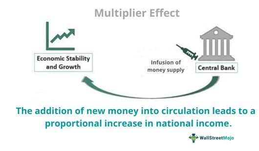

Macroeconomics provides a comprehensive framework for understanding large-scale economic phenomena, with the multiplier effect being one of its pivotal concepts. This effect illustrates how an initial change in spending can lead to a larger overall impact on the economy. Essentially, the multiplier effect describes the process through which an initial injection of funds into the economy, such as through government spending or business investments, leads to increased production and income that is greater than the original spending amount. This concept is fundamental to analyzing how economic activities are interconnected and amplified through various sectors.

Algorithmic trading, or algo trading, offers a modern perspective on economic interactions by employing computational algorithms to execute trades with high speed and precision. By leveraging advanced technologies and data analytics, algo trading seeks to optimize financial trading strategies, making it a crucial aspect of contemporary economics. Algorithms are designed to respond to market stimuli and trends based on complex mathematical models and financial theories. It enables the execution of large trade volumes and the management of intricate portfolios in a fraction of a second, thus playing a significant role in today's financial markets.



This article explores the intersection between macroeconomic theory and algorithmic trading, highlighting the relevance and application of the multiplier effect in various economic contexts. Through examining this synergy, we can uncover the potential for a more optimized and informed approach to financial decision-making, enhancing both market efficiency and economic growth.

## Table of Contents

## Understanding the Multiplier Effect in Macroeconomics

The multiplier effect is a fundamental concept in macroeconomics, illustrating how an initial change in spending translates into a more significant alteration in overall economic output. This process begins with an initial expenditure, which does not exist in isolation. Instead, it stimulates further spending in various sectors of the economy, leading to a cascade of economic activity greater than the initial amount spent.

The core principle of the multiplier effect is that money spent in one area of the economy circulates through other areas, generating additional income and consumption. The ultimate impact on the economy is a multiple of the initial spending. This principle is captured mathematically in the multiplier formula:

$$
\text{Multiplier} = \frac{1}{1 - MPC}
$$

where MPC stands for the marginal propensity to consume, which represents the proportion of additional income that consumers are likely to spend rather than save.

Various forms of spending can trigger the multiplier effect, each with distinct pathways through the economic system. Government spending on public projects such as infrastructure can initially boost demand for construction materials and labor. This increase in demand propels suppliers and workers to earn more, which in turn fuels further spending in the economy on goods and services. Similarly, consumer expenditures on goods can lead to higher revenues for businesses, prompting them to reinvest in their operations by hiring more employees or expanding their facilities. Likewise, investments by companies in new technologies or infrastructure typically galvanize additional economic activities by increasing productivity and fostering innovation.

The implications of the multiplier effect are broad and significant, as even a modest initial expenditure can engender pronounced economic expansion. Understanding this process helps policymakers and economists forecast economic conditions, craft fiscal policies, and assess the relative efficacy of different types of spending initiatives. It underscores the interconnectedness of economic variables and the importance of tracing the ripple effects of spending throughout the national economy.

## Mechanics of the Multiplier Effect

The multiplier effect in macroeconomics is a fundamental concept that explains how an initial expenditure can lead to a more significant increase in overall economic activity. This effect is grounded in the idea that money spent in an economy is not static; rather, it circulates through various sectors, amplifying the initial amount. The core principle lies in repeated spending cycles where each expenditure generates further income and consumption, thereby increasing total economic output beyond the original spending amount.

The formula to calculate the multiplier effect is expressed as the ratio of the change in total income to the change in spending that caused it. Mathematically, it is represented as:

$$
\text{Multiplier} = \frac{\Delta \text{Income}}{\Delta \text{Spending}}
$$

This formula demonstrates how a change in spending (such as government expenditure or investment) can trigger a cascade of additional incomes throughout an economy. The magnitude of the multiplier is influenced by factors such as the marginal propensity to consume (MPC) and the marginal propensity to save (MPS). The relationship can be further articulated as:

$$
\text{Multiplier} = \frac{1}{1 - \text{MPC}} = \frac{1}{\text{MPS}}
$$

Where:
- $\text{MPC}$ is the proportion of additional income that is spent on consumption.
- $\text{MPS}$ is the proportion of additional income that is saved (MPS = 1 - MPC).

The multiplier effect is a vital tool for evaluating the potential impacts of economic policies. For instance, when a government increases spending, the initial funds injected into the economy can lead to greater overall economic growth than the spent amount might suggest. This occurs as businesses experience greater demand, leading to increased hiring and production, which, in turn, spurs further consumption and income.

Furthermore, the multiplier effect assists in forecasting Gross Domestic Product (GDP) growth by enabling economists to estimate the potential expansion resulting from changes in economic activity. It also aids in assessing investment effectiveness, as it helps determine the expansive impact of capital flows within an economy.

Understanding the mechanics of the multiplier effect is key to crafting economic policies and interpreting financial outcomes. It reveals the interconnectedness of economic activities and the potential for significant, broader impacts stemming from what might initially appear as modest economic decisions.

## The Multiplier Effect in Action: Examples and Impact

Government spending on infrastructure is a classic example of the multiplier effect in action. When a government invests in building roads, bridges, or public buildings, it initiates a chain reaction of economic activities. The initial spending directly leads to increased demand for materials such as steel and concrete, boosting production and sales for suppliers. Concurrently, the demand for labor grows as construction companies hire workers to complete projects. This increase in employment results in greater disposable income for households, leading to further consumer spending on goods and services. Each round of spending generates additional income and consumption, thereby magnifying the initial expenditure's impact on the total economic output.

Bank lending also demonstrates the multiplier effect. When banks receive deposits, a fraction is retained as reserves, while the remainder is loaned out to businesses and individuals. These loans stimulate economic activity by enabling recipients to invest in new ventures, expand operations, or purchase goods and services. The subsequent spending by borrowers circulates through the economy, fostering additional rounds of income and expenditure. This process can be quantified using the money multiplier formula:

$$
\text{Money Multiplier} = \frac{1}{\text{Reserve Ratio}}
$$

For instance, if the reserve ratio is 10%, the money multiplier is 10. This implies that every $1 deposited in the banking system can result in up to $10 in economic activity. Thus, bank lending significantly amplifies the initial amount deposited, contributing to economic growth.

These multiplier effects have a profound impact on broader economic indicators. By boosting demand and production, they can enhance employment levels, reducing unemployment rates and increasing national income. Higher employment leads to greater consumer confidence and spending, further stimulating the economy. Moreover, the multiplier effect influences inflation rates, as increased demand can drive up prices if supply does not keep pace. Policymakers must therefore consider these dynamics when designing economic policies, ensuring that multiplier effects contribute positively to sustainable economic growth.

## Algorithmic Trading and Its Economic Implications

Algorithmic trading, commonly known as algo trading, utilizes sophisticated computational algorithms to automate financial trading decisions and execute trades at exceptional speeds. These automated systems can process vast volumes of financial data, enabling traders to respond swiftly to market movements and economic stimuli. This high-speed execution minimizes transaction costs and exploits short-term market inefficiencies, offering a competitive edge over traditional trading methods.

Understanding macroeconomic principles, including concepts like the multiplier effect, can significantly enhance [algorithmic trading](/wiki/algorithmic-trading) strategies. The multiplier effect, which describes how initial spending can lead to a more substantial overall economic impact, provides critical insights into potential market movements and economic trends. For instance, an increase in government spending might not only boost economic activity but could also signal a rise in stock prices linked to sectors benefiting from that spending. In this context, algorithmic traders can adjust their models to account for expected changes in economic conditions, ultimately contributing to more informed and strategic trading decisions.

Macroeconomic indicators play a pivotal role in this process. Indicators such as GDP growth rates, unemployment figures, and inflation rates are essential data points utilized by algorithmic models. These variables help predict market trends and guide trading decisions. For instance, an algorithm might be programmed to buy or sell securities based on projected GDP growth or inflationary pressures, which are indicative of underlying economic strengths or weaknesses.

To effectively integrate these macroeconomic insights into trading algorithms, traders often employ advanced data analytics and [machine learning](/wiki/machine-learning) techniques. This involves training models on historical market and economic data to identify patterns and predict future movements. The application of Python, with its robust libraries like pandas and scikit-learn, allows traders to construct and test these models efficiently.

```python
import pandas as pd
from sklearn.linear_model import LinearRegression

# Sample code to demonstrate using GDP and Inflation as predictors
data = pd.DataFrame({
    'GDP_Growth': [2.5, 3.0, 1.8, 2.2, 3.5],
    'Inflation': [1.5, 1.7, 1.2, 1.6, 1.8],
    'Stock_Return': [0.10, 0.15, 0.05, 0.08, 0.20]
})

X = data[['GDP_Growth', 'Inflation']]
y = data['Stock_Return']

model = LinearRegression()
model.fit(X, y)

# Predicting future stock return based on GDP growth of 2.8% and inflation of 1.4%
predicted_return = model.predict(pd.DataFrame({'GDP_Growth': [2.8], 'Inflation': [1.4]}))

print(f"Predicted Stock Return: {predicted_return[0]:.2f}")
```

In summary, the integration of macroeconomic understanding with algorithmic trading models offers the potential for more precise and responsive trading strategies. As traders harness macroeconomic indicators and the multiplier effect within their algorithmic frameworks, they are better positioned to anticipate market dynamics and optimize trading performance.

## Synergy Between Macroeconomics and Algo Trading

The integration of macroeconomic insights into algorithmic models serves as a powerful tool to enhance trading strategies, thereby fostering more sustained economic growth. Algorithmic trading, with its capacity for processing large datasets and executing transactions at high speed, can significantly benefit from the structured patterns identified within macroeconomic frameworks. Recognizing signs of an impending multiplier effect is a prime example where this synergy can be harnessed. The multiplier effect refers to the phenomenon where an initial increase in spending generates a ripple effect, leading to a larger overall increase in economic output.

Algorithmic traders who can anticipate and identify the conditions conducive to a multiplier effect may adjust their trade positions to align with expected economic shifts. This involves leveraging historical data, economic indicators, and analytical models to predict changes in aggregate output resulting from initial expenditures in areas like government spending or private investments.

Advanced data analytics play a critical role in this integration, providing sophisticated tools to interpret complex macroeconomic trends. With machine learning algorithms and [artificial intelligence](/wiki/ai-artificial-intelligence), traders can analyze economic indicators such as GDP growth rates, consumer spending metrics, and employment figures to derive actionable insights. These insights allow for the development of predictive models that can assess potential economic scenarios and inform strategic trading decisions.

For instance, a Python-based algorithm might process economic data to calculate potential outcomes of fiscal stimulus packages, using libraries like NumPy and pandas for numerical analysis and data manipulation. Such models can efficiently simulate different economic conditions, helping traders forecast the impacts of prospective government actions and adapt their strategies accordingly.

In this interconnected landscape, the ability to meld macroeconomic understanding with technological prowess facilitates a proactive approach to financial market navigation. As a result, traders who effectively integrate macroeconomic theories, such as the multiplier effect, into their algorithmic frameworks can capitalize on emerging opportunities and mitigate potential risks, contributing to more robust economic development.

## Challenges and Future Directions

The convergence of macroeconomic concepts like the multiplier effect with algorithmic trading offers substantial promise for financial markets, yet it is accompanied by inherent challenges. One of the most significant challenges is market [volatility](/wiki/volatility-trading-strategies), a persistent issue that can cause drastic fluctuations in asset prices, potentially leading to substantial losses if not effectively managed. The unpredictable nature of markets makes it difficult for algorithmic models to consistently predict outcomes, demanding more robust strategies.

Future advancements in technology are expected to mitigate these challenges, particularly through the application of artificial intelligence (AI) and enhanced data processing capabilities. AI can enable more sophisticated data analysis, uncovering patterns and trends not immediately apparent through traditional methods. Machine learning algorithms, for example, can be trained to recognize subtle changes in economic indicators that precede the multiplier effect, adapting trading strategies in real-time to exploit these opportunities. Python's extensive libraries, such as TensorFlow and scikit-learn, make it feasible to implement such AI-driven strategies by providing powerful tools for data analysis and machine learning.

Continual learning and adaptation are imperative for traders and economists in this rapidly evolving landscape. Economic theories and technologies are continuously advancing, and those involved in algorithmic trading must remain updated with the latest developments to maintain a competitive edge. This involves not only understanding emerging economic models and their implications for market dynamics but also staying abreast with technological innovations like quantum computing, which holds the potential to revolutionize data processing speeds and efficiency, further refining algorithmic trading capabilities.

In conclusion, while the integration of macroeconomic theory and algorithmic trading has its challenges, the potential benefits are transformative. With future technological advancements and a commitment to ongoing education, both traders and economists can not only overcome current limitations but also unlock new levels of financial market efficiency and profitability.

## Conclusion

The multiplier effect remains a fundamental concept in macroeconomics, elucidating how initial changes in expenditure can lead to amplified effects on economic output and growth. This mechanism is instrumental in understanding how targeted spending, whether by government, corporations, or consumers, can significantly influence broader economic indicators such as GDP, employment, and income levels.

With the advent of algorithmic trading, these macroeconomic insights find new applications within financial markets. Algorithmic trading employs sophisticated algorithms to execute trades at an unprecedented speed and [volume](/wiki/volume-trading-strategy), reacting to economic data and indicators. By integrating an understanding of the multiplier effect, traders can enhance their strategies, forecasting the potential broader impacts of economic stimuli on market dynamics.

This fusion of macroeconomic principles with algorithmic trading opens avenues for refining decision-making processes. Utilizing algorithms that recognize economic patterns and predict outcomes of fiscal and monetary policies can lead to more robust and adaptive trading strategies. For instance, detecting the onset of a multiplier effect in specific sectors might allow traders to adjust their positions proactively, optimizing financial returns.

Algorithmic trading, coupled with macroeconomic analysis, not only augments trading efficacy but also contributes to market [liquidity](/wiki/liquidity-risk-premium) and efficiency. As technology evolves, the capability to analyze vast swathes of economic data in real time promises further enhancements in trading strategies, facilitating a more profound integration of economic theory into practical financial applications.

Ultimately, the convergence of traditional economic theories with cutting-edge trading technologies underscores the dynamic nature of modern financial markets. By fostering a deeper comprehension and synergy between macroeconomic principles and algorithmic models, traders and economists can collaboratively innovate solutions that drive sustained economic growth and stability.

## References & Further Reading

[1]: Bergstra, J., Bardenet, R., Bengio, Y., & Kégl, B. (2011). ["Algorithms for Hyper-Parameter Optimization."](https://dl.acm.org/doi/10.5555/2986459.2986743) Advances in Neural Information Processing Systems 24.

[2]: ["Advances in Financial Machine Learning"](https://www.amazon.com/Advances-Financial-Machine-Learning-Marcos/dp/1119482089) by Marcos Lopez de Prado

[3]: ["Evidence-Based Technical Analysis: Applying the Scientific Method and Statistical Inference to Trading Signals"](https://www.amazon.com/Evidence-Based-Technical-Analysis-Scientific-Statistical/dp/0470008741) by David Aronson

[4]: ["Machine Learning for Algorithmic Trading"](https://github.com/PacktPublishing/Machine-Learning-for-Algorithmic-Trading-Second-Edition) by Stefan Jansen

[5]: ["Quantitative Trading: How to Build Your Own Algorithmic Trading Business"](https://books.google.com/books/about/Quantitative_Trading.html?id=j70yEAAAQBAJ) by Ernest P. Chan