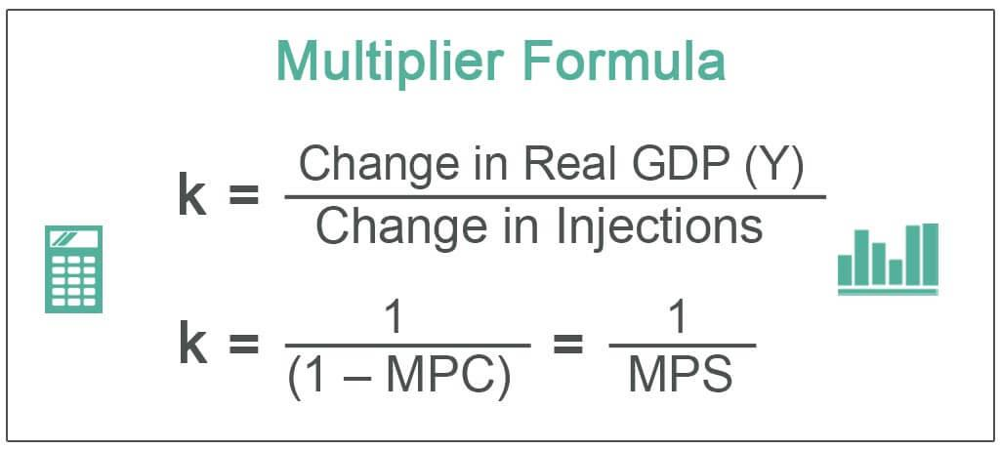

Multiplier economics, finance, and algorithmic trading are pivotal concepts that have continuously shaped the landscape of modern economic and financial systems. Multiplier economics refers to the process by which an initial change in spending—typically by the government or another large economic entity—produces a greater total impact on the economy than the initial expenditure. This effect occurs because spending generates income for others, who in turn spend a proportion of their additional income, leading to further economic activity. The multiplier effect is crucial for understanding how fiscal policies can stimulate economic growth and induce broader financial stability or instability.

Finance, on the other hand, encompasses a wide array of activities such as investment, budgeting, lending, and saving. It serves as the backbone of economic growth by mobilizing resources efficiently across time and space. Algorithmic trading, a subset of finance, applies algorithms—clearly defined, systematic processes—to execute trades at speeds and frequencies that are impractical for human traders. This method involves using complex mathematical models and formulas to make quick decisions, and its increasing prevalence is driven by advancements in computing power and data analytics. 

Algorithmic trading plays a critical role in modern finance by enhancing market liquidity and reducing transaction costs. However, its speed and autonomy introduce substantial risks, such as market manipulation and unintended consequences from erroneous trades, necessitating robust regulatory frameworks.

Conversely, the concept of the multiplier effect holds significant relevance in financial markets as it can inform investment strategies and predict market reactions to policy changes. By understanding multiplier economics, traders and economists can assess the potential ripple effects of fiscal interventions on market movements and capital allocation decisions.

The primary objective of this article is to illuminate the intersection between multiplier economics and algorithmic trading within the context of financial systems. By exploring these connections, we aim to offer valuable insights that can benefit both traders and economists. Understanding these interactions is becoming increasingly vital as technological advancements and economic complexities redefine financial strategies. The fusion of algorithmic trading and multiplier effects has far-reaching implications, potentially influencing everything from market volatility to policy efficacy.

As we scrutinize these interactions, it becomes apparent that they are reshaping modern financial strategies. Innovations in technology have facilitated more sophisticated trading algorithms capable of integrating macroeconomic indicators to assess multiplier effects comprehensively. This shift has enabled traders to execute strategies that not only anticipate market changes but also predict their broader economic impacts.

This discussion sets the foundation for a deeper exploration of how these concepts influence each other, and how they can be strategically employed, potentially transforming the future of finance.

## Table of Contents

## Understanding Multiplier Economics in Finance

Multiplier economics refers to the concept where an initial change in economic activity, such as an increase in investment or government spending, leads to a chain reaction of additional economic activities, amplifying the initial impact. The core of this theory is the multiplier effect, which quantifies how a change in spending circulates and multiplies within an economy. This is typically expressed as:

$$
\text{Multiplier} = \frac{1}{1 - MPC}
$$

where $MPC$ is the marginal propensity to consume, indicating the portion of additional income that consumers are likely to spend rather than save.

### Implications for Financial Systems

1. **Investment Impact on Economic Growth**: Investment plays a pivotal role in multiplier economics. When businesses increase investment in infrastructure or technology, it can lead to greater productivity and economic expansion. The initial investment creates demand for materials and labor, which in turn generates income for workers and suppliers. This income is then spent on goods and services, further stimulating the economy, often resulting in a larger cumulative economic growth than the original investment amount.

2. **Disproportionate Effects and Stability**: The multiplier effect can sometimes lead to disproportionate economic outcomes. For instance, during periods of economic uncertainty, a reduction in investment can cause a significant contraction in economic activity. Conversely, in a booming economy, incremental investments can spur excessive growth, potentially leading to inflation. Such dynamics highlight the delicate balance required in investment strategies to maintain economic stability.

### Real-World Examples in Financial Markets

A quintessential example of multiplier effects in financial markets can be observed during quantitative easing (QE) initiatives. Central banks purchase financial assets to inject [liquidity](/wiki/liquidity-risk-premium) into the economy, intending to lower interest rates and spur investment. The added liquidity often results in increased lending, greater investment activities, and ultimately, higher consumption rates—all of which amplify the initial monetary intervention.

### Government Policies and Consumer Behavior

**Government Policies**: Fiscal policies, such as tax cuts or increased public spending, can significantly influence multiplier effects. For example, a government construction project can lead to job creation, increased household income, and subsequently higher consumer spending, magnifying the initial governmental expenditure. 

**Consumer Behavior**: The effectiveness of multiplier effects often depends heavily on consumer confidence and their marginal propensity to consume. In uncertain times, even substantial financial stimuli might have muted impacts if consumers choose to save rather than spend.

### Challenges and Opportunities for Financial Analysts

1. **Challenges**: Predicting the precise impact of multiplier effects poses a significant analytical challenge due to the complex interplay of various economic factors and the difficulty of accurately measuring the marginal propensity to consume or save. Additionally, external shocks and behavioral changes can alter expected outcomes.

2. **Opportunities**: Understanding these dynamics allows financial analysts to better forecast economic trends and to develop strategies that capitalize on anticipated changes. For instance, during times of economic stimulus, sectors directly linked to increased investment, such as construction or manufacturing, might be expected to experience growth.

In conclusion, multiplier economics provides a valuable framework for analyzing the cascading impacts of investment and spending changes within an economy. Financial analysts leveraging these insights can identify both risks and opportunities, aligning investment strategies in a manner that anticipates potential multiplier effects.

## The Role of Algorithmic Trading in Modern Finance

Algorithmic trading, often referred to as algo trading, is a technological approach to trading in financial markets. It employs complex algorithms and mathematical models to make trading decisions, often at speeds and frequencies that far exceed human capabilities. Unlike traditional trading, which relies heavily on human decision-making and manual processes, [algorithmic trading](/wiki/algorithmic-trading) is automated and systematic, minimizing human intervention in executing trades.

### Technological Advancements in Algorithmic Trading

The proliferation of algorithmic trading has been significantly driven by advancements in technology. High-speed internet and powerful computing have enabled the development of sophisticated algorithms capable of processing vast amounts of data in real time. Machine learning and [artificial intelligence](/wiki/ai-artificial-intelligence) have further enhanced these algorithms, allowing for predictive analytics and improved decision-making. Cloud computing and the increasing accessibility of big data are other key drivers, providing the necessary infrastructure for executing complex strategies efficiently. Moreover, the integration of low-latency networks has minimized delays in trade execution, ensuring traders can capitalize on minuscule market movements.

### Benefits for Market Efficiency and Liquidity

Algorithmic trading offers various benefits, particularly concerning market efficiency and liquidity. By automating trades, algorithms can execute large orders by breaking them into smaller pieces, reducing market impact and enhancing price discovery. This fragmentation helps absorb market shocks and smoothens [volatility](/wiki/volatility-trading-strategies), contributing to overall market liquidity. Additionally, algorithmic trading facilitates [arbitrage](/wiki/arbitrage) opportunities, ensuring prices reflect accurate market information, and tightens bid-ask spreads, further contributing to market efficiency.

### Risks and Challenges

Despite its advantages, algorithmic trading introduces several risks and challenges. The reliance on algorithms makes the system susceptible to technical glitches and errors, potentially leading to significant market disruptions. Flash crashes, such as the event on May 6, 2010, illustrate the potential for algorithmic trading to exacerbate market instability. Moreover, high-frequency trading, a subset of algorithmic trading, has been criticized for creating unfair advantages, as firms with more sophisticated algorithms and infrastructure can exploit market inefficiencies faster than others.

The complexity and opacity of the algorithms pose additional challenges, as they can be difficult to regulate and monitor effectively. The speed at which trades are executed can also lead to scenarios where the market reacts faster than regulators can respond, underscoring the need for robust risk management and monitoring systems.

### Regulatory Measures

In response to the challenges posed by algorithmic trading, regulatory bodies worldwide have implemented various measures to govern its practices. These include requirements for pre-trade risk controls and real-time trade monitoring to detect and mitigate potential market abuses or errors. Regulations often emphasize transparency, mandating that firms disclose their algorithmic trading strategies to ensure fairness. For example, the European Union's Markets in Financial Instruments Directive II (MiFID II) requires firms engaging in algorithmic trading to have systems and risk controls in place, undergo regular testing, and provide notification of their algorithms to regulators.

In conclusion, while algorithmic trading represents a technological leap forward in the efficiency and liquidity of financial markets, it also necessitates a careful balance between leveraging its advantages and managing its associated risks. As technology continues to evolve, regulatory frameworks will need to adapt to ensure that the growth of algorithmic trading contributes positively to market stability and integrity.

## Intersection of Multiplier Economics and Algorithmic Trading

The interplay between multiplier economics and algorithmic trading strategies lies in how trading algorithms respond to market signals and subsequently influence market dynamics. In economics, a multiplier effect occurs when an initial economic input, such as investment, generates a larger increase in economic output. When this notion is applied to algorithmic trading, the responsiveness of trading algorithms to specific market conditions can further propagate these economic impacts through different trading actions.

Firstly, algorithmic trading has the potential to amplify multiplier effects within financial markets by rapidly reacting to information that can trigger multiple trading activities. For instance, an economic announcement such as a change in interest rates can initiate buy or sell orders from multiple algorithms simultaneously. This multiplicity of transactions can have a cascading effect, thereby increasing market liquidity and potentially driving price movements to a greater extent than traditional trading could achieve. These effects, theoretically, enhance the initial economic signal, mimicking a form of multiplier effect.

An example of these interactions can be observed in the flash crash events that have occurred in recent years. A flash crash is a very rapid, deep, and volatile fall in security prices occurring within an extremely short time. Algorithmic trading programs designed to sell off stocks under certain conditions can collectively create a strong multiplier effect, leading to a sudden drop in the stock market. The May 6, 2010, Flash Crash is a striking case where algorithmic trading significantly amplified market movements, emphasizing the interconnectedness and multiplier potential of these trading systems.

Interactions between multiplier economics and algorithmic trading have significant implications for market volatility and stability. On one hand, while algorithms can enhance market liquidity and price accuracy by executing trades efficiently, the same technology can also contribute to excessive volatility. The synchronous actions by multiple algorithms interpreting similar market conditions can result in herding behavior that enhances volatility instead of stabilizing it.

For traders, understanding how multiplier effects influence algorithmic trading strategies can provide significant opportunities for enhanced returns. By analyzing trends and patterns that suggest potential multiplier effects, traders can structure their algorithms to anticipate and capitalize on these amplified market movements. For instance, utilizing [machine learning](/wiki/machine-learning) to predict economic conditions that lead to potential multiplier effects can enable algorithms to make informed trades, thus optimizing returns.

In conclusion, the intersection of multiplier economics and algorithmic trading presents both challenges and opportunities for financial markets. While multiplier effects can amplify market actions through algorithmic trading, they also introduce risks related to market volatility. Traders who harness these interactions intelligently can potentially achieve greater financial returns, highlighting the importance of sophisticated algorithmic designs that account for economic multipliers.

## Future Trends and Implications

The intersection of multiplier economics, finance, and algorithmic trading is poised for significant transformations as technology evolves. The rapid advancements in AI and machine learning are crucial in shaping these domains. These technologies allow for enhanced predictive analytics, enabling traders to develop more sophisticated models that consider a plethora of variables with greater accuracy. Machine learning algorithms can detect patterns and correlations in vast datasets that are not immediately apparent, thus improving the efficiency of algorithmic trading strategies. This capability could further intensify the multiplier effects observed in financial markets, as faster and more precise trading decisions can lead to amplified impacts on market movements.

As these technologies continue to mature, they may also introduce new complexities to existing financial systems, necessitating a reevaluation of regulatory landscapes. The potential for AI-driven trading algorithms to contribute to market volatility raises concerns about market stability and fairness. Regulators may need to develop frameworks that ensure these algorithms operate transparently and ethically, balancing innovation with investor protection. This could involve setting standards for algorithm testing, requiring real-time monitoring of trading activities, and implementing fail-safes to prevent systemic risks. 

The evolving interplay between these factors suggests that future financial professionals will need a diverse skill set, combining traditional financial acumen with advanced technological literacy. Proficiency in programming languages such as Python for developing and testing trading algorithms, alongside a deep understanding of economic theories and financial regulations, will become increasingly important. Moreover, skills in data analytics and an awareness of ethical considerations in AI applications will be essential to navigate this dynamic environment successfully.

Maintaining stability and fairness in this rapidly changing financial ecosystem is a pressing challenge. Stakeholders must strive to create a balanced approach that fosters innovation while safeguarding the integrity of financial markets. Collaborative efforts between technologists, economists, traders, and regulators will be crucial in designing systems that support sustainable growth. By embracing these changes thoughtfully, the financial industry can harness the potential of multiplier economics and algorithmic trading to drive more informed and strategic decision-making processes.

## Conclusion

In our exploration of multiplier economics, finance, and algorithmic trading, we have uncovered the intricate web of interactions that define modern financial systems. The concept of multiplier effects, which reveals how initial changes in investment can lead to significant impacts on economic growth, underscores the dynamic nature of financial markets and their sensitivity to various factors such as governmental policies and consumer behavior. Algorithmic trading, with its reliance on sophisticated algorithms and high-speed data processing, represents a transformative approach that enhances market efficiency but also introduces new challenges such as increased volatility and regulatory complexities.

Understanding the intersection of multiplier economics and algorithmic trading is crucial for professionals within the finance sector. These two areas, when considered together, offer insights into how automated trading strategies can both influence and be influenced by broader economic conditions. Recognizing and analyzing this interaction allows for the development of strategies that leverage multiplier effects for improved performance, while also accounting for the potential risks and their mitigation.

As the financial world continues its rapid evolution, it is paramount to encourage ongoing research and adaptation. The roles of artificial intelligence and machine learning are poised to expand, promising further innovation but also necessitating new skills and knowledge to manage the accompanying changes. Financial professionals must be proactive in acquiring these skills to stay competitive and informed.

Ultimately, understanding these concepts equips stakeholders to make strategic financial decisions that are informed by a comprehensive view of the market dynamics. It is essential for everyone involved—from individual traders to institutional investors and policymakers—to actively consider how these factors will mold the future of finance. By doing so, they can contribute to a stable and fair financial ecosystem capable of sustaining growth amidst constant change. The call to action is clear: embrace these insights and integrate them into practice for a more strategic approach to finance that addresses both current and future challenges.

## References & Further Reading

[1]: Blinder, A. S. (2008). ["The Case for a Strong Stimulus."](https://www.nber.org/papers/w13932) NBER Working Paper No. 13862.

[2]: Bordo, M. D., & Haubrich, J. G. (2017). ["Deep Recessions, Fast Recoveries, and Financial Crises: Evidence from the American Record."](https://www.nber.org/papers/w18194) NBER Working Paper No. 23554.

[3]: Carney, M. (2018). ["The Future of Money."](https://www.bankofengland.co.uk/speech/2018/mark-carney-speech-to-the-inaugural-scottish-economics-conference) Bank of England.

[4]: Bank for International Settlements. (2011). ["High-Frequency Trading in the Foreign Exchange Market."](https://www.bis.org/publ/mktc05.pdf) Markets Committee Publications, BIS.

[5]: Haldane, A. G. (2011). ["The Race to Zero."](https://www.bankofengland.co.uk/speech/2011/the-race-to-zero-speech-by-andy-haldane) Bank of England.

[6]: Mehrling, P. (2010). ["In the Shadows of Banking."](https://www.city.ac.uk/__data/assets/pdf_file/0018/163440/Mehrling_Future-Global-Finance-126sn0t.pdf) NBER Working Paper No. 17063.

[7]: Stiglitz, J. E. (2010). ["Freefall: America, Free Markets, and the Sinking of the World Economy."](https://www.jstor.org/stable/24884136) W. W. Norton & Company.

[8]: Lopez de Prado, M. (2018). ["Advances in Financial Machine Learning."](https://www.amazon.com/Advances-Financial-Machine-Learning-Marcos/dp/1119482089) Wiley.