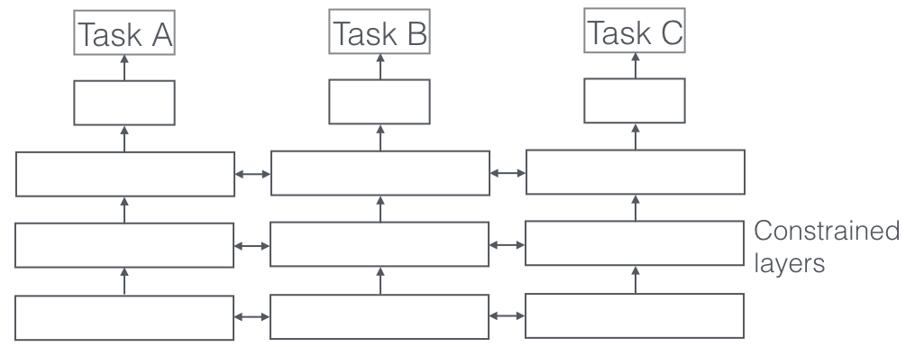

## Table of Contents

## What is multitask learning in machine learning?

Multitask learning is a way to train a machine learning model to do more than one job at the same time. Instead of teaching a model to do just one thing, like recognizing cats in pictures, multitask learning teaches the model to recognize cats, dogs, and maybe even birds all at once. This approach can make the model smarter and more efficient because it learns to see patterns that are useful across different tasks. For example, a model learning to identify different animals might get better at recognizing the general shape of animals, which helps with all the tasks.

The main advantage of multitask learning is that it can help the model perform better on each task than if it were trained on them separately. This happens because the model can use information from all the tasks to improve its understanding. For instance, if the model is learning to predict the weather and traffic at the same time, it might find that heavy rain affects both, so knowing about one helps with the other. However, multitask learning can be tricky because the model needs to balance the importance of each task and make sure it doesn't focus too much on one task and ignore the others.

## How does multitask learning differ from single-task learning?

Multitask learning and single-task learning are two different ways to teach a machine learning model. In single-task learning, the model focuses on just one job at a time. For example, if you want the model to recognize cats in photos, you train it only on pictures of cats. The model learns to find patterns that are specific to cats and nothing else. This can be good when you have a lot of data about one thing and want the model to be really good at that one thing.

On the other hand, multitask learning teaches the model to do several jobs at the same time. Using the same example, a multitask model might learn to recognize cats, dogs, and birds all from the same set of pictures. By learning multiple tasks, the model can find patterns that are useful across all the tasks, like the general shape of animals. This can make the model smarter and better at each task because it uses information from all the tasks to improve its understanding. However, it can be harder to balance the learning of multiple tasks, and the model might not be as good at one specific task as a single-task model trained only on that task.

## What are the main benefits of using multitask learning?

One of the biggest benefits of multitask learning is that it can make a model smarter and better at each task it learns. When a model learns multiple tasks at the same time, it can find patterns that are useful for all the tasks. For example, if a model is learning to recognize different animals, it might get better at understanding the general shape of animals. This shared knowledge can help the model do better on each task than if it were trained on them one by one. It's like learning math and science together; understanding one can help you with the other.

Another benefit is that multitask learning can be more efficient, especially when you don't have a lot of data for each task. By training on multiple tasks together, the model can use the data from all the tasks to learn better. This means you might need less data for each task to get good results. For example, if you're trying to predict the weather and traffic, learning both at the same time can help because heavy rain might affect both. So, even if you don't have a lot of data about traffic in the rain, the model can still learn from the weather data.

## Can you provide examples of applications where multitask learning is used?

One example of multitask learning is in healthcare, where a model might be trained to predict different diseases from medical images. For instance, a model could learn to spot signs of lung cancer, pneumonia, and heart disease all at once. By learning these tasks together, the model can better understand the common features in medical images that are important for diagnosing different conditions. This can lead to more accurate predictions and help doctors make better decisions about patient care.

Another application is in autonomous vehicles, where a model might need to recognize different objects on the road like cars, pedestrians, and traffic signs. By learning to identify all these things at the same time, the model can improve its overall understanding of the driving environment. This shared knowledge helps the vehicle react more safely to different situations on the road. For example, knowing how cars move can also help the model predict the behavior of pedestrians and cyclists.

Multitask learning is also used in natural language processing, where a model might be trained to do things like translating text, answering questions, and summarizing documents all at the same time. By learning these tasks together, the model can get better at understanding the meaning of words and sentences. This can lead to more accurate translations, better answers to questions, and more helpful summaries. For example, knowing how to summarize a document can help the model better understand what questions to answer about it.

## What are the common challenges faced when implementing multitask learning?

One common challenge in multitask learning is balancing the importance of each task. When a model learns multiple tasks at the same time, it needs to pay attention to all of them without focusing too much on one task and ignoring the others. This can be tricky because different tasks might need different amounts of attention. For example, if a model is learning to recognize cats, dogs, and birds, it might find cats easier to recognize and start ignoring the other animals. To solve this problem, researchers often use techniques like adjusting the weights of each task or using special algorithms that help the model learn all tasks evenly.

Another challenge is dealing with different types of data for each task. In multitask learning, the data for one task might be very different from the data for another task. For example, if a model is learning to predict the weather and traffic, the weather data might come from weather stations, while the traffic data comes from sensors on roads. These different types of data can make it hard for the model to find patterns that are useful across all tasks. Researchers often need to find ways to combine or transform the data so that the model can learn from it effectively. This might involve using special techniques to make sure the model can understand and use all the data it gets.

## How do you select tasks for multitask learning?

When selecting tasks for multitask learning, it's important to choose tasks that have something in common. This means the tasks should share some features or patterns that the model can learn from. For example, if you're training a model to recognize different animals, all the tasks (like recognizing cats, dogs, and birds) share the common feature of animal shapes. This shared knowledge helps the model get better at each task. If the tasks are too different, like recognizing animals and predicting stock prices, the model might get confused because there's not much in common between them.

Another thing to consider is the amount of data available for each task. If one task has a lot more data than the others, it might dominate the learning process and make it harder for the model to learn the other tasks well. You want to make sure there's enough data for each task so the model can learn from all of them evenly. Sometimes, you might need to balance the data by using techniques like oversampling the tasks with less data or undersampling the tasks with more data. This helps make sure the model pays attention to all the tasks and learns from them effectively.

## What are the different architectures used in multitask learning models?

One common architecture for multitask learning is the hard parameter sharing model. In this setup, the model has a shared part that all tasks use, and then separate parts for each task. The shared part learns features that are useful for all tasks, like the general shape of animals if the tasks are about recognizing different animals. Then, each task has its own part that learns the specific details for that task, like the differences between cats and dogs. This way, the model can use what it learns from all tasks to get better at each one.

Another architecture is the soft parameter sharing model. Instead of having a completely shared part, each task has its own set of parameters, but these parameters are connected. The model learns to adjust these parameters so that they are similar for tasks that have a lot in common. This can be done using techniques like adding a penalty to the loss function that makes the parameters more similar. For example, if the tasks are about recognizing cats and dogs, the model might learn that the parameters for recognizing the shape of a cat's ear are similar to those for recognizing a dog's ear. This helps the model use what it learns from one task to help with the others.

A third architecture is the cross-stitch network. In this setup, the model has separate parts for each task, but it also has special layers that let the tasks share information with each other. These layers, called cross-stitch units, learn how much information to share between tasks. For example, if the tasks are about recognizing cats and dogs, the cross-stitch units might learn to share a lot of information about the shape of animals but less about the specific details of each animal. This helps the model use what it learns from one task to help with the others, but it also lets each task learn its own specific details.

## How does multitask learning affect model training and performance?

Multitask learning can make a model smarter and better at each task it learns. When a model learns multiple tasks at the same time, it can find patterns that are useful for all the tasks. For example, if a model is learning to recognize different animals, it might get better at understanding the general shape of animals. This shared knowledge can help the model do better on each task than if it were trained on them one by one. It's like learning math and science together; understanding one can help you with the other. However, multitask learning can also make training more complicated because the model needs to balance the importance of each task. If one task is much easier or has more data, the model might focus too much on that task and not learn the others well.

Training a multitask learning model can take longer and be more complex than training a single-task model. This is because the model needs to learn from different types of data and find a way to use that data effectively for all tasks. For example, if a model is learning to predict the weather and traffic, the weather data might come from weather stations, while the traffic data comes from sensors on roads. These different types of data can make it hard for the model to find patterns that are useful across all tasks. Researchers often need to find ways to combine or transform the data so that the model can learn from it effectively. This might involve using special techniques to make sure the model can understand and use all the data it gets.

## What metrics are used to evaluate the performance of multitask learning models?

When evaluating multitask learning models, you often use different metrics for each task the model is learning. For example, if the model is learning to recognize different animals, you might use accuracy to see how often it correctly identifies each animal. Accuracy is calculated as the number of correct predictions divided by the total number of predictions. If the model is also learning to predict the weather, you might use mean squared error (MSE) to measure how close its predictions are to the actual weather. MSE is the average of the squared differences between the predicted and actual values. By looking at these different metrics, you can see how well the model is doing on each task.

It's also important to look at how multitask learning affects the overall performance of the model. One way to do this is to compare the performance of the multitask model to single-task models trained on each task separately. If the multitask model does better on each task than the single-task models, that's a good sign that multitask learning is helping. Another way to evaluate the model is to look at how well it balances the different tasks. You might use a metric like the average performance across all tasks or a weighted average if some tasks are more important than others. This helps you see if the model is learning all the tasks well or if it's focusing too much on one task and ignoring the others.

## How can transfer learning be integrated with multitask learning?

Transfer learning and multitask learning can work together to make a model even smarter. Transfer learning is when you take a model that's already good at one task and use it to help learn a new task. For example, if you have a model that's really good at recognizing cats, you can use that model to help it learn to recognize dogs too. When you combine transfer learning with multitask learning, the model can start with what it already knows from the first task and then learn multiple new tasks at the same time. This can make the model better at the new tasks because it already has a good starting point.

For example, imagine you have a model that's good at recognizing different animals. You can use transfer learning to help it learn new tasks like predicting animal behavior or identifying animal habitats. By learning these new tasks together with multitask learning, the model can use what it already knows about animals to get better at the new tasks. This combination can help the model learn faster and perform better on all the tasks it's learning.

## What are the latest advancements in multitask learning research?

Recent advancements in multitask learning have focused on improving how models can learn multiple tasks more effectively. One big step forward is the development of better ways to share information between tasks. Researchers have come up with new architectures like the cross-stitch network, which lets tasks share information in a smart way. This helps the model use what it learns from one task to help with the others. Another advancement is in how models balance the importance of each task. Techniques like adjusting the weights of each task or using special algorithms help make sure the model learns all tasks well, not just the easy ones.

Another exciting area of research is combining multitask learning with other techniques like transfer learning and meta-learning. Transfer learning helps models use what they already know to learn new tasks faster. When combined with multitask learning, this can make models even smarter and more efficient. Meta-learning, on the other hand, helps models learn how to learn, which can be really helpful when learning multiple tasks at once. These combinations are leading to models that can learn a wide range of tasks more quickly and accurately, making them more useful in real-world applications.

## How can multitask learning be scaled to handle large datasets and numerous tasks?

Scaling multitask learning to handle large datasets and numerous tasks can be challenging, but recent advancements have made it more manageable. One approach is to use distributed computing, where the data and tasks are split across multiple machines or GPUs. This allows the model to process large amounts of data more quickly and handle many tasks at once. Another way to scale multitask learning is by using efficient architectures like the cross-stitch network, which helps the model share information between tasks more effectively. By using these techniques, researchers can train models on big datasets and many tasks without the process taking too long or using too much memory.

Another important advancement is the use of techniques like curriculum learning, where the model learns easier tasks first and then moves on to harder ones. This helps the model build a strong foundation before tackling more complex tasks, making it easier to scale to numerous tasks. Additionally, researchers are using meta-learning to help models learn how to learn, which can be especially useful when dealing with a large number of tasks. By combining these approaches, multitask learning can be scaled to handle large datasets and numerous tasks more efficiently, leading to better performance and more practical applications.