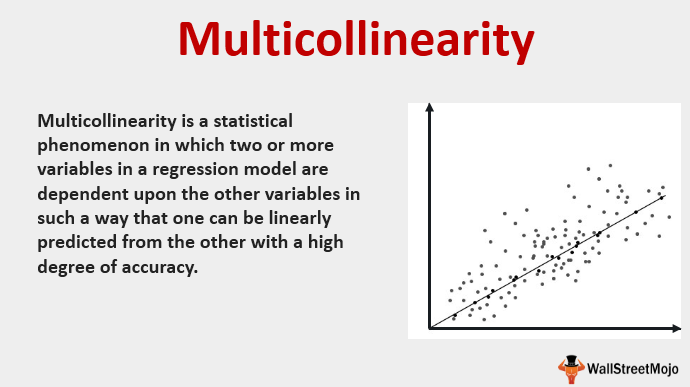

Statistical analysis and multivariate modeling are pivotal in deciphering complex datasets, identifying patterns, and making informed decisions—skills that are particularly vital in financial sectors. Statistical analysis involves employing mathematical techniques to interpret data, establish relationships, and forecast future trends, thereby facilitating decision-making processes. Multivariate modeling extends this further by examining multiple variables simultaneously. Techniques such as principal component analysis (PCA) and factor analysis are commonly utilized to reduce dimensionality and uncover underlying factors that influence observed phenomena.

In the context of modern finance, data modeling holds significant relevance. It provides the foundation for analyzing vast quantities of financial data, supporting investment decisions, portfolio management, and risk assessment. With financial markets becoming increasingly data-driven, these models are integral to predicting market behaviors and identifying potential investment opportunities.



One domain that exemplifies the reliance on statistical methods is algorithmic trading. This trading practice uses computer algorithms to execute trades at speeds and frequencies impractical for human traders. Algorithmic trading depends heavily on statistical models to analyze market conditions and execute trades based on mathematical criteria. These models allow traders to capitalize on fleeting market inefficiencies, maximize profits, and minimize risks.

By employing statistical analysis and multivariate modeling, financial professionals can formulate robust data-driven strategies that enhance their investment and trading decisions. This article will explore various aspects of these strategies, highlighting their profound impact on contemporary finance.

## Table of Contents

## Understanding Statistical Analysis and Multivariate Modeling

Statistical analysis is a discipline that involves the collection, exploration, and interpretation of data to identify patterns and trends. The primary objectives of statistical analysis are to summarize data, support decision-making, and provide conclusions that are backed by empirical evidence. In finance, statistical analysis enables analysts to make informed investment decisions, manage risk, and optimize financial portfolios based on objective data.

Multivariate modeling, a subset of statistical analysis, deals with the simultaneous observation and analysis of more than one statistical outcome variable. Its applications in finance include portfolio optimization, credit risk assessment, and market forecasting. By examining relationships between multiple variables, multivariate models provide insights into financial systems that single-variable models cannot offer.

One key technique in multivariate analysis is Principal Component Analysis (PCA). PCA is used to reduce the dimensionality of large data sets while preserving as much variance as possible. This is achieved by transforming the original variables into a new set of variables, called principal components, which are orthogonal. The first few principal components capture the most variance, allowing analysts to focus on a reduced number of variables for further analysis. For instance, PCA is used in constructing economic indicators or in risk management by summarizing the essential aspects of correlated financial instruments.

Another important technique is [factor](/wiki/factor-investing) analysis. It focuses on identifying underlying relationships between observed variables. Factor analysis models these relationships by assuming that observable variables are influenced by a smaller number of unobservable variables called factors. This technique is particularly useful in finance for developing models such as the Arbitrage Pricing Theory, which attempts to quantify the returns of an asset as a linear function of various macroeconomic factors.

Monte Carlo simulations serve as a prominent example of multivariate models in practice. This statistical technique allows practitioners to understand the impact of risk and uncertainty by simulating a range of possible outcomes. In finance, Monte Carlo methods are widely employed to estimate the potential future performance of investments, forecast economic conditions, and assess financial risk. The simulations generate numerous potential scenarios, each based on different assumptions about expected returns, [volatility](/wiki/volatility-trading-strategies), interest rates, and other financial variables. By aggregating and analyzing these simulations, financial analysts can derive insights into probable outcomes and assess the robustness of their strategies.

Here is a simple Python example using Monte Carlo simulation for estimating the potential future value of an investment:

```python
import numpy as np

# Parameters
initial_investment = 10000
annual_return = 0.07
annual_volatility = 0.15
years = 10
num_simulations = 1000

# Monte Carlo Simulation
np.random.seed(42)
simulated_results = []

for _ in range(num_simulations):
    end_value = initial_investment
    for _ in range(years):
        annual_growth = np.random.normal(annual_return, annual_volatility)
        end_value *= (1 + annual_growth)
    simulated_results.append(end_value)

# Calculate the mean and standard deviation of the results
mean_end_value = np.mean(simulated_results)
std_dev_end_value = np.std(simulated_results)

print(f"Expected Future Value: ${mean_end_value:.2f}")
print(f"Standard Deviation of Future Value: ${std_dev_end_value:.2f}")
```

This code simulates the potential future value of an initial $10,000 investment over a 10-year period, assuming an average annual return of 7% with a volatility of 15%. The simulation is run 1,000 times to generate a distribution of possible outcomes, from which the expected value and volatility can be calculated.

In summary, statistical analysis and multivariate modeling form the backbone of data-driven decision-making in finance. Techniques like PCA, factor analysis, and Monte Carlo simulations equip financial professionals with the tools to interpret complex data sets, refine investment strategies, and assess risk with greater precision.

## The Role of Data Modeling in Finance

Data modeling plays a crucial role in finance by underpinning investment decisions and facilitating robust risk management practices. By converting complex financial data into structured models, stakeholders can identify patterns, estimate future scenarios, and enhance decision-making processes.

One of the primary contributions of data modeling in finance is its ability to support investment decisions through predictive modeling. By leveraging historical data and statistical techniques, financial analysts can forecast trends and evaluate potential investment outcomes. For example, regression analysis, a fundamental statistical tool, is often used to understand relationships between different financial indicators and to predict stock prices or economic shifts. Predictive models such as time-series analysis offer insights by examining past behaviors to anticipate future market trends.

Data modeling also empowers risk management by quantifying uncertainties and delineating potential financial risks. Models like Value at Risk (VaR) help measure the potential loss in portfolio value over a specified period, with a given confidence interval. This aids financial managers in identifying and preparing for worst-case scenarios.

The integration of data models with financial analytics tools has further enhanced their applicability. Sophisticated platforms use these models to provide real-time analytics and insights. For instance, tools like Bloomberg Terminal and Reuters Eikon enable users to access comprehensive financial data and apply advanced modeling techniques seamlessly. Python libraries, such as pandas and NumPy, facilitate data manipulation and numerical computation, making it easier for professionals to implement intricate financial models.

Developing reliable financial data models requires adherence to best practices. Ensuring data quality is paramount; thus, cleaning and validating data sets before analysis is critical. Models should be regularly updated and recalibrated to reflect current market conditions and incorporate new data. Sensitivity analysis, stress testing, and scenario planning are vital processes that assess model stability and performance under varying economic conditions.

Incorporating feedback from domain experts enriches model development, ensuring they align with practical insights. Transparency in modeling processes and assumptions also contributes to model validity, fostering trust among stakeholders.

In summary, data modeling is fundamental to sound investment decision-making and effective risk management in finance. Through the integration of statistical models with powerful analytical tools and adherence to rigorous development practices, financial professionals can derive actionable insights, optimize strategies, and mitigate potential risks inherent in financial markets.

## Algorithmic Trading: Merging Technology and Finance

Algorithmic trading represents the fusion of technology and finance, utilizing computer algorithms to execute trading decisions at speeds and complexities far beyond traditional methods. This approach to trading can be traced back to the 1970s when the New York Stock Exchange implemented the first electronic trading systems. Over the decades, advancements in computing power and data availability have propelled [algorithmic trading](/wiki/algorithmic-trading) to the forefront of modern finance.

At its core, algorithmic trading relies heavily on statistical analysis and data modeling to develop and inform trading strategies. Statistical methods, such as time series analysis and regression models, are employed to discern patterns and relationships in historical data. This analysis enables traders to forecast future price movements and trading volumes, forming the backbone of algorithmic strategies. Data models help in constructing predictive frameworks that guide trading algorithms in making informed decisions under varying market conditions.

The primary benefits of algorithmic trading are evident in terms of speed and accuracy. Algorithms can execute orders within milliseconds, significantly outperforming human traders who are constrained by slower cognitive processes and manual systems. This rapid execution minimizes market impact and ensures that trades are executed at optimal prices. Moreover, algorithms operate with precision, adhering strictly to predefined criteria and eliminating the emotional biases that often influence human traders.

Despite its advantages, algorithmic trading poses several challenges and risks. Over-reliance on algorithms can lead to systemic vulnerabilities, especially if models fail to account for unforeseen market conditions. Historical examples such as the "Flash Crash" of 2010 illustrate how algorithmic strategies can exacerbate market volatility. Furthermore, algorithms can be susceptible to amplification of market movements, known as positive feedback loops, where initial trades trigger further buying or selling activity. Additionally, there are concerns regarding the transparency and fairness of algorithmic trading, as well as the potential for market manipulation.

To mitigate these risks, regulatory bodies enforce stringent guidelines, and traders implement safeguards like circuit breakers and model validation processes. It is essential for financial institutions to continuously stress-test their algorithms against a range of scenarios to ensure robustness and resilience in dynamic market environments.

## Case Studies of Statistical Models in Algo Trading

Real-world applications of multivariate models in algorithmic trading have become prominent in shaping decisions in financial markets. These models utilize complex statistical techniques to analyze vast datasets and detect patterns, ultimately assisting traders in making informed decisions.

Pattern recognition and predictive analytics play a crucial role in trading strategies. By analyzing historical market data, models can identify trends and predict future price movements. For instance, pattern recognition algorithms can identify candlestick patterns in stock charts, which traders use to predict short-term price movements. Predictive analytics, on the other hand, focuses on estimating future trends based on historical data, employing various statistical methods like time series analysis and regression models.

One notable case study is the use of multivariate models by Renaissance Technologies, a [hedge fund](/wiki/hedge-fund-trading-strategies) renowned for its [quantitative trading](/wiki/quantitative-trading) strategies. Renaissance employs sophisticated statistical models to analyze a multitude of financial instruments, leveraging predictive analytics to maintain a competitive edge in the market. Their Medallion Fund, known for its high returns, uses algorithms that identify and exploit small market inefficiencies.

Another example involves the application of neural networks by companies like Two Sigma Investments. These models learn from data by recognizing complex patterns and relationships across various variables, such as price, [volume](/wiki/volume-trading-strategy), and economic indicators. Two Sigma utilizes these insights to automate its trading process, making thousands of trades per second with considerable accuracy.

In a different approach, Goldman Sachs has implemented [machine learning](/wiki/machine-learning) models to manage trading risks and identify potential opportunities. By analyzing unstructured data such as news articles and social media, Goldman Sachs gains insights into market sentiment, which is integrated into their trading algorithms to adjust positions accordingly.

These examples underscore how companies leverage statistical models to gain a competitive advantage. By harnessing the power of multivariate models, financial firms can navigate the complexities of global markets with greater precision, ultimately driving more effective trading strategies. As technology continues to evolve, the integration of these models into trading platforms will likely become even more sophisticated and central to the industry.

## Tools and Technologies for Multivariate and Data Modeling

Statistical software and tools play a crucial role in the analysis and modeling of financial data, facilitating the development of complex multivariate models. Among the most widely used tools in finance are R, Python, and MATLAB, each offering unique capabilities for data processing, statistical analysis, and financial modeling.

R is renowned for its robust statistical and graphical capabilities, providing a vast array of packages specifically designed for quantitative finance, such as "quantmod" and "TTR" for technical trading rules. It allows the implementation of linear and non-linear modeling, time-series analysis, and is particularly adept at handling statistical tests and data visualization. Users can easily perform exploratory data analysis and apply advanced statistical methods to model financial time series.

Python has emerged as a dominant tool in data science and finance due to its versatility and powerful libraries. Libraries such as NumPy, pandas, and scipy offer efficient data manipulation and computation capabilities, while matplotlib and seaborn enable sophisticated data visualization. Python also supports machine learning and [deep learning](/wiki/deep-learning) applications through libraries like scikit-learn, TensorFlow, and PyTorch, enhancing its utility in modeling complex financial datasets and developing predictive models.

MATLAB is another powerful tool used widely in academia and industry for modeling and simulation due to its superior matrix handling functions and built-in toolboxes. The Financial Toolbox provides functions for mathematical modeling and quantitative analysis, making it particularly suitable for algorithmic trading, quantitative risk management, and portfolio optimization.

Artificial intelligence (AI) and machine learning (ML) have significantly impacted financial modeling, enhancing the ability to derive insights from large volumes of data. AI-driven models can identify patterns and correlations in data that traditional models might overlook, enabling more sophisticated modeling of market dynamics and better prediction of financial trends. Machine learning techniques, such as support vector machines, neural networks, and random forests, are increasingly integrated into financial models to improve their predictive accuracy and adapt to changing market conditions.

Emerging technologies are continuously shaping the future of financial modeling. Quantum computing, although still in its nascent stages, holds promise for processing and analyzing complex financial data at unprecedented speeds. Blockchain technology also offers potential in financial modeling, particularly in improving data security and transparency. Moreover, advancements in natural language processing (NLP) are allowing for the integration of unstructured data, such as news and social media sentiment, into financial models, providing a more comprehensive view of market trends.

As financial markets evolve, so too does the technology used to model these systems, with a clear trend towards more data-driven, adaptive, and intelligent approaches.

## Special Considerations: Risk Management and Model Validity

Model risk and the potential for black swan events are critical considerations in financial modeling. Model risk refers to the possibility that a financial model may produce inaccurate or misleading results, leading to poor decision-making. Black swan events are rare and unpredictable occurrences that can have severe consequences on financial markets. These events can expose the limitations of current models, often causing massive financial losses.

Validating and stress-testing financial models are essential practices for identifying potential weaknesses. Model validation involves assessing the model's performance and efficacy in capturing the underlying financial reality. Techniques for model validation include [backtesting](/wiki/backtesting), where the model's predictions are compared against historical data to evaluate its accuracy. Sensitivity analysis, which studies how model output changes with variations in input parameters, is another critical method. Stress testing explores how models perform under extreme market conditions, offering insights into potential weaknesses.

Risk mitigation through diversification and scenario analysis is vital for reducing model risk. Diversification spreads investments across various assets to minimize the impact of a single asset's poor performance. Scenario analysis involves analyzing the effects of different hypothetical events on an investment portfolio, assisting in understanding potential outcomes and preparing for adverse scenarios.

Multivariate models play a crucial role in risk assessment by analyzing multiple variables simultaneously, providing a comprehensive view of risk. An example is the use of Copula-based models to understand the dependency structure between market variables, helping in estimating joint default probabilities among assets. Additionally, Value at Risk (VaR) models, which measure the potential loss in value of a portfolio over a defined period for a given confidence interval, incorporate multivariate analysis to account for multiple risk factors.

In Python, tools such as NumPy and pandas support the implementation and analysis of multivariate models for risk assessment. For instance, Monte Carlo simulations, which evaluate the risk by simulating various scenarios, can be implemented using Python libraries like NumPy.

```python
import numpy as np

# Example: Monte Carlo simulation for risk assessment
# Define the parameters for the simulation
num_simulations = 10000
investment_value = 1000000  # Initial investment value
mean_return = 0.08  # Expected annual return
std_dev = 0.15  # Standard deviation of returns

# Run the simulation
np.random.seed(42)
simulated_returns = np.random.normal(mean_return, std_dev, num_simulations)
simulated_values = investment_value * (1 + simulated_returns)

# Calculate Value at Risk (VaR) at 95% confidence level
VaR_95 = np.percentile(investment_value - simulated_values, 95)
print(f"Value at Risk (95% confidence level): ${VaR_95:,.2f}")
```

In conclusion, understanding and managing model risk, along with being prepared for black swan events, are crucial for robust financial modeling. Validating models, applying stress tests, and using multivariate analysis are effective strategies to ensure model reliability and enhance risk management practices.

## Conclusion

Statistical and multivariate modeling play a crucial role in the financial sector, offering robust methods for analyzing complex datasets and making informed decisions. These models help financial professionals understand market dynamics, manage risks, and optimize trading strategies. By leveraging techniques such as principal component analysis, factor analysis, and Monte Carlo simulations, finance experts can extract valuable insights from large volumes of data, leading to more accurate predictions and better investment outcomes.

Looking ahead, the future of data modeling in algorithmic trading appears promising, driven by advances in technology and computing power. Algorithmic trading, which relies heavily on statistical models, stands to benefit from the integration of [artificial intelligence](/wiki/ai-artificial-intelligence) and machine learning techniques. These technologies enable traders to automate decision-making processes, enhance the precision of their models, and adapt to rapidly changing market conditions.

As the financial industry continues to evolve, it is essential for professionals to embrace data-driven strategies. Utilizing data models provides a competitive edge by offering insights that are not immediately apparent through traditional methods. Financial professionals are encouraged to continuously update their skills in statistical analysis and embrace the latest technological advancements to remain relevant. By doing so, they can harness the full potential of data-driven approaches and contribute to the development of innovative financial solutions.

## References & Further Reading

[1]: Jolliffe, I. T. (2002). ["Principal Component Analysis."](https://link.springer.com/book/10.1007/b98835) Springer Series in Statistics.

[2]: Fabozzi, F. J., Focardi, S. M., & Kolm, P. N. (2006). ["Financial Modeling of the Equity Market: From CAPM to Cointegration."](https://onlinelibrary.wiley.com/doi/book/10.1002/9781119201236) Wiley Finance.

[3]: Luenberger, D. G. (1997). ["Investment Science."](https://www.amazon.com/Investment-Science-David-G-Luenberger/dp/0199740089) Oxford University Press.

[4]: Tsay, R. S. (2010). ["Analysis of Financial Time Series."](https://onlinelibrary.wiley.com/doi/book/10.1002/9780470644560) Wiley Series in Probability and Statistics.

[5]: Glasserman, P. (2003). ["Monte Carlo Methods in Financial Engineering."](https://link.springer.com/book/10.1007/978-0-387-21617-1) Springer-Verlag New York.

[6]: Chan, E. P. (2013). ["Algorithmic Trading: Winning Strategies and Their Rationale."](https://github.com/ftvision/quant_trading_echan_book) Wiley Trading.

[7]: Papoulis, A., & Pillai, S. U. (2002). ["Probability, Random Variables, and Stochastic Processes."](https://searchworks.stanford.edu/view/4708590) McGraw-Hill.

[8]: Wilmott, P. (2006). ["Paul Wilmott Introduces Quantitative Finance."](https://www.amazon.com/Paul-Wilmott-Introduces-Quantitative-Finance/dp/0470319585) Wiley.