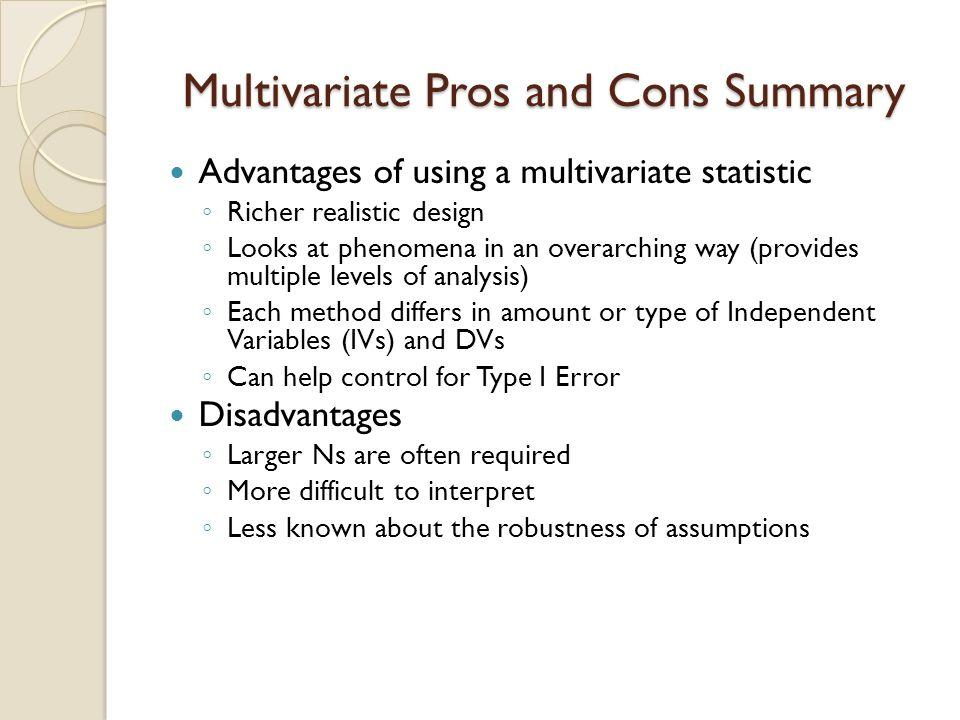

## Table of Contents

## What is a multivariate model?

A multivariate model is a statistical tool used to analyze data that involves more than one variable at the same time. Imagine you want to understand how different factors like age, income, and education level affect someone's health. A multivariate model helps you see how all these factors work together, rather than looking at them one by one. This is important because in real life, things are often connected and influence each other.

These models are used in many fields, like medicine, economics, and social sciences. For example, in medicine, doctors might use a multivariate model to predict a patient's risk of heart disease by considering their age, cholesterol levels, blood pressure, and smoking habits all at once. By understanding these relationships, researchers and professionals can make better predictions and decisions. However, multivariate models can be complex and require careful analysis to make sure the results are accurate and useful.

## How do multivariate models differ from univariate models?

Multivariate models and univariate models are both used in statistics, but they look at data in different ways. A univariate model focuses on one variable at a time. For example, if you want to know about people's heights, you would use a univariate model to study just that one piece of information. It's like looking at a single puzzle piece to understand it better.

On the other hand, a multivariate model looks at multiple variables together. It's like trying to see how different puzzle pieces fit together. For instance, if you want to understand how height, weight, and diet affect someone's health, you would use a multivariate model. This helps you see how these factors work together and influence each other, giving you a fuller picture of the situation.

In short, univariate models are simpler and focus on one thing at a time, while multivariate models are more complex and consider how multiple things interact. Both types of models are useful, but they serve different purposes depending on what you want to learn from your data.

## What are some common types of multivariate models?

There are several common types of multivariate models that people use to understand how different pieces of information work together. One popular type is multiple regression, which is like trying to predict one thing by looking at many others. For example, you might want to predict a house's price by looking at its size, age, and location all at the same time. Another type is [factor](/wiki/factor-investing) analysis, which helps find hidden patterns or groups within a bunch of data. Imagine you have a lot of test scores from students, and you want to see if there are certain subjects that tend to go together, like math and science.

Another common multivariate model is cluster analysis, which groups similar things together. It's like sorting different fruits into piles based on how they look or taste. This can be useful for things like market research, where you might want to find different types of customers based on what they buy or how they behave. Lastly, there's discriminant analysis, which helps tell different groups apart based on many pieces of information. For example, it could be used to tell the difference between different types of plants by looking at their leaves, flowers, and stems all together. Each of these models helps us see the bigger picture by looking at many things at once.

## What kind of data is typically used in multivariate models?

Multivariate models usually work with data that has more than one piece of information for each thing you're studying. For example, if you're looking at students, you might have data about their age, test scores, and how often they attend class. Each student would have numbers for all these things, and the model looks at how they all fit together. This kind of data can come from surveys, experiments, or records that already exist, like medical records or sales data.

The data used in these models can be numbers, like someone's weight or the price of a product, or it can be categories, like the type of car someone drives or their favorite color. Sometimes, the data needs to be cleaned up or changed a bit before it can be used in the model. This might mean fixing mistakes, dealing with missing information, or turning categories into numbers so the model can understand them better. By using all this data together, multivariate models help us see patterns and connections that we might miss if we looked at each piece of information on its own.

## How are multivariate models applied in different fields?

In medicine, doctors use multivariate models to understand how different things like age, blood pressure, and cholesterol levels all work together to affect a person's health. For example, they might use these models to predict the risk of heart disease by looking at many factors at once. This helps doctors make better decisions about treatments and can help patients live healthier lives. In business, companies use multivariate models to figure out what makes customers buy their products. They might look at things like age, income, and what people have bought before to see patterns and make better marketing plans. This helps businesses sell more and understand their customers better.

In social sciences, researchers use multivariate models to study things like how education, income, and where someone lives affect their happiness or success. For example, they might want to see how all these things work together to understand why some people are happier than others. This can help make better policies and programs to improve people's lives. In environmental science, scientists use these models to see how different factors like temperature, rainfall, and pollution affect ecosystems. They might use this information to predict how climate change will impact different areas and plan ways to protect the environment. By looking at many things at once, multivariate models help us understand complex situations better and make smarter decisions.

## What are the basic steps to build a multivariate model?

To build a multivariate model, you start by collecting data that has more than one piece of information for each thing you're studying. For example, if you're looking at students, you might collect data on their age, test scores, and attendance. Once you have this data, you need to clean it up. This means fixing any mistakes, dealing with missing information, and making sure all the data is in a form that the model can use. Sometimes, you might need to change categories into numbers so the model can understand them better.

After preparing the data, you choose the type of multivariate model that fits your question. There are different models like multiple regression, factor analysis, or cluster analysis, each good for different kinds of questions. Once you pick a model, you use special software to run it on your data. This software helps you see how all the pieces of information work together. You might need to try different models or change some settings to get the best results. Finally, you look at the results to see what the model tells you about how the different pieces of information are connected and what it means for your question.

## What are the key assumptions underlying multivariate models?

Multivariate models rely on a few important assumptions to work well. One big assumption is that the relationships between the different pieces of information are linear. This means that if you change one thing a little bit, it changes the other things in a straight line, not in a curve or some other shape. Another assumption is that the data is normally distributed. This means that if you draw a picture of the data, it looks like a bell shape, with most of the data in the middle and less on the sides. If the data doesn't follow these patterns, the model might not give you good results.

Another key assumption is that the different pieces of information you're looking at are not too closely related to each other. If they are, it can make the model confusing and less accurate. This is called multicollinearity. Also, multivariate models assume that the data points are independent of each other, meaning that one person's data doesn't affect another person's data. If these assumptions aren't true, you might need to change your model or use a different kind of analysis to get better results.

## How do you validate the accuracy of a multivariate model?

To check if a multivariate model is accurate, you start by splitting your data into two parts: a training set and a test set. You use the training set to build your model, and then you use the test set to see how well the model works on new data it hasn't seen before. If the model does a good job predicting the test set, that's a sign it's accurate. You can also use something called cross-validation, where you split your data into many small parts and test the model on each part to make sure it works well across all of them.

Another way to validate a multivariate model is by looking at different measures of how well it fits the data. One common measure is the R-squared value, which tells you how much of the variation in your data the model can explain. A higher R-squared means the model fits better, but you also need to check other things like the residuals, which are the differences between what the model predicts and what actually happened. If the residuals are small and don't follow any patterns, that's a good sign your model is accurate. By using these methods, you can feel more confident that your multivariate model is giving you reliable results.

## What are the main advantages of using multivariate models?

Multivariate models help us understand how different things work together. Instead of looking at one thing at a time, these models let us see the big picture. For example, if you want to know what makes people happy, you can look at their age, income, and where they live all at once. This gives you a better idea of what really matters because in real life, things are connected and affect each other. By using multivariate models, we can make better predictions and decisions because we're not missing important pieces of the puzzle.

Another big advantage of multivariate models is that they can find patterns and relationships that we might not see otherwise. For instance, in medicine, doctors can use these models to predict who might get sick by looking at many health factors together. This helps them give better care and maybe even prevent diseases. In business, companies can use multivariate models to understand their customers better by looking at what they buy, how old they are, and where they live. This helps businesses make smarter marketing plans and sell more. Overall, multivariate models give us a deeper understanding of complex situations and help us make better choices.

## What are the potential disadvantages or limitations of multivariate models?

Multivariate models can be tricky because they need a lot of data to work well. If you don't have enough data, the model might not give you good results. Also, these models make some guesses about how the data works, like assuming the relationships between different pieces of information are straight lines. If these guesses are wrong, the model might not be accurate. Another problem is that the data you use has to be clean and ready to go. If there are mistakes or missing pieces, it can mess up the whole model.

Another issue with multivariate models is that they can be hard to understand and explain. Because they look at many things at once, it can be tough to figure out how each piece of information affects the others. This can make it hard to explain the results to people who aren't experts. Plus, these models can be sensitive to small changes in the data. If you add or remove a few data points, it might change the results a lot. So, you need to be careful and check your model in different ways to make sure it's giving you the right answers.

## How can multivariate models be optimized for better performance?

To make multivariate models work better, start by making sure you have enough good data. The more clean and complete data you have, the better the model can work. You also need to check if the guesses the model makes about the data are right. For example, if the model thinks the relationships between different pieces of information are straight lines, but they're not, you might need to change the model or use a different one. Another way to help the model is by making sure all the data is in the right form. This means fixing mistakes and dealing with missing information before you use it in the model.

Once you have the data ready, you can try different ways to make the model better. One way is to use special methods like cross-validation, where you split your data into many small parts and test the model on each part. This helps you see if the model works well with all kinds of data. You can also look at different measures of how well the model fits the data, like the R-squared value, which tells you how much of the data the model can explain. If the model isn't working well, you might need to try different types of models or change some settings to get better results. By doing these things, you can make your multivariate model more accurate and useful.

## What advanced techniques can be used to enhance multivariate modeling?

To make multivariate models even better, you can use something called regularization. This helps stop the model from getting too focused on small details in the data that might not matter. There are different kinds of regularization, like Lasso and Ridge, which can make the model simpler and more accurate. Another cool technique is called principal component analysis, or PCA. This helps find the most important pieces of information in your data and can make the model easier to understand and work with. By using these advanced methods, you can make your multivariate model work better and give you more useful results.

Another way to improve multivariate models is by using [machine learning](/wiki/machine-learning) techniques like random forests and neural networks. Random forests are good at finding patterns in lots of data and can help make better predictions. Neural networks are like brains for computers and can learn from data in really complex ways. They're great for things like figuring out what people might buy next or predicting health risks. These machine learning methods can handle big and messy data and can often find things that regular models might miss. By trying out these advanced techniques, you can make your multivariate models smarter and more helpful.

## References & Further Reading

[1]: Jolliffe, I. T. (2002). ["Principal Component Analysis."](https://link.springer.com/book/10.1007/b98835) Springer Series in Statistics.

[2]: Fabozzi, F. J., Focardi, S. M., & Kolm, P. N. (2006). ["Financial Modeling of the Equity Market: From CAPM to Cointegration."](https://onlinelibrary.wiley.com/doi/book/10.1002/9781119201236) Wiley Finance.

[3]: Luenberger, D. G. (1997). ["Investment Science."](https://www.amazon.com/Investment-Science-David-G-Luenberger/dp/0199740089) Oxford University Press.

[4]: Tsay, R. S. (2010). ["Analysis of Financial Time Series."](https://onlinelibrary.wiley.com/doi/book/10.1002/9780470644560) Wiley Series in Probability and Statistics.

[5]: Glasserman, P. (2003). ["Monte Carlo Methods in Financial Engineering."](https://link.springer.com/book/10.1007/978-0-387-21617-1) Springer-Verlag New York.

[6]: Chan, E. P. (2013). ["Algorithmic Trading: Winning Strategies and Their Rationale."](https://github.com/ftvision/quant_trading_echan_book) Wiley Trading.

[7]: Papoulis, A., & Pillai, S. U. (2002). ["Probability, Random Variables, and Stochastic Processes."](https://searchworks.stanford.edu/view/4708590) McGraw-Hill.

[8]: Wilmott, P. (2006). ["Paul Wilmott Introduces Quantitative Finance."](https://www.amazon.com/Paul-Wilmott-Introduces-Quantitative-Finance/dp/0470319585) Wiley.