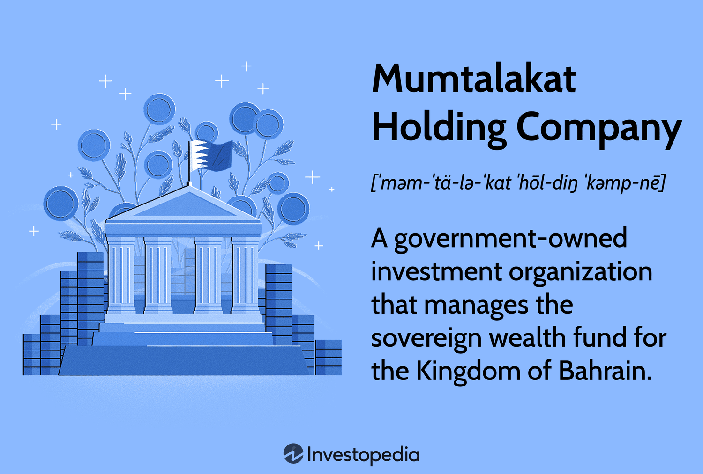

Mumtalakat Holding Company, established as Bahrain's sovereign wealth fund, serves a pivotal role in the nation's economic landscape. As a government-owned entity, Mumtalakat is tasked with managing and investing the wealth of Bahrain, leveraging its resources to foster economic diversification and sustainability. Founded in 2006, this dynamic investment company has strategically positioned itself to minimize Bahrain's economic dependency on oil and gas, thereby broadening its investment spectrum across various sectors.

Mumtalakat's investment strategy is noteworthy for its diverse portfolio, spanning industries such as real estate, tourism, technology, and financial services. This strategic diversification underscores its commitment to economic resilience and its pivotal role in the nation's long-term growth plans. By investing in a wide array of sectors, Mumtalakat not only seeks lucrative financial returns but also aims to stimulate economic development and job creation within Bahrain.

One of the key focal points of Mumtalakat's evolving investment strategy is the adoption and integration of cutting-edge technologies, particularly algorithmic trading and artificial intelligence (AI). These technologies have become integral in enhancing decision-making processes, offering sophisticated tools for market analysis, and enabling more precise investment forecasting. By leveraging AI and algorithmic trading, Mumtalakat aims to optimize its investment strategy, improve risk management, and achieve operational efficiencies.

This article will explore how Mumtalakat is integrating algorithmic trading and AI into its investment strategies, the impact of these technologies on its portfolio management, and how they are shaping the future trends in sovereign wealth fund management. The focus will be on the transformative potential of these technologies in driving Mumtalakat's commitment to innovation and sustainable growth in an increasingly complex global market.

## Table of Contents

## Understanding Mumtalakat Holding Company

Mumtalakat Holding Company is a government-owned investment entity responsible for managing Bahrain's sovereign wealth fund. Established in 2006, Mumtalakat was created to play a pivotal role in the diversification of Bahrain's economy, which historically relied heavily on oil revenues. By steering investments into multiple sectors, Mumtalakat aims to stabilize the nation's economic landscape and stimulate growth across different areas.

Since its inception, Mumtalakat has pursued a strategic investment approach that emphasizes a diversified portfolio extending beyond the traditional oil and gas sectors. This diversification strategy is central to reducing economic dependency on oil and promoting sustainable economic development. By investing in industries such as real estate, tourism, manufacturing, and financial services, Mumtalakat seeks to create a balanced economic structure resilient to fluctuations in global oil prices.

The company's investment philosophy is tailored towards fostering long-term growth and ensuring that Bahrain's future economic prosperity is built on a wide array of industries. By targeting investments in various economic sectors, Mumtalakat not only supports the local economy but also positions Bahrain as a competitive player on regional and global fronts.

## Mumtalakat's Investment Strategy

Mumtalakat Holding Company, as Bahrain's sovereign wealth fund, operates with a strategic focus on diversifying investments across local, regional, and international markets. This approach aims to stimulate economic growth and reduce the kingdom's reliance on oil revenues, aligning with Bahrain's broader economic diversification plans. The company's investment strategy is characterized by significant diversification across various sectors, most notably real estate, tourism, and financial services.

In the real estate sector, Mumtalakat has invested in both commercial and residential properties, contributing to the development of infrastructure that supports Bahrain’s economic growth and urbanization. Investments in tourism include ventures that enhance Bahrain's appeal as a global destination, supporting the wider Middle Eastern tourism market. This diversification not only seeks to capitalize on emerging market trends but also to secure stable returns through exposure to varied economic sectors.

The financial services sector is another critical area where Mumtalakat has positioned its investments strategically. Recognizing the dynamic nature of financial markets, the holding company seeks to bolster its investment portfolio with strong performers and innovative financial solutions. By investing in this sector, Mumtalakat benefits from new opportunities, such as tech-driven financial innovations and financial inclusion projects, which promise resilience and sustainable returns.

Mumtalakat’s board of directors reflects its strategic interests by including a mix of public officials and private sector experts. This combination ensures robust governance and informed decision-making, drawing on a wealth of experience from various industries. Having both public and private sector insights allows Mumtalakat to balance national economic goals with commercial profitability.

This governance model is crucial for identifying and leveraging synergies between public policies and private initiatives, particularly in executing investments that support national economic diversification agendas. The strategic insight from private sector experts on the board enhances Mumtalakat’s capacity to navigate and adapt to rapidly changing global market conditions, ensuring the company remains competitive and forward-looking. 

Through its diversified investment strategy and a governance structure that integrates public-private expertise, Mumtalakat not only seeks financial returns but also contributes to the sustainable economic development of Bahrain. This approach positions Mumtalakat as a significant player in the global investment landscape, fostering advancements in various sectors that align with its long-term strategic goals.

## Algorithmic Trading and AI Integration

Artificial Intelligence (AI) plays a pivotal role in refining Mumtalakat's investment strategies by enabling more precise and efficient decision-making processes. AI-driven technologies, particularly [algorithmic trading](/wiki/algorithmic-trading), have transformed traditional investment approaches by leveraging data-driven insights to predict market movements and optimize investment outcomes.

Algorithmic trading involves the use of computer programs to execute trades in financial markets based on pre-defined criteria. It capitalizes on AI and [machine learning](/wiki/machine-learning) algorithms to analyze vast amounts of financial data, detecting patterns and trends that might be imperceptible to human analysts. This process not only facilitates rapid trades that can capitalize on market fluctuations but also minimizes human error in decision-making.

For Mumtalakat, AI enhances market prediction capabilities by employing machine learning models to sift through historical market data, allowing for a better understanding of future price movements and trends. These predictions are generated through algorithmic models that recognize recurrent patterns and assess current economic indicators. As a result, Mumtalakat can make informed investment decisions that align with its strategic objectives, ensuring optimal returns while mitigating risks associated with market [volatility](/wiki/volatility-trading-strategies).

Furthermore, AI's impact on risk management is profound. Advanced algorithms can evaluate the risk profile of potential investments with greater accuracy by analyzing numerous variables and scenarios. Through machine learning, these algorithms continuously learn and adapt to new data, improving their risk assessment capabilities over time. This adaptability ensures that Mumtalakat's investment portfolio remains resilient against unforeseen market events.

In terms of operational efficiency, AI streamlines various processes within Mumtalakat. By automating routine tasks such as data collection, sorting, and initial analysis, AI frees up human resources for more complex decision-making tasks, thereby enhancing overall productivity. This automation not only reduces operational costs but also accelerates the investment process, granting Mumtalakat a competitive edge in seizing timely market opportunities.

In summary, AI and algorithmic trading are critical components of Mumtalakat's refined investment strategies. They provide reliable data-driven insights and enhance both market predictions and risk management, significantly improving operational efficiency. This integration of AI marks a transformative advancement in Mumtalakat's approach to meeting its financial and strategic goals.

## AI in Portfolio and Risk Management

Mumtalakat Holding Company has increasingly integrated [artificial intelligence](/wiki/ai-artificial-intelligence) (AI) technologies into its portfolio and risk management strategies, harnessing AI's capabilities to enhance decision-making processes and optimize financial performance. AI-powered tools deliver significant value by analyzing large datasets and generating insights that can lead to better investment outcomes and more effective risk management.

One of the primary AI applications utilized by Mumtalakat is predictive analytics for risk assessment. Predictive analytics models can process historical data and identify patterns or trends that might not be immediately apparent through traditional analysis methods. These models use algorithms that can anticipate market fluctuations, potential asset risks, and investment returns, thereby enabling more informed decision-making. For instance, machine learning algorithms can continuously learn from new data inputs, refining models to improve their predictive accuracy over time. This capability allows Mumtalakat to assess risk more effectively and adjust its investment strategies promptly, providing a dynamic approach to managing both opportunities and threats in the market.

Furthermore, AI tools are employed to optimize portfolio performance by evaluating various scenarios and suggesting reallocation of assets based on predicted market behaviors. Techniques such as [reinforcement learning](/wiki/reinforcement-learning), where AI [agents](/wiki/agents) learn optimal decisions through trial and error in a simulated environment, can be used to identify the most favorable investment actions. By simulating different market conditions and investment strategies, these AI-driven solutions help Mumtalakat enhance its portfolio allocation, maximizing returns while minimizing risk exposure.

Case studies of companies within Mumtalakat's portfolio further illustrate the successful implementation of AI technologies. For example, in sectors such as financial services, AI-driven customer analytics platforms can provide personalized insights that improve customer engagement and satisfaction, subsequently boosting the company's market position. Other applications might include AI-driven solutions in logistics companies that optimize supply chain operations, reduce costs, and improve efficiency through real-time data analysis and predictive maintenance.

In summary, the integration of AI-powered tools in portfolio and risk management empowers Mumtalakat Holding Company to navigate complex market dynamics with greater agility and precision. Through predictive analytics and advanced decision-making frameworks, AI enhances Mumtalakat's ability to manage uncertainty and capitalize on investment opportunities. These technologies play a vital role in sustaining the company's growth and competitive advantage amidst evolving global financial landscapes.

## Future Trends and Considerations

As AI technology continues to evolve, its application in algorithmic trading and investment management presents significant potential for sovereign wealth funds like Mumtalakat Holding Company. AI advancements promise enhanced decision-making capabilities through improved data analysis, predictive modeling, and automation.

Potential advancements in AI and algorithmic trading include the development of more sophisticated algorithms capable of processing vast datasets at unprecedented speeds. These advanced algorithms can help identify market trends, predict asset price movements, and optimize portfolio allocations more accurately. Machine learning models such as [deep learning](/wiki/deep-learning) and reinforcement learning are expected to play a critical role in this advancement. Deep learning, for instance, can extract complex patterns from large datasets, while reinforcement learning allows algorithms to learn from their interactions with the environment to make optimal investment decisions.

Despite these opportunities, adopting AI poses certain challenges, including data privacy concerns and algorithmic bias. Data privacy is a critical issue as AI systems require access to large volumes of data, potentially including sensitive information. Ensuring data privacy compliance with regulations such as the European Union's General Data Protection Regulation (GDPR) is essential for ethical AI deployment. Algorithmic bias, where AI systems inadvertently perpetuate or amplify existing biases in data, could lead to suboptimal or unfair investment decisions. Addressing these biases requires the continuous refinement of algorithms and the implementation of fairness-aware AI models.

Looking forward, AI-driven sustainable investing represents a promising opportunity. AI can enhance the evaluation of environmental, social, and governance ([ESG](/wiki/esg-investing)) factors by analyzing various data sources, including satellite imagery and social media sentiment. This capability enables better-informed investment decisions that align with sustainability goals. AI's potential in developing fully autonomous investment platforms is another area of interest, where AI systems could autonomously execute trades, manage portfolios, and ensure compliance with investment mandates without human intervention.

These future trends underscore the transformative impact AI could have on sovereign wealth funds by enhancing operational efficiency, optimizing investment strategies, and contributing to sustainable financial practices. Embracing these advancements while addressing accompanying challenges is crucial for the successful integration of AI in the investment landscape.

## Conclusion

The integration of AI and algorithmic trading within Mumtalakat's operations signifies a pivotal shift towards more efficient and informed investment strategies. By harnessing AI, Mumtalakat not only enhances its data analysis capabilities but also optimizes its portfolio management and risk assessment processes. This strategic leadership in employing cutting-edge technology underscores Mumtalakat's commitment to sustainable growth and innovation.

AI models analyze vast datasets to uncover patterns and predict market trends, allowing Mumtalakat to make informed investment decisions. Algorithmic trading automates these decisions, increasing the fund's operational efficiency and agility in responding to market fluctuations. These technological advancements bolster Mumtalakat's position as a forward-thinking sovereign wealth fund.

Looking ahead, the role of AI in global investment strategies is set to expand. The potential for AI-driven sustainable investing and the emergence of autonomously managed portfolios present new opportunities for sovereign wealth funds. However, challenges such as ensuring data privacy and mitigating algorithmic bias remain critical considerations. As AI technology continues to evolve, it will reshape investment paradigms, making strategic leadership in AI adoption crucial for sustained competitive advantage and responsible investing.

## References & Further Reading

[1]: ["Advances in Financial Machine Learning"](https://www.amazon.com/Advances-Financial-Machine-Learning-Marcos/dp/1119482089) by Marcos Lopez de Prado

[2]: Bergstra, J., Bardenet, R., Bengio, Y., & Kégl, B. (2011). ["Algorithms for Hyper-Parameter Optimization."](https://dl.acm.org/doi/10.5555/2986459.2986743) Advances in Neural Information Processing Systems 24.

[3]: ["Machine Learning for Algorithmic Trading"](https://github.com/stefan-jansen/machine-learning-for-trading) by Stefan Jansen

[4]: ["Quantitative Trading: How to Build Your Own Algorithmic Trading Business"](https://github.com/LucindaYa/quant-resources/blob/master/Quantitative%20Trading%20How%20to%20Build%20Your%20Own%20Algorithmic%20Trading%20Business.pdf) by Ernest P. Chan

[5]: ["Evidence-Based Technical Analysis: Applying the Scientific Method and Statistical Inference to Trading Signals"](https://www.amazon.com/Evidence-Based-Technical-Analysis-Scientific-Statistical/dp/0470008741) by David Aronson