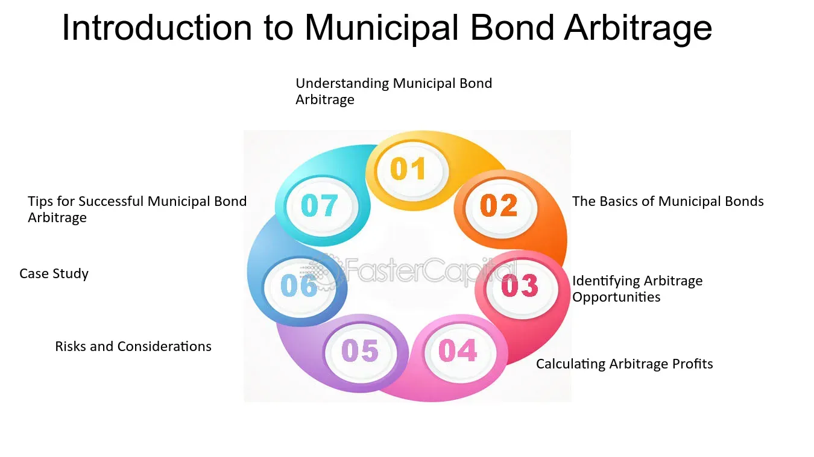

## Table of Contents

## What is a municipal bond?

A municipal bond is a type of loan that people give to cities, towns, or states to help them pay for big projects like building schools, roads, or hospitals. When you buy a municipal bond, you are lending money to the government, and in return, they promise to pay you back with interest over time. This interest is usually paid every six months until the bond reaches its maturity date, which can be anywhere from a few years to several decades.

Municipal bonds are popular because they are considered safe investments. This is because the government is less likely to go bankrupt compared to a company. Also, the interest you earn from these bonds is often not taxed by the federal government, and sometimes not by the state government either. This can make them a good choice for people looking to save on taxes while still earning a steady income from their investments.

## What is arbitrage in financial markets?

Arbitrage is a way to make money in financial markets by buying something in one place where it's cheaper and selling it in another place where it's more expensive. Imagine you find a toy that costs $10 at one store and you can sell it for $15 at another store. By buying the toy at the first store and selling it at the second, you make a profit of $5. This is the basic idea of arbitrage, but instead of toys, people use stocks, bonds, currencies, or other financial products.

In real financial markets, [arbitrage](/wiki/arbitrage) often involves using computers and special software to find and take advantage of these price differences very quickly. These differences might only last for a few seconds, so speed is important. Arbitrage helps keep prices fair across different markets because when people buy where prices are low and sell where prices are high, it pushes the prices to become more equal. However, it can be risky because the price differences might disappear before you can complete your trades, or there might be other costs that eat into your profit.

## How does municipal bond arbitrage work?

Municipal bond arbitrage is a way to make money by taking advantage of the difference between the [interest rate](/wiki/interest-rate-trading-strategies) on municipal bonds and the interest rate on borrowed money. Imagine you can borrow money at a lower interest rate than the rate you get from a municipal bond. If you borrow money to buy the bond, the interest you earn from the bond will be more than the interest you have to pay on the borrowed money. This difference is your profit.

People who do municipal bond arbitrage often use a special kind of investment called a "tax-exempt bond fund." These funds borrow money at a low interest rate and use it to buy municipal bonds that pay a higher interest rate. The key is that the interest from the municipal bonds is usually not taxed, which makes the profit even bigger. However, this kind of investing can be risky because if interest rates change, the profit might go away or even turn into a loss.

## What are the main types of municipal bonds used in arbitrage strategies?

The main types of municipal bonds used in arbitrage strategies are general obligation bonds and revenue bonds. General obligation bonds are backed by the full faith and credit of the issuing government. This means the government promises to use its taxing power to pay back the bondholders. These bonds are often used in arbitrage because they are considered very safe, and the interest they pay is usually tax-free.

Revenue bonds, on the other hand, are backed by the income from a specific project, like a toll road or a water treatment plant. The money earned from these projects is used to pay back the bondholders. These bonds can be riskier than general obligation bonds because if the project doesn't make enough money, the bondholders might not get paid. However, they can still be attractive for arbitrage if the interest rate they offer is high enough compared to the cost of borrowing money to buy them.

## What are the tax implications of municipal bond arbitrage?

The interest you earn from municipal bonds is usually not taxed by the federal government, and sometimes not by the state government either. This makes them very attractive for arbitrage because you can keep more of the money you earn. When you borrow money to buy these bonds, the interest you pay on the borrowed money is not tax-deductible if you are doing arbitrage. This means you have to pay taxes on the interest you pay to borrow the money, which can make your profit smaller.

However, if you do municipal bond arbitrage through a tax-exempt bond fund, the tax rules can be different. These funds are set up in a special way that can make the interest you earn and the interest you pay on borrowed money both tax-free. This can make your profit bigger because you don't have to pay taxes on either the money you earn or the money you spend to borrow. But, these funds have to follow strict rules to keep their tax-exempt status, and if they don't, you might have to pay taxes on your earnings.

## What are the risks associated with municipal bond arbitrage?

Municipal bond arbitrage can be risky because it depends a lot on interest rates. If you borrow money to buy a municipal bond, you hope the interest you earn from the bond will be more than the interest you pay on the borrowed money. But if interest rates go up, the cost of borrowing money can go up too. This might make your profit smaller or even turn it into a loss. Also, if interest rates go down, the price of the bonds you bought might go up, but that doesn't help if you planned to hold them until they mature.

Another risk is that the rules for tax-exempt bond funds are very strict. If a fund doesn't follow these rules, it might lose its tax-exempt status. If that happens, you might have to pay taxes on the money you earned, which can make your profit a lot smaller. Also, if the project that a revenue bond is based on doesn't make enough money, the bond might not pay you back. This can be a big problem if you borrowed money to buy the bond, because you still have to pay back the loan even if the bond doesn't pay you.

## How do interest rates affect municipal bond arbitrage?

Interest rates play a big role in municipal bond arbitrage. When you borrow money to buy a municipal bond, you want the interest you earn from the bond to be more than the interest you pay on the borrowed money. If interest rates go up, the cost of borrowing money can go up too. This means you might have to pay more to borrow the money, which can make your profit smaller or even turn it into a loss. On the other hand, if interest rates go down, the cost of borrowing money goes down, which can make your profit bigger.

But there's another side to interest rates and municipal bonds. When interest rates go down, the price of existing bonds usually goes up because new bonds will pay less interest. If you want to sell your bonds before they mature, you might make more money because of the higher price. But if you planned to hold the bonds until they mature, the higher price doesn't help you. You still get the same interest payments, but the cost of borrowing money to buy the bonds might be lower, which can still be good for your arbitrage strategy.

## What role does credit rating play in municipal bond arbitrage?

Credit ratings are very important in municipal bond arbitrage because they tell you how safe it is to lend money to a city or town. When a bond has a high credit rating, it means the government is very likely to pay you back. This makes the bond safer and more attractive for arbitrage because you can borrow money at a lower interest rate to buy it. If the bond has a low credit rating, it means there's a bigger chance the government might not pay you back. This makes the bond riskier, and you might have to pay a higher interest rate to borrow money to buy it, which can make your profit smaller.

The difference in credit ratings can also affect the price of the bonds. High-rated bonds are usually more expensive because more people want to buy them. If you can find a bond with a high rating that's cheaper in one market than another, you might be able to make money by buying it where it's cheaper and selling it where it's more expensive. But with lower-rated bonds, you have to be careful. They might offer higher interest rates to make up for the risk, but if the government can't pay back the bond, you could lose money, especially if you borrowed money to buy it.

## How can one identify mispriced municipal bonds for arbitrage opportunities?

To find mispriced municipal bonds for arbitrage, you need to compare the prices of the same bond in different markets. Sometimes, a bond might be cheaper in one place and more expensive in another. If you can buy the bond where it's cheaper and sell it where it's more expensive, you can make a profit. You can use special computer programs and data from financial websites to help you find these price differences quickly. It's also important to check the credit ratings of the bonds. Bonds with high credit ratings are usually safer and easier to use for arbitrage because you can borrow money at a lower interest rate to buy them.

Another way to find mispriced bonds is by looking at the interest rates they offer compared to other similar bonds. If a bond offers a higher interest rate than other bonds with the same credit rating, it might be underpriced. This means you can earn more money from the bond than from other bonds. But you have to be careful because a high interest rate can also mean the bond is riskier. Always check why the bond is offering a higher interest rate before deciding to buy it for arbitrage. Remember, the goal is to find bonds where the interest you earn is more than the interest you pay to borrow money to buy them.

## What are some common strategies used in municipal bond arbitrage?

One common strategy in municipal bond arbitrage is called "yield curve arbitrage." This is when you buy a bunch of different municipal bonds that will pay you back at different times. You use a computer to figure out which mix of bonds will give you the best profit. The idea is to borrow money at a low interest rate and use it to buy these bonds. If the interest you earn from the bonds is more than the interest you pay on the borrowed money, you make a profit. This strategy can be tricky because it depends a lot on interest rates and how they change over time.

Another strategy is called "tax arbitrage." This is when you use a special kind of investment called a "tax-exempt bond fund." These funds borrow money at a low interest rate and use it to buy municipal bonds that pay a higher interest rate. The interest you earn from these bonds is usually not taxed, which makes the profit even bigger. But these funds have to follow strict rules to keep their tax-exempt status. If they don't, you might have to pay taxes on your earnings, which can make your profit a lot smaller.

## How do regulatory changes impact municipal bond arbitrage?

Regulatory changes can have a big impact on municipal bond arbitrage. If the government changes the rules about taxes, it can change how much money you can make from arbitrage. For example, if the government decides to tax the interest you earn from municipal bonds, your profit might go down a lot. Also, if the rules for tax-exempt bond funds change, these funds might not be able to borrow money as cheaply or keep their tax-exempt status. This can make it harder to make money using these funds.

Another way regulatory changes can affect arbitrage is by changing the rules about how much money cities and towns can borrow. If the government makes it harder for them to borrow money, there might be fewer municipal bonds to buy. This can make it harder to find good arbitrage opportunities. Also, if the rules about credit ratings change, it can affect how safe the bonds are and how much you have to pay to borrow money to buy them. All these changes can make municipal bond arbitrage more complicated and riskier.

## What advanced tools and models are used to enhance municipal bond arbitrage strategies?

To make municipal bond arbitrage work better, people use special computer programs and math models. These programs can look at lots of data very quickly to find bonds that are priced differently in different places. They can also help figure out which mix of bonds will give the best profit. One popular model is called the "yield curve model." It helps you see how interest rates might change over time and pick the right bonds to buy. Another tool is called "credit analysis software," which looks at the credit ratings of bonds to see how safe they are. These tools help make decisions faster and with less risk.

Another important tool is called "risk management software." This software helps you understand how much you could lose if things don't go as planned. It can show you what might happen if interest rates go up or down or if a bond doesn't pay you back. By using this software, you can try to protect your money and make sure your arbitrage strategy is safe. All these tools together help people find the best opportunities for municipal bond arbitrage and manage the risks that come with it.

## References & Further Reading

[1]: Ang, A. (2014). ["Asset Management: A Systematic Approach to Factor Investing."](https://www.amazon.com/Asset-Management-Systematic-Investing-Association/dp/0199959323) Oxford University Press.

[2]: Fabozzi, F. J., Mann, S. V., & Wiley, J. (2005). ["The Handbook of Fixed Income Securities."](https://www.mhebooklibrary.com/doi/book/10.1036/9781260473902?contentTab=true) McGraw-Hill Education.

[3]: Lopez de Prado, M. (2018). ["Advances in Financial Machine Learning."](https://www.amazon.com/Advances-Financial-Machine-Learning-Marcos/dp/1119482089) Wiley.

[4]: Chan, E. (2009). ["Quantitative Trading: How to Build Your Own Algorithmic Trading Business."](https://github.com/ftvision/quant_trading_echan_book) Wiley.

[5]: Litterman, R. (2003). ["Modern Investment Management: An Equilibrium Approach."](https://archive.org/details/moderninvestment0000litt) Wiley.

[6]: McDonald, R. (2013). ["Derivatives Markets, 3rd Edition."](https://www.amazon.com/Derivatives-Markets-3rd-Pearson-Finance/dp/0321543084) Pearson.

[7]: Jansen, S. (2020). ["Machine Learning for Algorithmic Trading: Predictive Models to Extract Signals from Market and Alternative Data for Systematic Trading Strategies with Python."](https://www.amazon.com/Machine-Learning-Algorithmic-Trading-alternative/dp/1839217715) Packt Publishing.