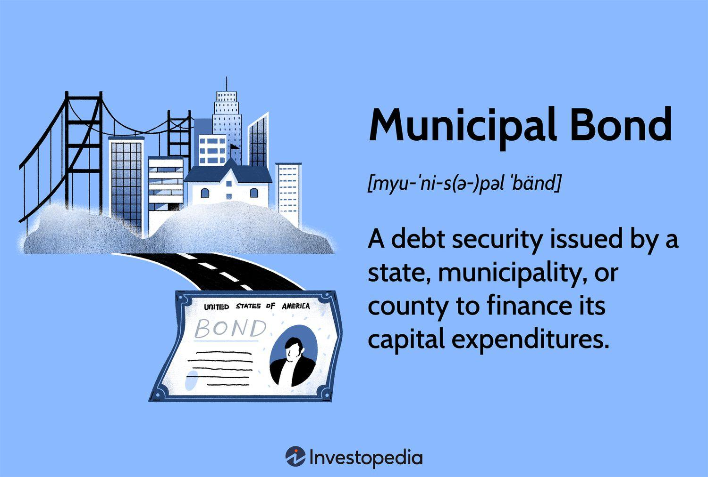

## Table of Contents

## What are municipal bonds?

Municipal bonds are loans that people give to local governments, like cities or towns. When you buy a municipal bond, you're basically lending money to the government. In return, the government promises to pay you back the money you lent them, plus some extra money as a thank you, called interest. This interest is usually paid to you every six months until the bond reaches its end date, which can be anywhere from one to thirty years later.

These bonds are often used by local governments to pay for big projects, like building new schools, fixing roads, or improving water systems. People like to invest in municipal bonds because they are seen as safe investments. Also, the interest you earn from these bonds is often not taxed by the federal government, and sometimes not by the state government either. This can make them a good choice for people looking to save on taxes while helping their community.

## How do municipal bonds work?

Municipal bonds are like loans that you give to a city or town. When you buy a municipal bond, you're lending money to the local government. They use this money to build things like schools, roads, or water systems. In return, the government promises to pay you back the money you lent them, plus a little extra as a thank you. This extra money is called interest, and it's usually paid to you every six months. The whole process can take anywhere from one to thirty years, depending on the bond.

These bonds are popular because they're seen as safe investments. People trust that the local government will pay them back. Another big reason people like municipal bonds is because the interest you earn is often not taxed by the federal government, and sometimes not by the state government either. This can save you money on taxes. So, by buying a municipal bond, you're not only helping your community with important projects, but you're also making a smart investment for yourself.

## What are the different types of municipal bonds?

There are two main types of municipal bonds: general obligation bonds and revenue bonds. General obligation bonds are backed by the full faith and credit of the issuing government. This means the government promises to use its taxing power to pay back the bond. They are often used for projects that benefit the whole community, like building schools or parks.

Revenue bonds, on the other hand, are paid back using money earned from the project they fund. For example, if a city builds a toll bridge with revenue bonds, the money collected from tolls will be used to pay back the bondholders. These bonds are riskier than general obligation bonds because if the project doesn't make enough money, the bond might not be paid back on time.

There's also a third type called private activity bonds. These are issued to help finance projects that mostly benefit private companies or individuals, but still have some public benefit. An example might be building a sports stadium that a private team will use but also brings people to the area. These bonds can have different tax rules compared to the other types.

## What are the benefits of investing in municipal bonds?

Investing in municipal bonds can be a smart choice for many reasons. One big reason is that they are usually very safe. When you buy a municipal bond, you are lending money to a city or town, and they promise to pay you back. Since these bonds are backed by the government, there's a good chance they will keep their promise. This makes municipal bonds a good choice if you want to keep your money safe.

Another great benefit is that the interest you earn from municipal bonds is often not taxed by the federal government, and sometimes not by the state government either. This means you get to keep more of the money you earn. It's like getting a little extra thank you for helping your community. So, by investing in municipal bonds, you can help build schools, roads, and other important projects while also saving on taxes.

## What are the risks associated with municipal bonds?

Even though municipal bonds are seen as safe investments, they still have some risks. One risk is that the city or town might not be able to pay back the money they borrowed from you. This can happen if they run out of money or if something goes wrong with the project they were using the bond money for. If the government can't pay you back, you might lose some or all of your investment.

Another risk is that interest rates might go up after you buy the bond. If this happens, the value of your bond could go down. This means if you want to sell your bond before it's supposed to be paid back, you might not get as much money for it as you hoped. So, it's important to think about how long you want to keep your money in the bond and what might happen with interest rates in the future.

Lastly, there's also the risk that comes with revenue bonds. These bonds are paid back using money made from the project they fund, like a toll bridge. If the project doesn't make enough money, the bond might not be paid back on time. This makes revenue bonds a bit riskier than general obligation bonds, which are backed by the government's promise to use taxes to pay you back.

## How are municipal bonds taxed?

When you earn interest from municipal bonds, the good news is that it's often not taxed by the federal government. This means you get to keep all the interest money you earn, without having to give any of it to the federal government. Sometimes, if you live in the same state where the bond was issued, you might not have to pay state taxes on the interest either. This can save you a lot of money on taxes, which is one reason why people like investing in municipal bonds.

But, there are some cases where you might have to pay taxes on your municipal bond earnings. If you buy what's called a private activity bond, the interest you earn might be taxed by the federal government. These bonds help finance projects that mainly benefit private companies or people, but still have some public benefit. Also, if you sell your bond for more money than you paid for it, you might have to pay taxes on that profit, called capital gains. So, while most municipal bonds come with tax benefits, it's important to understand the rules for the specific bond you're thinking about buying.

## How can someone invest in municipal bonds?

To invest in municipal bonds, you can start by talking to a financial advisor or using an online brokerage account. A financial advisor can help you understand which bonds might be good for you and how they fit into your overall investment plan. If you decide to go with an online brokerage, you can look at different bonds, see how much they cost, and how much interest they pay. You can buy the bonds directly through the brokerage's website, just like you would buy a stock.

Once you've bought a municipal bond, you'll start getting interest payments, usually every six months. These payments are your reward for lending money to the city or town. You'll need to keep track of when the bond will be paid back, which could be anywhere from one to thirty years later. If you need your money back before the bond's end date, you can try to sell the bond to someone else, but remember that the price you get might be different from what you paid.

## What is the process of issuing municipal bonds?

When a city or town wants to build something big like a school or a road, they might not have enough money to pay for it all at once. So, they decide to issue municipal bonds. First, they figure out how much money they need and what kind of bond they want to use, like a general obligation bond or a revenue bond. Then, they work with a bank or a financial advisor to set up the bond. They decide things like how long the bond will last, how much interest they will pay, and when they will pay it.

Once everything is set, the city or town makes the bond available for people to buy. They might do this through a special sale where people can bid on the bonds, or they might work with a broker to sell them. When people buy the bonds, they are lending money to the city or town. The city or town uses this money to build the project. Over time, they pay back the people who bought the bonds, along with interest, until the bond reaches its end date. This way, the city or town can pay for big projects without having to come up with all the money right away.

## How do municipal bond ratings affect investment decisions?

Municipal bond ratings are like report cards that tell you how safe it is to invest in a bond. They are given by special companies called rating agencies, like Moody's or Standard & Poor's. These agencies look at things like how much money the city or town has, how well they manage their money, and if they have a good history of paying back their debts. A high rating, like AAA, means the bond is very safe and the city or town is likely to pay you back. A lower rating, like BB, means the bond is riskier and there's a bigger chance you might not get your money back.

When you're thinking about buying a municipal bond, the rating can help you decide if it's a good investment for you. If you want a safe investment and don't mind [earning](/wiki/earning-announcement) less interest, you might choose a bond with a high rating. But if you're okay with taking more risk to earn more interest, you might look at bonds with lower ratings. The rating helps you understand the trade-off between safety and potential reward, so you can make a choice that fits your goals and how much risk you're comfortable with.

## What role do municipal bonds play in public finance?

Municipal bonds are a big part of how cities and towns pay for important projects. When a city wants to build something like a new school or fix a road, they might not have all the money they need right away. So, they can issue municipal bonds to borrow money from people who want to invest. The city uses the money from selling the bonds to pay for the project. Then, over time, they pay back the people who bought the bonds, plus a little extra as interest. This way, the city can do big projects without having to save up all the money first.

These bonds are also important because they help connect the community with investors. When people buy municipal bonds, they are helping their city or town build things that everyone can use. At the same time, they get a safe place to put their money and earn some interest. The interest from these bonds is often not taxed by the federal government, and sometimes not by the state government either. This makes municipal bonds a good choice for people looking to save on taxes while helping their community.

## How have municipal bonds performed historically compared to other investments?

Municipal bonds have been a pretty safe and steady investment over the years. They usually don't go up and down as much as stocks, which makes them a good choice if you want to keep your money safe. Over the long term, municipal bonds have given investors a steady return, often around 4% to 5% a year. This might not sound like a lot, but it's pretty good when you think about how safe they are and that the interest you earn is often not taxed by the federal government.

When you compare municipal bonds to other investments like stocks or corporate bonds, they usually don't make as much money. Stocks can go up a lot more, but they can also go down a lot more. Corporate bonds might give you a bit more interest than municipal bonds, but they are riskier because companies can go out of business. So, while municipal bonds might not make you rich quickly, they are a good choice if you want a safe place to put your money and help your community at the same time.

## What advanced strategies can be used when investing in municipal bonds?

When you want to get the most out of your municipal bond investments, one smart move is to use a strategy called laddering. This means you buy bonds that will pay you back at different times, like one year, three years, and five years from now. By doing this, you spread out when you get your money back, which can help you manage your cash flow better. It also lets you take advantage of different interest rates over time. If rates go up, you can reinvest the money from the bonds that pay you back sooner into new bonds with higher rates.

Another advanced strategy is to look at what's called the yield to worst. This tells you the lowest possible return you might get from a bond if the city or town decides to pay it back early. Knowing this can help you pick bonds that will still give you a good return even if things don't go as planned. Also, you might want to think about buying bonds from different places to spread out your risk. If you only buy bonds from one city and something bad happens there, you could lose a lot of money. But if you have bonds from different cities, the risk is spread out, making your investment safer overall.

## References & Further Reading

[1]: ["Municipal Bonds: Understanding Credit Risk"](https://www.sec.gov/investor/alerts/municipalbondsbulletin.pdf) by Investopedia.

[2]: "Fabozzi, F. J., Modigliani, F., & Jones, F. J. (2010). Foundations of Financial Markets and Institutions." Prentice Hall.

[3]: ["The Handbook of Municipal Bonds"](https://www.wiley.com/en-us/The+Handbook+of+Municipal+Bonds-p-9781118044940) by Sylvan G. Feldstein and Frank J. Fabozzi.

[4]: ["Algorithmic Trading and DMA: An introduction to direct access trading strategies"](https://www.amazon.com/Algorithmic-Trading-DMA-introduction-strategies/dp/0956399207) by Barry Johnson.

[5]: ["Municipal Bonds: A 21st Century Perspective"](https://www.investopedia.com/terms/m/municipalbond.asp) by Iman Anabtawi and Steven L. Schwarcz, from The National Bureau of Economic Research.