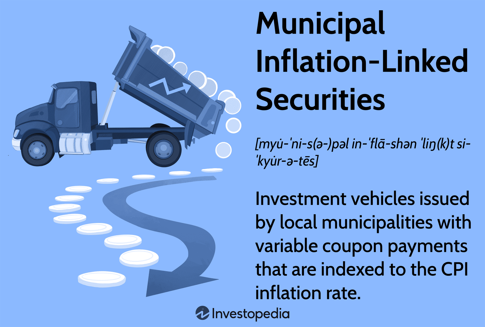

## Table of Contents

## What are municipal inflation-linked securities?

Municipal inflation-linked securities are special types of bonds that cities or towns issue to raise money. These bonds are different because their value goes up or down based on inflation, which is the general increase in prices over time. This means if prices go up, the bond pays more, helping to protect the money's value for the person who buys the bond.

These securities are useful for both the city and the investor. For the city, it's a way to borrow money to build things like schools or roads. For the investor, it's a way to earn money that keeps up with inflation. This makes the investment safer because it's less likely to lose value over time due to rising prices.

## How do municipal inflation-linked securities differ from traditional municipal bonds?

Municipal inflation-linked securities and traditional municipal bonds are both ways for cities and towns to borrow money, but they work a bit differently. Traditional municipal bonds have a fixed interest rate, which means they pay the same amount of interest no matter what happens with inflation. This can be good if you want a steady income, but if prices go up a lot, the money you get might not be worth as much over time.

On the other hand, municipal inflation-linked securities adjust their payments based on inflation. This means if prices go up, the amount of interest you get also goes up. This helps protect your money's value because you're getting more money when things cost more. So, these securities can be a better choice if you're worried about inflation eating away at your investment's value.

## What is the purpose of issuing inflation-linked securities by municipalities?

Municipalities issue inflation-linked securities to borrow money for projects like building schools or roads. These securities help cities and towns get the money they need without worrying about inflation making their debt harder to pay back. Because the payments on these securities go up with inflation, the money the city has to pay back stays worth about the same over time.

For people who buy these securities, they offer a way to protect their investment from losing value due to inflation. If prices go up, the interest they earn also goes up, which means their money keeps its value better than with regular bonds. This makes inflation-linked securities an attractive option for investors who want their money to grow in line with the cost of living.

## Who are the typical investors in municipal inflation-linked securities?

Typical investors in municipal inflation-linked securities are often people who want their money to keep up with rising prices. These investors might be retired folks who need their savings to last longer and keep buying power. They like these securities because the payments go up when prices go up, so their money doesn't lose value over time.

Another group of investors might be big institutions like pension funds or insurance companies. These organizations have to plan for the future and make sure they can pay out money to people over many years. Inflation-linked securities help them because the payments adjust with inflation, which matches well with their long-term planning needs.

## How does inflation impact the returns of these securities?

Inflation impacts the returns of municipal inflation-linked securities by making the payments go up when prices go up. This means if things get more expensive, the interest you get from these securities also gets bigger. So, your money keeps its value better than with regular bonds that don't change with inflation. This is good for you because you don't lose buying power over time.

For example, if inflation goes up by 2% in a year, the payments from these securities will also go up by 2%. This helps keep the value of your investment the same, even when prices are rising. It's like your money grows a little bit to match the cost of living, which makes these securities a smart choice if you're worried about inflation.

## What are the risks associated with investing in municipal inflation-linked securities?

Investing in municipal inflation-linked securities comes with some risks. One big risk is that the city or town might have trouble paying back the money they borrowed. If the city runs into money problems, they might not be able to make the payments on time or at all. This is called default risk, and it can mean you lose some or all of your investment.

Another risk is that the value of these securities can go up and down based on what's happening in the market. If people start thinking these securities are riskier or if interest rates go up, the price of the securities might drop. This is called [interest rate](/wiki/interest-rate-trading-strategies) risk, and it means you could lose money if you need to sell your securities before they mature.

Lastly, while these securities are designed to protect against inflation, there's still a chance that inflation could be higher than expected. If inflation goes up a lot more than the adjustments made to the securities, the payments might not keep up with the rising cost of living. This is called inflation risk, and it means your money might not grow as much as you need it to.

## Can you explain the mechanism of indexation used in these securities?

The mechanism of indexation in municipal inflation-linked securities works by adjusting the payments based on a measure of inflation, like the Consumer Price Index (CPI). The CPI tracks the average change over time in the prices paid by people for goods and services. When the CPI goes up, it means things are getting more expensive, and the payments from these securities go up too. This helps keep the value of your investment the same even when prices are rising.

For example, if the CPI goes up by 2% in a year, the interest payment on your security will also go up by 2%. This means you get more money to match the higher prices. The principal amount, which is the money you loaned to the city, also goes up with inflation. So, when the security matures and you get your money back, it's worth the same as when you first invested, even after years of inflation.

## How are municipal inflation-linked securities priced and valued?

Municipal inflation-linked securities are priced and valued based on how much inflation is expected in the future and how safe the investment is thought to be. When people think inflation will go up, the price of these securities goes up too. This is because the payments from the securities will get bigger to match the higher prices. Also, if people think the city or town is very safe and will pay back the money, the price of the securities will be higher. But if there's a risk the city might not pay back the money, the price will be lower.

The value of these securities can change over time based on what's happening in the market. If interest rates go up, the value of the securities might go down because new bonds might pay more interest. But if inflation goes up a lot, the value of these securities can go up because the payments will get bigger. So, it's a balance between how much inflation is expected, how safe the investment is, and what's happening with interest rates.

## What are some historical examples of municipal inflation-linked securities?

One example of municipal inflation-linked securities is from the city of Los Angeles. Back in the 1990s, Los Angeles issued bonds that were tied to inflation. These bonds helped the city build new projects while protecting the investors from losing money because of rising prices. People who bought these bonds got more money if prices went up, which made the investment safer and more attractive.

Another example comes from the state of Massachusetts. In the early 2000s, Massachusetts issued inflation-linked securities to help pay for big projects like building new schools and fixing roads. These securities were popular with investors who wanted their money to grow along with inflation. The state could borrow money without worrying about inflation making the debt harder to pay back, and investors got payments that kept up with the cost of living.

## How do tax considerations affect the attractiveness of municipal inflation-linked securities?

One big reason people like municipal inflation-linked securities is because of how they are taxed. The interest you get from these securities is often not taxed by the federal government. This means you get to keep more of the money you earn. For people in high tax brackets, this can make these securities a lot more attractive than other investments that are taxed. It's like getting a bigger return without having to pay as much in taxes.

On the other hand, there might be some state and local taxes to think about. If you live in the state where the securities are issued, you might not have to pay state taxes on the interest. But if you live in a different state, you might have to pay state taxes. This can change how good of a deal these securities are for you. So, it's important to look at both federal and state tax rules to see if these securities are a good choice for your money.

## What role do these securities play in a diversified investment portfolio?

Municipal inflation-linked securities can be a useful part of a diversified investment portfolio because they help protect your money from inflation. When prices go up, these securities pay more, so your money keeps its value better than with regular bonds. This can be really helpful if you want your savings to last a long time, like during retirement. By adding these securities to your portfolio, you're spreading out your risk and making sure some of your investments grow with the cost of living.

These securities also offer tax benefits that can make them even more attractive. Since the interest you earn is often not taxed by the federal government, you get to keep more of your money. This can be a big deal if you're in a high tax bracket. Adding municipal inflation-linked securities to your portfolio can help balance out other investments that might be taxed more heavily, giving you a mix of growth and protection from inflation while also saving on taxes.

## What are the current market trends and future outlook for municipal inflation-linked securities?

The current market for municipal inflation-linked securities is showing some interest, especially from investors worried about inflation. As prices keep going up, more people are looking for ways to keep their money's value safe. These securities are becoming more popular because they adjust payments based on inflation, which means investors can feel more secure about their money not losing value over time. Also, with the economy recovering from recent challenges, cities and towns are looking to borrow money for new projects, which can increase the supply of these securities.

Looking to the future, the outlook for municipal inflation-linked securities seems positive. If inflation stays high or keeps going up, these securities will likely become even more attractive to investors. People who need their savings to last a long time, like retirees, will find these securities helpful because they offer protection against rising prices. As long as cities and towns keep issuing these securities to fund their projects, and as long as inflation remains a concern, these securities should continue to play an important role in the investment world.

## What are Municipal Inflation-Linked Securities and How Do They Serve as a Shield Against Inflation?

Municipal inflation-linked securities operate similarly to standard municipal bonds, providing local government entities with a means to raise capital for public projects. However, these instruments incorporate a crucial mechanism to combat inflation: they adjust the principal in accordance with the Consumer Price Index (CPI). This adjustment offers a hedge against inflation, ensuring that the value of the investment maintains its purchasing power over time.

For investors, safeguarding against the erosive effects of inflation is a significant advantage. These securities adjust their principal value and thus the interest payments, which rise with inflation, providing a financial shield in environments where traditional fixed-income investments might lose ground. The principal adjustment can be expressed as:

$$
\text{Adjusted Principal} = \text{Initial Principal} \times \frac{\text{CPI}_{\text{Current}}}{\text{CPI}_{\text{Base}}}
$$

Despite their benefits, municipal inflation-linked securities come with certain trade-offs. They tend to offer lower initial coupon rates compared to their traditional counterparts. This is because the adjustment for inflation is considered part of the return on investment, reducing the upfront yield requirement. Investors need to weigh this potential reduction in immediate income against the long-term inflation protection these securities offer.

Another consideration for investors is the trade-off in [liquidity](/wiki/liquidity-risk-premium) and yield. Market liquidity for inflation-linked securities can be lower than for regular municipal bonds due to fewer market participants and the complexity of pricing these adjustments. As a result, selling these securities quickly could prove more challenging, potentially impacting the realized yield.

In conclusion, while municipal inflation-linked securities may offer protection against inflation-driven purchasing power erosion, investors should carefully assess their portfolio goals and liquidity needs when considering these instruments. Balancing these securities' advantages with their inherent trade-offs is essential for optimizing fixed-income investment strategies.

## Is Algorithmic Trading Prevalent in the Municipal Bond Market?

The integration of [algorithmic trading](/wiki/algorithmic-trading) in the municipal bond market offers significant advancements by utilizing automation and sophisticated data analytics. Algorithmic trading employs various strategies driven by mathematical models and statistical analyses to execute trades at optimal times. This approach addresses efficiency gaps in the market through several mechanisms.

**Efficient Price Discovery**

Algorithms facilitate efficient price discovery, a fundamental aspect of financial markets, by analyzing a vast array of market data, including historical prices, yield curves, and market news. They continuously scan the market for discrepancies between a bond's market price and its intrinsic value, executing trades to exploit these inefficiencies. This process helps in aligning prices closer to their true value, benefiting market participants through more competitive pricing. For instance, a basic algorithm might evaluate the expected yield of a bond by using a formula such as:

$$
\text{Expected Yield} = \frac{\text{Coupon Payment}}{\text{Market Price}} + \frac{\text{Face Value} - \text{Market Price}}{\text{Market Price} \times \text{Years to Maturity}}
$$

**Improved Liquidity Management**

Liquidity is a notable challenge in the municipal bond markets due to their fragmented nature. Algorithmic trading enhances liquidity by enabling swift and large-scale trade executions without significantly impacting bond prices. Automated systems can effectively match buy and sell orders across different venues, increasing the overall market turnover and ensuring tighter bid-ask spreads. For example, high-frequency trading ([HFT](/wiki/high-frequency-trading-strategies)) algorithms participate as market makers, providing continuous quotes on both sides of the market.

**Optimized Credit and Risk Analysis**

Risk management is another area significantly improved by algorithmic trading. Algorithms can assess credit risk by incorporating real-time economic indicators, ratings updates, and issuer financials into their trading models. They employ tools like logistic regression or [machine learning](/wiki/machine-learning) classifiers to predict default probabilities, allowing traders to swiftly mitigate risks associated with individual securities or entire portfolios.

**Speed and Accuracy**

The speed at which algorithmic trading operates is a distinct advantage, often executing trades within milliseconds. This speed is critical for capturing fleeting opportunities and reacting to fast-changing market conditions. Moreover, algorithmic trading enhances accuracy by minimizing human error—an inevitable [factor](/wiki/factor-investing) in manual trading—thus ensuring transactions are executed precisely as planned.

**Reduced Transaction Costs**

Automation significantly reduces transaction costs by cutting down on human labor expenses and facilitating better use of market data to strategically time trades. Algorithms are designed to minimize slippage through techniques such as iceberg orders, where only a fraction of the total order is visible at any time, thereby reducing market impact.

To illustrate this with a simple Python implementation, consider an algorithm designed to execute trades when specified conditions are met:

```python
import numpy as np

def calculate_expected_yield(coupon_payment, market_price, face_value, years_to_maturity):
    return (coupon_payment / market_price) + ((face_value - market_price) / (market_price * years_to_maturity))

def trading_decision(market_data):
    for bond in market_data:
        expected_yield = calculate_expected_yield(bond['coupon'], bond['market_price'], bond['face_value'], bond['years_to_maturity'])
        if expected_yield > bond['benchmark_yield']:
            execute_trade(bond['id'], 'buy')
        elif expected_yield < bond['benchmark_yield']:
            execute_trade(bond['id'], 'sell')

def execute_trade(bond_id, action):
    print(f"Executing {action} trade for bond {bond_id}")

market_data = [{'id': 1, 'coupon': 50, 'market_price': 950, 'face_value': 1000, 'years_to_maturity': 10, 'benchmark_yield': 0.05}]
trading_decision(market_data)
```

This integration of algorithmic trading in municipal bond markets promotes efficiency, cost-effectiveness, and adaptability, paving the way for a more dynamic investment landscape.

## References & Further Reading

[1]: Fabozzi, F. J., & Mann, S. V. (eds.). (2005). ["The Handbook of Municipal Bonds"](https://books.google.com/books/about/The_Handbook_of_Fixed_Income_Securities.html?id=YmaZzQEACAAJ). Wiley.

[2]: PFaifer, G. (2006). ["The Basics of Municipal Bonds"](https://us.etrade.com/knowledge/library/bonds-cds/municipal-bond-basics). John Wiley & Sons.

[3]: Ang, A., Bhansali, V., & Xing, Y. (2010). ["Inflation-Protected Securities: How Can They Make Your Portfolio Safer?"](https://onlinelibrary.wiley.com/doi/abs/10.1111/j.1540-6261.2009.01545.x). Financial Analysts Journal, 66(3), 36-50.

[4]: ["Advances in Financial Machine Learning"](https://www.amazon.com/Advances-Financial-Machine-Learning-Marcos/dp/1119482089) by Marcos Lopez de Prado

[5]: Litterman, R. B., Scheinkman, J., & Weiss, L. (1991). ["Volatility and the Yield Curve"](https://www.semanticscholar.org/paper/Volatility-and-the-Yield-Curve-Litterman-Scheinkman/5f9c5f23a5d01b47e26a06ec08d4fac740910474). Journal of Fixed Income, 1(3), 49-53.

[6]: Treleaven, P., Galas, M., & Lalchand, V. (2013). ["Algorithmic Trading Review"](https://dl.acm.org/doi/10.1145/2500117). Journal of Financial Markets Infrastructure, 2(1), 73-92.

[7]: Dybvig, P. H., & Marshall, W. (1996). ["Inflation Protection and the Term Structure of Interest Rates"](https://dybfin.wustl.edu/). Journal of Finance, 51(5), 2193-2219.

[8]: ["Quantitative Trading: How to Build Your Own Algorithmic Trading Business"](https://www.amazon.com/Quantitative-Trading-Build-Algorithmic-Business/dp/0470284889) by Ernest P. Chan