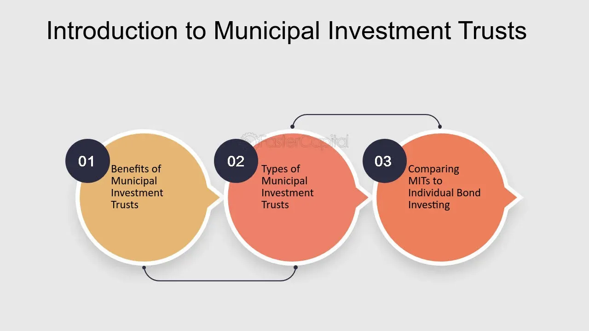

## Table of Contents

## What is a Municipal Investment Trust?

A Municipal Investment Trust is a type of investment fund that focuses on buying bonds issued by cities, towns, and other local governments. These bonds are called municipal bonds, and they help these local governments pay for things like schools, roads, and other public projects. When you invest in a Municipal Investment Trust, your money is pooled with other investors' money to buy a variety of these bonds. This can help spread out the risk because your investment is not tied to just one bond.

One of the main benefits of investing in a Municipal Investment Trust is that the interest you earn from the bonds is often free from federal income tax, and sometimes from state and local taxes too. This can make it a good choice for people looking to reduce their tax bill. However, like any investment, there are risks. The value of the bonds can go up and down, and if a local government has trouble paying back its bonds, it could affect the value of your investment in the trust.

## How does a Municipal Investment Trust differ from other investment vehicles?

A Municipal Investment Trust is different from other investment vehicles because it focuses only on municipal bonds. These are bonds from cities, towns, and other local governments. Other investment vehicles, like mutual funds or ETFs, might invest in a mix of stocks, bonds, and other assets. A Municipal Investment Trust pools money from many investors to buy a variety of these municipal bonds, which helps spread out the risk. This focus on municipal bonds makes it unique compared to more diverse investment options.

Another key difference is the tax advantage. The interest you earn from municipal bonds in a Municipal Investment Trust is often free from federal income tax, and sometimes from state and local taxes too. This is not usually the case with other investment vehicles like stocks or corporate bonds, where you have to pay taxes on the income you earn. This tax benefit can make Municipal Investment Trusts attractive to people looking to reduce their tax bill, but it also means they might accept lower returns compared to other investments that don't offer this tax advantage.

## What are the primary benefits of investing in a Municipal Investment Trust?

One of the main benefits of investing in a Municipal Investment Trust is the tax advantage. The interest you earn from the municipal bonds in the trust is often free from federal income tax, and sometimes from state and local taxes too. This can help you keep more of your money, making it a good choice if you want to lower your tax bill. This tax benefit can be especially helpful for people in higher tax brackets who are looking for ways to reduce their taxable income.

Another benefit is the diversification that comes with investing in a Municipal Investment Trust. When you invest in the trust, your money is used to buy a variety of municipal bonds from different cities and towns. This spreads out your risk because your investment isn't tied to just one bond or one local government. If one bond doesn't do well, the others might help balance it out. This can make investing in a Municipal Investment Trust a safer choice compared to buying individual bonds on your own.

## Who can invest in a Municipal Investment Trust?

Anyone can invest in a Municipal Investment Trust. You don't need to be rich or have a lot of money to start. As long as you have some money to invest and want to put it into something that helps cities and towns, you can join in. It's open to everyone, from regular people saving for the future to big investors looking for a safe place to put their money.

The only thing you need to check is if the trust has any rules about who can invest. Some trusts might have a minimum amount of money you need to invest, or they might only be available to certain types of investors. But usually, if you meet these simple requirements, you can start investing in a Municipal Investment Trust and enjoy the benefits it offers.

## How are the returns on a Municipal Investment Trust typically taxed?

The returns on a Municipal Investment Trust are usually not taxed by the federal government. This is because the trust invests in municipal bonds, and the interest you earn from these bonds is often free from federal income tax. This can be a big help if you want to keep more of your money and pay less in taxes. Sometimes, if you live in the same state or city as the bonds the trust buys, you might not have to pay state or local taxes on the interest either.

However, there are a few things to keep in mind. If you sell your shares in the trust for more than you paid, you might have to pay capital gains tax on the profit. Also, not all municipal bonds are the same. Some, called private activity bonds, might not be free from federal tax. It's a good idea to check the details of the trust and talk to a tax advisor to make sure you understand how the returns will be taxed in your situation.

## What types of municipal projects do these trusts typically fund?

Municipal Investment Trusts usually help pay for things that cities and towns need. These can be big projects like building new schools, fixing up old roads, or making new hospitals. They also help with things like water systems, parks, and even public transportation like buses and trains. When a city or town wants to do these projects, they can borrow money by selling bonds, and the trust buys these bonds to help them out.

Sometimes, the trusts also fund smaller projects that make life better for people in the community. This can include things like building community centers, improving libraries, or setting up programs to help people find jobs. These projects might not be as big as schools or hospitals, but they still make a big difference in people's lives. By investing in a Municipal Investment Trust, you're helping to make these important projects happen.

## How is the performance of a Municipal Investment Trust evaluated?

The performance of a Municipal Investment Trust is looked at in a few main ways. One way is by checking the yield, which is how much money the trust makes from the interest on the bonds it owns. If the yield is high, it means the trust is doing well at [earning](/wiki/earning-announcement) money for its investors. Another way is by looking at the trust's total return, which includes both the interest earned and any changes in the value of the bonds. If the total return goes up, it shows that the trust is growing and doing well.

Another important thing to look at is how safe the trust's investments are. This means checking if the cities and towns that issued the bonds can pay back what they borrowed. If they are likely to pay back on time, the trust is seen as safer and more stable. People also look at how the trust's performance compares to other similar investments, like other municipal bond funds. If it does better than these other options, it's a good sign that the trust is performing well.

## What are the risks associated with investing in a Municipal Investment Trust?

Investing in a Municipal Investment Trust comes with some risks. One big risk is that the cities or towns that issued the bonds might not be able to pay back what they owe. If a city runs into money problems, it could delay or even stop paying interest on its bonds. This would hurt the value of the trust and the money you get back from it. Another risk is that interest rates might go up. When this happens, the value of the bonds the trust holds can go down, which means the value of your investment could drop too.

Another thing to think about is that Municipal Investment Trusts might not grow as fast as other investments. They usually focus on keeping your money safe and giving you steady income, not on growing a lot. This means if you're looking for big gains, you might be better off looking at other options like stocks. Also, while the interest from municipal bonds is often tax-free, if you sell your shares in the trust for more than you paid, you might have to pay capital gains tax on the profit. This could affect how much money you keep at the end of the day.

## How do Municipal Investment Trusts contribute to local economic development?

Municipal Investment Trusts help local areas grow by giving cities and towns the money they need for big projects. When a city wants to build a new school or fix up its roads, it can borrow money by selling bonds. The trust buys these bonds, which means the city gets the money it needs to start working on these projects. This helps the local economy because building new things creates jobs for people who work on the projects, and it makes the area a better place to live, which can attract more businesses and people.

These trusts also help with smaller projects that make life better for people in the community. For example, they might help pay for new parks, community centers, or programs that help people find jobs. When these projects happen, they make the community stronger and happier. This can lead to more people wanting to live and work in the area, which is good for the local economy. By investing in a Municipal Investment Trust, you're not just trying to make money; you're also helping your local area grow and improve.

## What role do credit ratings play in Municipal Investment Trusts?

Credit ratings are really important for Municipal Investment Trusts. They tell investors how safe it is to buy the bonds that the trust invests in. A credit rating is like a score that shows if a city or town can pay back the money it borrows. If a city has a high credit rating, it means they are good at paying back their debts, and the bonds they sell are seen as safe. This makes the trust more attractive to investors because they feel their money is in a good place.

On the other hand, if a city has a low credit rating, it means there's a bigger chance they might have trouble paying back what they owe. This can make the bonds riskier, and the trust might not be as popular with investors. The trust's managers always keep an eye on these ratings because they can affect how well the trust does. If the ratings of the bonds they hold go down, the value of the trust could drop, and it might be harder to attract new investors.

## How can investors diversify their portfolio using Municipal Investment Trusts?

Investors can use Municipal Investment Trusts to spread out their money and make their investments safer. When you put your money into a Municipal Investment Trust, it gets mixed with other people's money to buy a lot of different municipal bonds. These bonds come from different cities and towns, so if one place has money problems, it won't hurt your whole investment. This way, you're not putting all your eggs in one basket, which is a good way to lower your risk.

Another way to use Municipal Investment Trusts for diversification is by adding them to a mix of other investments. If you already have money in stocks or other types of bonds, adding a Municipal Investment Trust can balance things out. Stocks can go up and down a lot, but municipal bonds usually stay more steady. Plus, the interest from these bonds is often tax-free, which can help you keep more of your money. By mixing different kinds of investments, you can make your portfolio stronger and less likely to be hurt by problems in any one area.

## What are the regulatory requirements and compliance issues for Municipal Investment Trusts?

Municipal Investment Trusts have to follow a lot of rules to make sure they are doing things the right way. They are watched by groups like the Securities and Exchange Commission (SEC) in the United States. The SEC makes sure that the trust tells investors everything they need to know about what they are investing in. This includes things like how much money the trust makes, what kinds of bonds it buys, and any risks that come with it. The trust also has to follow rules about how it manages its money and makes sure it's being fair to all its investors.

Another important part of running a Municipal Investment Trust is making sure it follows tax laws. Since the interest from municipal bonds is often tax-free, the trust has to be careful to only buy bonds that qualify for this benefit. They also need to keep good records and report everything correctly to the tax authorities. If they don't follow these rules, they could get in trouble and might have to pay fines. So, it's really important for the people who run the trust to stay on top of all these rules and make sure they are doing everything right.

## References & Further Reading

[1]: Bergstra, J., Bardenet, R., Bengio, Y., & Kégl, B. (2011). ["Algorithms for Hyper-Parameter Optimization."](https://dl.acm.org/doi/10.5555/2986459.2986743) Advances in Neural Information Processing Systems 24.

[2]: ["Advances in Financial Machine Learning"](https://www.amazon.com/Advances-Financial-Machine-Learning-Marcos/dp/1119482089) by Marcos Lopez de Prado

[3]: ["Evidence-Based Technical Analysis: Applying the Scientific Method and Statistical Inference to Trading Signals"](https://www.amazon.com/Evidence-Based-Technical-Analysis-Scientific-Statistical/dp/0470008741) by David Aronson

[4]: ["Machine Learning for Algorithmic Trading"](https://github.com/stefan-jansen/machine-learning-for-trading) by Stefan Jansen

[5]: ["Quantitative Trading: How to Build Your Own Algorithmic Trading Business"](https://www.amazon.com/Quantitative-Trading-Build-Algorithmic-Business/dp/1119800064) by Ernest P. Chan

[6]: Fabozzi, F. J., & Polimeni, R. S. (2010). ["Municipal Bond Portfolio Management."](https://www.amazon.com/Municipal-Portfolio-Management-Frank-Fabozzi/dp/1556236727) John Wiley & Sons.

[7]: Childs, P. D., Ottensmann, J. R., & Frischmann, P. J. (2004). ["An Introduction to Municipal Bonds."](https://shop.elsevier.com/books/mechanical-design/childs/978-0-7506-5771-6) Wiley & Sons.

[8]: Aldridge, I. (2013). ["High-Frequency Trading: A Practical Guide to Algorithmic Strategies and Trading Systems."](https://onlinelibrary.wiley.com/doi/pdf/10.1002/9781119203803.fmatter) John Wiley & Sons.