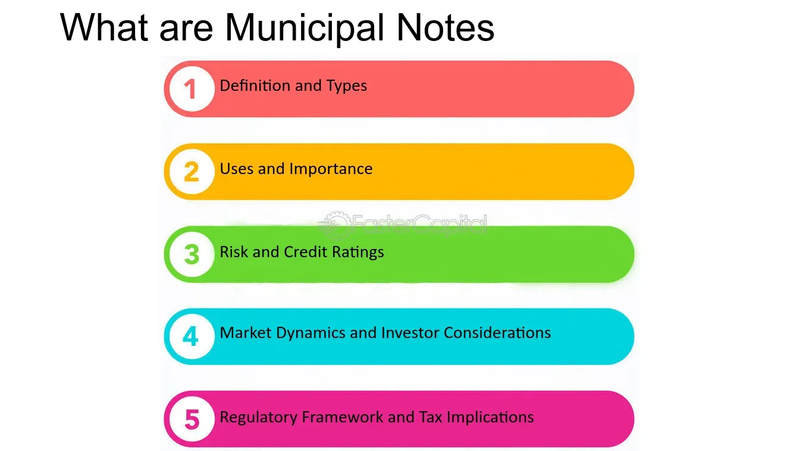

## Table of Contents

## What are municipal notes?

Municipal notes are short-term loans that cities or towns use to pay for things they need right away. They are like IOUs that the city promises to pay back soon, usually within a year. Cities might use these notes to cover costs for projects like building a new school or fixing roads before they get money from taxes or other sources.

These notes help cities manage their money better. For example, if a city needs to start a project but won't get the full funding until later, it can use municipal notes to get the money now and pay it back when the funding comes in. People who buy these notes are lending money to the city and will get their money back with a little extra as interest.

## How do municipal notes differ from municipal bonds?

Municipal notes and municipal bonds are both ways for cities to borrow money, but they have some key differences. The main difference is how long they last. Municipal notes are short-term loans that cities pay back within a year. They are like quick loans that help cities cover costs for projects until they get more money. On the other hand, municipal bonds are long-term loans that can last for many years, sometimes even decades. Cities use bonds for big projects that take a long time to finish, like building a new hospital or a bridge.

Another difference is how they are used. Municipal notes are often used to manage cash flow. For example, if a city needs to start a project but won't get tax money until later, it can use notes to get the money now. Municipal bonds, however, are used for bigger, long-term projects. When people buy bonds, they are lending money to the city for a longer time and usually get a bit more interest because of the longer wait. So, notes are for quick, short-term needs, while bonds are for big, long-term plans.

## What are the common uses of municipal notes?

Municipal notes are often used by cities to help them manage their money better. They are like short-term loans that the city can use when it needs money right away but won't get its tax money until later. For example, if a city needs to start fixing roads or building a new school, it can use municipal notes to get the money now and pay it back when it gets the tax money.

Another common use for municipal notes is to cover unexpected costs. Sometimes, things happen that the city didn't plan for, like a big storm that damages public buildings. Municipal notes can help the city pay for the repairs quickly, without waiting for the next round of tax money. This way, the city can keep things running smoothly and fix problems fast.

## What are the different types of municipal notes?

Municipal notes come in different types, and one common type is called a Tax Anticipation Note (TAN). Cities use TANs when they need money right away but know they will get tax money later. For example, if a city needs to start a project in January but won't get tax money until April, it can use a TAN to get the money now and pay it back when the taxes come in. This helps the city keep its projects going without waiting.

Another type is a Revenue Anticipation Note (RAN). Cities use RANs when they are waiting for money from other sources, like fees or grants. If a city is expecting money from a state grant but needs to start a project now, it can use a RAN to borrow the money and pay it back when the grant money arrives. This helps the city manage its money better and start important projects on time.

A third type is a Bond Anticipation Note (BAN). Cities use BANs when they plan to issue long-term bonds but need money right away. For example, if a city wants to build a new library and plans to use bonds to pay for it, but the bonds won't be ready for a few months, it can use a BAN to get the money now. The city will then pay back the BAN with the money from the bonds once they are issued. This helps the city start big projects without delay.

## How are municipal notes rated?

Municipal notes are rated by special companies called credit rating agencies. These agencies look at how likely the city is to pay back the money it borrows. They give the notes a grade, like a school report card, to show how safe the investment is. The grades can be AAA, AA, A, BBB, and so on. A high grade, like AAA, means the city is very likely to pay back the money, so the notes are seen as safe. A lower grade means there is more risk, and people might not want to buy the notes.

The agencies look at many things when they rate municipal notes. They check the city's past record of paying back loans, how much money the city makes from taxes, and how well the city manages its money. They also look at the city's overall economy and any big projects that might affect its ability to pay back the notes. All these things help the agencies decide what grade to give the notes.

## What are the risks associated with investing in municipal notes?

Investing in municipal notes can be a bit risky. One risk is that the city might not be able to pay back the money it borrowed. This can happen if the city's economy gets worse or if it doesn't collect enough tax money. If the city can't pay back the notes, investors might lose their money. Another risk is that the interest rates might go up after you buy the notes. If that happens, new notes might offer higher interest, making the ones you bought less valuable.

Another thing to think about is the credit rating of the notes. If the rating goes down, the value of the notes can drop too. This means you might not be able to sell them for as much as you paid. Also, some municipal notes might be hard to sell quickly because not many people want to buy them. This can be a problem if you need your money back fast. So, it's important to think about these risks before you decide to invest in municipal notes.

## How can one invest in municipal notes?

To invest in municipal notes, you can start by looking at what your city or other cities are offering. You can find this information on the city's website or through a financial advisor. Sometimes, you can buy municipal notes directly from the city. Other times, you might need to go through a broker or a bank that sells these notes. It's a good idea to check the credit rating of the notes before you buy them. This tells you how safe the investment is.

Once you decide to invest, you'll need to have enough money to buy the notes. You can usually buy them in different amounts, depending on what the city offers. After you buy the notes, you'll get your money back with some extra interest when the notes mature, which is usually within a year. Keep in mind that while municipal notes can be a good way to earn some interest, they also come with risks, so it's important to think carefully before you invest.

## What is the typical maturity period for municipal notes?

Municipal notes usually have a short maturity period. This means they are paid back quickly, often within a year. Cities use these notes to get money fast for things they need right away, like fixing roads or starting a new school project.

The short maturity period helps cities manage their money better. They can borrow money now and pay it back when they get their tax money or other funds later. This way, they don't have to wait to start important projects.

## How do tax implications affect the returns on municipal notes?

When you invest in municipal notes, the interest you earn can be tax-free. This means you don't have to pay federal taxes on the interest, and sometimes you don't have to pay state taxes either, depending on where you live and where the notes come from. This can make the returns on municipal notes better than other investments because you get to keep more of the money you earn.

The tax-free interest can make municipal notes a good choice for people in higher tax brackets. Even if the [interest rate](/wiki/interest-rate-trading-strategies) on the notes is lower than other investments, the tax savings can make up for it. This way, you can end up with more money in your pocket at the end of the year, even though the interest rate might look smaller at first.

## What role do municipal notes play in local government financing?

Municipal notes are like short-term loans that help cities pay for things they need right away. They are important because they let cities start projects without waiting for tax money or other funds to come in. For example, if a city needs to fix roads or build a new school, it can use municipal notes to get the money now and pay it back later. This helps cities keep their projects going smoothly and manage their money better.

Cities use different types of municipal notes for different needs. Tax Anticipation Notes (TANs) help when a city is waiting for tax money, Revenue Anticipation Notes (RANs) are used when waiting for other money like fees or grants, and Bond Anticipation Notes (BANs) are used when a city plans to issue long-term bonds but needs money right away. By using these notes, cities can cover unexpected costs or start big projects without delay, making sure they can serve their communities well.

## How do interest rates impact the pricing of municipal notes?

Interest rates play a big role in how much municipal notes cost. When interest rates go up, new municipal notes have to offer higher interest to attract investors. This makes the old notes, which have lower interest rates, less valuable. People might not want to buy them because they can get better deals on new notes. So, if you want to sell your old notes, you might have to lower the price to make them more appealing.

On the other hand, when interest rates go down, new municipal notes don't need to offer as much interest. This makes the old notes, which have higher interest rates, more valuable. People might want to buy them because they can earn more interest than what new notes are offering. So, if you want to sell your old notes, you might be able to get a higher price for them. This is how interest rates can change the value of municipal notes.

## What are some advanced strategies for trading municipal notes?

Trading municipal notes can be tricky, but some smart strategies can help. One way is to look at the credit ratings of the notes. If you think a city's economy will get better, you might buy notes with lower ratings now and sell them later when the ratings go up. This can make you more money because the notes will be worth more. Another strategy is to pay attention to interest rates. If you think interest rates will go down, you might buy notes now and sell them later when they are worth more because new notes will have lower interest rates.

Another good strategy is to use a ladder approach. This means buying notes that mature at different times. For example, you could buy some notes that mature in three months, some in six months, and some in nine months. This way, you always have money coming back to you, and you can use it to buy new notes or other investments. It helps you manage your money better and take advantage of changes in interest rates or credit ratings.

## References & Further Reading

[1]: Fabozzi, F.J. (2007). ["Bond Markets, Analysis, and Strategies"](https://books.google.com/books/about/Bond_Markets_Analysis_and_Strategies_ten.html?id=bQpNEAAAQBAJ) (7th Edition). Pearson.

[2]: Bodie, Z., Kane, A., & Marcus, A.J. (2014). ["Investments"](https://books.google.com/books/about/EBOOK_Investments_Global_edition.html?id=BMsvEAAAQBAJ) (10th Edition). McGraw-Hill Education.

[3]: Lopez de Prado, M. (2018). ["Advances in Financial Machine Learning"](https://www.amazon.com/Advances-Financial-Machine-Learning-Marcos/dp/1119482089). Wiley.

[4]: Griffin, J.M., & Mahajan, R. (2017). ["Is the Quality of Municipal Bond Ratings Improving with Time?"](https://scholar.google.com/citations?user=NlHVjwIAAAAJ&hl=en) (SSRN Working Paper).

[5]: IRS. ["Tax Information for Bondholders"](https://www.irs.gov/tax-exempt-bonds/bond-holders), Internal Revenue Service.

[6]: Pandit, R., & Jiang, J.C. (2019). ["The Impact of Algorithmic Trading on Liquidity Commonality in U.S. Corporate Bond ETFs"](https://www.researchgate.net/publication/378548435_Algorithmic_Trading_and_AI_A_Review_of_Strategies_and_Market_Impact). Journal of Financial Markets. 

[7]: Harris, L. (2003). ["Trading and Exchanges: Market Microstructure for Practitioners"](https://academic.oup.com/book/52292). Oxford University Press.