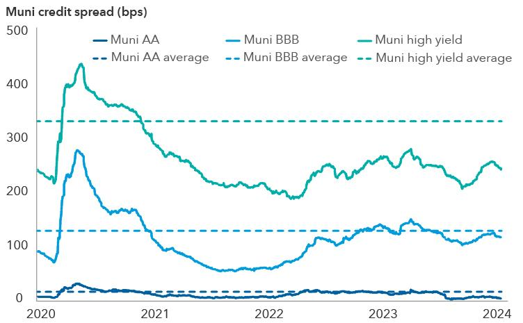

## Table of Contents

## What is the definition of a Municipals-Over-Bonds Spread?

A Municipals-Over-Bonds Spread is a way to compare the interest rates of two types of bonds: municipal bonds and Treasury bonds. Municipal bonds are loans that people give to local governments, like cities or states, to help pay for things like schools or roads. Treasury bonds are loans to the federal government. The spread is the difference between the interest rate on municipal bonds and the interest rate on Treasury bonds.

This spread is important because it helps investors see if municipal bonds are a good deal compared to Treasury bonds. If the spread is high, it means that municipal bonds are paying more interest than Treasury bonds, which might make them more attractive to investors. If the spread is low, it means that Treasury bonds might be a better choice because they are paying almost as much interest but are considered safer.

## How is the Municipals-Over-Bonds Spread calculated?

The Municipals-Over-Bonds Spread is calculated by finding the difference between the yield of a municipal bond and the yield of a Treasury bond. The yield is just another word for the interest rate that the bond pays. To do this, you need to pick two bonds that are similar in how long they last before they pay back the money you loaned. For example, if you are looking at a municipal bond that lasts 10 years, you would compare it to a 10-year Treasury bond.

Once you have chosen the two bonds, you subtract the yield of the Treasury bond from the yield of the municipal bond. If the municipal bond's yield is 3% and the Treasury bond's yield is 2%, the spread would be 1%. This number tells you how much extra interest you get from the municipal bond compared to the Treasury bond. It helps investors decide if the extra interest from the municipal bond is worth the risk, since municipal bonds can be riskier than Treasury bonds.

## Why is the Municipals-Over-Bonds Spread important for investors?

The Municipals-Over-Bonds Spread is important for investors because it helps them see if municipal bonds are a good deal compared to Treasury bonds. By looking at the spread, investors can figure out if the extra interest they might get from a municipal bond is worth the risk. Municipal bonds can be riskier than Treasury bonds because they depend on the financial health of local governments, which can change. If the spread is high, it means that municipal bonds are paying more interest than Treasury bonds, which might make them more attractive to investors looking for higher returns.

On the other hand, if the spread is low, it means that Treasury bonds might be a better choice because they are paying almost as much interest but are considered safer. This is important for investors who want to keep their money safe and are willing to accept lower returns. By understanding the spread, investors can make smarter choices about where to put their money, balancing the potential for higher returns against the risk of losing their investment.

## What factors influence the Municipals-Over-Bonds Spread?

Several factors can change the Municipals-Over-Bonds Spread. One big factor is the overall health of the economy. When the economy is doing well, investors might feel more confident and be willing to take on riskier investments like municipal bonds, which can make the spread smaller. But if the economy is struggling, investors might want safer investments like Treasury bonds, which can make the spread larger. Another factor is the financial health of local governments. If a city or state is having money problems, the risk of their bonds goes up, which can increase the spread.

Tax laws also play a big role in the spread. Interest from municipal bonds is usually not taxed by the federal government, which can make them more attractive to investors, especially those in higher tax brackets. This tax advantage can make the spread smaller because investors are willing to accept lower yields from municipal bonds. On the other hand, if there are changes in tax laws that make Treasury bonds more appealing, the spread might get bigger. So, the spread is influenced by a mix of economic conditions, the financial health of local governments, and tax policies.

## How does the tax status of municipal bonds affect the spread?

The tax status of municipal bonds can make them more attractive to investors, which affects the Municipals-Over-Bonds Spread. Interest earned from municipal bonds is usually not taxed by the federal government, and sometimes not by state or local governments either. This means that investors get to keep more of the interest they earn, which can make municipal bonds a better deal even if they have lower yields than Treasury bonds. Because of this tax advantage, investors might be willing to accept a lower yield from municipal bonds, which makes the spread smaller.

If tax laws change, it can also change the spread. For example, if the government makes changes that make Treasury bonds more appealing, like reducing taxes on their interest, investors might move their money to Treasury bonds. This could make the spread bigger because investors would need a higher yield from municipal bonds to make up for losing the tax benefits. So, the tax status of municipal bonds is a big factor in deciding how the spread changes over time.

## Can you explain the historical trends of the Municipals-Over-Bonds Spread?

Over the years, the Municipals-Over-Bonds Spread has gone up and down depending on what's happening with the economy and tax laws. During times when the economy is strong, investors might feel safe and want to invest in riskier things like municipal bonds. This can make the spread smaller because people are willing to accept lower yields from municipal bonds. On the other hand, when the economy is weak, people might want to play it safe with Treasury bonds, which can make the spread bigger. For example, during the 2008 financial crisis, the spread got much bigger as investors rushed to the safety of Treasury bonds.

Tax laws have also had a big impact on the spread over time. When tax rates are high, the tax-free interest from municipal bonds becomes more attractive, which can make the spread smaller. For instance, in the 1980s, tax rates were high, and this made municipal bonds very popular, pushing down the spread. But if tax laws change to make Treasury bonds more appealing, like during the Tax Cuts and Jobs Act of 2017, the spread might get bigger. So, the spread has changed a lot over the years because of the economy and tax laws.

## What are the risks associated with investing based on the Municipals-Over-Bonds Spread?

Investing based on the Municipals-Over-Bonds Spread can be risky because it depends on the financial health of local governments. If a city or state runs into money trouble, they might have a hard time paying back the money they borrowed through municipal bonds. This makes these bonds riskier than Treasury bonds, which are backed by the whole country's government. So, if you see a big spread and decide to invest in municipal bonds hoping for a high return, you could lose money if the local government can't pay you back.

Another risk is that the spread can change because of things like the economy or tax laws. If the economy suddenly gets worse, people might want to move their money to safer Treasury bonds, making the spread bigger. Or if tax laws change and make Treasury bonds more attractive, the spread could also get bigger. This means that even if you think you're getting a good deal based on the current spread, it could change quickly and affect how much money you make or lose. So, it's important to keep an eye on these factors and be ready for changes.

## How do changes in interest rates impact the Municipals-Over-Bonds Spread?

Changes in interest rates can have a big impact on the Municipals-Over-Bonds Spread. When interest rates go up, new bonds start to pay more interest. This can make older bonds, which pay less interest, less attractive to investors. If interest rates rise, the yield on Treasury bonds might go up faster than the yield on municipal bonds. This could make the spread bigger because investors would need a higher yield from municipal bonds to make up for the higher interest rates they could get from Treasury bonds.

On the other hand, when interest rates go down, new bonds pay less interest. This can make older bonds, which pay more interest, more attractive. If interest rates fall, the yield on Treasury bonds might go down faster than the yield on municipal bonds. This could make the spread smaller because investors might be happy with the lower yields from municipal bonds, especially since they are not taxed. So, changes in interest rates can make the spread bigger or smaller, depending on how fast the yields on Treasury bonds and municipal bonds change.

## What role does credit quality play in the Municipals-Over-Bonds Spread?

Credit quality is how safe or risky a bond is based on the chance that the borrower will pay back the money. For municipal bonds, credit quality depends on how well the city or state is doing financially. If a local government is doing well and can easily pay back its loans, its bonds are seen as safer and have a higher credit quality. But if the local government is struggling and might have trouble paying back its loans, its bonds are seen as riskier and have a lower credit quality. This difference in credit quality can change the Municipals-Over-Bonds Spread because investors want more interest from riskier bonds to make up for the chance they might lose their money.

If a municipal bond has a lower credit quality, investors will want a higher yield to take on the extra risk. This means the spread between the municipal bond and a Treasury bond, which is seen as very safe, will be bigger. On the other hand, if a municipal bond has a high credit quality and is seen as almost as safe as a Treasury bond, investors might be happy with a lower yield. This makes the spread smaller because the municipal bond is not much riskier than the Treasury bond. So, the credit quality of municipal bonds is a big factor in deciding how big the spread is.

## How can investors use the Municipals-Over-Bonds Spread to make investment decisions?

Investors can use the Municipals-Over-Bonds Spread to decide if they should put their money into municipal bonds or Treasury bonds. By looking at the spread, they can see how much more interest they might get from municipal bonds compared to Treasury bonds. If the spread is big, it means municipal bonds are paying a lot more interest. This might be a good time for investors who want higher returns and are okay with taking more risk, because municipal bonds can be riskier than Treasury bonds. But if the spread is small, it might be better to stick with Treasury bonds, which are safer and don't pay much less interest.

It's also important for investors to think about other things that can change the spread, like the economy, tax laws, and how safe the municipal bonds are. If the economy is doing well, the spread might get smaller because people feel safe investing in riskier bonds. But if the economy is struggling, the spread could get bigger as people move their money to safer Treasury bonds. Also, if tax laws change and make Treasury bonds more appealing, the spread might grow. By keeping an eye on these factors, investors can make smarter choices about where to put their money, balancing the chance of higher returns against the risk of losing their investment.

## What advanced strategies can be employed to take advantage of the Municipals-Over-Bonds Spread?

Investors can use a strategy called "relative value trading" to take advantage of the Municipals-Over-Bonds Spread. This means they look at the spread to find times when municipal bonds are paying a lot more interest than Treasury bonds. If the spread is big, they might buy municipal bonds and sell Treasury bonds, hoping to make money from the difference in interest rates. They can also use this strategy in reverse. If they think the spread will get smaller, they might sell municipal bonds and buy Treasury bonds. This strategy needs a lot of research and watching the market closely to know when to buy and sell.

Another advanced strategy is "duration matching." This means investors pick municipal bonds and Treasury bonds that last the same amount of time before they pay back the money. By doing this, they can see the real difference in interest rates without worrying about how long the bonds last. If the spread is big and they think it will stay that way, they might keep their money in municipal bonds for a long time. But if they think the spread will change soon, they might only keep their money in municipal bonds for a short time. This strategy helps them make the most of the spread while also managing the risk of interest rate changes.

## How does the Municipals-Over-Bonds Spread compare to other yield spreads in the fixed income market?

The Municipals-Over-Bonds Spread is just one of many yield spreads that investors look at in the fixed income market. Another common spread is the "credit spread," which is the difference between the interest rates of corporate bonds and Treasury bonds. Corporate bonds are loans to companies, and they can be riskier than Treasury bonds. If the credit spread is big, it means corporate bonds are paying a lot more interest than Treasury bonds. This might make them more attractive to investors who want higher returns and are okay with taking more risk. But if the credit spread is small, it might be better to stick with Treasury bonds, which are safer.

Another spread that investors pay attention to is the "swap spread," which is the difference between the interest rates of Treasury bonds and interest rate swaps. Interest rate swaps are agreements between two parties to exchange interest payments. If the swap spread is big, it can mean that investors are worried about the economy and want to protect themselves from interest rate changes. If the swap spread is small, it might mean that investors feel safe and don't need as much protection. Both the Municipals-Over-Bonds Spread and these other spreads help investors make decisions about where to put their money, but they each tell a different story about risk and return in the market.

## What is the understanding of Municipal Bonds and MOB Spread?

Municipal bonds, often referred to as "munis," are debt instruments issued by state, local governments, or their agencies primarily to finance public projects such as roads, schools, and infrastructure developments. Unlike other types of bonds, munis offer a distinct tax advantage: the interest income earned from most municipal bonds is exempt from federal income taxes and, in some cases, state and local taxes. This tax-exempt status makes them particularly attractive to investors in higher tax brackets, seeking tax-efficient income generation.

The Municipal-Over-Bond (MOB) spread is a significant concept in the municipal bond market. It represents the yield differential between municipal bonds and U.S. Treasury securities with similar maturities. This spread is a valuable metric for traders and investors as it captures the relative value and risk premium of municipal bonds compared to risk-free Treasuries. Given that Treasury bonds are backed by the full faith and credit of the U.S. government, they are considered the benchmark for credit risk assessment.

Mathematically, the MOB spread can be expressed as:

$$
\text{MOB Spread} = \text{Yield of Municipal Bond} - \text{Yield of Treasury Bond}
$$

Several factors influence the MOB spread. A key [factor](/wiki/factor-investing) is the prevailing [interest rate](/wiki/interest-rate-trading-strategies) environment. For example, in a rising interest rate scenario, the yields on newly issued Treasuries might increase more rapidly than municipal bond yields, affecting the spread. Additionally, the tax-exempt status of municipal bonds plays a critical role; fluctuations in investors' tax brackets or changes in tax legislation can impact the spread's attractiveness.

Analyzing the MOB spread provides investors with insights into potential tax strategies. Investors may find [arbitrage](/wiki/arbitrage) opportunities if the MOB spread deviates significantly from historical norms or average levels, suggesting mispricing between the two types of securities. For instance, if the spread widens, it might indicate that municipal bonds are undervalued relative to Treasuries, presenting a buying opportunity for traders seeking to capitalize on the potential reversion to historical spread levels.

Understanding the implications of the MOB spread is crucial for constructing effective trading strategies in the municipal bond market. By monitoring and analyzing changes in the spread, traders can make informed decisions about buying or selling municipal bonds in response to movements in interest rates and tax policy changes, thereby optimizing their portfolios for better yield and risk-adjusted returns.

## References & Further Reading

[1]: Gao, Peiqian, & Li, Zheng. (2013). ["Algorithmic Trading and Liquidity: Long-lasting Relationships in the U.S. Treasury Market"](https://www.researchgate.net/publication/378548435_Algorithmic_Trading_and_AI_A_Review_of_Strategies_and_Market_Impact). Journal of Financial Economics.

[2]: Chordia, Tarun, Roll, Richard, & Subrahmanyam, Avanidhar. (2011). ["Recent Trends in Trading Activity and Market Quality"](https://www.sciencedirect.com/science/article/pii/S0304405X11000730). Journal of Finance.

[3]: López de Prado, Marcos. ["Advances in Financial Machine Learning"](https://www.amazon.com/Advances-Financial-Machine-Learning-Marcos/dp/1119482089).

[4]: Chakravarty, Sugato, & Sarkar, Asani. (2003). ["Trading Costs in Three U.S. Bond Markets"](https://www.researchgate.net/publication/247906476_Trading_Costs_in_Three_US_Bond_Markets). Journal of Fixed Income.

[5]: O'Hara, Maureen. (2015). ["High Frequency Market Microstructure"](https://www.sciencedirect.com/science/article/pii/S0304405X15000045). Journal of Financial Economics.