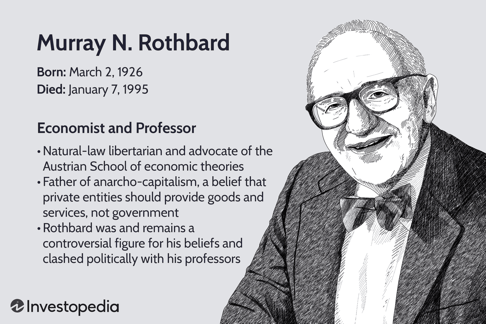

## Table of Contents

## Who was Murray Rothbard?

Murray Rothbard was an American economist and writer who lived from 1926 to 1995. He is famous for starting a type of economics called Austrian economics. He also helped start a political idea called anarcho-capitalism. This idea says that people should be free to do what they want without a government telling them what to do.

Rothbard wrote many books and articles about economics, history, and politics. He thought that governments often do more harm than good. He believed that people should be able to solve their own problems without government help. His ideas have influenced many people who want less government control and more freedom for individuals.

## What are the basic principles of Rothbard's economic theories?

Murray Rothbard's economic theories are based on the idea that free markets work best when they are not controlled by the government. He believed that people should be free to make their own choices about what to buy, sell, and trade. According to Rothbard, when the government gets involved, it often creates problems like inflation and unemployment. He thought that the best way to have a strong economy is to let people trade freely without any interference.

Another key part of Rothbard's theories is his belief in the importance of private property. He argued that people should have the right to own things and use them as they see fit. This, he believed, would lead to a more prosperous society because people would take better care of their own property and work harder to improve it. Rothbard also opposed taxes and believed that they were a form of theft because the government was taking money that rightfully belonged to individuals.

## How did Rothbard view the role of education in society?

Murray Rothbard believed that education should be free from government control. He thought that schools run by the government often teach what the government wants people to believe, not what is best for the students. Rothbard wanted education to be handled by private groups and families. He believed that if schools had to compete for students, they would offer better education because they would need to attract students and their families.

Rothbard also thought that education should focus on teaching people how to think for themselves. He believed that schools should help students learn about the world and how to solve problems on their own. He was against the idea of schools teaching students to follow rules without questioning them. Instead, he wanted education to encourage creativity and independent thinking.

## What was Rothbard's stance on public versus private education?

Murray Rothbard thought that private education was better than public education. He believed that when schools are run by the government, they often teach what the government wants, not what's best for students. Rothbard wanted schools to be run by private groups and families. He thought that if schools had to compete for students, they would try harder to be good and offer better education.

Rothbard also believed that education should help students think for themselves. He didn't like the idea of schools just teaching students to follow rules without questioning them. Instead, he wanted education to encourage creativity and independent thinking. He thought that private schools would be better at doing this because they would need to attract students and their families by offering a good education.

## Can you explain Rothbard's concept of 'free market education'?

Murray Rothbard's idea of 'free market education' means that schools should not be run by the government. Instead, they should be run by private groups and families. He thought that if schools had to compete for students, they would try to be the best they could be. This competition would make schools offer better education because they would need to attract students and their families.

Rothbard believed that education should help students think for themselves. He didn't like the idea of schools just teaching students to follow rules without questioning them. He wanted schools to encourage creativity and independent thinking. He thought that private schools would be better at this because they would need to offer a good education to attract students.

## How did Rothbard critique government intervention in education?

Murray Rothbard thought that when the government runs schools, it often teaches what the government wants, not what's best for students. He believed that government schools don't encourage students to think for themselves. Instead, they teach students to follow rules without questioning them. Rothbard didn't like this because he thought it limited students' creativity and independent thinking.

Rothbard wanted education to be handled by private groups and families. He believed that if schools had to compete for students, they would try harder to offer a good education. This competition would make schools better because they would need to attract students and their families. He thought that private schools would be more likely to encourage students to think for themselves and be creative.

## What are some of Rothbard's key writings on education and economics?

Murray Rothbard wrote a lot about education and economics. One of his important [books](/wiki/algo-trading-books) on education is called "Education: Free and Compulsory." In this book, he talks about how government schools often teach what the government wants, not what's best for students. He believes that schools should be run by private groups and families. Rothbard thinks that if schools have to compete for students, they will try harder to be good and offer better education. He also wants schools to help students think for themselves and be creative.

Rothbard's writings on economics are also very important. One of his key books is "Man, Economy, and State." In this book, he explains his ideas about how the economy works best when the government doesn't get in the way. He believes that people should be free to make their own choices about what to buy, sell, and trade. Rothbard also wrote "The Ethics of Liberty," where he talks about how private property is important and how taxes are like stealing. He thinks that if people can own things and use them as they want, it will make society better and more prosperous.

## How did Rothbard's views on education align with his broader economic philosophy?

Murray Rothbard believed that education should be free from government control, just like he thought the economy should be. He wanted schools to be run by private groups and families, not the government. Rothbard thought that if schools had to compete for students, they would try harder to offer a good education. He believed that this competition would make schools better because they would need to attract students and their families. He also wanted schools to help students think for themselves and be creative, instead of just following rules without questioning them.

Rothbard's views on education fit well with his economic ideas. He thought that the economy works best when people are free to make their own choices about what to buy, sell, and trade, without the government getting in the way. He believed that private property was important and that taxes were like stealing because the government was taking money that belonged to individuals. Just like he wanted the economy to be free from government control, he wanted education to be free too. He thought that both education and the economy would be better if people could make their own choices without the government telling them what to do.

## What impact did Rothbard believe economic freedom had on educational quality?

Murray Rothbard believed that economic freedom would make education better. He thought that if schools had to compete for students, they would try harder to offer a good education. This competition would make schools better because they would need to attract students and their families. Rothbard wanted schools to be run by private groups and families, not the government. He believed that when schools are free from government control, they can focus on what's best for students, not what the government wants.

Rothbard also thought that economic freedom would help students learn to think for themselves. He didn't like the idea of schools just teaching students to follow rules without questioning them. He wanted schools to encourage creativity and independent thinking. Rothbard believed that if people were free to make their own choices in the economy, they would also be free to choose the best education for themselves and their children. This freedom, he thought, would lead to better schools and a better education for everyone.

## How did Rothbard address the issue of educational funding in a free market system?

Murray Rothbard believed that schools should be funded by private groups and families, not the government. He thought that if schools had to compete for students, they would try harder to be good and offer better education. This competition would make schools better because they would need to attract students and their families. Rothbard didn't like the idea of the government taking money from people through taxes to pay for schools. He thought that taxes were like stealing because the government was taking money that belonged to individuals.

Rothbard wanted families to pay for education directly or through private organizations. He believed that if families had to pay for schools, they would choose the best schools for their children. This would make schools work harder to be good because they would need to attract students. Rothbard thought that this system would help students get a better education because schools would focus on what's best for students, not what the government wants.

## What criticisms have been leveled against Rothbard's educational and economic theories?

Some people don't agree with Murray Rothbard's ideas about education and the economy. They think that his idea of schools being run by private groups and families might not work well. They say that not all families can afford to pay for private schools. This could mean that some kids might not get a good education. Critics also worry that if schools have to compete for students, they might focus more on making money than on teaching students well. They think that the government should help make sure all kids can go to school and get a good education.

Critics also disagree with Rothbard's economic ideas. They think that the government needs to be involved in the economy to help people who can't help themselves. They believe that without government help, some people might not have enough money to live on. They also think that Rothbard's ideas about private property and taxes are too extreme. They say that taxes are needed to pay for important things like roads and hospitals. Critics argue that Rothbard's focus on complete economic freedom might not be fair to everyone and could lead to more problems than it solves.

## How have Rothbard's ideas on education and economics influenced contemporary libertarian thought?

Murray Rothbard's ideas on education and economics have had a big impact on libertarian thought today. Libertarians who follow Rothbard believe that schools should be run by private groups and families, not the government. They think that if schools have to compete for students, they will try harder to be good and offer better education. This fits with Rothbard's idea that people should be free to make their own choices without the government telling them what to do. Many libertarians also agree with Rothbard that education should help students think for themselves and be creative, instead of just following rules.

In economics, Rothbard's ideas have also influenced libertarians. They believe, like Rothbard, that the economy works best when the government doesn't get in the way. Libertarians think that people should be free to buy, sell, and trade without government control. They also agree with Rothbard that private property is important and that taxes are like stealing because the government takes money that belongs to individuals. Rothbard's focus on economic freedom and his ideas about how the economy should work have become important parts of libertarian thinking today.

## References & Further Reading

[1]: Rothbard, M. N. (2006). ["Education: Free and Compulsory"](https://cdn.mises.org/Education%20Free%20and%20Compulsory_3.pdf) Ludwig von Mises Institute.

[2]: Rothbard, M. N. (2006). ["Man, Economy, and State with Power and Market"](https://mises.org/library/book/man-economy-and-state-power-and-market) Ludwig von Mises Institute.

[3]: Huerta de Soto, J. (2010). ["The Austrian School: Market Order and Entrepreneurial Creativity"](https://iea.org.uk/publications/co-published-books/the-austrian-school-market-order-and-entrepreneurial-creativity) Edward Elgar Publishing.

[4]: Lopez de Prado, M. (2018). ["Advances in Financial Machine Learning"](https://www.amazon.com/Advances-Financial-Machine-Learning-Marcos/dp/1119482089) John Wiley & Sons.

[5]: Chan, E. P. (2009). ["Quantitative Trading: How to Build Your Own Algorithmic Trading Business"](https://github.com/ftvision/quant_trading_echan_book) John Wiley & Sons.

[6]: Jansen, S. (2020). ["Machine Learning for Algorithmic Trading"](https://github.com/stefan-jansen/machine-learning-for-trading) Packt Publishing.

[7]: Menger, C. (2007). ["Principles of Economics"](https://cdn.mises.org/principles_of_economics.pdf) Ludwig von Mises Institute.