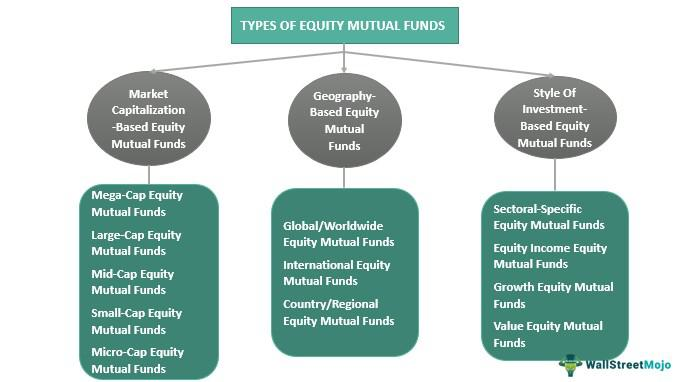

The modern financial landscape is characterized by rapid change driven by new technologies and investment strategies, reshaping how wealth is managed. At the heart of this transformation are mutual funds, which pool resources from investors to diversify investments across various securities, financial planning, which provides personalized strategies for asset management, and algorithmic trading, a technology-driven approach to executing trades.

Mutual funds have long been a staple in wealth management, offering investors a way to diversify risk and access professional management. They allow individual investors an opportunity to participate in a broader range of investments than they could access independently. However, mutual funds are undergoing change as they integrate with innovative technologies such as algorithmic trading. This integration is more than just a technological advancement; it signals a shift in how investment strategies can be optimized for better returns and reduced risk.



Algorithmic trading, characterized by high-speed, automated trade executions, eliminates human errors and biases, thereby enhancing the discipline in trading activities. It offers substantial potential to amplify the benefits of traditional mutual funds by leveraging real-time data analysis and sophisticated predictive analytics. By combining these technologies with mutual fund advisory services, investors can potentially enhance their portfolio performance, ensuring strategies are both efficient and aligned with personal financial goals.

This article examines how these financial instruments, when used together, can lead to a more dynamic investment strategy. It will cover their benefits, the strategies that can be employed, and the challenges posed by such integration. By exploring these aspects, we can understand how financial innovation can significantly boost portfolio performance, adapting to an ever-evolving financial environment. As our journey begins, we first explore the fundamentals of mutual funds to provide context for this transformative integration.

## Table of Contents

## Understanding Mutual Funds

Mutual funds are collective investment schemes that pool financial resources from multiple investors to purchase a diversified portfolio of securities, including stocks, bonds, and other assets. By doing so, mutual funds provide an accessible platform for individuals to invest in a professionally managed portfolio without the need to directly purchase and manage individual securities themselves.

One of the primary advantages of mutual funds is their ability to offer diversification and professional oversight. Diversification is achieved by spreading investments across a wide range of asset classes, industries, and geographical regions, thereby mitigating the specific risks associated with any single investment. This diversification is mathematically beneficial, as it tends to reduce the variance of the portfolio returns, in accordance with the principles of modern portfolio theory ([Markowitz, H. M.](https://www.jstor.org/stable/2975974), "Portfolio Selection", 1952).

Professional management is another critical feature of mutual funds. Expert fund managers actively monitor market conditions and make strategic decisions to adjust the portfolio to achieve the fund's investment objectives, taking into consideration both macroeconomic trends and individual security performance.

However, the benefits of diversification and professional management come at a cost. Mutual funds charge expense ratios, which cover the management fees and operational costs associated with running the fund. These fees can significantly impact an investor's returns over time, making the selection of funds with competitive expense ratios crucial. For example, if a mutual fund has a return of 8% with an expense ratio of 1.5%, the net return to the investor would be 6.5%.

Mutual funds also cater to a variety of risk appetites and financial goals by offering different types of funds. These include equity funds, which focus on stocks and are typically suited for growth-oriented investors; bond funds, which prioritize income and stability; money market funds, which are low-risk and highly liquid; and balanced funds, which combine stocks and bonds to achieve a mix of income and growth goals. The selection of a mutual fund should align with the investor's risk tolerance and financial objectives to ensure that the investment strategy supports their long-term financial plan.

## The Role of Mutual Fund Advisory in Financial Planning

Mutual fund advisory services play a critical role in shaping effective financial planning by providing personalized strategies tailored to each investor's unique financial goals and risk tolerance. Typically, an advisor starts by assessing the investor's financial situation, including income, expenses, asset base, and future financial goals. This assessment informs the development of a comprehensive financial plan, which outlines the strategic allocation of assets across different investment vehicles, considering the investor's time horizon and risk appetite.

Advisors ensure that portfolios remain aligned with investor goals over time. This involves selecting a mix of mutual funds that match the investor's risk profile and desired outcomes, such as growth, income, or a balanced approach. Asset allocation is one of the most effective ways to manage risk and optimize returns, as it diversifies investments across various asset classes like equities, bonds, and other securities. A well-diversified portfolio can reduce the impact of market [volatility](/wiki/volatility-trading-strategies) on an investor’s overall return, adhering to the principle of not putting all your eggs in one basket.

During market fluctuations, advisors provide crucial guidance by interpreting market trends and economic indicators. They offer insights and recommend adjustments to the investment strategy as needed to ensure portfolios remain on track to achieve the desired financial outcomes. By leveraging professional advisors, investors benefit from expert knowledge and experience, which can enhance returns and minimize risks through informed decision-making.

Ongoing communication between the advisor and investor is a cornerstone of successful financial planning. Regular reviews and updates are necessary to address changes in the investor's life circumstances, market conditions, or financial goals. This iterative process allows for the continuous refinement of the investment strategy. Professional advisors maintain open lines of communication, ensuring that any new information or change in goals is swiftly incorporated into the financial plan.

In conclusion, mutual fund advisory services not only guide investors in constructing and maintaining optimal portfolios but also offer valuable insights and responsive adjustments to navigate the complexities of the financial markets. This personalized and dynamic approach underpins effective financial planning, ultimately leading to better financial outcomes for investors.

## Benefits of Investing in Mutual Funds

Mutual funds offer a range of benefits to investors, primarily due to their inherent design and professional management. One of the key advantages is the access to a diversified portfolio of assets. By pooling resources from multiple investors, mutual funds can invest in a wide variety of securities, such as stocks, bonds, and other asset classes. This diversification reduces the risk inherent in investing in individual securities, as poor performance by a single investment is offset by better performance in others.

Professional management is another significant benefit. Mutual funds are managed by experienced financial professionals who make informed decisions based on market research and data analysis. These managers provide expert insights that individual investors might not have the resources to obtain, thereby increasing the potential for higher returns. The decision-making process is often more disciplined and strategic, leveraging a deeper understanding of market trends and economic indicators.

Mutual funds also feature low minimum investment requirements, making them accessible to a broad spectrum of investors, including those with limited capital. This democratization of investment means that even small-scale investors can participate in markets that would otherwise be difficult to access.

Liquidity is a crucial component, as mutual funds can typically be bought or sold on any business day. This daily [liquidity](/wiki/liquidity-risk-premium) ensures that investors can access their funds without undue delay, providing flexibility and ease of transaction. Unlike certain other investment vehicles, which may have lock-in periods, mutual funds offer the advantage of easy entry and [exit](/wiki/exit-strategy).

Furthermore, mutual funds can potentially offer both capital appreciation and regular income. Capital appreciation refers to the increase in the value of the fund's assets, which can result in a higher net asset value (NAV) and thus a gain for investors. Additionally, many mutual funds distribute dividends to their investors, providing a steady stream of income. These dividends are often derived from interest earned by the fund’s holdings or from gains made by its sale of investments. 

Overall, mutual funds present a balanced investment approach, combining risk reduction through diversification, expert management, accessibility, liquidity, and the potential for income and growth. These features make them an attractive option for investors aiming for a comprehensive and manageable investment strategy.

## Algorithmic Trading: Transforming Investment Strategies

Algorithmic trading leverages advanced computer algorithms to execute trades with precision and speed, dramatically altering traditional investment strategies. This approach minimizes human errors and mitigates psychological biases, promoting a disciplined trading environment where decisions are based purely on data and predetermined criteria.

The algorithms employed in these trading systems are capable of processing vast amounts of market data in real-time, making swift decisions that would be impossible for a human trader. This enhances market liquidity and trading efficiency, as algorithms can execute buy and sell orders in fractions of a second, taking advantage of fleeting market conditions.

Several common strategies underpin [algorithmic trading](/wiki/algorithmic-trading), each focusing on different market dynamics:

1. **Trend-Following**: This strategy capitalizes on existing market trends, adhering to the principle that prices are likely to move in the same direction for a certain period. Algorithms identify and follow these trends, optimizing entry and exit points.

2. **Mean Reversion**: Mean reversion strategies are based on the assumption that prices will eventually revert to their historical average. Algorithms monitor asset prices, identifying opportunities to buy undervalued securities or sell overvalued ones, anticipating a return to the mean.

3. **Statistical Arbitrage**: This strategy involves exploiting price inefficiencies between correlated assets. Algorithms rapidly analyze price data, executing trades that capitalize on these discrepancies before the market corrects them.

Programming languages like Python and C++ are instrumental in developing these sophisticated algorithms. Python, with its extensive libraries such as NumPy for numerical computations and pandas for data manipulation, provides a robust framework for building and [backtesting](/wiki/backtesting) trading models. A simple Python snippet for a moving average crossover strategy might look like this:

```python
import numpy as np
import pandas as pd

def moving_average_crossover_strategy(prices, short_window, long_window):
    signals = pd.DataFrame(index=prices.index)
    signals['price'] = prices
    signals['short_ma'] = prices.rolling(window=short_window, min_periods=1).mean()
    signals['long_ma'] = prices.rolling(window=long_window, min_periods=1).mean()
    signals['signal'] = 0.0
    signals['signal'][short_window:] = np.where(signals['short_ma'][short_window:] > signals['long_ma'][short_window:], 1.0, 0.0)
    signals['positions'] = signals['signal'].diff()

    return signals
```

This code calculates short and long-term moving averages and generates buy and sell signals when the short-term average crosses above or below the long-term average.

As algorithmic trading becomes more ingrained in financial markets, its influence extends to mutual funds and other investment vehicles. The continued advancement of technology and algorithmic processes promises to expand the scope and effectiveness of trading strategies, ensuring that they remain a vital component of modern financial management.

## Integrating Algo Trading with Mutual Funds

Integrating algorithmic trading with mutual funds presents an opportunity to optimize portfolio performance by leveraging the precision and speed of computer algorithms in the management of mutual fund assets. By employing algorithms for real-time data analysis, fund managers can improve investment decision-making processes, adjusting strategies dynamically to respond to market conditions.

One of the primary benefits of using algorithmic trading within mutual funds is the efficient execution of trades. Automated trading systems are capable of processing large volumes of trades quickly, ensuring that transactions are completed at optimal prices. This efficiency not only minimizes transaction costs but also mitigates the risks associated with human error and delays. The ability to act rapidly on market information can be pivotal in capturing short-term opportunities.

Additionally, algorithms can dynamically adjust asset allocations by utilizing predictive analytics. This involves analyzing historical market data to predict future trends and making informed decisions about buying or selling assets in the fund's portfolio. For example, [machine learning](/wiki/machine-learning) models can be trained to recognize patterns that precede large market movements. These models can be implemented in programming languages like Python, using libraries such as NumPy and Pandas for data manipulation and TensorFlow or PyTorch for building predictive models. 

```python
import numpy as np
import pandas as pd
from sklearn.model_selection import train_test_split
from sklearn.ensemble import RandomForestRegressor

# Sample simplified code for predicting stock prices based on historical data
# Load historical market data
data = pd.read_csv('market_data.csv')

# Preprocessing
X = data[['feature1', 'feature2', 'feature3']]  # Features could be metrics like [momentum](/wiki/momentum), [volume](/wiki/volume-trading-strategy), etc.
y = data['target']  # Target is the predicted stock price

# Splitting the data
X_train, X_test, y_train, y_test = train_test_split(X, y, test_size=0.2, random_state=42)

# Training a model
model = RandomForestRegressor(n_estimators=100, random_state=42)
model.fit(X_train, y_train)

# Making predictions
predictions = model.predict(X_test)
```

The integration of algorithmic trading enhances mutual fund operations by marrying traditional investment methodologies with modern technological advances. Such integration results in a more agile investment strategy adept at capitalizing on market inefficiencies.

However, successful integration of algorithms into mutual fund management requires a sophisticated technological infrastructure and a commitment to continuous monitoring and refinement of trading algorithms. Ensuring these systems are robust and aligned with regulatory standards is critical to fully realizing the benefits of this innovative approach to investment management. By adopting these strategies, mutual funds can potentially achieve superior returns while managing inherent investment risks.

## Challenges and Considerations

Algorithmic trading requires a substantial technological infrastructure, comprising high-speed internet connections, powerful computing systems, and sophisticated software capable of processing large volumes of data swiftly and accurately. These components are critical in executing trades within milliseconds to capitalize on market opportunities.

Market volatility poses significant challenges to algorithmic trading. Algorithms must be flexible and adaptable to respond to rapid changes in market conditions. This dynamic environment necessitates frequent adjustments and refinements to trading strategies to ensure they remain effective and relevant. Algorithms might use statistical models such as GARCH (Generalized Autoregressive Conditional Heteroskedasticity) to predict volatility, but the unpredictability of market movements demands a robust approach to risk management.

Moreover, regulatory compliance is essential to avoid legal issues. Markets globally are subject to a complex web of regulations that govern trading practices. Algorithmic traders must ensure that their systems adhere to these standards, potentially requiring regular audits and updates to maintain alignment with evolving regulatory frameworks. For instance, the European Union's Markets in Financial Instruments Directive II (MiFID II) imposes strict requirements on algorithms to ensure transparency and fairness in trading activities.

Educating investors about the realities and limitations of algorithmic trading is crucial. There are common misconceptions, such as the belief that algorithms guarantee high profits without risk. Investors should understand that while algorithmic trading can enhance efficiency and decision-making precision, it is not immune to losses or operational failures. Awareness of these nuances is fundamental for informed decision-making.

Continuous monitoring and backtesting are vital to maintain algorithmic trading systems' efficacy. Regularly testing algorithms against historical data allows traders to verify their performance and identify necessary adjustments. Backtesting helps in evaluating different trading strategies under various market scenarios, enhancing the robustness of the algorithms. Here is a simple example of a backtesting setup in Python using the `pandas` and `numpy` libraries:

```python
import pandas as pd
import numpy as np

# Load historical market data
data = pd.read_csv('historical_stock_data.csv')
data['returns'] = data['Close'].pct_change()

def simple_moving_average_strategy(data, short_window, long_window):
    data['short_ma'] = data['Close'].rolling(window=short_window).mean()
    data['long_ma'] = data['Close'].rolling(window=long_window).mean()
    data['signal'] = 0
    data['signal'][short_window:] = np.where(data['short_ma'][short_window:] > data['long_ma'][short_window:], 1, 0) 
    data['positions'] = data['signal'].diff()
    return data

# Define strategy parameters
short_window = 40
long_window = 100

# Apply strategy
strategized_data = simple_moving_average_strategy(data, short_window, long_window)

# Evaluate strategy performance
strategy_returns = strategized_data['returns'] * strategized_data['positions'].shift()
cumulative_returns = (1 + strategy_returns).cumprod()

print(f"Final strategy return: {cumulative_returns.iloc[-1] - 1:.2%}")
```

This code provides a basic framework to quantify and refine algorithmic strategies by simulating their performance and optimizing parameters in response to observed outcomes. The investment strategies that leverage algorithmic trading must integrate continuous learning and infrastructure enhancements to capitalize on their potential fully.

## Conclusion

Mutual funds and algorithmic trading form a robust alliance in today’s investment strategies. This synergy enables investors to harness the strengths of both approaches, marrying the diversified risk management of mutual funds with the precision and speed of algorithmic trading. Through meticulous planning and the use of innovative tools, investors can not only improve their returns but also minimize associated risks.

In a financial landscape characterized by rapid changes and technological advancements, staying well-informed and adaptable is essential. The integration of technology with traditional financial methodologies offers a pathway to enhanced portfolio management. Algorithmic trading brings real-time data analysis and an efficient execution framework to mutual fund investments, allowing for more informed decision-making and timely adjustments. This melding of strategies ensures that portfolios are dynamically optimized to meet the changing market conditions and investor goals.

As the financial ecosystem continues to evolve, a commitment to continuous learning and adaptation is crucial. Investors and financial advisers must remain vigilant, educating themselves on the latest tools, strategies, and regulatory changes. By doing so, they can effectively navigate the complexities of modern markets, ensuring investment strategies are both innovative and robust. This dynamic adaptability not only helps in achieving higher returns but also plays a pivotal role in risk mitigation, fostering more resilient and future-proof investment portfolios.

## References & Further Reading

Statman, Meir. "Investment Strategies and Performance: The Case of Index Funds and Index-Based Investment." Financial Analysts Journal explores the performance and strategic advantages of index-based investments, highlighting their potential in passive investment strategies.

Sharpe, William F. "Capital Asset Prices: A Theory of Market Equilibrium Under Conditions of Risk." The Journal of Finance provides insights into the Capital Asset Pricing Model (CAPM), which assesses the relationship between expected return and risk in financial markets. The formula $E(R_i) - R_f = \beta_i \times (E(R_m) - R_f)$ encapsulates the expected return on an asset $(E(R_i))$, considering the risk-free rate $(R_f)$, the asset's beta $(\beta_i)$, and the market return $(E(R_m))$.

Elton, Edwin J., and Gruber, Martin J. "Modern Portfolio Theory and Investment Analysis." John Wiley & Sons offers a comprehensive overview of portfolio construction and the balance of risk versus return, focusing on the mathematical foundations of diversification as expressed through the efficient frontier.

Bergstra, J., Bardenet, R., Bengio, Y., & Kégl, B. "Algorithms for Hyper-Parameter Optimization." Advances in Neural Information Processing Systems discusses methods for optimizing hyperparameters in machine learning models, which can be applied to enhance algorithmic trading strategies. Python libraries like `scikit-learn` and frameworks such as `Optuna` can implement these optimization techniques to improve algorithmic trade executions.