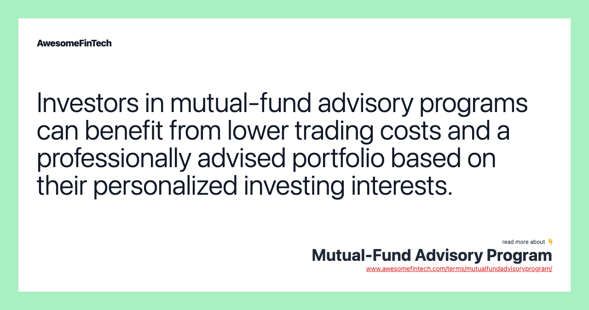

## Table of Contents

## What is a mutual fund advisory program?

A mutual fund advisory program is a service where financial experts help people choose and manage their investments in mutual funds. Mutual funds are collections of stocks, bonds, or other assets that many people invest in together. The advisors in these programs give personalized advice based on what the investor wants and can afford. They look at things like how much risk someone is willing to take and when they might need their money back.

These programs can be helpful because they take some of the guesswork out of investing. Instead of trying to pick the right mutual funds on your own, you have someone with experience guiding you. The advisor keeps an eye on the market and can make changes to your investments if needed. This can save time and potentially lead to better results, though it's important to remember that all investments carry some risk and there are usually fees for the advisory service.

## How does a mutual fund advisory program work?

A mutual fund advisory program works by connecting you with a financial advisor who helps you pick the right mutual funds to invest in. When you join the program, you'll talk to the advisor about your money goals, how much risk you're okay with, and when you might need your money back. Based on this, the advisor will suggest a mix of mutual funds that fit your needs. They'll explain why they chose these funds and how they think they'll help you reach your goals.

Once you've picked your mutual funds, the advisor keeps an eye on them for you. They watch how the funds are doing and can make changes if they think it's needed. This might mean switching to different funds if the market changes or if your goals change. You'll usually meet with your advisor every so often to talk about how things are going and make any needed adjustments. Remember, there are fees for this service, but many people find it helpful to have an expert guiding their investments.

## What are the different types of mutual fund advisory programs available?

There are a few different types of mutual fund advisory programs that you might come across. One type is called a discretionary program. In this kind of program, you let the advisor make investment choices for you without asking you every time. They'll pick and change your mutual funds based on what they think is best for your goals. Another type is a non-discretionary program. Here, the advisor will give you advice and suggestions, but you're the one who makes the final call on what to do with your money.

Some programs are also called wrap fee programs. In these, you pay one big fee that covers both the advisor's help and the costs of buying and selling the mutual funds. This can make things simpler because you know exactly what you're paying upfront. Lastly, there are robo-advisor programs, which use computer programs to pick your mutual funds. These are often cheaper than working with a human advisor, but they might not give you the personal touch and detailed advice that a human can offer.

## Who can benefit from enrolling in a mutual fund advisory program?

People who are new to investing can really benefit from a mutual fund advisory program. If you don't know much about the stock market or how to pick good mutual funds, an advisor can help you learn and make smart choices. They can explain things in a way that's easy to understand and help you avoid common mistakes that beginners might make. This can give you more confidence as you start investing your money.

Even if you have some experience with investing, a mutual fund advisory program can still be helpful. If you're busy and don't have time to keep up with the market, an advisor can do that for you. They can watch your investments and make changes when needed, so you don't have to worry about it. Plus, if your financial goals or life situation changes, the advisor can adjust your investments to match your new needs.

## What are the costs associated with mutual fund advisory programs?

The costs of a mutual fund advisory program can vary, but there are a few common types of fees you might see. One is the advisory fee, which is what you pay the advisor for their time and expertise. This fee can be a percentage of the money you have invested, often around 1% to 2% per year. Another cost is the expense ratio of the mutual funds themselves. This is a fee that the mutual fund company charges to manage the fund, and it's usually a small percentage of your investment, like 0.5% to 1% per year.

Some programs might also have other fees, like transaction fees for buying or selling funds, or account maintenance fees. If you're in a wrap fee program, you'll pay one big fee that covers both the advisor's services and the costs of managing your mutual funds. This can make things simpler because you know exactly what you're paying upfront, but it might be more expensive overall. It's important to ask about all the fees before you sign up so you know what to expect and can compare different programs to find the best one for you.

## How do mutual fund advisory programs help in achieving financial goals?

Mutual fund advisory programs help people reach their financial goals by giving them personalized advice on what mutual funds to invest in. When you join a program, you talk to an advisor about what you want to achieve with your money, how much risk you're okay with, and when you might need your money back. Based on this, the advisor picks a mix of mutual funds that fit your goals. They explain why they chose these funds and how they think they'll help you get where you want to be financially. This makes it easier for you to invest in a way that's right for you, without having to do all the research yourself.

Once you've picked your mutual funds, the advisor keeps watching them for you. They keep an eye on how the market is doing and can make changes to your investments if they think it's needed. This might mean switching to different funds if things change in the market or if your goals change. You'll meet with your advisor every so often to talk about how things are going and make any adjustments that are needed. This ongoing help can make a big difference in reaching your financial goals, because the advisor is always working to keep your investments on track.

## What should one look for when choosing a mutual fund advisory program?

When choosing a mutual fund advisory program, it's important to think about what you need and what the program offers. First, look at the advisor's experience and how well they understand the market. You want someone who knows a lot about mutual funds and can give you good advice. Also, think about what kind of program you want. Some programs let the advisor make choices for you, while others need you to make the final call. Pick the one that fits how involved you want to be with your investments.

Another thing to consider is the fees. Advisory programs can cost different amounts, so it's good to know what you'll be paying. Some have a yearly fee, while others might charge for each trade or have other costs. Make sure you understand all the fees before you sign up. Lastly, see if the program can help you reach your financial goals. Talk to the advisor about what you want to achieve and see if they have a plan that makes sense for you. A good program will give you personalized advice and help you stay on track with your goals.

## How do mutual fund advisory programs compare to self-managed investment strategies?

Mutual fund advisory programs and self-managed investment strategies are two different ways to invest your money. In a mutual fund advisory program, you work with a financial advisor who helps you pick the right mutual funds to invest in. They give you advice based on your goals, how much risk you're okay with, and when you might need your money back. The advisor keeps an eye on your investments and can make changes if needed. This can be really helpful if you're new to investing or if you don't have time to watch the market yourself. However, you'll need to pay for the advisor's services, which can add up over time.

On the other hand, with a self-managed investment strategy, you're in charge of everything. You pick the mutual funds you want to invest in and decide when to buy or sell them. This gives you more control over your money, but it also means you need to do your own research and keep up with the market. It can be more work, but you won't have to pay for an advisor's help. This approach might be better if you enjoy investing and have the time and knowledge to do it well. Both methods have their pros and cons, so it's important to think about what fits best with your needs and comfort level.

## What are the potential risks involved in mutual fund advisory programs?

There are some risks to think about when you join a mutual fund advisory program. One big risk is the fees you have to pay. You'll pay money to the advisor for their help, and also fees for the mutual funds themselves. These fees can add up and might take away from the money you earn from your investments. It's important to know all the fees before you start so you can see if it's worth it for you.

Another risk is that the advisor might not always pick the best mutual funds for you. Even though they know a lot about investing, they can still make mistakes. The market can change in ways no one expects, and the funds they choose might not do as well as hoped. Plus, if you're in a program where the advisor can make choices without asking you, you might not agree with all their decisions. It's good to talk with your advisor a lot and make sure you're both on the same page about your goals and how to reach them.

## How can one evaluate the performance of a mutual fund advisory program?

To evaluate the performance of a mutual fund advisory program, you need to look at how well your investments are doing over time. Start by checking the returns of the mutual funds the advisor picked for you. Compare these returns to what you hoped to achieve and to how the overall market is doing. If your funds are doing better than the market, that's a good sign. Also, think about how much risk you took to get those returns. If you took a lot of risk and didn't get much reward, the program might not be working well for you.

Another way to evaluate the program is by looking at how the advisor is helping you reach your financial goals. Are they making changes to your investments when needed? Do they explain things clearly and keep you in the loop? It's also important to think about the fees you're paying. If the fees are high but your investments aren't doing much better than if you did it yourself, the program might not be worth it. Talking to your advisor regularly can help you understand if the program is helping you get closer to your goals.

## What regulatory considerations should be taken into account with mutual fund advisory programs?

When you're thinking about joining a mutual fund advisory program, you need to know about the rules that keep things fair and safe. In the United States, the main rule-makers are the Securities and Exchange Commission (SEC) and the Financial Industry Regulatory Authority (FINRA). They make sure that advisors follow the rules and don't do anything wrong. One big rule is that advisors have to act in your best interest, which means they should pick investments that are good for you, not just for them. They also have to tell you about any fees or risks before you start.

Another thing to think about is how the advisor is paid. Some advisors get paid based on how much you invest or what funds they pick for you. This can sometimes lead to conflicts of interest, where they might pick funds that pay them more, not what's best for you. The SEC and FINRA have rules to make sure this doesn't happen too much, but it's still good to ask your advisor how they get paid and make sure it's clear to you. Knowing these rules can help you feel more sure that your money is being looked after the right way.

## How do advanced features in mutual fund advisory programs cater to expert investors?

Advanced features in mutual fund advisory programs can really help expert investors by giving them more control and detailed information. These programs often let expert investors pick from a wider range of mutual funds, including ones that might be harder to find on your own. They also offer tools that let you see how your investments are doing in real-time and make changes quickly if you need to. This can be a big help if you like to keep a close eye on the market and make quick decisions.

Another way these programs help expert investors is by giving them access to more in-depth research and analysis. This can include reports on how different funds are doing, what's happening in the market, and even predictions about what might happen next. Expert investors can use this information to make smarter choices about where to put their money. Plus, some programs let you talk to the advisor more often, so you can get advice and make changes to your investments whenever you need to.

## References & Further Reading

Statman, Meir. "Investment Strategies and Performance: The Case of Index Funds and Index-Based Investment." Financial Analysts Journal explores the performance and strategic advantages of index-based investments, highlighting their potential in passive investment strategies.

Sharpe, William F. "Capital Asset Prices: A Theory of Market Equilibrium Under Conditions of Risk." The Journal of Finance provides insights into the Capital Asset Pricing Model (CAPM), which assesses the relationship between expected return and risk in financial markets. The formula $E(R_i) - R_f = \beta_i \times (E(R_m) - R_f)$ encapsulates the expected return on an asset $(E(R_i))$, considering the risk-free rate $(R_f)$, the asset's beta $(\beta_i)$, and the market return $(E(R_m))$.

Elton, Edwin J., and Gruber, Martin J. "Modern Portfolio Theory and Investment Analysis." John Wiley & Sons offers a comprehensive overview of portfolio construction and the balance of risk versus return, focusing on the mathematical foundations of diversification as expressed through the efficient frontier.

Bergstra, J., Bardenet, R., Bengio, Y., & Kégl, B. "Algorithms for Hyper-Parameter Optimization." Advances in Neural Information Processing Systems discusses methods for optimizing hyperparameters in [machine learning](/wiki/machine-learning) models, which can be applied to enhance [algorithmic trading](/wiki/algorithmic-trading) strategies. Python libraries like `scikit-learn` and frameworks such as `Optuna` can implement these optimization techniques to improve algorithmic trade executions.

