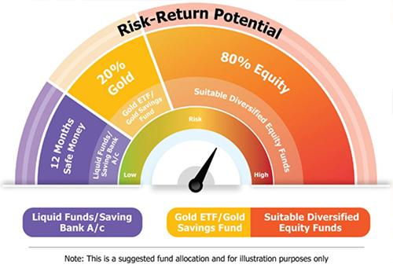

## Table of Contents

## What is a mutual fund and how does it work?

A mutual fund is like a big basket where many people put their money together to buy a variety of investments, like stocks, bonds, or other assets. When you invest in a mutual fund, you're buying a small piece of that basket. This makes it easier for people who don't have a lot of money to invest in a diverse range of assets, which can help spread out the risk.

The way a mutual fund works is that it's managed by a professional who decides what to buy and sell within the basket. The value of your investment in the mutual fund goes up or down based on how well those investments perform. At the end of each day, the total value of all the investments in the fund is calculated, and the price per share of the fund is set. This price is called the Net Asset Value (NAV). When you want to sell your shares, you get the current NAV, which reflects the performance of the fund's investments.

## What are the different types of mutual funds available to investors?

There are many types of mutual funds, and each type is designed to meet different investment goals. One common type is the equity fund, which mainly invests in stocks. These funds can focus on different things, like big companies or smaller ones, or even companies in certain areas like technology or health care. Another type is the bond fund, which invests in bonds. These are safer than stocks but usually don't grow as much. Bond funds can focus on government bonds, corporate bonds, or a mix of both.

Then there are balanced funds, which mix stocks and bonds to balance risk and reward. These are good for people who want a bit of both worlds. Money market funds are another type, and they invest in very safe, short-term things like government securities. These funds are good for people who want to keep their money safe and easy to get to. Lastly, there are index funds, which try to match the performance of a specific market index, like the S&P 500. These funds are usually cheaper to own because they don't need a lot of managing.

So, depending on what you want from your investment, like growth, safety, or a bit of both, there's a type of mutual fund that can fit your needs. It's important to understand what each type does so you can pick the one that's right for you.

## How do you evaluate the performance of a mutual fund?

To evaluate the performance of a mutual fund, you need to look at a few key things. One important thing is the fund's return, which tells you how much the fund has grown over time. You can compare this return to other funds or to a benchmark, like the S&P 500, to see if the fund is doing well. Another thing to check is the fund's risk, which shows how much the value of the fund goes up and down. Funds with higher risk might give you bigger returns, but they can also lose more money. You can use a measure called standard deviation to see how risky a fund is.

Another way to judge a mutual fund is by looking at its expense ratio, which is how much it costs to run the fund. A lower expense ratio means more of your money stays invested and can grow over time. It's also good to see how the fund has done over different time periods, like one year, three years, or five years, to get a full picture of its performance. Some funds might do well in the short term but not so well over longer periods.

Lastly, consider the fund manager's experience and the fund's investment strategy. A good manager with a clear strategy can make a big difference in how well the fund does. You might also want to look at the fund's turnover rate, which shows how often the fund buys and sells its investments. A high turnover rate can mean higher costs and might affect the fund's performance. By looking at all these things together, you can get a good idea of how well a mutual fund is doing and whether it's a good choice for you.

## What are the key metrics to consider when analyzing mutual funds?

When analyzing mutual funds, one of the key metrics to consider is the fund's return. This tells you how much the fund has grown over time. You can compare the fund's return to other funds or to a benchmark like the S&P 500 to see if it's doing well. Another important metric is the fund's risk, which shows how much the value of the fund goes up and down. You can use a measure called standard deviation to see how risky a fund is. Funds with higher risk might give you bigger returns, but they can also lose more money. It's also good to look at the fund's expense ratio, which is how much it costs to run the fund. A lower expense ratio means more of your money stays invested and can grow over time.

Another thing to consider is the fund's performance over different time periods, like one year, three years, or five years. This gives you a full picture of how the fund has been doing. Some funds might do well in the short term but not so well over longer periods. You should also look at the fund manager's experience and the fund's investment strategy. A good manager with a clear strategy can make a big difference in how well the fund does. Lastly, consider the fund's turnover rate, which shows how often the fund buys and sells its investments. A high turnover rate can mean higher costs and might affect the fund's performance. By looking at all these metrics together, you can get a good idea of how well a mutual fund is doing and whether it's a good choice for you.

## How does the expense ratio affect the returns of a mutual fund?

The expense ratio is how much it costs to run a mutual fund, and it's taken out of the fund's assets each year. This means that the higher the expense ratio, the less money you get to keep from the fund's returns. For example, if a fund has a 1% expense ratio and it earns 10% in a year, you'll only get to keep 9% because 1% goes to cover the costs of running the fund. Over time, even a small difference in the expense ratio can make a big difference in how much money you end up with.

Let's say you invest $10,000 in a fund with a 1% expense ratio and another $10,000 in a fund with a 0.5% expense ratio. If both funds earn 8% a year before expenses, after 20 years, the fund with the 1% expense ratio would grow to about $38,697, while the fund with the 0.5% expense ratio would grow to about $43,219. That's a difference of over $4,500 just because of the expense ratio. So, when you're choosing a mutual fund, it's really important to look at the expense ratio because it can eat into your returns over time.

## What role does the fund manager play in the success of a mutual fund?

The fund manager is really important for how well a mutual fund does. They are the ones who decide what to buy and sell in the fund, trying to make the best choices to grow the money of everyone who has invested in the fund. A good fund manager knows a lot about the market and uses that knowledge to pick the right investments. They keep an eye on how the economy is doing and what's happening in the world, which helps them make smart choices. If the fund manager is good at their job, the fund is more likely to do well and give investors good returns.

But, the fund manager's impact isn't just about [picking](/wiki/asset-class-picking) the right investments. They also need to manage the fund in a way that keeps costs low and follows the fund's goals. For example, if the fund is meant to be safe and steady, the manager needs to choose investments that match that goal. They also have to think about how often they buy and sell investments, because doing this too much can make the fund's costs go up. So, a good fund manager can make a big difference in how well a mutual fund does, by picking good investments and managing the fund well.

## How can diversification within a mutual fund impact investment returns?

Diversification in a mutual fund means spreading your money across different types of investments, like stocks, bonds, and other assets. When you diversify, you're not putting all your eggs in one basket. This can help lower the risk because if one investment does badly, the others might do well and balance things out. For example, if the stock market goes down, but the bond market stays steady, a fund that has both stocks and bonds might not lose as much value as a fund that only has stocks.

But diversification can also affect your returns in other ways. Sometimes, having a lot of different investments can mean you don't get as high of returns as you might if you had put all your money into one thing that did really well. But, it's usually safer because it reduces the chance of losing a lot of money if one investment fails. So, while diversification might not always lead to the highest possible returns, it can help make your investment more stable and protect you from big losses.

## What are the tax implications of investing in mutual funds?

When you invest in mutual funds, you need to think about taxes. If you make money from your mutual fund, you might have to pay taxes on it. There are two main ways you can make money from a mutual fund: dividends and capital gains. Dividends are payments the fund makes from the income it earns, and you usually have to pay taxes on them. Capital gains happen when the fund sells investments for more than it paid for them. If the fund gives you these gains, you'll have to pay taxes on them too. The tax rate depends on how long the fund held the investment before selling it. If it was less than a year, it's a short-term capital gain and taxed like regular income. If it was more than a year, it's a long-term capital gain and usually taxed at a lower rate.

Another thing to think about is when you sell your mutual fund shares. If you sell them for more than you paid, you'll have a capital gain, and you'll have to pay taxes on that too. Just like with the fund's gains, how long you held the shares matters. Short-term gains are taxed at your regular income tax rate, while long-term gains are taxed at a lower rate. If you lose money when you sell your shares, you can use that loss to lower your taxes. You can subtract those losses from any gains you made that year, and if you have more losses than gains, you can use up to $3,000 of those losses to lower your regular income. Any leftover losses can be carried over to future years. So, taxes can take a bite out of your mutual fund returns, but knowing how they work can help you plan better.

## How do market conditions influence mutual fund performance?

Market conditions play a big role in how well a mutual fund does. When the overall market is doing well, like when stock prices are going up, mutual funds that invest in stocks usually do well too. This is because the value of the stocks in the fund goes up, which makes the fund's value go up. On the other hand, if the market is doing badly, like during a recession when stock prices fall, mutual funds can lose value. The type of investments a fund holds matters too. For example, if a fund has a lot of tech stocks and the tech industry is doing great, the fund will likely do well. But if the tech industry is struggling, the fund might not do as well.

Different market conditions can affect different types of mutual funds in different ways. For instance, bond funds might do better when interest rates are low because bond prices go up. But if interest rates go up, bond prices can fall, which can hurt the performance of bond funds. Also, economic events like inflation or changes in government policy can influence how well a mutual fund does. If inflation is high, it can eat into the returns of a fund, especially if the fund is holding a lot of cash or bonds. So, it's important for investors to keep an eye on market conditions and understand how they might impact their mutual fund investments.

## What advanced statistical tools can be used to predict mutual fund performance?

To predict how well a mutual fund might do, people use some advanced statistical tools. One of these tools is called regression analysis. It helps figure out how different things, like the economy or stock prices, might affect the fund's returns. By looking at past data, regression analysis can show patterns that might help predict what will happen in the future. Another tool is the Monte Carlo simulation. This tool runs a lot of different scenarios to see how the fund might perform under different conditions. It's like playing out many possible futures to get a better idea of what could happen.

Another useful tool is time-series analysis, which looks at how the fund's performance changes over time. It can help spot trends or cycles that might repeat in the future. Then there's [factor](/wiki/factor-investing) analysis, which breaks down the fund's performance into different parts to see what's driving the returns. For example, it might show how much of the fund's performance comes from the stock market as a whole versus how much comes from the fund manager's choices. These tools can give investors a better idea of what might happen with their mutual fund, but remember, no tool can predict the future perfectly.

## How can investors use sector rotation strategies within mutual funds to optimize returns?

Sector rotation is a way for investors to try to get better returns from their mutual funds by moving their money into different parts of the economy at different times. The idea is that different sectors, like technology, health care, or energy, do better at different points in the economic cycle. For example, when the economy is growing, sectors like technology and consumer goods might do well. But when the economy is slowing down, sectors like utilities or consumer staples might be safer bets. By figuring out where the economy is in its cycle, investors can shift their money into mutual funds that focus on the sectors that are expected to do well next.

Using sector rotation in mutual funds means picking funds that invest in specific sectors and moving money between them. If an investor thinks the economy is about to grow, they might put more money into a mutual fund that focuses on technology stocks. Later, if they think the economy is going to slow down, they might move some of that money into a fund that focuses on utilities or health care. This strategy can help investors take advantage of the ups and downs of different sectors, but it needs a good understanding of the economy and a bit of guesswork about what will happen next. It's not a sure thing, but it can be a way to try to get better returns.

## What are the latest trends in mutual fund investing and how might they affect future returns?

One of the latest trends in mutual fund investing is the growing popularity of [ESG](/wiki/esg-investing) (Environmental, Social, and Governance) funds. These funds focus on companies that are good for the environment, treat their workers well, and have strong leadership. More and more people want to invest in companies that match their values, so ESG funds are getting more attention. This trend might affect future returns because companies that focus on ESG might do better in the long run. If more people buy these funds, it could push up the prices of the stocks they invest in, which could lead to higher returns for investors.

Another trend is the move towards passive investing, which means buying funds that track an index like the S&P 500 instead of trying to beat the market. These funds, called index funds, usually have lower fees because they don't need a lot of managing. As more people choose index funds, the money going into actively managed funds might go down. This could make it harder for active fund managers to find good investments, which might affect their returns. On the other hand, the lower fees of index funds could mean more money stays in investors' pockets, helping their overall returns over time.

## What is the Financial Analysis of Mutual Funds?

Financial analysis is essential for evaluating mutual funds by examining their strategy, historical performance, and risk profile. Understanding these aspects enables investors to align their investments with personal risk tolerance and financial goals.

A fundamental component of mutual fund analysis involves examining key metrics such as the risk-return ratio, beta, and standard deviation. The risk-return ratio provides insight into how much risk is undertaken to achieve a certain level of return. It is typically calculated as:

$$
\text{Risk-Return Ratio} = \frac{\text{Expected Return} - \text{Risk-Free Rate}}{\text{Standard Deviation}}
$$

This metric helps investors understand the efficiency of a fund in generating returns relative to the risks taken.

Beta measures a fund's sensitivity to market movements and indicates how much the fund's returns are expected to change in response to a change in the market index. A beta greater than 1 suggests that the fund is more volatile than the market, while a beta of less than 1 indicates less [volatility](/wiki/volatility-trading-strategies).

Standard deviation is another crucial metric that quantifies the variation or [dispersion](/wiki/dispersion-trading) of a fund's returns. A higher standard deviation implies greater volatility and uncertainty in the fund's returns.

To accurately analyze mutual funds, modern financial analysis leverages advanced analytics and technological tools. These tools enhance the precision of performance evaluations by allowing for more comprehensive data analysis and pattern recognition. Techniques such as [machine learning](/wiki/machine-learning) and [artificial intelligence](/wiki/ai-artificial-intelligence) can identify trends and predict future performance, providing a competitive edge in investment decision-making.

Understanding a mutual fund's financial health involves analyzing various tools and methodologies. These may include performance attribution analysis, which determines the source of a fund's returns, and scenario analysis, which assesses a fund's potential performance under different market conditions. Additionally, stress testing evaluates how a fund might react to adverse market events, helping investors gauge the resilience of the investment.

The integration of advanced analytics and performance metrics into mutual fund analysis helps investors better align their investment choices with their risk tolerance and objectives. By assessing the comprehensive financial health of mutual funds, investors can make more informed decisions, optimizing their portfolios for both short-term objectives and long-term growth.

## What are Investment Returns and Performance Metrics?

Investment returns are a crucial measure of the profitability of investments in mutual funds, determining the performance outcomes relative to the invested capital. Understanding these returns involves analyzing several key metrics, which enable investors to interpret financial reports with precision and make informed investment decisions.

**Annual and Monthly Returns**

Annual returns offer a snapshot of a fund's performance over a year, encapsulating the gains or losses incurred. They can be calculated using the formula:

$$
\text{Annual Return} = \frac{\text{Ending Value} - \text{Beginning Value} + \text{Dividends Paid}}{\text{Beginning Value}} \times 100\%
$$

Monthly performance, on the other hand, provides insights into more granular trends within the year, allowing investors to track consistency and identify periods of volatility. Both measures are essential for evaluating past performance and forecasting future potential.

**Up-Market and Down-Market Capture**

Up-market capture ratio and down-market capture ratio are key performance metrics that assess a mutual fund's behavior relative to a benchmark index during periods of market growth and decline, respectively. 

- **Up-Market Capture Ratio:** This measures how well a fund performed relative to a benchmark during periods when the benchmark had positive returns. A ratio greater than 100% indicates that the fund outperformed the benchmark in up markets.

- **Down-Market Capture Ratio:** Conversely, this evaluates how a fund fared relative to a benchmark during periods of negative returns. A ratio lesser than 100% suggests that the fund declined less than the benchmark during down markets.

Calculating these ratios provides investors with insights into the fund manager's effectiveness in different market climates and helps in assessing the fund's risk-adjusted performance.

**Performance Metrics and Benchmark Comparisons**

Performance metrics such as these capture ratios and annual or monthly returns are integral to assessing a fund's ability to deliver sustainable returns over time. When evaluating mutual fund performance, it is also vital to compare returns with relevant benchmark indices. This comparison facilitates the assessment of fund manager skill and ensures that the fund's returns justify the associated risks and fees.

For instance, a mutual fund's performance might be compared against a broad market index like the S&P 500 or a sector-specific index, depending on the fund's investment focus. The benchmark provides a standard against which performance is measured, indicating whether the fund is adding value through active management.

In conclusion, a comprehensive understanding of investment returns and performance metrics is indispensable for evaluating mutual funds. Accurate measurement and comparison with benchmarks allow investors to discern superior funds capable of delivering consistent, risk-adjusted returns, thereby guiding sound investment decisions.

## References & Further Reading

[1]: Bergstra, J., Bardenet, R., Bengio, Y., & Kégl, B. (2011). ["Algorithms for Hyper-Parameter Optimization."](https://dl.acm.org/doi/10.5555/2986459.2986743) Advances in Neural Information Processing Systems 24.

[2]: ["Advances in Financial Machine Learning"](https://www.amazon.com/Advances-Financial-Machine-Learning-Marcos/dp/1119482089) by Marcos Lopez de Prado

[3]: ["Evidence-Based Technical Analysis: Applying the Scientific Method and Statistical Inference to Trading Signals"](https://www.amazon.com/Evidence-Based-Technical-Analysis-Scientific-Statistical/dp/0470008741) by David Aronson

[4]: ["Machine Learning for Algorithmic Trading"](https://github.com/stefan-jansen/machine-learning-for-trading) by Stefan Jansen

[5]: ["Quantitative Trading: How to Build Your Own Algorithmic Trading Business"](https://www.amazon.com/Quantitative-Trading-Build-Algorithmic-Business/dp/1119800064) by Ernest P. Chan