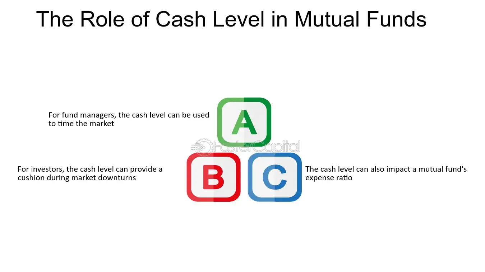

## Table of Contents

## What is a mutual fund?

A mutual fund is a type of investment where many people put their money together to buy different things like stocks, bonds, or other assets. A professional manager decides what to buy and sell, trying to make the fund grow. This makes it easier for people who don't have a lot of money or time to invest on their own.

When you invest in a mutual fund, you buy shares of the fund. The value of your shares goes up or down based on how well the investments in the fund are doing. Mutual funds can be a good way to spread out your risk because they hold a mix of different investments. This means if one investment does poorly, it might be balanced out by others that do well.

## What are cash levels in a mutual fund?

Cash levels in a mutual fund are the amount of money the fund holds in cash or cash equivalents, like money market instruments. This cash is not invested in stocks, bonds, or other securities. The cash level can change over time based on the fund manager's decisions and the fund's investment strategy. Sometimes, the fund might keep more cash if the manager thinks it's a good time to wait before buying more investments, or if they need money to pay investors who want to take their money out of the fund.

Having cash in a mutual fund can be important for several reasons. It gives the fund manager flexibility to quickly buy new investments when good opportunities come up. It also helps the fund meet any sudden requests from investors who want to withdraw their money. However, holding too much cash can mean the fund might not grow as much as it could if all the money was invested in other assets. So, the fund manager needs to balance having enough cash to be ready for opportunities and withdrawals, but not so much that it hurts the fund's performance.

## Why do mutual funds hold cash?

Mutual funds hold cash to be ready for different situations. One reason is to have money available to buy new investments quickly. If the fund manager sees a good opportunity in the market, like a stock that's suddenly cheaper, they can use the cash to buy it right away. This can help the fund grow faster. Another reason is to pay investors who want to take their money out of the fund. If lots of people want their money back at the same time, the fund needs cash to give it to them without having to sell investments at a bad time.

But holding too much cash can be a problem. If all the money in the fund is not invested, it might not grow as much as it could. Cash usually doesn't earn as much as stocks or bonds, so if the fund has a lot of cash sitting around, it might miss out on making more money. The fund manager has to find a balance. They need enough cash to be ready for opportunities and to pay investors, but not so much that it stops the fund from growing as well as it could.

## How are cash levels typically reported in mutual funds?

Cash levels in mutual funds are usually shown in the fund's regular reports. These reports, like the monthly or quarterly statements, tell investors how much of the fund's money is in cash or cash equivalents. This information helps investors see how the fund manager is handling the fund's money. You can find these reports on the mutual fund company's website or through financial websites that track mutual funds.

The cash level is often shown as a percentage of the fund's total assets. For example, if a fund has $100 million in total and $5 million of that is in cash, the cash level would be 5%. This percentage can change from one report to the next, depending on what the fund manager decides to do with the money. By looking at these percentages over time, investors can get a sense of the fund's strategy and how much cash the manager likes to keep on hand.

## What is considered a high or low cash level in a mutual fund?

In a mutual fund, what counts as a high or low cash level can change depending on the type of fund and what it's trying to do. Usually, if a fund keeps more than 5% to 10% of its money in cash, people might say it has a high cash level. This can be okay for some funds, like those that are very careful and don't want to take big risks. But for funds that want to grow a lot, having too much cash might mean they're not using all their money to make more money.

On the other hand, a low cash level might be when a fund keeps less than 2% to 5% in cash. This can be good for funds that want to have most of their money working hard in stocks or bonds. But if the cash level is too low, the fund might struggle to buy new things quickly or pay back investors who want their money. So, the right amount of cash depends a lot on what the fund is trying to do and how it wants to manage risk and growth.

## How do cash levels affect a mutual fund's performance?

Cash levels can affect a mutual fund's performance in a few ways. If a fund keeps a lot of cash, it might not grow as fast as it could. This is because cash usually doesn't earn as much as stocks or bonds. So, if a fund has a lot of money sitting in cash instead of being invested, it might miss out on making more money. On the other hand, having some cash can be good. It gives the fund manager the flexibility to buy new investments quickly when good opportunities come up. This can help the fund grow faster if the manager makes smart choices.

But, too little cash can also be a problem. If a fund doesn't have enough cash, it might not be able to pay investors who want their money back right away. This could force the fund to sell investments at a bad time, which might hurt the fund's performance. So, finding the right balance is important. The fund manager needs to keep enough cash to be ready for opportunities and to meet investor needs, but not so much that it stops the fund from growing as well as it could.

## What are the implications of high cash levels for investors?

High cash levels in a mutual fund can mean that the fund might not grow as fast as it could. When a fund keeps a lot of money in cash, that money isn't being used to buy stocks or bonds that could make more money. So, if you're an investor looking for your money to grow a lot, a fund with high cash levels might not be the best choice. It's like having money in your pocket instead of putting it in a bank where it can earn interest.

On the other hand, high cash levels can also be good for investors in some ways. It means the fund manager can quickly buy new investments if they see a good deal. This can help the fund grow if the manager makes smart choices. Also, if lots of people want to take their money out of the fund at the same time, having cash means the fund can pay them without having to sell investments at a bad time. So, high cash levels can make the fund more stable and ready for different situations.

## How can cash levels signal a fund manager's market outlook?

Cash levels in a mutual fund can tell you a lot about what the fund manager thinks about the market. If the manager is keeping a lot of cash, it might mean they think the market is risky right now. They might be waiting for prices to go down before they buy more stocks or bonds. It's like saving your money until you find something really good to buy.

On the other hand, if the cash levels are low, it might mean the fund manager feels good about the market. They're using most of the fund's money to buy investments because they think those investments will do well. It's like spending your money because you see a lot of good deals around. So, by looking at how much cash a fund is holding, you can get a sense of whether the manager is feeling cautious or confident about what's happening in the market.

## What strategies can fund managers use to manage cash levels effectively?

Fund managers can use different strategies to keep the right amount of cash in their mutual funds. One way is to watch the market closely and change how much cash they hold based on what they see. If they think the market might go down, they might keep more cash to buy things when prices are lower. If they think the market is doing well, they might use more of the cash to buy investments right away. This helps them be ready for different situations and make the most of good opportunities.

Another strategy is to plan ahead for times when lots of people might want their money back. Fund managers can set up rules for how much cash they need to have to pay these investors. This way, they can keep enough cash to handle these requests without having to sell investments at a bad time. By thinking ahead and keeping the right amount of cash, they can make sure the fund stays stable and keeps growing as well as it can.

Sometimes, fund managers also use tools like money market funds or short-term bonds to manage their cash. These are safe places to put money that can be turned into cash quickly. By using these tools, fund managers can keep their money working a little bit while still being ready to buy new investments or pay investors. This helps them balance having cash ready with making sure the fund's money is being used as well as possible.

## How do cash levels impact a mutual fund's risk profile?

Cash levels can change how risky a mutual fund is. If a fund keeps a lot of cash, it might be less risky. This is because cash is safe and doesn't go up and down like stocks or bonds. So, if the market goes down, the fund with more cash won't lose as much money. But, having too much cash can also mean the fund might not grow as much as it could. It's like having money in your pocket instead of putting it in a bank where it can earn interest.

On the other hand, if a fund has very little cash, it might be more risky. This is because most of the fund's money is in stocks or bonds that can go up and down a lot. If the market goes down, the fund could lose more money. But, if the market goes up, the fund could grow more too. So, the amount of cash in a fund can tell you a lot about how much risk the fund is taking. It's all about finding the right balance between being safe and trying to grow the fund.

## What are the tax implications of cash levels in mutual funds?

The amount of cash a mutual fund holds can affect how much tax you have to pay. When a fund has a lot of cash, it might not make as much money from investments like stocks or bonds. This means the fund might not have to pay as much in taxes because it's not making as much money that needs to be reported. But, if the fund does earn some interest on the cash it holds, that interest can be taxed. So, having more cash might mean less tax on investment gains, but you could still have to pay tax on any interest earned.

On the other hand, if a fund has very little cash and is mostly invested in stocks or bonds, it might make more money. This can lead to more taxes because the fund has to report and pay taxes on the gains from those investments. When the fund sells investments that have gone up in value, it has to pay capital gains tax on those profits. So, a fund with low cash levels might have more taxable events, which means you could end up paying more in taxes. It's important to think about these tax effects when you're choosing a mutual fund.

## How can investors use cash level data to make informed investment decisions?

Investors can use cash level data to understand what the fund manager thinks about the market. If a fund has a lot of cash, it might mean the manager is being careful and waiting for a good time to buy more investments. This can be a sign that the manager thinks the market might go down soon. On the other hand, if the cash levels are low, it might mean the manager feels good about the market and is using most of the fund's money to buy investments. By looking at these cash levels, investors can decide if they want to invest in a fund that's being careful or one that's trying to grow quickly.

Another way investors can use cash level data is to think about how much risk they want to take. A fund with a lot of cash might be less risky because it won't lose as much money if the market goes down. But, it might also grow slower because cash doesn't make as much money as stocks or bonds. If an investor wants to be safe, a fund with high cash levels might be a good choice. But, if they want their money to grow a lot and are okay with taking more risk, a fund with low cash levels might be better. By understanding how cash levels affect a fund's risk and growth, investors can pick the right fund for their goals.

## What are the investment strategies for mutual funds?

Investment strategies for mutual funds play an essential role in guiding the allocation and management of assets, balancing the trade-off between risk and return. These strategies generally fall into two primary categories: active management and passive management. Active management involves fund managers seeking to outperform market indices by selecting a diverse portfolio of assets based on research and analysis. This approach relies heavily on market timing, stock selection, and tactical allocation to capitalize on market inefficiencies. Conversely, passive management aims to replicate the performance of a specific index, such as the S&P 500, by constructing a portfolio that mirrors the index's constituents. This strategy is often more cost-effective due to lower transaction costs and management fees, as it requires less frequent trading and decision-making.

A critical component of mutual fund investment strategies is understanding the risk-return trade-off. In financial terms, this relationship is often depicted using the Capital Asset Pricing Model (CAPM), where the expected return of an asset or portfolio ($E[R_i]$) is expressed as:

$$
E[R_i] = R_f + \beta_i (E[R_m] - R_f)
$$

Here, $R_f$ represents the risk-free rate, $E[R_m]$ the expected market return, and $\beta_i$ the asset or portfolio's risk relative to the market. Generally, higher expected returns come with higher [volatility](/wiki/volatility-trading-strategies) and potential risk, necessitating a careful assessment of investors' risk tolerance and investment objectives.

Diversification is another fundamental principle in mutual fund investment strategies. By allocating assets across various classes — such as stocks, bonds, and money market instruments — fund managers can reduce unsystematic risk, which is the risk specific to a single asset or a small group of investments. Diversifying across different asset types and sectors helps in smoothing out volatility and achieving more stable returns over time.

Investment horizons, whether long-term or short-term, further influence mutual fund strategies. Long-term strategies typically embrace higher levels of risk and volatility, anticipating that market fluctuations will average out over an extended period. This approach capitalizes on compounding returns and potential growth in equity markets. Conversely, short-term strategies favor conservative allocations to preserve capital and ensure [liquidity](/wiki/liquidity-risk-premium), catering to investors who may require access to their funds sooner or who have a lower risk tolerance.

By comprehending and applying these fundamental investment strategies, mutual fund managers can effectively tailor portfolios to meet the diverse objectives and risk appetites of investors, helping them navigate the complexities of the financial markets.

## References & Further Reading

[1]: Bergstra, J., Bardenet, R., Bengio, Y., & Kégl, B. (2011). ["Algorithms for Hyper-Parameter Optimization."](https://papers.nips.cc/paper/4443-algorithms-for-hyper-parameter-optimization) Advances in Neural Information Processing Systems 24.

[2]: ["Advances in Financial Machine Learning"](https://www.amazon.com/Advances-Financial-Machine-Learning-Marcos/dp/1119482089) by Marcos Lopez de Prado

[3]: ["Evidence-Based Technical Analysis: Applying the Scientific Method and Statistical Inference to Trading Signals"](https://www.amazon.com/Evidence-Based-Technical-Analysis-Scientific-Statistical/dp/0470008741) by David Aronson

[4]: ["Machine Learning for Algorithmic Trading"](https://github.com/stefan-jansen/machine-learning-for-trading) by Stefan Jansen

[5]: ["Quantitative Trading: How to Build Your Own Algorithmic Trading Business"](https://www.amazon.com/Quantitative-Trading-Build-Algorithmic-Business/dp/1119800064) by Ernest P. Chan