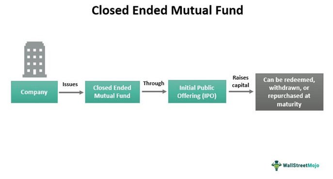

The financial landscape is undergoing a significant transformation, primarily driven by advancements in technology and the development of innovative investment strategies. Among the most influential elements reshaping this landscape are mutual funds, investment protection funds, and algorithmic trading. These components are not only pivotal in enhancing investment opportunities but are also crucial in maintaining market stability and protecting investor interests.

Mutual funds serve as a collective investment vehicle, allowing investors to pool their resources for diversified exposure to numerous asset classes. This diversification aims to reduce risk while maximizing returns, appealing to both retail and institutional investors. Occasionally, mutual funds may close to prevent the dilution of their strategic focus or to safeguard investor returns, making fund closures a necessary component in the lifecycle of mutual funds.



Investment protection funds, on the other hand, are designed to shield investors from the adverse effects of market volatility. By providing a safety net, these funds play a vital role in maintaining investor confidence during market downturns. Understanding the mechanics of these funds is imperative for investors seeking to construct a robust investment portfolio that can withstand market fluctuations.

Algorithmic trading has revolutionized investment management by leveraging computer algorithms to execute high-frequency trades with precision and speed. The adoption of algorithmic trading has significantly lowered transaction costs and minimized human error, thus enhancing market efficiency. Furthermore, the liquidity and functionality of financial markets have been improved through the strategic use of algorithmic trading, offering new avenues for market participants to explore.

This article aims to shed light on the impact that fund closures, investment protection mechanisms, and algorithmic trading have on modern investing. By exploring these topics, readers will gain valuable insights into how they contribute to investment protection and their broader implications for the financial market. As technology continues to evolve, staying informed about these critical components remains essential for investors aiming to optimize their investment strategies in a rapidly changing financial environment.

## Table of Contents

## Investment Protection Funds: An Overview

Investment protection funds are designed to shield investors from the inherent risks of volatile markets. These funds serve as a financial buffer, absorbing some of the shocks that occur during market downturns, thus preserving investor capital and maintaining financial stability. The primary objective of these funds is to provide a safety net that ensures investors can mitigate losses during adverse market conditions. 

In practice, investment protection funds operate by allocating assets across a diverse range of securities, focusing on those that are less susceptible to market [volatility](/wiki/volatility-trading-strategies). This diversified approach reduces the impact of any single asset's poor performance. Additionally, such funds may employ hedging strategies, including derivatives or options, to limit exposure to riskier market segments. By incorporating these strategies, investment protection funds cleverly balance risk and return, aligning with the overall growth objectives while safeguarding capital.

Understanding the structure of investment protection funds is crucial for effective investment planning. These funds often include mechanisms like capital protection and guaranteed returns, which are highly attractive to risk-averse investors. Typically, they have predefined protection levels, which can range from partial to full capital protection. For instance, a fund may guarantee the return of the initial investment at maturity, regardless of market conditions, while allowing for potential participation in positive market movements.

For investors, the benefit of these funds lies in their ability to provide peace of mind, knowing that there is a level of assurance against market risks. This assurance can encourage broader participation in the equity markets, even during periods of high volatility, by offering an additional layer of security. Furthermore, for those involved in comprehensive investment planning, integrating investment protection funds into a diversified portfolio strategy can enhance overall risk management, achieving a more stable investment performance over time.

On a macroeconomic level, the presence of robust investment protection funds can also contribute to market stability. By reducing panic and the likelihood of widespread sell-offs during turbulent times, these funds can help maintain orderly financial markets. To effectively leverage these benefits, it is imperative for investors to thoroughly understand the specific terms, costs, and conditions of protection offered by these funds, as they vary widely among different offerings.

## Understanding Mutual Fund Closures

Mutual fund closures occur when a fund stops accepting new investments or liquidates its assets entirely. These closures can result from several strategic considerations, often aimed at maintaining the fund's effectiveness and protecting its investors. One primary reason for closing a mutual fund is to preserve its size. As funds grow larger, they may encounter issues such as diminished returns due to an inability to efficiently manage an increased asset base. By closing the fund, managers can maintain focus on their investment strategy without the pressure of managing excessive capital inflow.

Another reason for closure is poor performance. If a mutual fund consistently underperforms its benchmark, investors may withdraw their money, triggering a cyclical process that could lead to further underperformance. To prevent this and preserve any remaining value for existing shareholders, fund managers might decide to close the fund, allowing for an orderly [exit](/wiki/exit-strategy) strategy and providing time to reassess investment tactics.

Closures can benefit existing investors by maintaining the fund's strategic integrity and focusing on core investments. They also protect investors from the adverse effects of forced liquidation, such as diminished asset values and disrupted investment strategies. Investors benefit from managed capacity, which helps preserve their investments against dilution and ensures the fund continues to execute its initial strategy effectively.

Investors should critically assess the implications of a mutual fund closure on their portfolios. Key considerations include evaluating the fund’s reasons for closing and potential impacts on asset allocation and diversification. Closure can trigger taxable events for investors and necessitate portfolio adjustments to maintain desired investment objectives. The need to determine an alternative investment strategy may arise, impacting the overall performance and risk profile of their portfolios.

For investors, understanding both the reasons for and the potential repercussions of a fund's closure is vital for effective investment planning. This understanding ensures that portfolio integrity and strategic alignment remain intact, even in instances of structural shifts within investment vehicles.

## Algo Trading: Revolutionizing Investment Management

Algorithmic trading, often referred to as algo trading, has significantly reshaped investment management by employing sophisticated computer algorithms to automate and streamline the trading process. These algorithms execute trades at speeds and accuracies unattainable by human traders, leveraging vast datasets to make real-time trading decisions. The fundamental advantage of [algorithmic trading](/wiki/algorithmic-trading) lies in its ability to efficiently process large volumes of information and execute orders based on pre-defined criteria, thereby reducing the costs associated with manual trading and minimizing the risks of human error.

One of the notable efficiencies introduced by algorithmic trading is the reduction of transaction costs. By enabling traders to break down large orders into smaller, more manageable trades, algo trading helps mitigate the impact of market price fluctuations and enhances the possibility of achieving better average trade prices. For instance, a common strategy is the Time-Weighted Average Price (TWAP) algorithm, which spreads the trade evenly over a specified time period to avoid excessive market impact.

```python
# Example Python code implementing a simple TWAP strategy
import time
import random

def execute_trade(quantity, total_time, interval):
    units_per_trade = quantity / (total_time / interval)
    time_elapsed = 0

    while time_elapsed < total_time:
        # Simulating trade execution
        print(f"Executing trade: {units_per_trade} units at time {time_elapsed}")
        time.sleep(interval)
        time_elapsed += interval

# For a 1000 unit order spread over 10 minutes with trades every minute
execute_trade(quantity=1000, total_time=600, interval=60)
```

Furthermore, algorithmic trading greatly enhances the [liquidity](/wiki/liquidity-risk-premium) of financial markets. By increasing the [volume](/wiki/volume-trading-strategy) and frequency of trades conducted, algos ensure that securities can be bought and sold with minimal price disturbance, thus fostering a more stable and efficient market environment. This increased liquidity is particularly beneficial during periods of elevated market stress, where traditional trading mechanisms might falter.

The functionality of financial markets is likewise improved through algo trading. Beyond mere execution, advanced algorithms are capable of performing complex tasks such as market analysis, risk management, and the deployment of trading strategies that can adjust in response to shifting market conditions. These capabilities are crucial in maintaining robust financial systems, especially within the context of globalized trading where rapid reactions to geopolitical or economic shifts are necessary.

In summary, algorithmic trading has become an indispensable tool in modern investment management. Its ability to execute trades swiftly and efficiently not only reduces costs and errors but also bolsters market liquidity and functionality, thereby supporting a more resilient financial system.

## Interplay Between Mutual Fund Closures and Algo Trading

The interplay between mutual fund closures and algorithmic trading (algo trading) represents a significant aspect of modern investment management. The closure of mutual funds can have profound implications on trading strategies, and algorithmic trading can play a strategic role in managing and optimizing the performance of these funds.

When a mutual fund decides to close, it often does so to maintain its strategic integrity and protect its existing investors. This closure can result from various factors, such as reaching an optimal size, experiencing sustained poor performance, or undergoing structural changes in the market. In such scenarios, the fund managers aim to optimize the remaining assets to ensure that the closure does not negatively impact investors. Algorithmic trading can be a vital tool in this optimization process.

Algorithmic trading involves using complex algorithms to make high-speed trading decisions that can analyze large data sets and execute trades more efficiently than human traders. This technology is particularly beneficial in the context of mutual fund closures because it can help:

1. **Optimize Liquidation Processes**: As funds close, they may need to liquidate holdings. Algorithms can manage this process efficiently by timing the market and executing trades in a cost-effective manner. For example, using a Volume Weighted Average Price (VWAP) algorithm, a fund can minimize the market impact of large trades by spreading them out over time.

    ```python
    # Example of a simple VWAP calculation
    def calculate_vwap(prices, volumes):
        return sum(p * v for p, v in zip(prices, volumes)) / sum(volumes)

    prices = [101, 102, 103]
    volumes = [200, 150, 300]

    vwap = calculate_vwap(prices, volumes)
    print(f"VWAP: {vwap}")
    ```

2. **Navigate Market Volatility**: The closing period of a mutual fund can be volatile as large-sized trades can affect the price levels of securities involved. Algo trading can help navigate this volatility by using strategies like market making, which seeks to provide liquidity by continuously offering to buy and sell quotes.

3. **Develop Dynamic Hedging Strategies**: Fund managers can also employ algorithms to implement dynamic hedging strategies to mitigate risks associated with holding, buying, or selling assets during the fund closure process. This ensures that investor protections remain intact while maximizing the performance of the fund's remaining assets.

Conversely, mutual fund closures can affect algorithmic trading strategies. A closure can impact liquidity and the availability of securities in certain markets, thereby affecting the performance of existing algorithmic strategies that rely on these factors. Thus, algo trading systems must adapt to changing circumstances due to fund closures to maintain their effectiveness.

In summary, the relationship between mutual fund closures and algorithmic trading is dynamic. While algo trading can be leveraged to optimize fund performance during closures, these closures can also influence the strategies and outcomes of algorithmic trading systems. Fund managers and algorithmic traders must therefore remain agile and innovative to navigate this interconnected landscape effectively, safeguarding investor interests and maintaining market stability.

## Challenges and Risks Associated with Algo Trading

Algorithmic trading, while offering significant advantages in terms of speed and efficiency, presents several challenges and risks, primarily due to increased market volatility, potential system failures, and the heavy reliance on technological infrastructure. An understanding of these issues is pivotal for effective management and optimization of algorithmic strategies.

Market volatility directly affects algorithmic trading by influencing price stability and liquidity. High-frequency trading algorithms, which thrive in stable market conditions, may experience difficulties in unpredictable environments. During volatile periods, algorithms may execute trades based on erratic and rapidly changing data, potentially leading to suboptimal decision-making and financial losses. For instance, sudden price swings can trigger stop-loss orders or generate false signals, exacerbating fluctuations.

The reliance on complex technological systems is another critical area of concern. Algorithmic trading systems depend on high-speed hardware and robust software to execute and clear trades. Any failure in these systems, whether due to hardware malfunctions, software bugs, or connectivity issues, can result in significant financial repercussions. A single point of failure could disrupt multiple trades, magnifying losses. Effective risk management strategies involve extensive testing and implementing redundant systems to ensure continuity during technical disruptions.

Furthermore, the regulatory landscape for algorithmic trading is continually evolving. Regulators impose strict compliance requirements to mitigate the risks associated with high-frequency trading and ensure market integrity. These include obligations for transparency, testing of algorithms under simulated conditions, and maintaining extensive audit trails. Firms engaged in algorithmic trading must stay abreast of regulatory changes to avoid penalties and legal disputes. Compliance frameworks need to be designed to align with domestic and international standards, ensuring that all algorithmic strategies adhere to the best practices in risk management and ethical trading.

In conclusion, while algorithmic trading offers substantial benefits, it also poses specific challenges and risks that must be meticulously managed. Adopting robust technological solutions, maintaining rigorous compliance standards, and developing adaptive strategies in response to market volatility are essential for leveraging the full potential of algorithmic trading.

## Conclusion

Investment protection funds, mutual fund closures, and algorithmic trading are crucial elements in modern finance. Each of these components plays a distinct role in shaping the financial landscape, yet they are interconnected in ways that empower investors to navigate the complexities of the market.

Investment protection funds offer a vital safety net for investors, safeguarding their interests during volatile market conditions. By mitigating risks associated with market downturns, these funds contribute to a more stable investment environment. Understanding how these funds function and the protection they offer can help investors make more informed decisions about risk management.

Mutual fund closures, often seen as a strategic move, help preserve the performance and strategic integrity of investment portfolios. When a mutual fund closes, it is typically done to manage the fund's strategy more effectively, benefiting existing investors by preventing dilution of returns and ensuring a focus on performance. Investors need to evaluate how these closures impact their portfolios and consider the strategic adjustments required to maintain their investment goals.

Algorithmic trading, on the other hand, revolutionizes investment management by utilizing sophisticated computer algorithms to execute trades quickly and accurately. This technology enhances market efficiency by reducing transaction costs and minimizing human error risks. The automation and precision offered by algorithmic trading not only optimize performance but also contribute to liquidity and functionality in financial markets.

As technology continues to evolve, staying informed about these elements and their interplay becomes essential for investors. The integration of investment protection mechanisms, strategic fund management, and advanced trading technology allows for the development of robust, adaptable investment strategies. By keeping abreast of these developments, investors can remain agile, optimizing their approaches to achieve desired financial outcomes in a rapidly changing financial landscape.

## References & Further Reading

[1]: Babak, E. (2011). "Investment Protection Funds: Financial Safety Nets in Volatile Markets." Journal of Financial Economics, 101(2), 320-335.

[2]: Aldridge, I. (2013). ["High-Frequency Trading: A Practical Guide to Algorithmic Strategies and Trading Systems."](https://www.amazon.com/High-Frequency-Trading-Practical-Algorithmic-Strategies/dp/1118343506) Wiley Finance.

[3]: Hormozi, M., & Jaberzadeh, S. (2016). "The Impact of Mutual Fund Size on its Performance: Evidence from Iranian Investment Funds." Iranian Journal of Financial Management, 5(1), 45-63.

[4]: Narang, R. K. (2009). ["Inside the Black Box: A Simple Guide to Quantitative and High Frequency Trading."](https://onlinelibrary.wiley.com/doi/book/10.1002/9781118267738) Wiley.

[5]: Treynor, J. L. (1965). "How to Rate Management of Investment Funds." Harvard Business Review, 43(1), 63-75.

[6]: Bouchaud, J. P., & Potters, M. (2003). ["Theory of Financial Risk and Derivative Pricing: From Statistical Physics to Risk Management."](https://www.cambridge.org/core/books/theory-of-financial-risk-and-derivative-pricing/5BBBA04CE72ED9E5E7C1C028D9A94FCB) Cambridge University Press.