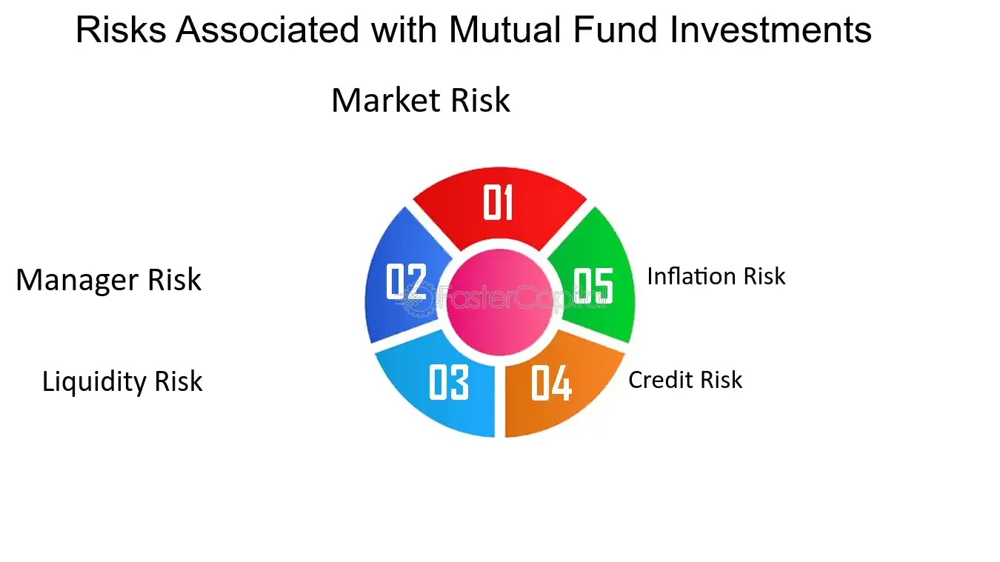

## Table of Contents

## What is a mutual fund?

A mutual fund is a type of investment where many people pool their money together to buy a variety of stocks, bonds, or other assets. This makes it easier for individuals to invest in a diversified portfolio without needing a lot of money or knowledge about the stock market. A professional manager runs the mutual fund, making decisions about which investments to buy and sell.

When you invest in a mutual fund, you are buying shares of the fund, not the individual stocks or bonds it holds. The value of your investment can go up or down based on how well the fund's investments perform. Mutual funds can be a good option for people who want to grow their money over time but don't want to manage their investments themselves.

## What does it mean when a mutual fund closes?

When a mutual fund closes, it means that the fund stops accepting new investors and may also stop allowing current investors to buy more shares. This can happen for a few reasons. Sometimes, a fund might close because it has grown too big and the manager can't manage it well anymore. Other times, it might close because it's not doing well and the company running the fund decides to shut it down.

After a mutual fund closes, it usually goes into what's called a liquidation process. This means that the fund's assets, like stocks and bonds, are sold off. The money from these sales is then given back to the investors based on how many shares they own. This process can take some time, and during this period, investors can't buy or sell shares in the fund. Once the liquidation is complete, the mutual fund officially stops existing.

## Why do mutual funds close?

Mutual funds close for a few main reasons. One reason is that the fund might get too big. When a fund grows a lot, it can be hard for the manager to keep making good investment choices. The manager might decide to close the fund to new investors so they can keep the fund at a size they can handle well. Another reason is that the fund might not be doing well. If a fund isn't making money for its investors, the company running the fund might decide to close it down.

Sometimes, a mutual fund closes because the company running it wants to focus on other funds that are doing better. They might think that their time and resources are better spent on funds that have a brighter future. When a fund closes, it goes through a process called liquidation. This means the fund's investments, like stocks and bonds, are sold off, and the money is given back to the investors. This can take some time, and during this period, investors can't buy or sell shares in the fund.

## How are investors notified about a mutual fund closure?

When a mutual fund is going to close, the people who run the fund have to tell the investors about it. They usually send a letter or an email to everyone who has money in the fund. This letter tells them that the fund is closing and explains what will happen next. It's important for investors to read this letter carefully so they know what to do with their money.

After getting the letter, investors might have some questions. They can usually call the company that runs the fund to ask for more information. The company will also put updates on their website about the closure. This way, investors can keep track of what's happening with their money and when they will get it back.

## What happens to my investment when a mutual fund closes?

When a mutual fund closes, the people who run the fund start a process called liquidation. This means they sell all the investments the fund owns, like stocks and bonds. Once everything is sold, they take the money and give it back to the people who invested in the fund. How much money you get back depends on how many shares you own in the fund. This process can take some time, so you might have to wait a bit before you get your money.

During the time the fund is closing, you can't buy or sell shares in the fund. The people who run the fund will send you a letter or an email to let you know what's happening. They'll tell you when you can expect to get your money back. If you have any questions, you can call the company that runs the fund or check their website for more information. It's important to keep an eye on these updates so you know what to do next with your money.

## Are there any fees associated with a mutual fund closure?

When a mutual fund closes, there might be some fees you have to pay. These fees can be for things like the cost of selling off the fund's investments or for managing the process of closing the fund. The exact fees can be different for each fund, so it's a good idea to read the letter or email you get from the fund company to see if there are any fees and how much they are.

The fees are usually taken out of the money the fund gets from selling its investments before it's given back to you. This means the amount of money you get back might be a bit less than what you might have expected. If you're not sure about the fees or how they will affect your money, you can call the fund company or check their website for more information.

## How can investors protect themselves from the risks of mutual fund closures?

Investors can protect themselves from the risks of mutual fund closures by keeping an eye on how their funds are doing. They should read the reports and updates that the fund company sends out. If a fund is not doing well or is getting too big, it might be a good idea to move their money to a different fund before it closes. Also, spreading their money across different types of investments, like stocks, bonds, and other funds, can help. This way, if one fund closes, they won't lose all their money.

Another way to protect themselves is by choosing funds run by companies with a good track record. These companies are less likely to close their funds without a good reason. Investors should also read the fund's prospectus, which is like a guidebook that explains the fund's goals and risks. By understanding these things, investors can make better choices and be ready for any changes, like a fund closing.

## What are the regulatory safeguards in place for investors when a mutual fund closes?

When a mutual fund closes, there are rules to help protect investors. The company running the fund has to follow these rules, which are set by groups like the Securities and Exchange Commission (SEC). The SEC makes sure that the fund company tells investors about the closure in a clear way. They have to send a letter or email to everyone who has money in the fund, explaining what's happening and what investors can expect next. This helps investors know what to do with their money.

Another important rule is that the fund company has to sell all the investments the fund owns and give the money back to the investors fairly. They can't keep any of the money for themselves, and they have to make sure everyone gets their fair share based on how many shares they own. If there are any fees, these have to be explained clearly too. These rules help make sure that investors are treated fairly and get their money back as soon as possible when a fund closes.

## How do mutual fund closures impact the overall market?

When a mutual fund closes, it can affect the overall market, but usually, the impact is small. The fund has to sell all its investments, like stocks and bonds, to give the money back to the investors. This selling can make the prices of those investments go down a little bit. But because there are so many other buyers and sellers in the market, the effect is often not very big. It's like a small ripple in a big pond.

Sometimes, if a lot of funds close at the same time, it can have a bigger impact. This might happen if the whole market is not doing well, and many funds are losing money. When many funds are selling their investments at the same time, it can push prices down more. But even then, the market usually finds a new balance pretty quickly. So, while mutual fund closures can cause some short-term changes, the overall market is usually strong enough to handle it.

## What are the differences between voluntary and involuntary mutual fund closures?

When a mutual fund closes, it can happen in two ways: voluntary or involuntary. A voluntary closure happens when the people who run the fund decide to close it. They might do this because the fund got too big to manage well, or because they want to focus on other funds that are doing better. When a fund closes voluntarily, the people in charge usually have a plan to sell off the investments and give the money back to the investors in a fair way.

An involuntary closure, on the other hand, happens when the fund has to close because of rules or laws. This can happen if the fund is not following the rules set by groups like the Securities and Exchange Commission (SEC), or if the fund is losing too much money and can't keep going. When a fund closes involuntarily, it can be a surprise to the investors. The people running the fund still have to sell off the investments and give the money back to the investors, but it might take longer and be more complicated than a voluntary closure.

## How should investors assess the risk of a mutual fund closure before investing?

Before putting money into a mutual fund, investors should look at how well the fund has been doing. They can check the fund's past performance to see if it has been making money or losing it. If a fund has been losing money for a long time, it might be at risk of closing. Investors should also read the fund's prospectus, which is like a guidebook that explains the fund's goals and risks. If the prospectus says the fund might close if it gets too big or if it doesn't do well, that's something to think about.

Another thing to consider is the size of the fund. If a fund is very big, it might be hard for the manager to keep making good investment choices. This could lead to the fund closing to new investors or even shutting down completely. Investors should also look at the company that runs the fund. If the company has a good track record and is known for managing funds well, the risk of closure might be lower. By looking at these things, investors can get a better idea of whether a fund might close and make smarter choices with their money.

## What are some case studies of notable mutual fund closures and their outcomes for investors?

One notable case of a mutual fund closure was the Fidelity Advisor Biotechnology Fund in 2017. This fund closed because it was not doing well and was losing money. When it closed, the people who had money in the fund got their money back after the fund's investments were sold. The process took a few months, but everyone got their fair share based on how many shares they owned. Some investors were surprised by the closure, but they were happy that they got their money back without any big problems.

Another example is the Vanguard Capital Opportunity Fund, which closed to new investors in 2016. This fund did not close completely, but it stopped letting new people put money into it because it had gotten too big. The people who already had money in the fund could keep it there, but they couldn't buy more shares. This helped the fund's manager keep making good investment choices without the fund getting even bigger. Investors who were already in the fund were okay with this because their money was still safe and the fund kept doing well.

These cases show that when a mutual fund closes, it can happen for different reasons, like not doing well or getting too big. The important thing for investors is to get their money back fairly and on time. By understanding why a fund might close and what happens when it does, investors can feel more ready for any changes and make better choices with their money.

## References & Further Reading

[1]: Babak, E. (2011). "Investment Protection Funds: Financial Safety Nets in Volatile Markets." Journal of Financial Economics, 101(2), 320-335.

[2]: Aldridge, I. (2013). ["High-Frequency Trading: A Practical Guide to Algorithmic Strategies and Trading Systems."](https://www.amazon.com/High-Frequency-Trading-Practical-Algorithmic-Strategies/dp/1118343506) Wiley Finance.

[3]: Hormozi, M., & Jaberzadeh, S. (2016). "The Impact of Mutual Fund Size on its Performance: Evidence from Iranian Investment Funds." Iranian Journal of Financial Management, 5(1), 45-63.

[4]: Narang, R. K. (2009). ["Inside the Black Box: A Simple Guide to Quantitative and High Frequency Trading."](https://onlinelibrary.wiley.com/doi/book/10.1002/9781118267738) Wiley.

[5]: Treynor, J. L. (1965). "How to Rate Management of Investment Funds." Harvard Business Review, 43(1), 63-75.

[6]: Bouchaud, J. P., & Potters, M. (2003). ["Theory of Financial Risk and Derivative Pricing: From Statistical Physics to Risk Management."](https://www.cambridge.org/core/books/theory-of-financial-risk-and-derivative-pricing/5BBBA04CE72ED9E5E7C1C028D9A94FCB) Cambridge University Press.