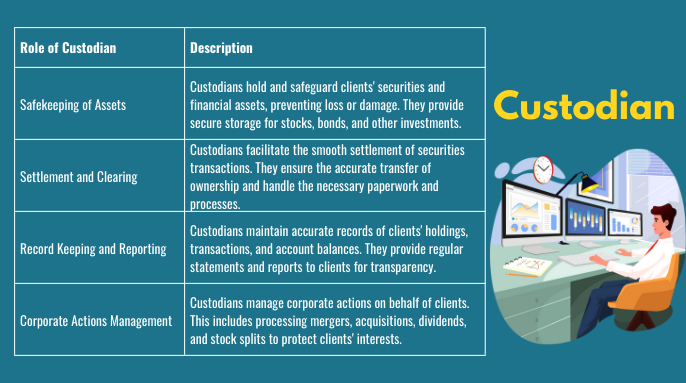

## Table of Contents

## What is a mutual fund custodian?

A mutual fund custodian is a financial institution, like a bank, that holds and safeguards the securities and assets of a mutual fund. They make sure that the mutual fund's investments are safe and properly managed. The custodian keeps track of all the stocks, bonds, and other investments that the mutual fund owns, and they also handle the buying and selling of these assets when needed.

In addition to holding the assets, the custodian also plays a key role in ensuring that the mutual fund follows all the rules and regulations. They keep detailed records and provide regular reports to the mutual fund company and its investors. This helps to make sure everything is transparent and that the investors can trust the mutual fund is being managed correctly.

## What are the primary responsibilities of a mutual fund custodian?

A mutual fund custodian's main job is to keep the mutual fund's investments safe. They hold onto all the stocks, bonds, and other assets that the mutual fund owns. This means they make sure these investments are secure and not lost or stolen. When the mutual fund needs to buy or sell investments, the custodian does that too. They handle all the transactions and make sure everything goes smoothly.

Another important responsibility of the custodian is to make sure the mutual fund follows all the rules. They keep detailed records of all the investments and transactions. The custodian also gives regular reports to the mutual fund company and its investors. This helps everyone see what's happening with the fund and makes sure it's being managed the right way. By doing all this, the custodian helps keep the mutual fund honest and trustworthy.

## How does a mutual fund custodian differ from a mutual fund manager?

A mutual fund custodian and a mutual fund manager have different jobs. The custodian is like a safekeeper. They hold onto all the stocks, bonds, and other things that the mutual fund owns. They make sure these investments are safe and they handle buying and selling them when needed. The custodian also keeps records and gives reports to make sure everything is done right and follows the rules.

The mutual fund manager, on the other hand, is like the decision-maker. They pick which stocks, bonds, or other investments the mutual fund should buy or sell. The manager's job is to try to make the fund grow and do well for the people who invest in it. They come up with the plan and make the choices, while the custodian just follows those choices and keeps everything safe.

## What are the legal requirements for a mutual fund custodian?

A mutual fund custodian must follow certain rules to make sure they are doing their job right. They need to be a bank or a trust company that is approved by the government. This means they have to be watched by groups like the Securities and Exchange Commission (SEC) in the U.S. or similar groups in other countries. The custodian also has to keep the mutual fund's money and investments separate from their own money. This helps to make sure that the investors' money stays safe and is not mixed up with the custodian's own funds.

The custodian also has to keep good records of all the investments they hold for the mutual fund. They need to give regular reports to the mutual fund company and the investors. These reports help everyone see what is happening with the fund and make sure it is being managed properly. The custodian must follow all the rules and regulations set by the government to make sure the mutual fund is honest and trustworthy. By doing all this, the custodian helps keep the investors' money safe and the mutual fund running smoothly.

## Can you explain the role of a custodian in safeguarding assets?

A custodian is like a guardian for a mutual fund's assets. They hold onto all the stocks, bonds, and other things that the mutual fund owns. This means they keep these investments safe and make sure they are not lost or stolen. When the mutual fund needs to buy or sell something, the custodian does that too. They handle all the transactions and make sure everything goes smoothly.

The custodian also plays a big role in making sure the mutual fund follows all the rules. They keep detailed records of all the investments and transactions. They also give regular reports to the mutual fund company and its investors. This helps everyone see what's happening with the fund and makes sure it is being managed the right way. By doing all this, the custodian helps keep the mutual fund honest and trustworthy.

## What are the common fees associated with mutual fund custodians?

When a mutual fund uses a custodian, they usually have to pay some fees. One common fee is called a custody fee. This is what the custodian charges to hold and take care of the mutual fund's investments. The custody fee can be a fixed amount or a percentage of the total assets that the custodian is looking after. Sometimes, the fee might also depend on how often the mutual fund buys or sells investments.

Another fee that might come up is called a transaction fee. This is what the custodian charges every time they buy or sell something for the mutual fund. The transaction fee can be a small amount for each trade, and it adds up if the mutual fund does a lot of buying and selling. These fees are important to know about because they can affect how much money the mutual fund makes for its investors.

## How do mutual fund custodians ensure compliance with regulations?

Mutual fund custodians help make sure the mutual fund follows all the rules by keeping good records of all the investments and transactions. They have to report these records regularly to the mutual fund company and its investors. This helps everyone see what's happening with the fund and makes sure it's being managed the right way. The custodian also has to follow rules set by government groups like the Securities and Exchange Commission (SEC) in the U.S. These rules make sure the custodian is doing their job correctly and that the investors' money stays safe.

The custodian also has to keep the mutual fund's money and investments separate from their own. This is called segregation of assets, and it's important to make sure the investors' money is not mixed up with the custodian's own funds. By doing all these things, the custodian helps keep the mutual fund honest and trustworthy. They make sure everything is transparent and follows the law, which helps protect the people who invest in the mutual fund.

## What are the risks involved in choosing a mutual fund custodian?

Choosing a mutual fund custodian comes with some risks. One risk is that the custodian might not do a good job of keeping the mutual fund's investments safe. If the custodian makes mistakes or is not careful, the mutual fund's stocks, bonds, and other assets could be lost or stolen. Another risk is that the custodian might charge high fees. These fees can eat into the money the mutual fund makes for its investors, which means less profit for them.

Another risk is that the custodian might not follow all the rules and regulations properly. If the custodian does not keep good records or give regular reports, it can be hard for the mutual fund company and its investors to see what is happening with the fund. This can lead to problems and make it harder to trust the mutual fund. Choosing a custodian that is not well-regulated or trustworthy can put the whole mutual fund at risk, which is why it's important to pick a custodian carefully.

## How does the selection process for a mutual fund custodian work?

When a mutual fund is looking for a custodian, they start by checking out different banks or trust companies that can do the job. They want to make sure the custodian is good at keeping investments safe and following all the rules. The mutual fund will look at things like how much the custodian charges in fees, how well they handle transactions, and if they have a good track record of doing things right. They might also talk to other mutual funds or financial experts to see who they recommend.

Once the mutual fund has a list of possible custodians, they will do more research. They will check to make sure the custodian is approved by the government and follows all the rules set by groups like the Securities and Exchange Commission (SEC). They will also look at the custodian's financial health to make sure they are strong and reliable. After all this checking, the mutual fund will pick the custodian that they think will do the best job of keeping their investments safe and making sure everything is done the right way.

## Can you provide examples of major mutual fund custodians?

Some big mutual fund custodians are companies like Bank of New York Mellon and State Street Corporation. Bank of New York Mellon is a huge bank that helps lots of mutual funds keep their investments safe. They have been doing this for a long time and are trusted by many people. State Street Corporation is another big bank that works with mutual funds. They are known for being good at keeping records and making sure everything follows the rules.

Another major custodian is JPMorgan Chase. They are a big bank that helps mutual funds by holding onto their stocks, bonds, and other things. They make sure these investments are safe and handle buying and selling when needed. These big custodians are important because they help mutual funds run smoothly and keep investors' money safe.

## What are the technological advancements affecting mutual fund custodians?

Technology has changed a lot for mutual fund custodians. They now use computer systems to keep track of all the stocks, bonds, and other investments they hold. These systems help them do their job faster and with fewer mistakes. For example, they can use special software to handle buying and selling investments quickly and safely. This means the mutual fund can make decisions faster and the custodian can make sure everything is done right.

Another big change is that custodians can now use the internet to share information with the mutual fund company and its investors. They can send reports and updates online, which makes everything easier and more transparent. This also helps them follow all the rules better because they can keep better records and share them easily. Overall, technology helps custodians do a better job of keeping investments safe and making sure the mutual fund runs smoothly.

## How do global mutual fund custodians manage cross-border operations?

Global mutual fund custodians have to handle investments in different countries. They need to know the rules and laws in each place where the mutual fund has money. They work with other banks and financial companies around the world to keep the investments safe. When the mutual fund wants to buy or sell something in another country, the custodian makes sure it happens the right way. They also need to keep track of different currencies and make sure the money is moved correctly between countries.

To manage all this, global custodians use special computer systems that can work across borders. These systems help them keep everything organized and make sure they follow the rules in each country. They also use the internet to share information quickly with the mutual fund company and its investors, no matter where they are. This helps everyone see what's happening with the fund and makes sure the investments stay safe and well-managed, even when they are spread all over the world.

## What are the strategies and techniques in investment management?

Investment management is a dynamic financial process focused on the strategic oversight and administration of investment assets to achieve specific objectives. The primary aim is to optimize the balance between risk and return according to an investor's financial goals, time horizon, and risk tolerance.

Investment strategies are diverse and cater to varied investment philosophies. Value investing involves selecting securities that appear undervalued compared to their intrinsic value. This discrepancy signifies potential gains as the market corrects its initial undervaluation. Growth investing, in contrast, targets companies that display potential for above-average growth, often characterized by high price-to-earnings ratios. Index investing entails replicating the performance of a financial market index, a strategy often lauded for its cost-effectiveness and ability to deliver market-average returns.

Risk assessment and management are core components of investment decision-making. Effective risk management involves identifying potential risks, quantifying their impact, and employing mitigation strategies to guard against losses. Tools such as the Sharpe ratio, which measures risk-adjusted returns, are instrumental in evaluating the attractiveness of an investment. Calculating the Sharpe ratio uses the formula:

$$
\text{Sharpe Ratio} = \frac{R_p - R_f}{\sigma_p}
$$

where $R_p$ is the return of the portfolio, $R_f$ is the risk-free rate, and $\sigma_p$ is the standard deviation of the portfolio's excess return.

Portfolio diversification and asset allocation are fundamental principles in managing investment risk. Diversification aims to spread investments across various asset classes or sectors, reducing unsystematic risk—specific to a particular company or industry. Asset allocation involves distributing investment funds among different asset categories, such as stocks, bonds, and cash, based on an investor's objectives and risk tolerance. A well-diversified portfolio can achieve a more stable performance by minimizing the impact of individual asset [volatility](/wiki/volatility-trading-strategies).

Research and analysis play pivotal roles in investment management. Comprehensive analysis entails evaluating macroeconomic indicators, industry trends, and company financials to forecast future performance and identify viable investments. Quantitative models and qualitative assessments are combined to form informed investment decisions, ensuring a balanced and evidence-based approach.

The fusion of these strategies and techniques underscores the multifaceted nature of investment management, emphasizing the blending of systematic methodologies and strategic foresight to attain superior financial outcomes.

## References & Further Reading

[1]: Sharpe, W. F. (1966). ["Mutual Fund Performance"](https://www.jstor.org/stable/2351741). The Journal of Business, 39(1), 119-138.

[2]: Fabozzi, F. J., & Markowitz, H. M. (Eds.). (2011). ["The Theory and Practice of Investment Management: Asset Allocation, Valuation, Portfolio Construction, and Strategies, 2nd Edition"](https://books.google.com/books/about/The_Theory_and_Practice_of_Investment_Ma.html?id=PFZhVW1W0k8C). John Wiley & Sons.

[3]: Hasbrouck, J. (2007). ["Empirical Market Microstructure: The Institutions, Economics, and Econometrics of Securities Trading"](https://archive.org/details/empiricalmarketm0000hasb). Oxford University Press.

[4]: Lopez de Prado, M. (2018). ["Advances in Financial Machine Learning"](https://books.google.com/books/about/Advances_in_Financial_Machine_Learning.html?id=oU9KDwAAQBAJ). John Wiley & Sons.

[5]: Chan, E. P. (2008). ["Quantitative Trading: How to Build Your Own Algorithmic Trading Business"](https://github.com/ftvision/quant_trading_echan_book). John Wiley & Sons.

[6]: Jansen, S. (2020). ["Machine Learning for Algorithmic Trading: Predictive Models to Extract Signals from Market and Alternative Data for Systematic Trading Strategies with Python, 2nd Edition"](https://www.amazon.com/Machine-Learning-Algorithmic-Trading-alternative/dp/1839217715). Packt Publishing.

[7]: BlackRock. ["What Is Aladdin?"](https://www.blackrock.com/aladdin). BlackRock Official Website. 

[8]: Securities and Exchange Commission (SEC). ["Rules and Regulations"](https://www.sec.gov/rules-regulations/statutes-regulations). SEC Official Website.

[9]: European Securities and Markets Authority (ESMA). ["Regulatory Framework"](https://www.esma.europa.eu/document/financial-regulation-european-securities-and-markets-authority). ESMA Official Website.