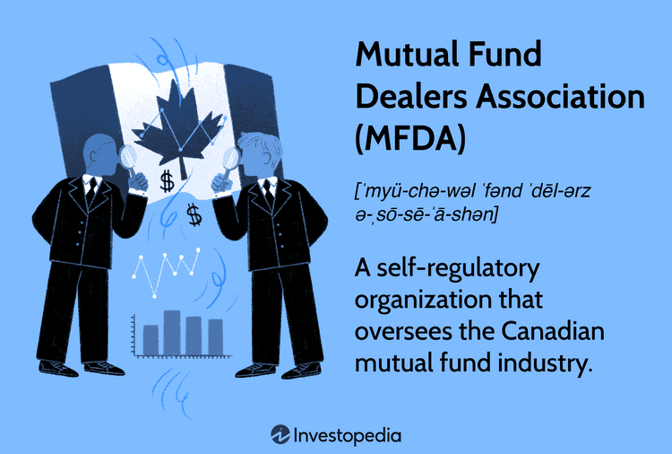

The evolution of financial markets has been significantly influenced by the advent of algorithmic trading, an innovation that has brought about increased efficiency, speed, and precision in executing trades. This transformation has not only affected stock exchanges but has also had profound effects on the mutual funds sector. Mutual funds, which pool money from multiple investors to purchase securities, find themselves at a crossroads as they adapt to the sophisticated landscape introduced by algorithmic strategies.

In Canada, the Mutual Fund Dealers Association (MFDA) is a pivotal entity responsible for overseeing the activities of mutual fund dealers. Established as a self-regulatory organization, the MFDA's primary mission is to regulate the operations of its members by setting and enforcing rules, thereby ensuring fair and efficient market conduct. With over $700 billion in client assets under its umbrella and nine million Canadian households as its clientele, the MFDA's role in fostering trust and integrity in the mutual fund industry is indisputable.

As algorithmic trading becomes increasingly intertwined with financial operations, understanding the regulations that the MFDA employs to govern these technologies is essential for market participants. The repercussions of algorithmic trading necessitate a regulatory framework that balances innovation with investor protection. This article examines the MFDA's regulatory architecture and its impact on the activities of mutual fund dealers, especially those engaging in algorithmic trading systems. The discussion extends to encompass the history, pivotal functions, and strategic initiatives of the MFDA, providing a comprehensive view of how regulation shapes the evolving financial ecosystem.

## Table of Contents

## What is the Mutual Fund Dealers Association (MFDA)?

The Mutual Fund Dealers Association (MFDA) is a pivotal self-regulatory organization in Canada that oversees the activities of mutual fund dealers. Established to uphold rigorous standards of professional conduct and financial health, the MFDA is recognized by all provincial securities commissions across Canada, ensuring an equitable and efficient marketplace for mutual fund operations.

The MFDA is tasked with a substantial responsibility, as it represents an enormous market segment of over $700 billion in client assets. This figure indicates the organization's broad influence and its critical role in protecting the financial interests of approximately nine million Canadian households. Given its expansive reach and authority, the MFDA's regulatory framework is designed to foster a climate of trust and credibility within the mutual fund industry, which is essential for maintaining public confidence.

One of the MFDA's paramount objectives is to reinforce this public trust by ensuring that mutual fund dealers operate with integrity, transparency, and accountability. By monitoring compliance with established regulations, the MFDA seeks to safeguard investors and promote market stability. This oversight is achieved through a comprehensive set of guidelines that mutual fund dealers are required to follow, aiming to preserve the integrity and credibility of the Canadian mutual fund market.

## The Role of the MFDA in Regulating Mutual Fund Dealers

The Mutual Fund Dealers Association (MFDA) establishes regulations and compliance standards that are integral to the functioning of mutual fund dealers in Canada. These standards are primarily designed to safeguard investor interests and ensure the overall integrity of the financial markets. The MFDA mandates that compliance with its regulations is obligatory for all mutual fund dealers operating within recognized provinces. This requirement underscores the MFDA's commitment to upholding a fair, transparent, and stable investment environment.

The MFDA's regulatory purview includes a collaborative relationship with the Autorité des marchés financiers (AMF) in Québec. This collaboration enhances the regulatory framework by ensuring that mutual fund dealers adhere to both provincial and national standards. Such cooperation is particularly significant in harmonizing regulatory practices across Canada, thereby minimizing discrepancies that could arise from differing provincial regulations.

Furthermore, the MFDA's standards are comprehensive, covering various aspects of a dealer's operations, including financial compliance, sales practices, and risk management protocols. These regulations are geared toward creating an environment where investors can have confidence in the mutual fund market, knowing that their interests are being protected by stringent oversight mechanisms.

In summary, the MFDA plays a critical role in regulating mutual fund dealers by enforcing regulations that protect investors and maintain market integrity. Its authority, exercised in conjunction with provincial bodies like the AMF, ensures a consistent and robust regulatory framework across Canada.

## Strategic Initiatives by the MFDA: Education and Compliance

The Mutual Fund Dealers Association (MFDA) outlined significant strategic initiatives concerning education and compliance in its 2018-2022 Strategic Plan. A key component of this plan is the mandate for continuing education for mutual fund advisors. These mandates are crucial for ensuring that advisors are equipped with current knowledge and skills, enabling them to effectively serve investors and adhere to regulatory standards.

The MFDA’s approach to continuing education reflects a broader trend among regulatory bodies, aiming to align its education requirements with industry standards. This is done to ensure that the knowledge base of advisors remains relevant in an evolving financial landscape. By fostering continuous learning, the MFDA seeks to enhance the professionalism within the industry, contributing to increased investor confidence and trust.

One of the primary goals of these initiatives is to mitigate risks in the mutual fund sector. By imposing structured educational requirements, the MFDA ensures that advisors are better prepared to navigate complex financial scenarios and regulatory norms. This preparation, in turn, helps in preventing potential missteps that could lead to significant investor losses or legal challenges.

Furthermore, the MFDA’s emphasis on education and compliance not only focuses on reactive measures but also on proactive strategies. By equipping advisors with up-to-date regulatory knowledge and financial insights, it anticipates and addresses issues before they escalate, thereby maintaining market integrity and protecting investor interests.

In summary, the MFDA’s strategic initiatives regarding education and compliance are integral to maintaining high standards in the mutual fund industry. By promoting continuous learning and aligning educational mandates with industry benchmarks, the MFDA enhances professionalism and mitigates risks, ensuring a robust financial environment for investors.

## Algorithmic Trading and its Implications for Mutual Fund Dealers

Algorithmic trading has become a fundamental aspect of modern financial markets, offering significant advantages in terms of speed, precision, and cost-effectiveness. By automating trade processes and reducing human errors, [algorithmic trading](/wiki/algorithmic-trading) enhances operational efficiency and market [liquidity](/wiki/liquidity-risk-premium). Nevertheless, the integration of such technology within mutual fund dealers poses distinct challenges that necessitate rigorous regulatory oversight to maintain market integrity and protect investors.

The Mutual Fund Dealers Association (MFDA) enforces specific regulations to govern how mutual fund dealers utilize algorithmic trading systems. These regulations ensure that the deployment of these systems does not compromise the financial market's stability or the investors' interests. The regulatory framework mandates that mutual fund dealers adopt comprehensive risk management practices, ensuring that algorithmic strategies align with the overall trading policies and objectives of the dealers. Proper algorithms should be thoroughly tested, monitored, and documented to ensure they function as intended and can adapt to market changes without inducing undue risk.

Understanding the conduct rules established by the MFDA is essential for mutual fund dealers employing algorithmic strategies. These rules require dealers to maintain robust supervisory, operational, and compliance structures to mitigate the risks associated with algorithmic trading. Implementing effective controls helps in identifying and rectifying any system malfunctions or unusual trading activities promptly. For example, automated systems should include kill-switches or similar mechanisms to halt trading during abnormalities, thus safeguarding against potential market disruption.

Mutual fund dealers must also ensure that they possess the necessary technological infrastructure and expertise to handle the complexities of algorithmic trading. This includes hiring qualified personnel to oversee algorithm implementation, interpret data, and make informed decisions regarding trading adjustments. Continuous education and training programs are vital for the traders and the support teams to remain current with technological advances and regulatory updates.

In summary, while algorithmic trading introduces numerous benefits to the mutual fund industry, its implications necessitate vigilant regulatory oversight by entities such as the MFDA. Mutual fund dealers must comprehensively understand and adhere to the conduct rules, employing stringent measures to mitigate risks and ensure the protection of both the market and the investors.

## Recent Developments and Challenges in the Regulatory Landscape

The Mutual Fund Dealers Association (MFDA) has faced recent developments and challenges in its regulatory landscape, reflecting the dynamic nature of the financial markets and the increasing complexity introduced by new trading technologies. One significant development was the withdrawal of proposals concerning discretionary trading and the use of business titles. These proposals had aimed to address concerns around the clarity and suitability of titles used by advisors, which could potentially mislead investors regarding the nature and scope of services provided. The retraction indicates an ongoing need to reassess strategies that ensure enhanced transparency and investor protection without imposing unnecessary constraints.

Additionally, the regulatory environment is set to undergo transformation with the establishment of a new single self-regulatory organization (SRO) in Canada, as announced by the Canadian Securities Administrators (CSA) [source](https://www.securities-administrators.ca/). This new body will combine the functions of existing SROs, including the MFDA, in a move meant to streamline oversight and improve public confidence in the financial system. The integration is expected to usher in a harmonization of regulatory practices and policies across the country, although specific details and timelines regarding its implementation remain in flux.

Simultaneously, the proliferation of algorithmic trading presents additional regulatory challenges that necessitate ongoing vigilance. Algorithmic trading—defined as the use of computer algorithms to automate and optimize trading decisions—has revolutionized trading by increasing speed and reducing human error. However, it also introduces risks such as increased market [volatility](/wiki/volatility-trading-strategies) and systemic vulnerabilities. The MFDA recognizes the necessity of regulating how mutual fund dealers implement these technologies, aiming to strike a balance between fostering innovation and maintaining robust investor protection. As algorithmic strategies become more sophisticated, the MFDA must continuously adapt its regulatory framework to address potential risks such as algorithmic malfunctions or manipulative trading behaviors.

The evolving landscape of algorithmic trading, combined with the structural changes in regulatory frameworks, underscores the need for mutual fund dealers to remain adaptable. Staying informed on these developments is crucial for ensuring compliance and safeguarding the integrity of the mutual fund industry.

## Conclusion

The Mutual Fund Dealers Association (MFDA) remains pivotal in the regulation of the mutual fund industry, especially as it navigates the complexities introduced by technological advancements such as algorithmic trading. The MFDA's regulatory framework is designed to uphold market integrity, ensuring that innovation does not compromise investor protection. This balance is crucial as algorithmic trading offers substantial efficiency gains yet presents challenges related to transparency, execution quality, and market fairness.

As the mutual fund industry evolves, so do the regulations that govern it. For mutual fund dealers, staying compliant with these evolving regulations is not just a legal obligation but essential for maintaining trust with clients. The MFDA's rules and guidelines serve as a blueprint for ethical conduct and operational robustness in an increasingly automated trading environment. Dealers must be proactive in understanding and implementing these changes, employing strategic foresight to foresee potential regulatory shifts.

Adapting to regulatory changes requires not only attention to the current guidelines but also a preparedness for future developments. Mutual fund dealers are encouraged to engage in continuous education and training, as emphasized by the strategic initiatives laid out by the MFDA. This vigilance ensures that they can effectively manage risks while capitalizing on the opportunities that technological innovations present. In sum, the symbiotic relationship between regulation and technology in the mutual fund industry underscores the necessity for both caution and agility in navigating the financial landscape.

## References & Further Reading

[1]: ["Mutual Fund Dealers Association of Canada"](https://en.wikipedia.org/wiki/Mutual_Fund_Dealers_Association) - Official website of the MFDA providing resources and information about their regulatory framework.

[2]: Aldridge, I. (2013). ["High-Frequency Trading: A Practical Guide to Algorithmic Strategies and Trading Systems"](https://www.amazon.com/High-Frequency-Trading-Practical-Algorithmic-Strategies/dp/1118343506) - A comprehensive guide detailing algorithmic trading strategies and regulatory considerations.

[3]: De Prado, M. L. (2018). ["Advances in Financial Machine Learning"](https://www.amazon.com/Advances-Financial-Machine-Learning-Marcos/dp/1119482089) - A book exploring the impact of machine learning on financial markets and trading.

[4]: ["Canadian Securities Administrators (CSA)"](https://www.securities-administrators.ca/) - Provides updates on Canadian regulatory developments including the integration of regulatory bodies.

[5]: Chan, E. P. (2009). ["Quantitative Trading: How to Build Your Own Algorithmic Trading Business"](https://github.com/ftvision/quant_trading_echan_book) - Practical insights into constructing an algorithmic trading business, relevant for mutual fund dealers adapting to new technologies.