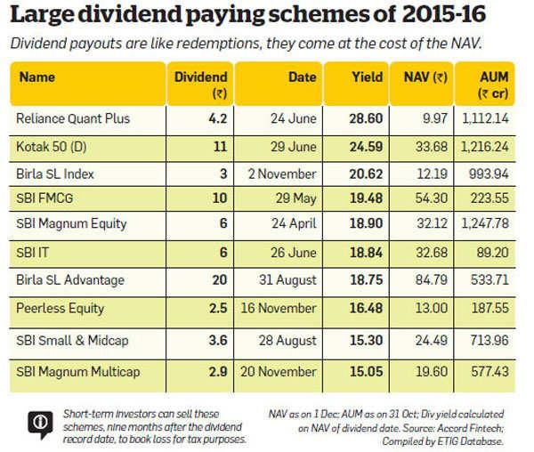

In today's dynamic financial landscape, investors constantly seek options that offer both security and growth potential. A dynamic approach to investing is crucial to meet both short-term income needs and long-term wealth accumulation. By combining different investment strategies, investors can enhance income and build a robust portfolio capable of weathering market fluctuations. This article examines dividends, mutual fund investments, and algorithmic trading as key components of a diversified investment strategy.

Dividends are a direct source of income for investors, signifying a company's profitability and financial health. They provide a regular income stream, enhancing the stability of an investment portfolio. Mutual funds, on the other hand, offer diversification and professional management, which can appeal to investors aiming for steady returns without the need for in-depth market analysis. This allows investors to benefit from a wide array of investment sources without having to manage each asset individually.



Algorithmic trading introduces a modern twist to investment by using technology for precise and swift trade executions, optimizing the opportunity to capitalize on short-term market movements. It automates trading strategies based on predefined criteria, offering potential gains through enhanced market efficiency and risk management.

By understanding how dividends, mutual funds, and algorithmic trading can contribute to income generation, investors can align these strategies with their financial goals. The interplay of these approaches allows individuals to tailor their portfolios, enhancing returns while managing risk. This article aims to provide clarity on optimizing investment strategies for both novice and seasoned investors, ensuring a well-rounded and informed approach to achieving financial goals.

## Table of Contents

## Understanding Dividends and Their Role in Investment Income

Dividends serve as a crucial component for investors seeking regular income from their investments. They represent a portion of a company’s earnings distributed to shareholders and are typically issued by established firms with stable earnings. Through dividends, investors receive a steady payment, usually on a quarterly basis, which can either be reinvested to purchase additional shares or taken as income.

### Basics of Dividends

Companies issue dividends as a way to return value to their shareholders. The decision to pay a dividend, and its size, is determined by the company’s board of directors and reflects the company’s profitability and strategic use of cash. The dividend yield, calculated as the annual dividend payment divided by the stock’s price, provides a measure of the income generated relative to the investment value. For example, if a stock with a price of $100 per share pays an annual dividend of $5, the dividend yield is 5%.

### Appeal to Income-Focused Investors

For investors prioritizing income over growth, dividend-paying stocks can be appealing for several reasons. They offer a predictable revenue stream, which is essential for retirees or those seeking steady cash flow. Additionally, dividend stocks often belong to established companies with lower [volatility](/wiki/volatility-trading-strategies), providing a degree of safety during economic downturns. Mutual funds or exchange-traded funds (ETFs) focused on dividends can enhance diversification, spreading risk across multiple companies and sectors.

### Types of Dividend-Paying Assets

1. **Stocks**: Many public companies distribute dividends, but not all. Dividend Aristocrats, a group of companies with a history of increasing dividends annually over 25 years, are often targeted by income-focused investors.

2. **Mutual Funds and ETFs**: These funds offer collective investment by pooling resources to invest in a diversified portfolio of dividend-paying stocks. They provide professional management and diversification benefits, which can reduce individual investment risk while maintaining steady income flows.

### Tax Implications and Risks

Dividend income is subject to taxation, which affects net returns. In the United States, qualified dividends are taxed at the more favorable long-term capital gains tax rate, while ordinary dividends are taxed as regular income. Understanding the difference between these can significantly impact the after-tax income from dividends. Furthermore, while dividends can imply a company’s financial health, a reduction or cut may signal potential trouble, leading to stock price decline and impacting income.

### Complementing Investment Income Sources

Dividends can effectively complement other income-generating investments within a portfolio, such as bonds or real estate. While bonds provide fixed interest payments, dividends can offer growth in payout over time, adjusted for inflation. A balanced portfolio may allocate resources across various asset types, potentially increasing total income while mitigating risk. By understanding how dividends integrate with broader financial strategies, investors can enhance their portfolio’s income potential, preserving long-term value and growth.

## Exploring Mutual Funds for Steady Returns

Mutual funds have gained popularity among investors due to their ability to provide diversification and the benefit of professional management. They pool money from many investors to purchase a diverse range of securities, which can include stocks, bonds, and other financial instruments. This diversification helps mitigate risk as the performance is spread across various assets, potentially reducing the impact of a poor-performing individual security on the overall portfolio.

One of the primary benefits of investing in mutual funds is the accessibility they provide to a wide array of investment strategies that might otherwise be unattainable for individual investors with limited capital. Among these, mutual funds focused on dividend income are particularly attractive to those seeking regular income streams. Dividend-focused mutual funds invest in companies known for paying regular dividends, allowing investors to benefit from a consistent income along with potential capital appreciation.

There are various types of mutual funds, each catering to different investor needs and risk appetites. Equity income funds, for example, primarily invest in dividend-paying stocks and aim to provide a balance between income and growth. Balanced funds take a slightly different approach by investing in both stocks and bonds, offering a mix of income generation from dividends and interest payments with the potential for growth through equity investments. This asset allocation makes them suitable for investors looking for stability and income with a moderate level of risk.

When considering mutual fund investments, it is crucial for investors to assess performance metrics and be aware of the fees associated with these funds. Performance metrics such as the fund's return history, volatility, and benchmark comparison can provide valuable insights into the fund's past and potential future performance. Fees, including management expense ratios (MER), load fees, and redemption fees, can significantly affect net returns and should be carefully evaluated. Higher fees can erode investment gains over time, so understanding and comparing these can help in maximizing returns.

Selecting the right mutual fund involves aligning its objectives with the investor’s broader financial strategies. This requires a thorough understanding of one’s financial goals, risk tolerance, and time horizon. By carefully choosing mutual funds that align with these factors, investors can enhance their income-generation potential and achieve their financial objectives. Additionally, regular review and reevaluation of mutual fund investments are necessary to adapt to changing financial circumstances and market conditions, ensuring the investment strategy remains optimal. 

In conclusion, mutual funds offer a versatile and professionally managed investment avenue that can contribute significantly to a diversified investment portfolio. When chosen wisely, they not only provide steady returns through dividend income but also support the investor's overall financial strategy in achieving both income and growth prospects.

## Algorithmic Trading: A Modern Twist on Investment Strategies

Algorithmic trading, often referred to as algo trading, uses computer programs to execute trades at speeds and frequencies that would be impossible for a human trader. These programs follow predefined criteria, such as timing, price, or quantity, allowing for precise and rapid decision-making. Over recent years, [algorithmic trading](/wiki/algorithmic-trading) has gained significant popularity among retail and institutional investors due to its potential to optimize transactions and manage risks effectively.

### Basics of Algorithmic Trading

Algorithmic trading involves creating a mathematical model to define trading strategies. These models can analyze a vast amount of market data much faster than human computation allows. Once the data is processed, the model can buy or sell assets based on its programmed logic. Common algorithmic strategies include [trend following](/wiki/trend-following), [arbitrage](/wiki/arbitrage), and [market making](/wiki/market-making), among others. For example, a simple trend-following algorithm might execute a buy order when a stock's moving average crosses above a certain threshold.

```python
# Example of a basic trend-following strategy in Python

import pandas as pd

def simple_moving_average_strategy(data, short_window=40, long_window=100):
    signals = pd.DataFrame(index=data.index)
    signals['signal'] = 0.0
    signals['short_mavg'] = data['Close'].rolling(window=short_window, min_periods=1, center=False).mean()
    signals['long_mavg'] = data['Close'].rolling(window=long_window, min_periods=1, center=False).mean()

    # Generate trading signals
    signals['signal'][short_window:] = np.where(signals['short_mavg'][short_window:] 
                                                 > signals['long_mavg'][short_window:], 1.0, 0.0)   

    # Generate trading orders
    signals['positions'] = signals['signal'].diff()

    return signals
```

### Optimizing and Diversifying Portfolios

A critical advantage of algorithmic trading is its capability to optimize and diversify portfolios. Algorithms can process complex datasets and discover patterns or anomalies, which might be missed by manual analysis. By reallocating assets based on these findings, investors can potentially increase their returns and minimize risks. This approach is particularly beneficial in volatile markets, where human emotions can lead to irrational trading decisions.

Furthermore, algorithms can automatically rebalance portfolios to maintain a desired asset mix, ensuring that the investor's risk profile is consistently managed according to their preferences. This automation reduces the need for constant manual adjustments and allows investors to take advantage of market opportunities as they arise.

### Risks and Challenges of Algorithmic Trading

While algorithmic trading offers many benefits, it also comes with risks and challenges. Market volatility can lead to rapid price changes that might exceed the parameters set by an algorithm, resulting in unexpected losses. Additionally, over-reliance on historical data can cause algorithms to fail in unanticipated market conditions. Hence, it is crucial for investors to regularly update and test their algorithms to ensure they remain effective.

The complexity of algorithmic trading platforms also requires a solid understanding of programming and quantitative analysis. Errors in coding or model development can lead to significant financial repercussions. As such, investors must ensure thorough testing and validation procedures before deploying algorithms in live markets.

### Strategic Integration for Enhanced Returns

Incorporating algorithmic trading into an investment strategy can enhance returns, yet it needs thorough planning and execution. Investors should start by determining their financial goals and risk tolerance before designing or selecting appropriate algorithms. A well-rounded approach often involves using a combination of strategies to capture diverse market opportunities and hedge against potential risks.

Additionally, staying informed about technological advancements and market regulations is essential for maintaining an effective algorithmic trading strategy. Continuous education and adaptation help investors remain agile and responsive to changes in the financial landscape, ultimately leading to better decision-making and improved investment outcomes.

In summary, algorithmic trading represents a modern and efficient approach to executing trades and managing portfolios. By harnessing the power of technology, investors can achieve greater precision, speed, and flexibility in their trading activities, provided they understand the inherent risks and implement robust risk management protocols.

## Synergizing Investment Strategies for Optimal Income

Combining dividends, mutual funds, and algorithmic trading can create a potent investment strategy tailored to meet specific financial objectives. By integrating these components, investors can achieve a balance between income generation and growth while managing risk effectively.

### Complementarity of Strategies

Dividends provide a reliable income stream and signify the financial health of a company. When combined with mutual funds, which offer diversification and professional management, the synergy can amplify returns. Mutual funds, particularly those focusing on dividend income, enable investments across a broad spectrum of dividend-yielding assets. This diversification reduces idiosyncratic risk associated with individual stocks.

Algorithmic trading adds another layer by using technology to execute trades based on predefined criteria. It enhances precision and speed in capitalizing on market movements. In doing so, it minimizes human error and emotional biases often associated with trading decisions, offering a systematic approach to portfolio optimization.

### Tailoring Strategies to Financial Objectives

Each investor’s goals are unique, and these strategies can be tailored to align with individual financial aspirations. For example, an investor seeking steady income might prioritize high dividend-yield mutual funds and use algorithms to optimize the timing of reinvestments. Alternatively, a growth-focused strategy might use algorithms to identify undervalued stocks with potential for dividend increases and invest in growth-oriented mutual funds.

### Case Studies and Successful Outcomes

Consider a case study where an investor integrates these strategies:

1. **Dividend Reinvestment**: The investor utilizes a dividend reinvestment plan (DRIP) with mutual funds, allowing dividends to purchase additional fund shares automatically. This compounding effect magnifies growth over time.

2. **Algorithmic Portfolio Rebalancing**: The investor implements an algorithm that periodically rebalances the portfolio. By adjusting allocations based on market conditions, the algorithm ensures the portfolio remains aligned with the investor’s risk tolerance and objectives.

3. **Adaptive Market Strategies**: During volatile market conditions, the investor employs algorithms to shift focus between high dividend-yield stocks and growth-oriented mutual funds, taking advantage of market dynamics to optimize returns.

### Importance of Regular Evaluation

Market conditions are ever-changing, necessitating regular evaluation of investment strategies. Investors should assess the performance of dividends, mutual funds, and algorithmic trading methods to ensure they align with macroeconomic indicators and personal financial goals. Adjustments should be made to mitigate risks and exploit new opportunities.

Python, as a preferred language for algorithmic trading, can be used to create scripts for market analysis, portfolio management, and trade execution. Using libraries such as NumPy and pandas, investors can analyze historical data to develop and backtest trading algorithms:

```python
import pandas as pd
import numpy as np
import matplotlib.pyplot as plt

# Sample code to simulate portfolio optimization
data = pd.read_csv('historical_data.csv')
returns = data.pct_change().mean() * 252
cov_matrix = data.pct_change().cov() * 252

weights = np.array([0.4, 0.3, 0.3]) # Sample allocation between dividend stocks, mutual funds, and cash
portfolio_return = np.dot(weights, returns)
portfolio_volatility = np.sqrt(np.dot(weights.T, np.dot(cov_matrix, weights)))

print(f'Expected Portfolio Return: {portfolio_return}')
print(f'Expected Portfolio Volatility: {portfolio_volatility}')
```

### Building Sustainable Wealth

The integration of dividends, mutual funds, and algorithmic trading offers a comprehensive approach to maximizing income potential and building sustainable wealth. By leveraging the benefits of each strategy, investors can construct a robust portfolio that not only meets immediate financial needs but also secures long-term prosperity.

## Conclusion

In integrating dividends, mutual fund investments, and algorithmic trading, investors find a potent avenue for generating income. Each of these strategies brings distinct advantages and risks, and careful consideration is necessary to construct a robust and balanced portfolio. Dividends offer a steady stream of income and reflect a company's financial stability, while mutual funds provide diversification and professional management. Meanwhile, algorithmic trading introduces precision and speed into investment tactics, enhancing portfolio effectiveness.

The continuous evolution of financial markets necessitates that investors remain informed and adaptable. Keeping abreast of market trends, regulatory changes, and technological advancements is integral to fine-tuning investment strategies. This ongoing education helps investors leverage their strategies to capitalize on opportunities and mitigate risks effectively.

Despite the diverse nature of these strategies, their combined utilization creates a harmonized investment approach. This synergy supports long-term financial goals by offering stability through dividends, growth via mutual funds, and strategic agility through algorithmic trading.

Investing is inherently personal, with no universal strategy fitting every investor's needs. Embracing a combination of dividends, mutual funds, and algorithmic trading can result in a more rewarding financial journey. By customizing investment portfolios to align with individual objectives, investors can optimize their income potential and secure sustainable wealth over time.

## References & Further Reading

[1]: Bergstra, J., Bardenet, R., Bengio, Y., & Kégl, B. (2011). ["Algorithms for Hyper-Parameter Optimization."](https://papers.nips.cc/paper/4443-algorithms-for-hyper-parameter-optimization) Advances in Neural Information Processing Systems 24.

[2]: ["Advances in Financial Machine Learning"](https://www.amazon.com/Advances-Financial-Machine-Learning-Marcos/dp/1119482089) by Marcos Lopez de Prado

[3]: ["Evidence-Based Technical Analysis: Applying the Scientific Method and Statistical Inference to Trading Signals"](https://www.amazon.com/Evidence-Based-Technical-Analysis-Scientific-Statistical/dp/0470008741) by David Aronson

[4]: ["Machine Learning for Algorithmic Trading"](https://github.com/PacktPublishing/Machine-Learning-for-Algorithmic-Trading-Second-Edition) by Stefan Jansen

[5]: ["Quantitative Trading: How to Build Your Own Algorithmic Trading Business"](https://www.amazon.com/Quantitative-Trading-Build-Algorithmic-Business/dp/1119800064) by Ernest P. Chan