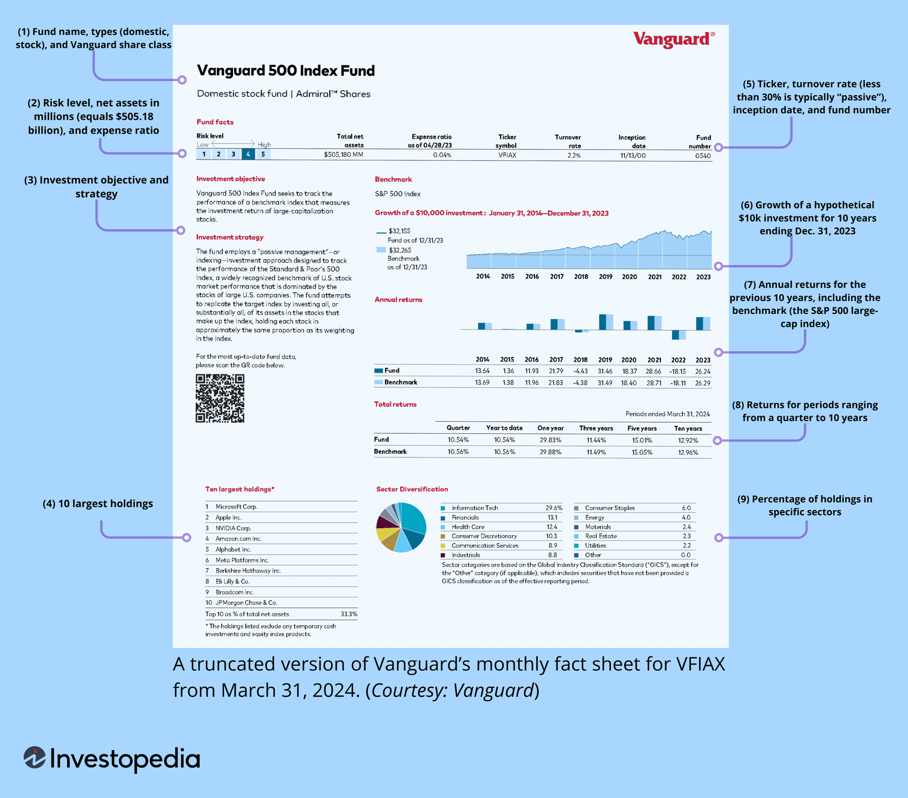

## Table of Contents

## What is a mutual fund fact sheet?

A mutual fund fact sheet is a document that provides important information about a mutual fund. It is usually created by the fund company and is meant to help investors understand what the fund invests in, how it has performed, and other key details. The fact sheet is often updated monthly or quarterly, so investors can keep track of how the fund is doing over time.

The fact sheet typically includes details like the fund's investment objective, which explains what the fund aims to achieve. It also shows the fund's performance over different time periods, like one year, three years, or five years. Other information might include the fund's fees, the names of the fund managers, and a breakdown of what the fund is invested in, such as stocks, bonds, or other assets. This helps investors make informed decisions about whether the fund is right for their investment goals.

## Why are mutual fund fact sheets important for investors?

Mutual fund fact sheets are important for investors because they give a clear picture of what a fund is all about. They tell you what the fund aims to do, like growing your money or providing steady income. They also show you where the fund puts its money, whether it's in stocks, bonds, or other things. This helps you understand if the fund matches what you want to achieve with your investments.

Another reason fact sheets are helpful is that they show how the fund has been doing over time. You can see how it performed over the last year, three years, or even longer. This information can help you decide if the fund is a good choice based on its past results. Plus, fact sheets tell you about the fees you'll have to pay and who is managing the fund, which are important details to consider before investing.

## What key information is typically included in a mutual fund fact sheet?

A mutual fund fact sheet usually includes the fund's investment objective, which tells you what the fund is trying to achieve. It might aim to grow your money over time or provide regular income. The fact sheet also shows you what the fund is invested in, like stocks, bonds, or other assets. This helps you see if the fund matches your investment goals. You'll also find information about the fund's fees, which are the costs you'll have to pay for investing in the fund.

The fact sheet also gives you a look at the fund's performance over different time periods, like one year, three years, or five years. This helps you understand how well the fund has been doing. You'll see the names of the people managing the fund, which can be important if you want to know who is making the investment decisions. All this information helps you make a smart choice about whether to invest in the fund.

## How often are mutual fund fact sheets updated?

Mutual fund fact sheets are usually updated every month or every three months. This means you can get new information about the fund pretty often, which helps you keep track of how it's doing.

These updates are important because they give you the latest details on the fund's performance, what it's invested in, and any changes in fees or management. By checking the fact sheet regularly, you can make better decisions about your investments.

## Where can investors find mutual fund fact sheets?

Investors can find mutual fund fact sheets on the website of the company that manages the fund. Most big fund companies have a section on their site where they list all their funds, and you can click on each one to see its fact sheet. Sometimes, you can also find them by searching for the fund's name along with the words "fact sheet" on a search engine.

Another place to look is on financial websites that gather information about lots of different funds. Websites like Morningstar or Yahoo Finance often have fact sheets for many mutual funds. These sites can be really helpful if you want to compare different funds side by side.

If you have money invested with a financial advisor or a broker, they can also give you fact sheets for the funds you're interested in. They might even send them to you regularly to keep you updated on your investments.

## How can a beginner interpret the data in a mutual fund fact sheet?

When you look at a mutual fund fact sheet for the first time, start with the investment objective. This part tells you what the fund is trying to do, like making your money grow over time or giving you regular income. It's important to see if this matches what you want from your investments. Next, check the section about what the fund is invested in. It will show you if the fund has mostly stocks, bonds, or other things. This helps you understand if the fund fits with your comfort level for risk. If you're new to investing, you might want a fund with less risk, like one that focuses more on bonds.

The performance section is also key. It shows how the fund has done over different time periods, like one year, three years, or five years. Look at these numbers to see if the fund has been doing well or not. Remember, past performance doesn't guarantee future results, but it can give you an idea. Don't forget to check the fees. These are the costs you'll pay for being in the fund, and they can affect how much money you keep in the end. Lower fees are usually better, especially if you're planning to keep your money in the fund for a long time.

Lastly, take a look at who is managing the fund. The fact sheet will list the names of the fund managers. It's good to know who is making the decisions about where your money goes. If you're curious, you can even look up more about these managers to see if they have a good track record. By understanding these parts of the fact sheet, you can make a smarter choice about whether to invest in the fund.

## What are the differences between fact sheets of equity, bond, and hybrid funds?

Fact sheets for equity, bond, and hybrid funds share some common information, but they also have differences based on what each type of fund invests in. Equity fund fact sheets focus on stocks. They show you which companies the fund has invested in, how much of the fund is in different sectors like technology or healthcare, and how the fund's stock investments have performed over time. You'll also see details like the fund's price-to-earnings ratio, which helps you understand if the stocks in the fund are seen as expensive or cheap compared to their earnings. Bond fund fact sheets, on the other hand, focus on bonds. They tell you about the types of bonds the fund holds, like government or corporate bonds, their average credit quality, and how long it will take for the bonds to mature. They also show the fund's yield, which is how much income you might get from the bonds.

Hybrid fund fact sheets combine information from both equity and bond funds because these funds invest in a mix of stocks and bonds. You'll see details about the stock portion, like the sectors and companies the fund is invested in, as well as information about the bond portion, like the types of bonds and their credit quality. The fact sheet will also show you the balance between stocks and bonds in the fund, which can change over time based on the fund manager's decisions. By looking at these different sections, you can understand how the hybrid fund tries to balance growth from stocks with stability from bonds.

## How do performance metrics on a fact sheet help in evaluating a mutual fund?

Performance metrics on a mutual fund fact sheet help you see how well the fund has done over time. They show you numbers for different periods, like one year, three years, or five years. This helps you understand if the fund has been growing your money or not. You can compare these numbers to see if the fund is doing better or worse than other funds or a general market index. This way, you can tell if the fund is a good choice for your investment goals.

These metrics also give you a sense of how steady or risky the fund is. For example, if the fund's returns go up and down a lot, it might be riskier than a fund with more stable returns. The fact sheet might also show something called the "standard deviation," which tells you how much the fund's returns change from year to year. By looking at these performance metrics, you can decide if the fund fits with how much risk you're willing to take and if it's likely to help you reach your financial goals.

## What role do risk measures play in a mutual fund fact sheet?

Risk measures on a mutual fund fact sheet help you understand how safe or risky the fund is. They tell you about the chance that your investment might lose value. One common risk measure is the standard deviation, which shows how much the fund's returns can change from year to year. A higher standard deviation means the fund's returns can swing a lot, making it riskier. A lower standard deviation means the returns are more stable, so the fund might be less risky.

Another important risk measure is the fund's beta. This number tells you how the fund moves compared to the overall market. A beta of 1 means the fund moves the same as the market. A beta higher than 1 means the fund might go up or down more than the market, which is riskier. A beta lower than 1 means the fund might be less risky because it doesn't move as much as the market. By looking at these risk measures, you can decide if the fund fits with how much risk you're willing to take with your money.

## How can advanced investors use the portfolio composition details in a fact sheet for deeper analysis?

Advanced investors can use the portfolio composition details in a mutual fund fact sheet to get a deeper understanding of what the fund is invested in and how it might perform in the future. By looking at the breakdown of the fund's holdings, they can see if the fund is heavily invested in certain sectors or companies. This helps them judge if the fund is diversified enough or if it's too focused on a few areas, which could be risky. They can also check if the fund's investments match their own investment strategy or if they need to look for a different fund that better fits their goals.

In addition, advanced investors can analyze the portfolio's asset allocation, like the mix of stocks, bonds, and other assets, to see how the fund balances growth and stability. They can use this information to predict how the fund might react to different market conditions. For example, if the fund has a lot of stocks from tech companies, it might do well when tech stocks are popular but could suffer if the tech sector has a downturn. By understanding the portfolio composition, advanced investors can make more informed decisions about whether to keep their money in the fund or move it elsewhere.

## What are some common pitfalls or misinterpretations to avoid when reading a mutual fund fact sheet?

One common pitfall when reading a mutual fund fact sheet is focusing too much on past performance. Just because a fund did well in the past doesn't mean it will do the same in the future. Markets change, and what worked before might not work again. So, don't pick a fund just because it had high returns last year. Look at other things like the fund's investment strategy and how it fits with your goals.

Another mistake is ignoring the fees. Fees can eat into your returns over time, so it's important to understand what you're paying. Some people might overlook the expense ratio or other costs listed on the fact sheet. Always compare the fees of different funds to make sure you're not paying too much. Remember, lower fees can make a big difference in the long run.

Lastly, don't overlook the risk measures. Some people might skip over details like standard deviation or beta, thinking they're too complicated. But these numbers tell you how risky the fund is. A fund with a high standard deviation might have big ups and downs, which could be too risky for you. Always check the risk measures to see if the fund matches your comfort level with risk.

## How can expert investors compare multiple mutual fund fact sheets to make informed investment decisions?

Expert investors can compare multiple mutual fund fact sheets by looking at key information like the investment objective, performance metrics, and fees. They start by checking if the funds' goals match their own investment strategy. For example, if they want growth, they'll look for funds aiming to increase in value over time. Then, they compare the funds' performance over different periods, like one, three, and five years. This helps them see which fund has been doing better. They also pay close attention to the fees. Lower fees can mean more money in their pocket over time, so they compare the expense ratios and other costs to find the most cost-effective option.

Another important part of the comparison is looking at the portfolio composition and risk measures. Expert investors analyze what each fund is invested in to see if it's diversified enough or too focused on certain sectors. They also look at how the fund balances stocks and bonds, which can affect its performance in different market conditions. Risk measures like standard deviation and beta are crucial too. These numbers tell them how much the fund's returns might change and how it moves with the market. By comparing these details across multiple fact sheets, expert investors can make informed decisions about which funds are the best fit for their investment goals and risk tolerance.

## What is the Importance of a Mutual Fund Fact Sheet?

A mutual fund fact sheet acts as a vital transparency tool for investors seeking to evaluate the appropriateness of a mutual fund for their investment needs. By laying out critical information in a clear and concise manner, these documents help investors assess the key characteristics of a fund.

One of the primary benefits of a fact sheet is its ability to present potential returns, often depicted through historical performance data. This data typically includes the fund's past returns over specific periods, such as one, three, and five years, as well as since inception. For example, a fact sheet may show a fund's annualized return of 8% over the past five years, allowing investors to compare this performance against benchmarks or other funds.

Risk assessment is another critical aspect highlighted in fact sheets. Mutual funds usually present their risk profile through various metrics, such as standard deviation or the Sharpe ratio. The standard deviation indicates the degree of variation in fund returns over a period, while the Sharpe ratio measures risk-adjusted returns, calculated as:

$$
\text{Sharpe Ratio} = \frac{R_p - R_f}{\sigma_p}
$$

where $R_p$ is the portfolio return, $R_f$ is the risk-free rate, and $\sigma_p$ is the standard deviation of the portfolio's excess return.

Fact sheets also detail the fees associated with the fund, including management fees, expense ratios, and any additional costs like sales loads or redemption fees. Understanding these fees is crucial as they directly impact net performance. For instance, a fund with a 1% management fee would require higher gross returns to achieve the same net performance as a similar fund with a 0.5% fee.

Becoming familiar with the content of a mutual fund fact sheet empowers investors to align their portfolio strategies with personal financial goals and risk tolerance. It enables them to make informed decisions by evaluating how well a fund's objectives, past performance, and risk/return profile fit within their overall investment strategy. Thus, the fact sheet is an indispensable resource for those seeking to build a portfolio that meets their individual requirements.

## References & Further Reading

[1]: Bergstra, J., Bardenet, R., Bengio, Y., & Kégl, B. (2011). ["Algorithms for Hyper-Parameter Optimization."](https://papers.nips.cc/paper/4443-algorithms-for-hyper-parameter-optimization) Advances in Neural Information Processing Systems 24.

[2]: ["Advances in Financial Machine Learning"](https://www.amazon.com/Advances-Financial-Machine-Learning-Marcos/dp/1119482089) by Marcos Lopez de Prado

[3]: ["Evidence-Based Technical Analysis: Applying the Scientific Method and Statistical Inference to Trading Signals"](https://www.amazon.com/Evidence-Based-Technical-Analysis-Scientific-Statistical/dp/0470008741) by David Aronson

[4]: ["Machine Learning for Algorithmic Trading"](https://github.com/stefan-jansen/machine-learning-for-trading) by Stefan Jansen

[5]: ["Quantitative Trading: How to Build Your Own Algorithmic Trading Business"](https://www.amazon.com/Quantitative-Trading-Build-Algorithmic-Business/dp/1119800064) by Ernest P. Chan