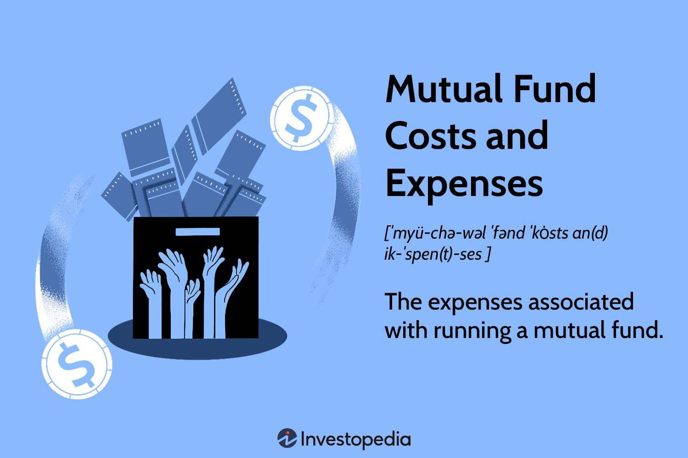

## Table of Contents

## What are mutual fund fees and expenses?

Mutual fund fees and expenses are costs that investors pay when they invest in mutual funds. These fees can affect the overall return on your investment. There are different types of fees, but the main ones are the expense ratio, sales charges, and other operational fees. The expense ratio is an annual fee that covers the costs of managing and operating the fund. It is expressed as a percentage of the fund's average net assets. Sales charges, also known as loads, are fees paid when you buy or sell shares of the fund. Other fees might include redemption fees, exchange fees, and account fees.

Understanding these fees is important because they can add up over time and reduce the amount of money you earn from your investment. For example, if a mutual fund has a high expense ratio, it means a larger portion of your investment goes towards covering the costs rather than growing your money. It's a good idea to compare the fees of different mutual funds before you decide to invest. By choosing funds with lower fees, you can keep more of your returns and potentially increase your long-term gains. Always read the fund's prospectus to get a clear picture of all the fees involved.

## Why do mutual funds charge fees?

Mutual funds charge fees to cover the costs of managing and operating the fund. These costs include paying the people who choose which investments to buy and sell, keeping records, and handling customer service. The fees also help pay for things like marketing the fund to new investors and keeping the fund's website and other services running smoothly. Without these fees, the mutual fund company wouldn't be able to provide the services that investors need.

The fees also help make sure the fund is managed well. For example, the people who manage the fund need to do a lot of research to pick the best investments. This research costs money, and the fees help cover those costs. If the fees are too high, it can eat into the money that investors could be [earning](/wiki/earning-announcement), so it's important for investors to look at the fees before choosing a fund. By understanding why fees are charged and comparing them across different funds, investors can make better choices about where to put their money.

## What is the difference between a load and no-load mutual fund?

A load mutual fund charges a fee when you buy or sell shares of the fund. This fee is called a sales load or simply a load. The load is used to pay the people who sell the fund, like financial advisors or brokers. There are different types of loads, like front-end loads that you pay when you buy the shares, and back-end loads that you pay when you sell the shares. These fees can make the fund more expensive, so they might affect how much money you make from your investment.

A no-load mutual fund does not charge a sales load when you buy or sell shares. This means you can invest in the fund without paying extra fees to brokers or advisors. No-load funds can be a good choice if you want to keep more of your money working for you instead of paying fees. But remember, even no-load funds might have other fees, like an expense ratio, so it's important to look at all the costs before you decide to invest.

## What is an expense ratio and how is it calculated?

An expense ratio is a fee that mutual funds charge every year to cover the costs of running the fund. It's like a yearly bill you pay just for owning the fund. The expense ratio is shown as a percentage of the fund's total assets. So, if a fund has an expense ratio of 1%, that means they take 1% of the fund's money each year to pay for things like managing the investments, keeping records, and customer service.

To calculate the expense ratio, you take all the yearly costs of running the fund and divide them by the fund's total assets. For example, if a fund spends $100,000 a year on costs and has $10 million in assets, the expense ratio would be $100,000 divided by $10 million, which equals 1%. This percentage is important because it affects how much money you keep from your investment. A lower expense ratio means more of your money stays in the fund, which can help your investment grow over time.

## How do front-end loads and back-end loads work?

A front-end load is a fee you pay when you buy shares of a mutual fund. It's like an entry fee. When you decide to invest in a fund with a front-end load, part of your money goes to this fee right away. For example, if you want to invest $1,000 and the front-end load is 5%, you'll pay $50 as a fee, and only $950 will actually go into the fund. This fee is used to pay the people who sell the fund, like financial advisors or brokers. It can make the fund more expensive, so it's something to think about before you invest.

A back-end load, on the other hand, is a fee you pay when you sell your shares of a mutual fund. It's like an [exit](/wiki/exit-strategy) fee. Sometimes, the back-end load gets smaller the longer you keep your money in the fund. For example, if you sell your shares within a year, you might pay a 5% fee, but if you wait five years, the fee might drop to 1%. This fee also goes to the people who sell the fund. Back-end loads can make it more expensive to take your money out of the fund, so it's important to know about them before you decide to invest.

## What are 12b-1 fees and what are they used for?

12b-1 fees are charges that some mutual funds add to cover the costs of marketing and selling the fund. These fees are named after the SEC rule that lets funds charge them. The fees are taken out of the fund's assets each year, and they are part of the fund's expense ratio. So, if a fund has a 12b-1 fee, it means a small part of the money in the fund is used to pay for things like ads, paying brokers, and other ways to get more people to invest in the fund.

These fees can make the fund more expensive for investors because they reduce the amount of money that stays in the fund to grow. Not all mutual funds have 12b-1 fees, so it's important to check if a fund has them before you invest. If a fund does have these fees, it's a good idea to think about how much they cost and if the fund is still a good choice for your money.

## How can management fees impact the overall performance of a mutual fund?

Management fees can have a big effect on how well a mutual fund does over time. These fees are what the fund charges to pay the people who manage it and take care of other costs. When a fund has high management fees, it means less of your money is left to grow. For example, if a fund earns 8% in a year but has a 2% management fee, you only get to keep 6% of the growth. Over many years, these fees can add up and take away a lot from what you could have earned.

It's important to look at the management fees when you're [picking](/wiki/asset-class-picking) a mutual fund. Funds with lower fees can help you keep more of your money, which can make a big difference in the long run. Imagine two funds that both make the same amount of money each year, but one has a lower management fee. The fund with the lower fee will grow more over time because more of the money stays in the fund. So, paying attention to management fees can help you choose funds that might give you better results in the end.

## What are the typical ranges for mutual fund fees and expenses?

Mutual fund fees and expenses can vary a lot, but there are some common ranges that you might see. The expense ratio, which is the yearly fee for running the fund, usually falls between 0.5% and 1.5% for actively managed funds. Index funds, which try to match the performance of a market index, often have lower expense ratios, typically between 0.05% and 0.5%. These percentages might seem small, but they can add up over time and affect how much money you make from your investment.

Other fees like sales loads can also make a big difference. Front-end loads, which you pay when you buy the fund, can range from 3% to 6% of your investment. Back-end loads, which you pay when you sell the fund, can start at around 5% but might go down the longer you keep your money in the fund. Some funds also have 12b-1 fees for marketing and distribution, which can be up to 1% per year. Knowing these ranges can help you pick funds that fit your budget and investment goals.

## How do mutual fund fees affect long-term investment returns?

Mutual fund fees can really change how much money you make over a long time. When you pay fees, less of your money stays in the fund to grow. For example, if a fund earns 8% in a year but has a 1% fee, you only get to keep 7% of the growth. Over many years, these fees can take away a lot from what you could have earned. If you invest for 20 or 30 years, even small fees can add up to a big amount of money that you miss out on.

It's smart to look at the fees before you pick a mutual fund. Funds with lower fees let you keep more of your money, which can make a big difference in the long run. Imagine two funds that both make the same amount of money each year, but one has lower fees. The fund with lower fees will grow more over time because more of your money stays in the fund. So, choosing funds with lower fees can help you end up with more money when you're ready to use it.

## What are some strategies to minimize mutual fund fees and expenses?

One good way to keep mutual fund fees low is to choose no-load funds. These funds don't charge you a fee when you buy or sell them, so more of your money goes into the fund instead of paying fees. Another thing you can do is look for funds with low expense ratios. These are the yearly fees that the fund charges to run the fund. Index funds often have lower expense ratios than actively managed funds, so they can be a good choice if you want to save on fees. Also, some funds might offer different share classes with different fee structures, so it's worth checking if you can switch to a class with lower fees.

Another strategy is to keep an eye on 12b-1 fees, which are used for marketing and distribution. If a fund has these fees, it can make the fund more expensive, so it's a good idea to pick funds that don't have them or have very low ones. You can also think about working with a fee-only financial advisor who doesn't get paid based on the funds they recommend. This can help you avoid funds with high sales loads because the advisor isn't making money from those fees. By being careful about the fees and choosing the right funds, you can keep more of your money working for you over the long term.

## How can investors compare the fees of different mutual funds effectively?

To compare the fees of different mutual funds effectively, investors should start by looking at the expense ratio. This is the yearly fee that the fund charges to cover its costs. A lower expense ratio means more of your money stays in the fund to grow. You can find the expense ratio in the fund's prospectus or on the fund company's website. It's a good idea to compare the expense ratios of different funds side by side to see which ones are the cheapest. Also, think about whether the fund is an index fund or an actively managed fund. Index funds usually have lower expense ratios than actively managed funds.

Another important thing to check is whether the fund has a sales load. This is a fee you pay when you buy or sell the fund. Front-end loads are fees you pay when you buy the fund, and back-end loads are fees you pay when you sell it. No-load funds don't have these fees, so they can be a good choice if you want to keep more of your money. Also, look for 12b-1 fees, which are used for marketing and distribution. These fees can make the fund more expensive, so it's better to pick funds with low or no 12b-1 fees. By comparing all these fees, you can find the funds that will help you keep more of your investment returns over time.

## What regulatory measures are in place to ensure transparency in mutual fund fee disclosure?

The Securities and Exchange Commission (SEC) has rules that make sure mutual funds tell investors about their fees clearly. One big rule is that funds have to give investors a prospectus. This is a long document that lists all the fees, like the expense ratio, sales loads, and 12b-1 fees. The prospectus also explains what these fees are used for. This way, investors can see all the costs before they decide to invest. The SEC also says that funds have to show their fees in a simple table at the start of the prospectus, so it's easy to find and understand.

Another rule is that mutual funds have to send investors a yearly report that shows how much they paid in fees over the past year. This helps investors keep track of what they're spending on fees and see how it affects their investment. The SEC keeps an eye on these rules to make sure funds follow them and that investors get the clear information they need to make good choices about their money.

## What are Mutual Fund Costs and Expenses?

Mutual fund expenses encompass all the costs required to operate and manage a mutual fund. These expenses are an integral aspect of the fund's financial framework and significantly influence the investor's returns. The primary types of mutual funds in terms of management style are active and passive funds, each exhibiting distinct cost structures. Passive funds, which aim to replicate the performance of a specific index, typically incur lower expenses due to reduced management involvement and fewer transactions. In contrast, actively managed funds, which involve more frequent buying and selling of assets in pursuit of outperforming benchmarks, generally have higher costs.

The expenses associated with mutual funds are typically expressed as a percentage of the fund's average net assets, known as the expense ratio. This ratio includes management fees, distribution and service (12b-1) fees, and other operational costs. Here's a basic representation of how the expense ratio is calculated:

$$
\text{Expense Ratio} = \frac{\text{Total Operating Expenses}}{\text{Average Net Assets}}
$$

This measure is crucial because it directly impacts the net return on investment. For example, if a fund's gross return is 7% and its expense ratio is 1.5%, the net return to the investor would be approximately 5.5%.

Investors often use the expense ratio as a benchmarking tool when selecting mutual funds. A lower expense ratio typically indicates a more cost-efficient fund, particularly attractive for long-term investment strategies. By choosing funds with lower expenses, investors can retain more of their returns, as costs can erode gains over time. Understanding these cost structures is vital for investors aiming to maximize their investment outcomes.

## How do costs impact investment performance?

High expenses in mutual fund investments can significantly reduce the overall return on investment (ROI). Mutual funds pool money from multiple investors to collectively invest in a diversified portfolio of stocks, bonds, or other securities. While mutual funds are an attractive investment option due to their diversified nature, they also come with associated costs that can erode returns over time.

### High Expenses and Their Effect on ROI

Expenses are a crucial determinant of a mutual fund's performance. They are deducted annually from the total assets of the fund to cover operational costs. High expenses can greatly reduce the net returns received by investors. For instance, if a mutual fund generates returns of 8% annually and has an expense ratio of 2%, the net return for investors drops to 6%. This reduction may appear minor at first glance, but when compounded annually over an extended period, the impact becomes substantial.

### Small Differences in Fees and Long-term Impact

Even nominal differences in fees can lead to significant variances in investment outcomes over time due to the power of compounding. The compounding effect implies that the benefit lost to higher fees increases exponentially as time progresses. Here's an example to illustrate this:

Consider two mutual funds, Fund A and Fund B, both yielding an average annual return of 8%. Fund A has an expense ratio of 1%, while Fund B has an expense ratio of 2%. Assuming an initial investment of $10,000, the future value $FV$ of the investment after $n$ years can be calculated using the formula:

$$
FV = P \times (1 + r)^n
$$

where $P$ is the principal investment, $r$ is the net annual return (annual return minus expense ratio), and $n$ is the number of years the investment is held.

Using Python, the long-term effect of these expense ratios can be modeled as follows:

```python
def calculate_future_value(principal, annual_return, expense_ratio, years):
    net_return = annual_return - expense_ratio
    return principal * (1 + net_return) ** years

principal = 10000
annual_return = 0.08

# Fund A
expense_ratio_a = 0.01
future_value_a = calculate_future_value(principal, annual_return, expense_ratio_a, 20)

# Fund B
expense_ratio_b = 0.02
future_value_b = calculate_future_value(principal, annual_return, expense_ratio_b, 20)

print(f"Future value with Fund A: ${future_value_a:,.2f}")
print(f"Future value with Fund B: ${future_value_b:,.2f}")
```

Running this script shows that after 20 years, the future value of the investment in Fund A will be approximately $46,905, whereas in Fund B, it will be around $37,031. This $9,874 difference is solely due to the disparate expense ratios, highlighting the significant long-term impact of even small fee variations.

### Importance of Understanding and Minimizing Fees

For investors, understanding and minimizing mutual fund fees is vital for maximizing long-term performance. Investors are encouraged to scrutinize the expense ratios of their chosen funds and compare them with benchmarks and peer funds in the same category. By reducing the amount paid in fees, investors retain more of their gains, enhancing their overall return on investment.

Ultimately, by minimizing costs and carefully selecting funds with lower expense ratios, investors can significantly improve their chances of success and growth in their investment portfolios over the long haul.

## References & Further Reading

[1]: Haslem, J. A. (2003). ["Mutual Fund Expense Ratios: Context and Multivariate Predictors"](https://www.bogleheads.org/wiki/John_A._Haslem). Financial Services Review, 12(2), 115-132.

[2]: Sharpe, W. F. (1966). ["Mutual Fund Performance"](https://www.scirp.org/reference/ReferencesPapers?ReferenceID=1451307). The Journal of Business, 39(1), Part 2: Supplement on Security Prices.

[3]: Bogle, J. C. (1999). ["Common Sense on Mutual Funds: New Imperatives for the Intelligent Investor"](https://www.researchgate.net/publication/245704247_Common_Sense_on_Mutual_Funds_New_Imperatives_for_the_Intelligent_Investor). Wiley.

[4]: ["Algorithmic Trading and DMA: An Introduction to Direct Access Trading Strategies"](https://archive.org/details/algorithmictradi0000john) by Barry Johnson

[5]: Poterba, J. M., & Shoven, J. B. (2002). ["Exchange-Traded Funds: A New Investment Option for Taxable Investors"](https://www.nber.org/papers/w8781). In E. S. Browning & R. D. Lambert (Eds.), Brookings-Wharton Papers on Financial Services. Brookings Institution Press.