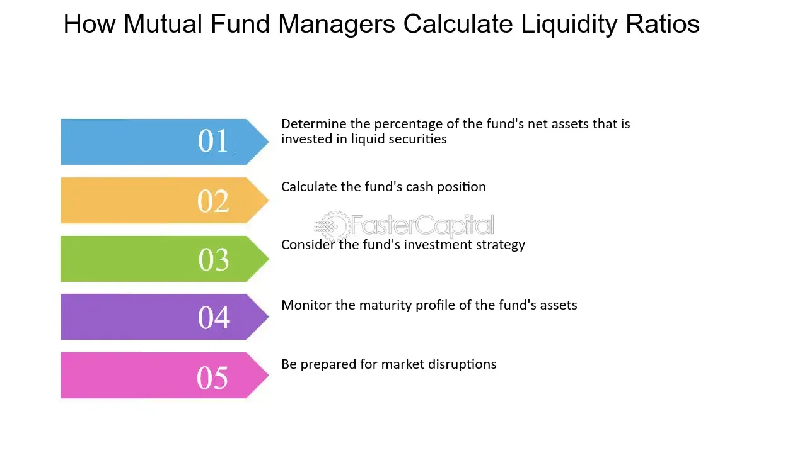

## Table of Contents

## What is a mutual fund?

A mutual fund is a type of investment where many people put their money together to buy a variety of stocks, bonds, or other assets. It's like a big basket where everyone's money is mixed and managed by a professional. This makes it easier for people who don't have a lot of money or time to invest on their own. By investing in a mutual fund, you own a small piece of all the different investments in the fund.

Mutual funds can be a good choice because they help spread out the risk. Instead of putting all your money into one company, your money is spread across many different companies or types of investments. This can make it less risky if one investment doesn't do well. Also, because the fund is managed by experts, it can save you time and help you make better investment choices.

## What is liquidity in the context of mutual funds?

Liquidity in the context of mutual funds means how easily you can turn your investment into cash. When you invest in a mutual fund, you can usually sell your shares quickly and get your money back. This is because mutual funds are designed to be easy to buy and sell. Most mutual funds let you sell your shares at the end of each trading day, and you'll get the money in a few days.

However, some mutual funds might be less liquid than others. For example, if a fund invests in things that are harder to sell quickly, like real estate or certain types of bonds, it might take longer to get your money back. Also, if a lot of people want to sell their shares at the same time, the fund might need to sell some of its investments to pay everyone, which can take time. So, while mutual funds are generally liquid, it's good to check how easy it is to get your money out before you invest.

## How is the liquidity ratio of a mutual fund calculated?

The liquidity ratio of a mutual fund is a way to see how easily the fund can turn its investments into cash. It's calculated by dividing the fund's liquid assets by its total assets. Liquid assets are things that can be sold quickly, like stocks and bonds that trade a lot. Total assets include everything the fund owns, even things that might take longer to sell, like real estate or certain types of bonds.

A higher liquidity ratio means the fund can turn more of its investments into cash quickly. This is important because if a lot of people want to take their money out of the fund at the same time, the fund needs to have enough liquid assets to pay them back without having to sell off slower-to-sell investments at a bad price. So, a higher liquidity ratio can make a mutual fund more attractive to investors who might need their money back quickly.

## Why is the liquidity ratio important for mutual fund investors?

The liquidity ratio is important for mutual fund investors because it shows how quickly the fund can turn its investments into cash. If you need your money back fast, you want to be in a fund that can give it to you without any problems. A high liquidity ratio means the fund has a lot of investments that can be sold quickly, like stocks and bonds that trade a lot. This makes it easier for the fund to pay you back if you decide to sell your shares.

On the other hand, if a fund has a low liquidity ratio, it might take longer to get your money back. This can happen if the fund has a lot of investments in things that are harder to sell quickly, like real estate or certain types of bonds. If a lot of people want to take their money out at the same time, the fund might have to sell these slower-to-sell investments at a bad price, which could hurt the value of your investment. So, knowing the liquidity ratio helps you pick a fund that matches your need for quick access to your money.

## What are the typical liquidity ratio ranges for mutual funds?

Liquidity ratios for mutual funds can vary a lot, but they usually fall between 10% and 80%. A ratio around 10% to 30% is common for funds that invest in things like real estate or certain types of bonds, which can take longer to sell. These funds might be good for people who don't need their money back quickly.

On the other hand, funds that invest in stocks and bonds that trade a lot can have liquidity ratios from 50% to 80%. These funds are easier to turn into cash quickly, so they're better for people who might need their money back fast. Knowing the typical range can help you pick a fund that fits your needs.

## How does the liquidity ratio affect the risk profile of a mutual fund?

The liquidity ratio of a mutual fund can change how risky it is. If a fund has a high liquidity ratio, it means it can turn its investments into cash quickly. This is good because if a lot of people want their money back at the same time, the fund can pay them without selling off investments at a bad price. So, a high liquidity ratio can make a fund less risky because it's easier to get your money out when you need it.

On the other hand, a fund with a low liquidity ratio might be riskier. If it has a lot of investments in things like real estate or certain types of bonds that take longer to sell, it might be hard for the fund to give people their money back quickly. If a lot of people want to take their money out at the same time, the fund might have to sell these slower-to-sell investments at a bad price, which could make the value of your investment go down. So, a low liquidity ratio can make a fund more risky because it's harder to get your money out fast.

## What factors can influence the liquidity ratio of a mutual fund?

The liquidity ratio of a mutual fund can change because of what the fund invests in. If a fund has a lot of money in things like stocks and bonds that trade a lot, it can sell these quickly and easily. This makes the fund's liquidity ratio higher. But if a fund puts money into things like real estate or special types of bonds that don't trade as much, it might take longer to sell these. So, the liquidity ratio will be lower because the fund can't turn its investments into cash as fast.

Another thing that can change the liquidity ratio is how many people want to take their money out of the fund. If a lot of people want their money back at the same time, the fund might need to sell some of its investments to pay them. If the fund has a lot of liquid assets, this won't be a big problem. But if it has a lot of investments that are hard to sell quickly, the fund might have to sell these at a bad price, which can lower the liquidity ratio. So, the demand for cash from investors can also affect how liquid a fund is.

## How can investors use the liquidity ratio to make better investment decisions?

Investors can use the liquidity ratio to pick funds that fit their needs. If you might need your money back quickly, you should look for funds with a high liquidity ratio. These funds have a lot of investments that can be sold fast, like stocks and bonds that trade a lot. This means you can get your money out of the fund without waiting too long. So, if you're saving for something you might need soon, like a down payment on a house, a fund with a high liquidity ratio is a good choice.

On the other hand, if you're investing for the long term and don't need your money back right away, you might be okay with a fund that has a lower liquidity ratio. These funds might invest in things like real estate or special types of bonds that take longer to sell. While they might be riskier if a lot of people want their money back at the same time, they can still be good investments if you're planning to keep your money in the fund for a while. By looking at the liquidity ratio, you can make a smarter choice about which fund is right for you based on when you might need your money.

## What are the differences between liquidity ratios in equity and bond mutual funds?

Equity mutual funds and bond mutual funds can have different liquidity ratios because they invest in different things. Equity funds invest in stocks, which usually trade a lot and can be sold quickly. This means equity funds often have higher liquidity ratios. If you need your money back fast, an equity fund might be a good choice because it's easier for the fund to turn its investments into cash.

Bond mutual funds, on the other hand, can have lower liquidity ratios. This is because they invest in bonds, which might not trade as much as stocks. Some bonds, like those from the government, can be easy to sell, but others, like corporate bonds or municipal bonds, might take longer to find a buyer. So, if you're looking at a bond fund, you might want to check its liquidity ratio to see how quickly you can get your money back if you need it.

In general, the type of investments a fund makes can change how liquid it is. Equity funds are often more liquid because stocks are easier to sell, while bond funds can be less liquid, especially if they invest in bonds that don't trade often. Knowing the difference can help you pick the right fund based on when you might need your money.

## How do regulatory requirements impact the liquidity management of mutual funds?

Regulatory requirements can affect how mutual funds manage their liquidity. Rules from groups like the Securities and Exchange Commission (SEC) in the U.S. make sure that mutual funds can give investors their money back when they want it. These rules say that funds need to have enough liquid assets to cover what investors might want to take out. This means funds have to keep a certain amount of their money in things that can be sold quickly, like stocks and bonds that trade a lot. If a fund doesn't follow these rules, it might get in trouble with the regulators, so it's important for funds to manage their liquidity well.

Also, these rules can change how funds invest their money. For example, a fund might want to put more money into real estate because it thinks it will make a good return, but if real estate is hard to sell quickly, the fund might not be able to do that because it needs to stay liquid. So, funds have to balance making money with being able to give investors their money back fast. This can make funds more careful about what they invest in and how much they put into things that are hard to sell.

## Can the liquidity ratio of a mutual fund change over time, and if so, why?

Yes, the liquidity ratio of a mutual fund can change over time. This happens because the things the fund invests in can change. For example, if a fund starts to put more money into stocks, which are easy to sell, its liquidity ratio might go up. But if the fund starts to invest more in real estate, which is harder to sell quickly, the liquidity ratio might go down. Also, if the fund's managers decide to change how they invest, like moving money from bonds to stocks, this can change the liquidity ratio too.

Another reason the liquidity ratio can change is because of what investors do. If a lot of people want to take their money out of the fund at the same time, the fund might need to sell some of its investments to give them their money back. If the fund has a lot of liquid assets, like stocks, it can do this easily, and the liquidity ratio stays high. But if the fund has to sell things that are hard to sell quickly, like certain types of bonds, the liquidity ratio might go down. So, the actions of investors can also make the liquidity ratio of a mutual fund change over time.

## What advanced strategies can fund managers employ to optimize the liquidity ratio?

Fund managers can use different strategies to make sure their fund has a good liquidity ratio. One way is by keeping a mix of investments that are easy to sell and those that might take longer to sell. For example, they might put some money into stocks, which trade a lot and can be sold quickly, and some into bonds or real estate, which might not be as easy to sell. By balancing these investments, managers can keep the fund's liquidity ratio high enough to meet the needs of investors who might want their money back fast, while still trying to make good returns from less liquid investments.

Another strategy is to use something called cash flow forecasting. This means the fund manager tries to guess how much money investors might want to take out of the fund in the future. If they think a lot of people will want their money back soon, they can make sure the fund has enough liquid assets to cover this. They might do this by keeping more money in cash or in investments that can be sold quickly. This helps the fund stay ready to give investors their money back without having to sell off slower-to-sell investments at a bad price, which can keep the liquidity ratio stable and the fund less risky.

## What is a Liquidity Ratio?

A liquidity ratio is a financial metric utilized to assess a company's capability to settle its short-term obligations using its most liquid assets. These ratios gauge a firm's financial health by measuring its current or quick assets relative to its liabilities due within a year. Common liquidity ratios include the current ratio, quick ratio, and cash ratio, each providing unique insights into a firm's liquidity status.

In mutual funds, liquidity ratios are applied to evaluate the amount of cash a fund holds compared to its total assets. This measure is crucial as it indicates how prepared a fund is to meet operational expenses and potential withdrawal requests from investors. An optimal liquidity balance is fundamental: while maintaining excessive cash reserves might lower potential investment returns, insufficient liquidity can jeopardize the fund's ability to meet immediate financial obligations.

Calculating the [liquidity](/wiki/liquidity-risk-premium) ratio for mutual funds can be represented by:

$$
\text{Liquidity Ratio} = \frac{\text{Cash and Cash Equivalents}}{\text{Total Assets}}
$$

This ratio serves as an indicator for investors concerning the fund's cash holdings utilized for addressing short-term demands and unforeseen needs. Fund managers use these insights to align cash reserves with prevailing market conditions and their strategic objectives. Regularly monitoring liquidity ratios enables managers to maintain a balance that secures operational efficiency and investor confidence, while also optimizing potential returns.

Essentially, effective liquidity management ensures that a fund is well-positioned to respond to both expected and unexpected financial requirements without compromising on investment opportunities.

## References & Further Reading

[1]: ["Advances in Financial Machine Learning"](https://github.com/FIONA-Youkyung/Financial_Engineering/blob/master/Advances_in_Financial_Machine_Learning_Marcos_Lopez_de_Prado.pdf) by Marcos Lopez de Prado

[2]: ["Evidence-Based Technical Analysis: Applying the Scientific Method and Statistical Inference to Trading Signals"](https://www.amazon.com/Evidence-Based-Technical-Analysis-Scientific-Statistical/dp/0470008741) by David Aronson

[3]: ["Machine Learning for Algorithmic Trading"](https://github.com/stefan-jansen/machine-learning-for-trading) by Stefan Jansen

[4]: ["Quantitative Trading: How to Build Your Own Algorithmic Trading Business"](https://github.com/LucindaYa/quant-resources/blob/master/Quantitative%20Trading%20How%20to%20Build%20Your%20Own%20Algorithmic%20Trading%20Business.pdf) by Ernest P. Chan

[5]: Bergstra, J., Bardenet, R., Bengio, Y., & Kégl, B. (2011). ["Algorithms for Hyper-Parameter Optimization."](https://dl.acm.org/doi/10.5555/2986459.2986743) Advances in Neural Information Processing Systems 24.

[6]: Grinold, R. C., & Kahn, R. N. (2000). ["Active Portfolio Management: A Quantitative Approach for Producing Superior Returns and Controlling Risk."](https://www.amazon.com/Active-Portfolio-Management-Quantitative-Controlling/dp/0070248826) McGraw-Hill.

[7]: Hasbrouck, J. (2007). ["Empirical Market Microstructure: The Institutions, Economics, and Econometrics of Securities Trading."](https://academic.oup.com/book/52241) Oxford University Press.