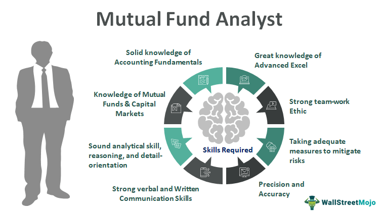

Financial analysis in mutual fund investments plays an essential role in helping investors understand and evaluate the potential returns of various funds. Mutual funds pool capital from multiple investors to purchase a diversified portfolio of securities, managed by a professional fund manager. The performance analysis of mutual funds is critical as it informs investors about the effectiveness of the fund manager's investment strategy, risk management, and ability to achieve the stated investment objectives. By examining past performance, investors can make informed decisions about allocating their resources to funds that align with their financial goals and risk tolerance.

Algorithmic trading represents a technological advancement in the financial markets, where computer algorithms execute trades based on predetermined criteria. It is characterized by its speed, efficiency, and potential for cost reduction. Algorithmic trading has become increasingly prevalent, utilizing advanced mathematical models and statistical analyses to make trading decisions. Its role extends beyond equities to include various asset classes such as commodities, currencies, and derivatives. The objective is often to exploit market inefficiencies, optimize trade execution, and manage transaction costs effectively.



Integrating mutual fund performance analysis with insights from algorithmic trading can enhance the depth of financial assessment. This combination offers a more comprehensive approach to understanding fund dynamics and refining investment strategies. Algorithmic insights can be used to dissect a mutual fund's transaction costs, identify trading patterns, and optimize execution strategies. By leveraging technology, investors and fund managers can refine their processes, leading to potentially better performance outcomes. This integration also empowers fund managers to adjust their strategies dynamically in response to real-time market conditions, ultimately aiming to improve fund returns while mitigating risks.

## Table of Contents

## Understanding Mutual Fund Investment Performance

Mutual funds are investment vehicles that pool money from multiple investors to purchase a diversified portfolio of stocks, bonds, or other securities. They are managed by professional fund managers who make decisions about how to allocate the fund's assets to achieve specific financial goals. Investors in mutual funds gain exposure to a broad array of asset classes without the need to purchase individual securities, thus mitigating the risks associated with single-stock investments.

### Metrics and Factors Used to Analyze Mutual Fund Performance

Analyzing mutual fund performance involves several key metrics and factors:

1. **Net Asset Value (NAV):** NAV is the per-share value of the fund's assets minus its liabilities. It represents the price at which investors can buy or sell fund shares. The NAV is typically calculated daily.

2. **Total Return:** This metric considers not only price changes in the fund's holdings but also dividend and interest income received over a specified period. Total return provides a comprehensive picture of a fund's performance.

3. **Expense Ratio:** The expense ratio reflects the fund's operational costs as a percentage of its assets. A lower expense ratio suggests a more cost-efficient fund, potentially enhancing investor returns.

4. **Alpha and Beta:** These metrics assess a fund's performance relative to a benchmark index. Alpha indicates how much a fund outperforms or underperforms the benchmark, while beta measures the fund's volatility compared to the market.

5. **Sharpe Ratio:** This ratio evaluates risk-adjusted return by considering both the return of the investment and the risk-free rate of return. A higher Sharpe ratio indicates better risk-adjusted performance.

### Sector Weighting and Its Influence on Mutual Fund Returns

Sector weighting refers to the allocation of assets within various sectors (e.g., technology, healthcare, finance) in a mutual fund's portfolio. Sector weights can significantly influence overall fund returns, particularly when specific sectors outperform or underperform the market. For instance, a mutual fund heavily weighted in the technology sector may experience high returns when tech stocks perform well but may also be exposed to higher [volatility](/wiki/volatility-trading-strategies). Fund managers must strategically allocate investments across sectors to balance risk and capitalize on market trends.

### Investment Mandates and Their Impact on Fund Characteristics and Outcomes

Investment mandates define the fund's investment objectives and constraints. These mandates guide the fund manager's decisions regarding asset allocation, sector focus, geographic distribution, and risk tolerance. Different types of mutual funds, such as growth, value, income, or balanced funds, have distinct mandates influencing their characteristics and performance outcomes. For example, a growth fund might prioritize capital appreciation by investing in high-growth industries, whereas an income fund may focus on generating regular income through dividends or interest. The adherence to investment mandates ensures that the fund's strategy aligns with investors' expectations and risk profiles.

In conclusion, understanding mutual fund investment performance requires a comprehensive evaluation of metrics such as NAV, total return, expense ratios, and risk-adjusted performance indicators like alpha, beta, and the Sharpe ratio. Strategic sector weighting and adherence to investment mandates are critical in shaping fund characteristics and aligning them with investor objectives.

## Analyzing Mutual Fund Portfolio Performance

Analyzing mutual fund portfolio performance is crucial for determining how effectively a fund manager is achieving investment objectives and adding value to the portfolio. The primary method used in this analysis is attribution analysis, which examines the sources of a portfolio's returns relative to a benchmark.

### Attribution Analysis in Performance Evaluation

Attribution analysis divides the portfolio's performance into several components to assess the specific contributions of different decisions made by fund managers. The analysis generally follows these steps:

1. **Identify the Benchmark**: Select an appropriate benchmark against which the mutual fund's performance is compared. This benchmark should reflect the fund's investment strategy.

2. **Calculate Return Differences**: Determine the difference between the returns of the fund and the benchmark. This difference is known as the active return.

3. **Decompose Active Return**: Active return is decomposed into several factors, primarily sector allocation, stock selection, and interaction effects:

   - **Sector Allocation Effect**: This measures the impact of the fund manager's decision to overweight or underweight certain sectors compared to the benchmark. It can be calculated using the following formula:
$$
     \text{Sector\ Allocation\ Effect} = \sum_{i} (W_{pi} - W_{bi}) \times (R_{bi} - R_b)

$$

     where $W_{pi}$ and $W_{bi}$ are the weights of sector $i$ in the portfolio and benchmark, respectively, $R_{bi}$ is the return of sector $i$ in the benchmark, and $R_b$ is the total return of the benchmark.

   - **Stock Selection Effect**: This effect assesses the benefit derived from selecting specific securities within a sector. It is given by:
$$
     \text{Stock\ Selection\ Effect} = \sum_{i} W_{bi} \times (R_{pi} - R_{bi})

$$

     where $R_{pi}$ is the return of sector $i$ in the portfolio.

   - **Interaction Effect**: This captures the combined impact of sector allocation and stock selection, often considered a residual effect.

### Evaluating Portfolio Design and Sector Weights

The design of the portfolio and sector weights plays a significant role in determining the potential risk and return. Evaluating these involves:

- **Assessing Alignment with Mandate**: Ensuring the portfolio structure aligns with the investment mandate, considering factors such as geographic allocation and capitalization focus.

- **Risk-Adjusted Performance Metrics**: Analyzing metrics like the Sharpe ratio or the Information ratio for a clear perspective on the risk-adjusted returns relative to the benchmark.

### Value Added by Stock Selection vs. Asset Allocation

To determine the value added by stock selection versus asset allocation, multiple approaches can be utilized:

- **Regression Analysis**: Assessing the historical data to identify how much variance in returns is explained by different factors.

- **Factor Decomposition**: Utilizing factor models to separate the influence of sector selection from stock selection, oftenthrough multi-factor analysis using tools like the Fama-French three-factor model.

These methods allow investors to quantify the proportion of excess returns obtained through strategic allocation against those gained from tactical stock [picking](/wiki/asset-class-picking).

By thoroughly analyzing mutual fund performance using these methodologies, investors can gain insights into the effectiveness of fund management and make informed investment decisions.

## Algorithmic Trading in Mutual Funds

Algorithmic trading refers to the use of computer algorithms to automatically execute trading orders based on predefined criteria. These algorithms analyze complex datasets and market trends, making trades at speeds impossible for human traders. The rise of [algorithmic trading](/wiki/algorithmic-trading) has become a transformative force in financial markets, contributing to significant shifts in how trading is conducted.

The influence of algorithmic trading in financial markets is continuously growing due to its key advantages. One of the primary benefits is speed. Algorithms can process market information and execute trades in milliseconds, allowing for rapid response to market changes. This speed not only provides a competitive edge in capturing profitable opportunities but also enhances market efficiency by narrowing bid-ask spreads and increasing price competitiveness.

Efficiency is another major benefit of algorithmic trading. By automating the trading process, algorithms reduce the likelihood of human error, streamline transaction processes, and ensure consistent execution of trade strategies. This automation allows for the handling of large volumes of transactions, which is particularly advantageous for mutual funds with substantial capital.

Cost reduction is a significant perk as well. Algorithmic trading reduces transaction costs by minimizing the need for manual intervention and eliminating the inefficiencies associated with traditional trading methods. This reduction in costs increases the return on investment for mutual funds, contributing positively to their overall performance.

However, the adoption of algorithmic trading is not without its challenges. One potential pitfall is predatory trading, where sophisticated algorithms exploit their speed advantage to manipulate market prices to the detriment of other investors. For instance, high-frequency trading strategies might employ tactics like order spoofing, creating false market activity to mislead traders.

Market volatility is another concern associated with algorithmic trading. Algorithms, while efficient, can amplify market swings if they simultaneously respond to similar triggers, leading to rapid and sometimes excessive movements in asset prices. The flash crash of 2010, where major U.S. stock indices plummeted and recovered within minutes, illustrated the potential for algorithm-driven volatility.

In conclusion, algorithmic trading offers significant advantages in terms of efficiency, speed, and cost reduction, making it an attractive option for mutual fund managers. However, it also necessitates careful management to mitigate risks such as predatory trading and increased volatility. Despite these challenges, the increasing integration of algorithmic trading strategies in mutual funds underscores its growing importance in modern financial markets.

## The Impact of Algorithmic Trading on Mutual Fund Performance

Algorithmic trading has transformed the financial markets by increasing market quality and [liquidity](/wiki/liquidity-risk-premium). These algorithms facilitate rapid transaction speeds and enhanced efficiency, enabling market participants to respond swiftly to price changes and maintain competitive spreads. This results in tighter bid-ask spreads, increased market depth, and reduced market impact costs, all of which contribute to improved market quality.

Studies have shown that algorithmic trading positively influences mutual fund returns. Automated strategies allow fund managers to execute trades with precision and minimize timing risks associated with discretionary human trading. Algorithms can efficiently handle large volumes of data to assess the optimal timing and pricing for trades, thus improving performance outcomes for mutual funds. According to a study by Hendershott, Jones, and Menkveld (2011), markets with a higher presence of algorithmic trading experience improved liquidity and reduced volatility, benefiting mutual fund performance by providing more favorable entry and [exit](/wiki/exit-strategy) points for trades.

Automated strategies are particularly relevant in optimizing fund management and trading efficiency. They enable funds to execute investment strategies consistently and free fund managers from routine trading decisions, allowing them to focus on higher-value tasks such as strategic asset allocation and risk management. For example, algorithms can implement a [momentum](/wiki/momentum) trading strategy by continuously monitoring market trends and executing trades based on preset rules, thereby reducing the human errors associated with emotional or psychological biases.

Several case studies underscore the tangible impacts of algorithmic trading on mutual fund performance. A notable example is the use of [machine learning](/wiki/machine-learning) algorithms by Two Sigma Investments, a technology-driven asset management firm, which has achieved significant success by employing advanced statistical and computational techniques in its trading strategies. These methods enable them to identify complex patterns within big data sets to make more informed trading decisions, resulting in superior fund performance compared to traditional management styles.

In conclusion, the integration of algorithmic trading into mutual fund management offers distinct advantages in terms of market quality, execution efficiency, and return optimization. As technology continues to evolve, mutual funds leveraging algorithmic strategies are likely to maintain a competitive edge, adapting more swiftly to changing market conditions and embracing innovations that enhance their investment processes.

## Comparative Analysis: Human vs. Algorithmic Management

Traditional human fund management and algorithmic strategies offer distinct approaches to managing mutual funds, each with unique strengths and limitations. Understanding these differences is crucial for investors and fund managers who aim to optimize outcomes through informed decision-making and innovative strategies.

### Traditional Human Fund Management

Human fund management relies on the expertise, intuition, and experience of fund managers to make investment decisions. This approach allows managers to consider a wide array of qualitative factors, such as economic trends, geopolitical events, and corporate ethics, which could significantly impact investment outcomes. Human managers can adapt to new information and unforeseen circumstances dynamically, leveraging their analytical skills and industry knowledge.

**Strengths:**
1. **Intuitive Decision-Making:** Human managers can assess soft factors and nuances that might not be readily captured by algorithms, such as leadership quality and corporate reputation.
2. **Adaptability:** The ability to respond swiftly to market sentiment changes and adapt strategies accordingly.
3. **Holistic Analysis:** Encompasses both quantitative data and qualitative insights, which can be critical during market anomalies.

**Limitations:**
1. **Bias and Emotion:** Susceptible to cognitive biases and emotional decision-making, potentially leading to inconsistent performance.
2. **Limited Data Processing:** Inability to process large volumes of data swiftly, which could hinder informed decision-making in fast-paced markets.
3. **Scalability Issues:** Human-led strategies may struggle with scalability, affecting fund performance as asset sizes grow.

### Algorithmic Trading Strategies

Algorithmic trading leverages computer programs and mathematical models to make data-driven investment decisions at high speed. These algorithms can analyze vast datasets, identify patterns, and execute trades with minimal human intervention, often yielding efficiencies and cost advantages.

**Strengths:**
1. **Speed and Efficiency:** Capable of executing trades within milliseconds, taking advantage of fleeting market opportunities.
2. **Data-Driven Precision:** Utilizes sophisticated models to analyze large datasets, potentially uncovering insights that human managers might overlook.
3. **Consistency:** Reduces human error and bias, maintaining a consistent approach to investment strategies.

**Limitations:**
1. **Over-Reliance on Historical Data:** Algorithms depend heavily on historical data, which may not always predict future market movements accurately.
2. **Lack of Qualitative Analysis:** Algorithms may struggle to incorporate qualitative factors and complex, non-quantitative information into decision-making processes.
3. **Technological Risks:** Vulnerable to system failures, coding errors, and cybersecurity threats.

### Potential for Hybrid Models

To leverage the strengths of both human and algorithmic approaches, hybrid models are gaining traction in the asset management industry. These models aim to blend human intuition with machine efficiency, balancing qualitative insights with quantitative data analysis for optimal results.

1. **Complementary Strategies:** Human managers can oversee algorithmic models, providing strategic oversight and contextual insights, while algorithms handle execution and data analysis.
2. **Enhanced Flexibility and Accuracy:** By integrating human expertise in scenario analysis and risk management, hybrid models can adjust strategies in response to market changes, ensuring well-rounded decision-making.
3. **Integrated Risk Management:** Human oversight helps in mitigating algorithm risks, such as errors and biases, while algorithms enhance the scalability and precision of the decision-making process.

An example of Python code that might illustrate the combination of human oversight and algorithmic efficiency could involve a simple portfolio optimization algorithm overseen by a human manager to refine initial parameters:

```python
import numpy as np
from scipy.optimize import minimize

# Hypothetical returns and covariance matrix
returns = np.array([0.10, 0.12, 0.14])
cov_matrix = np.array([[0.005, -0.002, 0.004],
                       [-0.002, 0.007, 0.002],
                       [0.004, 0.002, 0.009]])

# Initial weights from human manager's input
initial_weights = np.array([0.4, 0.4, 0.2])

# Define the objective function for portfolio optimization
def portfolio_variance(weights):
    return weights.T @ cov_matrix @ weights

# Constraints and bounds for optimal weights
constraints = {'type': 'eq', 'fun': lambda weights: np.sum(weights) - 1}
bounds = [(0, 1) for _ in range(len(weights))]

result = minimize(portfolio_variance, initial_weights, method='SLSQP', constraints=constraints, bounds=bounds)

optimal_weights = result.x
print("Optimal Weights:", optimal_weights)
```

This simple script demonstrates a blend of human and algorithmic efforts, where a human manager provides initial insights and directions, and an optimization algorithm fine-tunes portfolio allocations for risk minimization.

Ultimately, the future of mutual fund management may lie in harnessing the complementary strengths of both human expertise and algorithmic precision, crafting a balanced approach that maximizes investment returns while mitigating risks.

## Conclusion

Mutual fund performance analysis and algorithmic trading represent two pivotal facets of modern financial markets. Understanding the interplay between these elements is crucial for optimizing investment strategies. Mutual fund performance is influenced by various factors including asset allocation, sector weighting, and stock selection, each contributing to the overall returns on investment. Advanced metrics and analytical techniques allow investors to evaluate fund manager performance and make informed decisions.

Algorithmic trading has reshaped the financial landscape with its speed, efficiency, and capability to process large volumes of data, offering significant advantages for mutual fund management. By leveraging algorithms, funds can optimize trade execution, reduce costs, and enhance market liquidity. However, the potential downsides like increased market volatility necessitate careful implementation and oversight.

The integration of technology with traditional finance strategies is essential in the current investment climate. The fusion of algorithmic trading capabilities with human expertise can potentially yield superior outcomes. Humans possess intuition and the ability to interpret qualitative factors, while algorithms efficiently process quantitative data and execute trades rapidly.

Looking towards the future, we can anticipate continued technological advancements in trading and fund management. The rise of [artificial intelligence](/wiki/ai-artificial-intelligence) and machine learning in investment decision-making could further transform mutual fund strategies. Hybrid models that combine human judgment with algorithmic precision are likely to become more prevalent, driving innovation in portfolio management and execution efficiency.

Embracing these developments requires a willingness to adapt and evolve. Investors and fund managers who successfully integrate technological advancements will likely gain a competitive edge in the evolving financial markets. The harmonious blend of human insight and algorithmic ability will play a pivotal role in shaping the future of mutual fund investments.

## References & Further Reading

[1]: Hendershott, T., Jones, C. M., & Menkveld, A. J. (2011). ["Does Algorithmic Trading Improve Liquidity?"](https://onlinelibrary.wiley.com/doi/full/10.1111/j.1540-6261.2010.01624.x) The Review of Financial Studies, 24(3), 835-859.

[2]: Narasimhan Jegadeesh and Sheridan Titman (1993). ["Returns to Buying Winners and Selling Losers: Implications for Stock Market Efficiency."](https://www.jstor.org/stable/2328882) The Journal of Finance, 48(1), 65-91.

[3]: Marcos López de Prado (2018). ["Advances in Financial Machine Learning."](https://www.amazon.com/Advances-Financial-Machine-Learning-Marcos/dp/1119482089) Wiley.

[4]: Carhart, M. M. (1997). ["On Persistence in Mutual Fund Performance."](https://onlinelibrary.wiley.com/doi/full/10.1111/j.1540-6261.1997.tb03808.x) The Journal of Finance, 52(1), 57-82.

[5]: David Aronson (2007). ["Evidence-Based Technical Analysis: Applying the Scientific Method and Statistical Inference to Trading Signals."](https://www.amazon.com/Evidence-Based-Technical-Analysis-Scientific-Statistical/dp/0470008741) Wiley.

[6]: Stefan Jansen (2020). ["Machine Learning for Algorithmic Trading: Predictive Models to Extract Signals from Market and Alternative Data for Systematic Trading Strategies with Python."](https://www.amazon.com/Machine-Learning-Algorithmic-Trading-alternative/dp/1839217715) Packt Publishing.

[7]: Chan, E. P. (2008). ["Quantitative Trading: How to Build Your Own Algorithmic Trading Business."](https://github.com/ftvision/quant_trading_echan_book) Wiley.