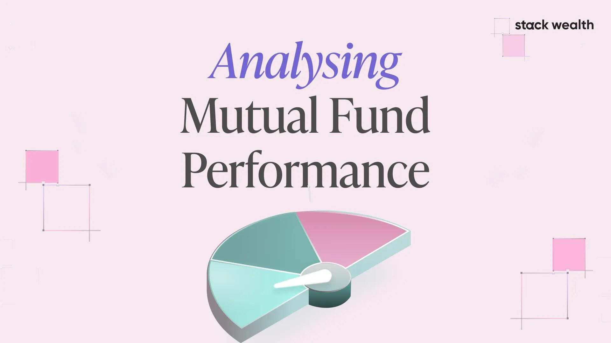

## Table of Contents

## What is a mutual fund?

A mutual fund is a type of investment where many people pool their money together to buy a variety of stocks, bonds, or other assets. This makes it easier for individuals to invest in a diversified portfolio without needing a lot of money or knowledge about the stock market. A professional manager runs the mutual fund, making decisions about which investments to buy and sell.

When you invest in a mutual fund, you buy shares of the fund. The value of your shares will go up or down depending on how well the investments in the fund perform. Mutual funds can be a good way to save for goals like retirement or buying a house because they offer diversification, which can help reduce risk. However, they also come with fees, so it's important to understand these costs before investing.

## How do you measure the performance of a mutual fund?

To measure the performance of a mutual fund, you usually look at its returns over time. This means checking how much the fund's value has grown or shrunk. You can compare these returns to a benchmark, which is like a standard that the fund is trying to beat. For example, if a mutual fund focuses on U.S. stocks, you might compare its performance to the S&P 500, which is a common benchmark for U.S. stocks. If the fund does better than the benchmark, it's doing well. If it does worse, it might not be the best choice.

Another way to measure a mutual fund's performance is by looking at its risk-adjusted returns. This means you're not just looking at how much money the fund made, but also how risky it was to get those returns. A common measure for this is the Sharpe ratio. A higher Sharpe ratio means the fund gave good returns for the level of risk it took. You can also look at other measures like the fund's [volatility](/wiki/volatility-trading-strategies), which shows how much its value goes up and down. A fund with lower volatility might be safer, but it might also grow more slowly.

## What are the common benchmarks used to evaluate mutual fund performance?

When people want to see how well a mutual fund is doing, they often compare it to something called a benchmark. A benchmark is like a yardstick that helps measure the fund's performance. For mutual funds that invest in U.S. stocks, a common benchmark is the S&P 500. This index includes 500 of the biggest companies in the U.S., so it's a good way to see how the overall market is doing. If a mutual fund does better than the S&P 500, it's doing a good job. For funds that invest in bonds, a common benchmark might be the Bloomberg Barclays U.S. Aggregate Bond Index.

Another benchmark often used is the Russell 2000, which is good for funds that focus on smaller U.S. companies. If a mutual fund is trying to beat this index, it shows how well it's doing with smaller stocks. For international stocks, people might use the MSCI EAFE Index, which tracks stocks from developed countries outside of the U.S. and Canada. By comparing a mutual fund to these benchmarks, you can get a good idea of whether the fund is doing well compared to the market it's trying to beat.

## What is the difference between absolute and relative performance in mutual funds?

Absolute performance of a mutual fund looks at how much money the fund has made over time, without comparing it to anything else. It's like checking how much your savings account grew last year. If a mutual fund made 10% last year, that's its absolute performance. It doesn't matter what other funds or the market did; it just tells you how much that specific fund grew.

Relative performance, on the other hand, compares the fund's performance to a benchmark or another fund. It's like seeing if your savings account did better than your friend's. If the S&P 500 went up by 8% last year and your mutual fund went up by 10%, your fund did better than the market, which is good relative performance. This helps you see if your fund is beating the market or other similar funds, which can be important when deciding where to invest your money.

## How does risk-adjusted performance impact mutual fund analysis?

Risk-adjusted performance is important when looking at mutual funds because it shows how well a fund did compared to the risks it took. Imagine you have two funds, and both made 10% last year. But one fund took a lot more risks to get that 10%. The other fund played it safer. Risk-adjusted performance helps you see which fund did a better job, considering the risks they took. A common way to measure this is with the Sharpe ratio. A higher Sharpe ratio means the fund got good returns without taking too much risk.

This kind of analysis helps investors make smarter choices. If two funds have the same returns, but one has a higher Sharpe ratio, it's probably a better choice because it took less risk to get those returns. Risk-adjusted performance also helps you understand if a fund's high returns are just from taking big risks, or if it's really doing a good job managing the money. By looking at risk-adjusted performance, you can pick funds that match your comfort with risk and your investment goals.

## What role do expense ratios play in mutual fund performance?

Expense ratios are important when looking at how well a mutual fund does. They are the fees that the fund charges to cover costs like managing the fund and paying the people who run it. These fees are taken out of the fund's assets every year, so they can eat into the returns you get. If a fund has a high expense ratio, it needs to do better than a fund with a lower expense ratio just to give you the same amount of money back. This is because the higher fees take away more of the fund's earnings.

When comparing mutual funds, it's smart to look at the expense ratio. A lower expense ratio means more of the fund's earnings stay in your pocket. Over time, even a small difference in expense ratios can add up to a lot of money. For example, if you invest $10,000 in a fund with a 1% expense ratio and another $10,000 in a fund with a 0.5% expense ratio, the fund with the lower expense ratio will likely give you more money in the long run, even if they have the same returns before fees. So, expense ratios can really affect how well your investment grows.

## How can historical performance data be used to predict future mutual fund performance?

Historical performance data can give you some clues about how a mutual fund might do in the future, but it's not a crystal ball. If a fund has done well over the last few years, it might mean that the people running the fund know what they're doing. They might have a good way of picking stocks or bonds that keeps making money. But just because a fund did well in the past doesn't mean it will keep doing well. Things like the economy, the stock market, and even changes in who runs the fund can make a big difference.

So, while looking at how a fund has done in the past can help you make a guess about the future, it's not the only thing you should think about. You should also look at the fund's fees, how much risk it takes, and what it invests in. All these things together can give you a better idea of whether a fund might be a good choice for you. Remember, past performance is just one piece of the puzzle when trying to predict how a mutual fund will do in the future.

## What are the key metrics used in mutual fund performance analysis?

When looking at how well a mutual fund is doing, people often look at a few key numbers. One important number is the fund's return, which tells you how much money the fund made over a certain time. You can check the return over different times like one year, three years, or even ten years. Another number people look at is the fund's volatility, which shows how much the fund's value goes up and down. A fund with high volatility might make more money, but it's also riskier because its value can change a lot. The expense ratio is also key because it tells you how much the fund charges in fees every year. A lower expense ratio means more of the fund's earnings stay in your pocket.

Another important metric is the Sharpe ratio, which helps you understand how well the fund did compared to the risks it took. A higher Sharpe ratio means the fund did a good job getting returns without taking too much risk. People also compare a fund's performance to a benchmark, like the S&P 500 for U.S. stock funds, to see if the fund did better or worse than the market. Relative performance helps you see if the fund is beating its competition. All these numbers together give you a good picture of how the mutual fund is doing and can help you decide if it's a good choice for your money.

## How do different investment styles affect mutual fund performance?

Different investment styles can really change how a mutual fund does. There are lots of styles, like growth, value, and blend. Growth funds focus on companies that are expected to grow a lot and make more money in the future. These funds might do really well when the economy is booming, but they can also be riskier because if the companies don't grow like expected, the fund's value can drop a lot. Value funds, on the other hand, look for companies that seem to be a good deal, like buying a stock when it's cheaper than it should be. These funds might not grow as fast as growth funds, but they can be safer because they're not betting as much on future growth.

Another style is blend funds, which mix growth and value strategies. They try to get the best of both worlds by investing in companies that are growing and also in ones that are a good value. This can make the fund's performance more stable because it's not all in on one style. Then there are also funds that focus on different sizes of companies, like small-cap, mid-cap, or large-cap funds. Small-cap funds invest in smaller companies that might grow a lot, but they can also be more risky. Large-cap funds invest in big, well-known companies that might not grow as fast but are usually safer. So, the style a fund uses can make a big difference in how it performs and how risky it is.

## What is the impact of fund manager changes on mutual fund performance?

When the person who runs a mutual fund changes, it can affect how well the fund does. The new manager might have different ideas about which stocks or bonds to buy. If the old manager did a great job picking investments, the fund might not do as well with someone new. On the other hand, if the old manager wasn't doing so well, a new manager might make the fund do better. It's like when a new coach comes to a sports team; the team might play differently and get different results.

Because the new manager can change what the fund invests in, it's important to keep an eye on how the fund does after the change. Sometimes, the fund's performance might stay the same because the new manager follows the same strategy. But other times, the fund might start to do better or worse. It's a good idea to look at the new manager's past work with other funds to see if they have a good track record. That way, you can guess if the fund might do well with them in charge.

## How do market conditions influence mutual fund performance?

Market conditions can really change how a mutual fund does. When the economy is doing well, like when people are buying a lot and companies are making more money, stock prices usually go up. This can make mutual funds that invest in stocks do better. But if the economy is not doing so well, like during a recession, stock prices might go down, and mutual funds can lose money. Also, things like interest rates can affect funds that invest in bonds. If interest rates go up, bond prices usually go down, which can hurt bond funds.

Different types of mutual funds can be affected differently by market conditions. For example, funds that invest in technology companies might do really well when tech is popular, but they can also drop a lot if people start to think tech is not a good investment anymore. Funds that invest in different countries can also be affected by what's happening in those countries' economies. So, it's important to think about what's going on in the market when you're looking at how a mutual fund is doing.

## What advanced statistical methods can be used for in-depth mutual fund performance analysis?

Advanced statistical methods can help you get a deeper look at how a mutual fund is doing. One method is regression analysis, which can show how different things like the economy or interest rates affect the fund's performance. It's like trying to see if the fund goes up when the economy does well, or if it goes down when interest rates change. Another method is [factor](/wiki/factor-investing) analysis, which can help you understand what makes the fund's performance different from other funds. It can show if the fund does better because it invests in certain types of companies, like tech or health care, or if it's because of other reasons.

Another useful method is the Monte Carlo simulation. This method uses a computer to run lots of different scenarios to see how the fund might do in the future. It's like playing out different versions of the future to see what could happen. This can help you understand how risky the fund is and how likely it is to make money. Also, time series analysis can be used to look at how the fund has done over time and see if there are patterns or trends. By using these advanced methods, you can get a better idea of what's really going on with the fund and make smarter choices about where to invest your money.

## How can we analyze the performance of a mutual fund portfolio?

Analyzing mutual fund portfolio performance is crucial for determining how effectively a fund manager is achieving investment objectives and adding value to the portfolio. The primary method used in this analysis is attribution analysis, which examines the sources of a portfolio's returns relative to a benchmark.

### Attribution Analysis in Performance Evaluation

Attribution analysis divides the portfolio's performance into several components to assess the specific contributions of different decisions made by fund managers. The analysis generally follows these steps:

1. **Identify the Benchmark**: Select an appropriate benchmark against which the mutual fund's performance is compared. This benchmark should reflect the fund's investment strategy.

2. **Calculate Return Differences**: Determine the difference between the returns of the fund and the benchmark. This difference is known as the active return.

3. **Decompose Active Return**: Active return is decomposed into several factors, primarily sector allocation, stock selection, and interaction effects:

   - **Sector Allocation Effect**: This measures the impact of the fund manager's decision to overweight or underweight certain sectors compared to the benchmark. It can be calculated using the following formula:
$$
     \text{Sector\ Allocation\ Effect} = \sum_{i} (W_{pi} - W_{bi}) \times (R_{bi} - R_b)

$$

     where $W_{pi}$ and $W_{bi}$ are the weights of sector $i$ in the portfolio and benchmark, respectively, $R_{bi}$ is the return of sector $i$ in the benchmark, and $R_b$ is the total return of the benchmark.

   - **Stock Selection Effect**: This effect assesses the benefit derived from selecting specific securities within a sector. It is given by:
$$
     \text{Stock\ Selection\ Effect} = \sum_{i} W_{bi} \times (R_{pi} - R_{bi})

$$

     where $R_{pi}$ is the return of sector $i$ in the portfolio.

   - **Interaction Effect**: This captures the combined impact of sector allocation and stock selection, often considered a residual effect.

### Evaluating Portfolio Design and Sector Weights

The design of the portfolio and sector weights plays a significant role in determining the potential risk and return. Evaluating these involves:

- **Assessing Alignment with Mandate**: Ensuring the portfolio structure aligns with the investment mandate, considering factors such as geographic allocation and capitalization focus.

- **Risk-Adjusted Performance Metrics**: Analyzing metrics like the Sharpe ratio or the Information ratio for a clear perspective on the risk-adjusted returns relative to the benchmark.

### Value Added by Stock Selection vs. Asset Allocation

To determine the value added by stock selection versus asset allocation, multiple approaches can be utilized:

- **Regression Analysis**: Assessing the historical data to identify how much variance in returns is explained by different factors.

- **Factor Decomposition**: Utilizing factor models to separate the influence of sector selection from stock selection, oftenthrough multi-factor analysis using tools like the Fama-French three-factor model.

These methods allow investors to quantify the proportion of excess returns obtained through strategic allocation against those gained from tactical stock [picking](/wiki/asset-class-picking).

By thoroughly analyzing mutual fund performance using these methodologies, investors can gain insights into the effectiveness of fund management and make informed investment decisions.

## References & Further Reading

[1]: Hendershott, T., Jones, C. M., & Menkveld, A. J. (2011). ["Does Algorithmic Trading Improve Liquidity?"](https://onlinelibrary.wiley.com/doi/full/10.1111/j.1540-6261.2010.01624.x) The Review of Financial Studies, 24(3), 835-859.

[2]: Narasimhan Jegadeesh and Sheridan Titman (1993). ["Returns to Buying Winners and Selling Losers: Implications for Stock Market Efficiency."](https://www.jstor.org/stable/2328882) The Journal of Finance, 48(1), 65-91.

[3]: Marcos López de Prado (2018). ["Advances in Financial Machine Learning."](https://www.amazon.com/Advances-Financial-Machine-Learning-Marcos/dp/1119482089) Wiley.

[4]: Carhart, M. M. (1997). ["On Persistence in Mutual Fund Performance."](https://onlinelibrary.wiley.com/doi/full/10.1111/j.1540-6261.1997.tb03808.x) The Journal of Finance, 52(1), 57-82.

[5]: David Aronson (2007). ["Evidence-Based Technical Analysis: Applying the Scientific Method and Statistical Inference to Trading Signals."](https://www.amazon.com/Evidence-Based-Technical-Analysis-Scientific-Statistical/dp/0470008741) Wiley.

[6]: Stefan Jansen (2020). ["Machine Learning for Algorithmic Trading: Predictive Models to Extract Signals from Market and Alternative Data for Systematic Trading Strategies with Python."](https://www.amazon.com/Machine-Learning-Algorithmic-Trading-alternative/dp/1839217715) Packt Publishing.

[7]: Chan, E. P. (2008). ["Quantitative Trading: How to Build Your Own Algorithmic Trading Business."](https://github.com/ftvision/quant_trading_echan_book) Wiley.