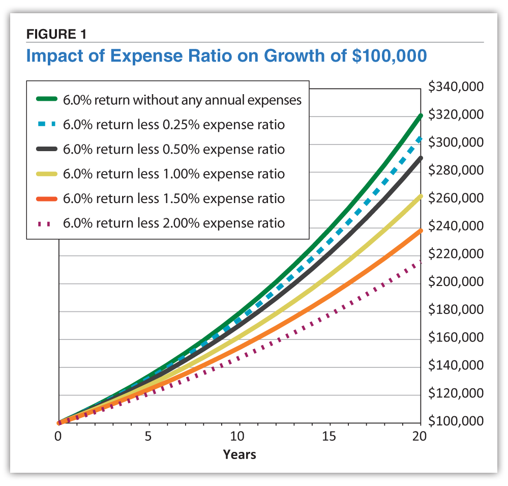

## Table of Contents

## What is a mutual fund?

A mutual fund is a type of investment where many people put their money together to buy a variety of stocks, bonds, or other assets. It's like a big basket where everyone's money is mixed to buy different things. This way, even if you don't have a lot of money, you can still invest in many different companies or types of investments.

Mutual funds are managed by professionals who decide what to buy and sell. This can be helpful because it means you don't have to pick the investments yourself. However, you'll have to pay a fee for this service, which is usually a small percentage of your investment. This fee is used to pay the people who manage the fund and cover other costs.

## What is meant by 'performance' in the context of mutual funds?

When people talk about the 'performance' of a mutual fund, they are usually talking about how well the fund is doing in terms of making money for its investors. This can be measured by looking at the fund's returns, which is how much the value of the fund has gone up or down over a certain period of time. If the fund's value goes up, it means the performance is good, and if it goes down, the performance is not so good.

Performance can also be compared to other things, like a benchmark, which is a standard that the fund is trying to beat. For example, if a fund is supposed to do better than the stock market as a whole, people will look at how the fund's performance stacks up against the market's performance. This helps investors decide if the fund is doing a good job or if they should look for a different one.

## Why is it important to consider fees when evaluating mutual fund performance?

When you look at how well a mutual fund is doing, it's really important to think about the fees you have to pay. Fees are like a cost for having someone else manage your money. They can take away from the money you make from the fund. Even if a fund looks like it's doing well because its value is going up, if the fees are high, you might end up with less money than you thought.

For example, if a fund makes 10% in a year but you have to pay 2% in fees, you're really only making 8%. Over time, those fees can add up and make a big difference. That's why smart investors always look at the fees and think about how they affect the real performance of the fund. By understanding the fees, you can make better choices about which funds to invest in.

## What are the different types of fees associated with mutual funds?

When you invest in mutual funds, you might have to pay different kinds of fees. One common fee is the management fee, which is what you pay the people who run the fund for their work. This fee is usually a small percentage of your investment, taken out every year. Another fee you might see is the sales load, which is like a commission paid to the person or company that sold you the fund. This can be charged when you buy the fund (front-end load) or when you sell it (back-end load).

There are also other fees that might come up, like the 12b-1 fee, which is used for marketing and distribution costs of the fund. This fee is also taken out of your investment each year. Sometimes, you might have to pay for other things like account maintenance fees or fees for buying and selling the assets inside the fund, known as transaction fees. All these fees can add up, so it's good to know about them before you decide to invest in a mutual fund.

## How can fees impact the overall return of a mutual fund?

Fees can take a big bite out of the money you make from a mutual fund. Imagine you put money into a fund that grows by 10% in a year. That sounds good, right? But if you have to pay 2% in fees, that means your real gain is only 8%. Over time, those fees can add up and make a big difference in how much money you end up with. It's like if you're trying to fill a bucket with water, but there's a hole in the bottom. The more fees you pay, the bigger the hole, and the less water—or money—you keep.

It's really important to look at all the fees before you invest in a mutual fund. Some funds might have high fees but do really well, so you might still make money. But other funds might have lower fees and still give you good returns. By understanding how fees work and how they affect your returns, you can make smarter choices about which funds to pick. It's all about finding the right balance between the fees you pay and the performance you get.

## What does 'net of fees' mean in mutual fund performance reporting?

When you see 'net of fees' in mutual fund performance reports, it means the numbers they show have already taken out all the fees. So, if a fund says it made 8% 'net of fees,' that's how much money you actually made after paying all the costs. It's like looking at your take-home pay after taxes, not your gross salary.

This is important because it gives you a clear picture of what you're really [earning](/wiki/earning-announcement) from the fund. Without knowing the 'net of fees' performance, you might think you're making more money than you actually are. By looking at the 'net of fees' numbers, you can make better decisions about which funds to invest in, because you'll know exactly how much money you'll have left after all the fees are paid.

## How is 'net of fees' performance calculated for a mutual fund?

To find the 'net of fees' performance of a mutual fund, you start with the total return of the fund before any fees are taken out. This is the gross return, which shows how much the fund's value grew without considering any costs. Then, you subtract all the fees that investors have to pay, like management fees, sales loads, and other costs. The result is the 'net of fees' performance, which tells you how much money you actually made from your investment after all the fees are taken out.

For example, if a mutual fund had a gross return of 10% for the year, but you had to pay 2% in fees, the 'net of fees' performance would be 8%. This means that even though the fund grew by 10%, after paying the fees, your actual return was only 8%. Knowing the 'net of fees' performance helps you see the real growth of your investment, making it easier to compare different funds and make smart choices about where to put your money.

## What are some common methods used to report mutual fund performance net of fees?

When mutual fund companies report how well their funds are doing, they often show the performance 'net of fees.' This means they take the total return of the fund and subtract all the fees that investors have to pay. This way, you can see how much money you really made from the fund after paying for things like management fees, sales loads, and other costs. It's like looking at your paycheck after taxes, not before.

One common way to report this is through a simple percentage. For example, if a fund says it had a return of 8% 'net of fees,' that means after all the fees were taken out, the fund grew by 8%. Another method is to use charts or graphs that show the fund's performance over time, always accounting for fees. These visual aids help investors see trends and understand how the fund has been doing, making it easier to compare with other funds or benchmarks.

## How can investors compare the performance of different mutual funds net of fees?

To compare the performance of different mutual funds net of fees, investors should look at the returns that have already been adjusted for all the costs. This means checking the percentage returns that the fund reports after taking out fees like management fees, sales loads, and other expenses. By focusing on these 'net of fees' numbers, you can see how much money you would actually make from each fund. It's like comparing the take-home pay from different jobs after taxes, not just the salary before any deductions.

A good way to do this comparison is by using tools like online calculators or investment websites that show the performance of different funds side by side. These tools often have charts or graphs that make it easy to see how each fund has done over time, always accounting for fees. By looking at these visuals, you can quickly spot which funds have been doing better after all the costs are taken out. This helps you make a smart choice about where to put your money, based on the real returns you can expect.

## What are the regulatory requirements for disclosing mutual fund performance net of fees?

In the United States, the Securities and Exchange Commission (SEC) sets rules about how mutual funds need to share their performance numbers. They say that mutual funds have to show their returns in a way that includes all the fees. This is so investors can see how much money they really made from the fund after paying all the costs. The SEC wants to make sure that everyone can see the true performance of the fund, so they can make good choices about where to invest their money.

These rules are important because they help keep things fair and clear for everyone. By showing the returns 'net of fees,' mutual funds give a true picture of how well they did. This way, investors can compare different funds easily and pick the ones that will give them the best returns after all the fees are taken out. It's all about making sure that people have the right information to make smart decisions about their money.

## How does the timing of fee deductions affect the reported performance of mutual funds?

The timing of when fees are taken out of a mutual fund can change how its performance looks. If fees are taken out at the start of the year, like a front-end load, they reduce the amount of money that can grow over time. This means the reported performance might look lower because the fees are taken out before the money has a chance to earn returns. On the other hand, if fees are taken out at the end of the year, like a back-end load, they don't affect the growth of the money during the year, but they still reduce the final amount you get.

It's important to understand this because it affects how you see the fund's performance. If you're comparing different funds, knowing when fees are taken out can help you see which one really gives you more money after all the costs. By looking at the 'net of fees' performance, which shows returns after all fees are taken out, you can make a better choice about where to put your money.

## What advanced analytical techniques can be used to assess mutual fund performance net of fees over different market conditions?

To really understand how well a mutual fund does after fees, even when the market goes up and down, you can use some fancy math tricks. One way is to use something called regression analysis. This helps you see how the fund's returns change with the market, and it takes into account the fees you pay. By doing this, you can see if the fund does better or worse than the market as a whole, after paying all the costs. Another trick is called risk-adjusted performance measures, like the Sharpe Ratio. This looks at how much extra return you get for the risk you take, and it also considers the fees. It helps you see if the fund is worth the risk, even after paying for it.

Another useful method is to use scenario analysis. This means you look at how the fund might do in different situations, like when the market is booming or when it's crashing. By doing this, you can see how the fees affect the fund's performance in good times and bad times. It's like playing out different stories to see what might happen. All these methods help you get a better picture of how the fund really does after you pay all the fees, no matter what the market is doing.

## What are Mutual Fund Fees and How Can They Be Understood?

Mutual funds are subject to a range of fees, each impacting the overall return on investment. These fees are primarily encapsulated in what is known as the "expense ratio." The expense ratio is a measure that includes operating expenses, management fees, and distribution fees. Operating expenses cover the day-to-day operational costs involved in managing a mutual fund. Management fees are paid to the fund managers for their expertise and oversight. Distribution fees, frequently referred to as 12b-1 fees, cover marketing and distribution expenses. These are expressed as a percentage of the fund's average annual assets.

Beyond the expense ratio, additional costs, such as brokerage fees incurred during trading activities, can affect a fund's total return. These costs arise from the buying and selling of securities and can vary significantly based on the fund's investment strategy and turnover rate. Higher turnover rates typically result in more frequent trades, thereby increasing brokerage costs. Although these fees are not included in the expense ratio, they play a critical role in determining the net returns to investors.

To accurately assess a mutual fund's performance, investors must consider both the expense ratio and any additional trading costs. Understanding the full spectrum of fees allows for a more holistic evaluation of the mutual fund's potential to deliver returns net of costs. Calculating the net return involves deducting all fees from the gross return, which may require detailed knowledge of all the costs involved. An equation representing this could be expressed as:

$$
\text{Net Return} = \text{Gross Return} - (\text{Expense Ratio} + \text{Brokerage Fees})
$$

Investors armed with a comprehensive understanding of these costs can make more informed comparisons between potential investment options, potentially leading to better investment decisions.

## References & Further Reading

[1]: ["Evaluating Mutual Fund Performance"](https://www.investopedia.com/ask/answers/111414/how-do-i-judge-mutual-funds-performance.asp) by CFA Institute

[2]: ["The Case for Index Fund Investing"](https://www.vanguard.co.uk/professional/vanguard-365/investment-knowledge/portfolio-construction/the-case-for-indexing) by Vanguard

[3]: ["How Mutual Funds are Misleading Investors"](https://www.kiplinger.com/investing/common-mutual-fund-misconceptions-debunked) by Morningstar

[4]: ["A Practitioner's Guide to Algorithmic Trading"](https://www.amazon.com/Algorithmic-Trading-Practitioners-Jeffrey-Bacidore/dp/0578715236) by Ashwin Gomatam

[5]: ["Managed Funds Association - Algorithmic Trading"](https://www.mfaalts.org/) by Managed Funds Association