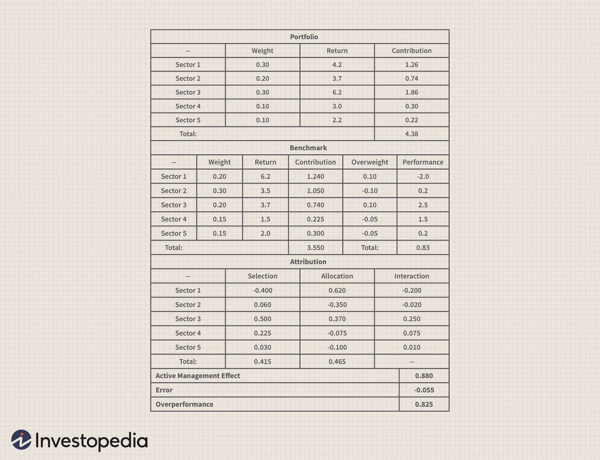

In the competitive world of investing, understanding and analyzing the performance of mutual funds is crucial for investors seeking to maximize their returns. Mutual funds are pooled investment vehicles that allow investors to diversify across a wide array of securities, including stocks, bonds, and other assets. The performance of these funds is often a primary factor in investment decisions, making it essential for investors to consider how returns are reported.

One key consideration is whether performance numbers are reported net of fees. Fees can significantly impact an investor's net return as they encompass various expenses incurred by the fund, such as management fees, operating expenses, and distribution charges. These fees are typically deducted from the fund's assets, which means the reported return is lower than the gross return. Understanding whether performance numbers are net of these fees is essential because it directly affects the actual returns investors receive. 



Moreover, reporting performance net of fees allows for an accurate comparison of different mutual funds. When all costs are considered, investors gain better insight into which funds are likely to deliver superior returns over time. This precision in evaluating fund performance is indispensable when forming a robust investment strategy.

In addition to understanding fee impacts, the role of algorithmic trading in mutual fund performance is increasingly relevant. Algorithmic trading involves using pre-programmed trading instructions to execute trades at optimal prices and times. By automating the trading process, mutual funds can potentially enhance performance through reduced trading costs and improved efficiency. Exploring how algorithmic trading interacts with fee structures provides a comprehensive view of mutual fund performance dynamics.

This article aims to explore how performance reporting net of fees affects mutual fund returns and the influence of algorithmic trading. By examining these elements, investors can make more informed decisions, helping them navigate a complex investment landscape effectively.

## Table of Contents

## Understanding Mutual Fund Fees

Mutual funds are subject to a range of fees, each impacting the overall return on investment. These fees are primarily encapsulated in what is known as the "expense ratio." The expense ratio is a measure that includes operating expenses, management fees, and distribution fees. Operating expenses cover the day-to-day operational costs involved in managing a mutual fund. Management fees are paid to the fund managers for their expertise and oversight. Distribution fees, frequently referred to as 12b-1 fees, cover marketing and distribution expenses. These are expressed as a percentage of the fund's average annual assets.

Beyond the expense ratio, additional costs, such as brokerage fees incurred during trading activities, can affect a fund's total return. These costs arise from the buying and selling of securities and can vary significantly based on the fund's investment strategy and turnover rate. Higher turnover rates typically result in more frequent trades, thereby increasing brokerage costs. Although these fees are not included in the expense ratio, they play a critical role in determining the net returns to investors.

To accurately assess a mutual fund's performance, investors must consider both the expense ratio and any additional trading costs. Understanding the full spectrum of fees allows for a more holistic evaluation of the mutual fund's potential to deliver returns net of costs. Calculating the net return involves deducting all fees from the gross return, which may require detailed knowledge of all the costs involved. An equation representing this could be expressed as:

$$
\text{Net Return} = \text{Gross Return} - (\text{Expense Ratio} + \text{Brokerage Fees})
$$

Investors armed with a comprehensive understanding of these costs can make more informed comparisons between potential investment options, potentially leading to better investment decisions.

## The Importance of Reporting Net of Fees

Reporting performance net of fees is crucial because it offers a more accurate representation of the actual returns investors can expect. In mutual fund investing, fees can significantly diminish returns over time. By focusing on net-of-fees reporting, investors gain a transparent view of a fund's performance after all costs have been deducted, allowing for more precise and meaningful comparisons between different funds.

This approach is vital for assessing whether a fund manager's active management contributions justify the costs incurred. Operating expenses, management fees, and distribution fees form part of the expense ratio, a key component affecting a fund's returns. However, additional costs like brokerage fees, which arise from trading activities, are not included in this ratio but still impact the fund's net returns. By evaluating net-of-fees performance, investors can sidestep the potentially misleading effects of gross returns, which do not account for these deductions.

Consider a hypothetical example where Mutual Fund A has a gross annual return of 8% and an expense ratio of 1.5%, whereas Mutual Fund B has a gross return of 7% with an expense ratio of 0.5%. While Fund A appears to deliver higher gross returns, its net return, when fees are subtracted (8% - 1.5% = 6.5%), is actually lower than Fund B's net return (7% - 0.5% = 6.5%). This underscores why focusing on net returns is essential for making informed investment choices.

Moreover, funds with lower fees have a historical tendency to outperform over time due to the compounding effect of reduced costs. For instance, a seemingly small fee difference of 1% annually can lead to a substantial divergence in net returns over an extended period.

In summary, reporting net of fees aligns the evaluation of mutual fund performance with investors' actual financial outcomes, fostering investment decisions grounded in comprehensive cost considerations and performance benchmarks.

## Algorithmic Trading in Mutual Funds

Algorithmic trading within mutual funds employs sophisticated algorithms to execute trades automatically, allowing for enhanced performance optimization. This advanced form of trading leverages vast computational power and mathematical models to execute trades at optimal times, based on set parameters and conditions defined by fund managers. As mutual funds aim to generate higher returns for their investors, [algorithmic trading](/wiki/algorithmic-trading) serves as a tool to achieve this goal by minimizing trading costs and maximizing transaction efficiency.

The integration of algorithmic trading can significantly reduce transaction costs, which are a component of the overall fees a mutual fund incurs. These costs include bid-ask spreads, market impact costs, and commissions, all of which can erode the fund's returns. By executing trades with precision and speed, algorithms help in reducing slippage and avoid market movements that might be unfavorable to the fund's objectives.

Moreover, algorithmic trading enhances market efficiency by providing [liquidity](/wiki/liquidity-risk-premium), thus narrowing bid-ask spreads. This efficiency contributes to the narrowing of execution costs, thereby positively affecting investors' net returns. For instance, smart order routing algorithms determine the best venues for execution by analyzing liquidity conditions across multiple exchanges.

Assessing algorithmic strategies involves [backtesting](/wiki/backtesting), a process where historical data is used to test the validity of the algorithm. This evaluation is crucial in understanding how the strategy would have performed in the past under various market conditions. While historical performance is not indicative of future results, it provides insights into the algorithm's operational dynamics and risk profile.

Given the sophistication required in the development of these algorithms, mutual funds often collaborate with quantitative analysts and computer scientists who specialize in creating these complex trading systems. Their expertise is crucial in ensuring that the algorithms align with the fund's investment strategy and risk tolerance levels.

Incorporating algorithmic trading strategies into mutual funds demands ongoing monitoring and adjustment. Market conditions are perpetually fluctuating, requiring algorithms to be updated and refined to adapt to new trends and data. This dynamic approach ensures that mutual funds remain competitive and effective in optimizing returns for their investors.

Algorithmic trading is increasingly vital in the mutual fund industry due to its ability to enhance trading efficiency and reduce costs, thereby augmenting the overall performance of the funds. The continued evolution and refinement of these algorithms are likely to play an even more critical role in the investment landscape, providing mutual funds with a robust tool for return optimization.

## Comparing Mutual Funds with ETFs

Exchange-traded funds (ETFs) present a cost-effective alternative to traditional mutual funds. ETFs are structured to provide investors with the advantages of diversification and liquidity while maintaining a lower cost profile. Unlike mutual funds, ETFs are traded on stock exchanges, allowing investors to buy or sell shares throughout the trading day at market prices. This intraday trading capability provides investors with greater flexibility compared to mutual funds, which are only priced at the end of the trading day.

One of the primary cost differences between ETFs and mutual funds is the fee structure. Mutual funds often impose load fees, which are charged either at the time of purchase (front-end load) or when shares are sold (back-end load). These fees can significantly increase the cost of investing. In contrast, ETFs generally do not have these load fees, making them more attractive to cost-conscious investors.

The expense ratio is another critical component of the cost structure. This ratio encompasses the fees for management and operational expenses and is expressed as a percentage of the fund's average net assets. ETFs typically have lower expense ratios than mutual funds because they are often passively managed, tracking an index rather than relying on active stock selection. As a result, the costs associated with research and fund management are reduced.

For instance, suppose a mutual fund has an expense ratio of 1.00%, and an [ETF](/wiki/etf-trading-strategies) tracking a similar index has an expense ratio of 0.15%. Over time, the difference in expense ratios can significantly impact an investor's returns. Consider an investment of $10,000 in both the mutual fund and the ETF, each growing at an average annual return of 6% before fees. After 10 years, the mutual fund, with its higher expense ratio, may yield approximately $16,050, whereas the ETF, with its lower fee structure, could result in approximately $17,040. 

```python
# Python code to calculate the difference in returns due to different expense ratios
initial_investment = 10000
annual_return = 0.06
years = 10

# Returns for mutual fund
mutual_fund_expense_ratio = 0.01
mutual_fund_final_value = initial_investment * ((1 + annual_return - mutual_fund_expense_ratio) ** years)

# Returns for ETF
etf_expense_ratio = 0.0015
etf_final_value = initial_investment * ((1 + annual_return - etf_expense_ratio) ** years)

mutual_fund_final_value, etf_final_value
```

Hence, the cost-efficiency of ETFs enables investors to retain more of their potential gains over time. While mutual funds might attract investors seeking active management strategies and the potential for higher returns, the transparency and lower costs associated with ETFs often make them an appealing option for both passive and active investors seeking efficient fee structures.

Moreover, the transparency of an ETF's holdings is generally superior to that of mutual funds. ETF portfolios are disclosed daily, providing investors with clear insight into underlying assets, whereas mutual fund portfolios are usually disclosed on a quarterly basis. This transparency allows investors to make more informed decisions about their asset allocation and risk exposure.

By comparing the fee structures and transparency between mutual funds and ETFs, investors can better evaluate how these factors affect performance and make choices that align with their investment objectives and cost preferences.

## Conclusion

Informed investment decisions rely heavily on a comprehensive understanding of mutual fund performance reporting, particularly when these figures are adjusted net of fees. These fees, encompassing management, operating, and distribution costs, can significantly dilute the gross returns of a fund. By focusing on net-of-fees reporting, investors gain a clearer insight into the actual returns they might expect, enabling more accurate comparisons between various investment options.

Algorithmic trading has emerged as a powerful tool within mutual funds, providing opportunities to enhance fund performance by minimizing trading costs and boosting efficiency. These complex algorithms automate trading processes, potentially increasing a fund's net returns. The effectiveness of these strategies is crucial, as they can bridge the gap between gross and net returns, thereby adding value for investors.

In parallel, investors must carefully evaluate mutual funds alongside alternative investment vehicles like exchange-traded funds (ETFs). ETFs often present a cost-effective alternative, with lower fee structures and the flexibility of intraday trading. By considering both mutual funds and ETFs, investors can better assess which option offers the most cost-effective, performance-oriented investment solution, ensuring optimized returns relative to the fees incurred. This strategic evaluation will guide investors towards maximizing their investment potential in a competitive financial market.

## References & Further Reading

[1]: ["Evaluating Mutual Fund Performance"](https://www.investopedia.com/ask/answers/111414/how-do-i-judge-mutual-funds-performance.asp) by CFA Institute

[2]: ["The Case for Index Fund Investing"](https://www.vanguard.co.uk/professional/vanguard-365/investment-knowledge/portfolio-construction/the-case-for-indexing) by Vanguard

[3]: ["How Mutual Funds are Misleading Investors"](https://www.kiplinger.com/investing/common-mutual-fund-misconceptions-debunked) by Morningstar

[4]: ["A Practitioner's Guide to Algorithmic Trading"](https://www.amazon.com/Algorithmic-Trading-Practitioners-Jeffrey-Bacidore/dp/0578715236) by Ashwin Gomatam

[5]: ["Managed Funds Association - Algorithmic Trading"](https://www.mfaalts.org/) by Managed Funds Association