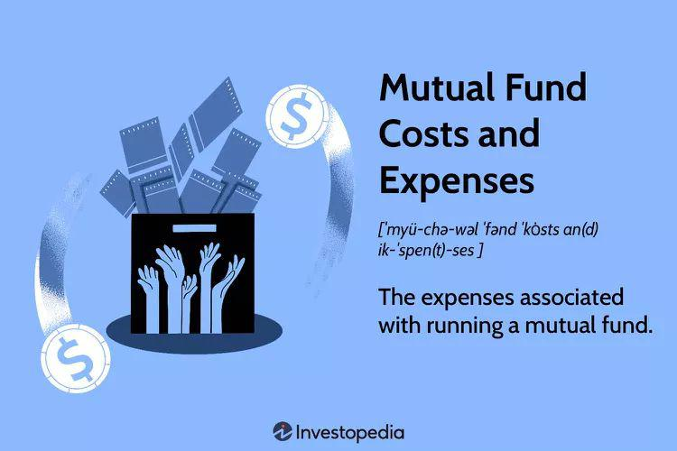

The financial landscape is constantly evolving, with investment funds such as mutual funds serving as key components in both individual and institutional portfolios. These funds are vital because they provide a medium for pooling resources, allowing investors to achieve diversification and professional management of their investments. Comprehending how these funds are priced and valued is essential for making informed investment decisions that align with one's financial goals and risk tolerance.

Investment funds, and particularly mutual funds, are priced based on their Net Asset Value (NAV), which is calculated once a day. The NAV represents the per-share value of the mutual fund, derived by subtracting the fund’s total liabilities from its total asset value and then dividing by the total number of shared outstanding. This calculation ensures a transparent method of pricing, as it is based on the current value of the portfolio's assets, which are subject to daily market fluctuations. The formula for NAV can be expressed as:



$$
\text{NAV} = \frac{\text{(Total Assets - Total Liabilities)}}{\text{Number of Shares Outstanding}}
$$

Algorithmic trading, a technique that utilizes computer algorithms to automate trade decisions based on predefined criteria, has brought about new dimensions in the investment space. This approach aims to exploit pricing inefficiencies and enhance the speed of trade execution, potentially increasing returns. By integrating algorithmic trading into fund management, operators can streamline operations, reduce trading costs, and improve liquidity for mutual funds and other investment vehicles. However, algorithmic trading also poses risks such as reliance on sophisticated technology and susceptibility to market volatility.

This article will examine the structures of investment funds, with a focus on mutual funds, exploring their pricing mechanisms, valuation methods, and how algorithmic trading impacts them. This foundational knowledge is crucial for both investors and financial professionals seeking to better navigate the complexities of modern investing environments.

## Table of Contents

## Investment Funds: An Overview

Investment funds are financial vehicles designed to aggregate capital from a broad spectrum of investors, including individuals and institutions, enabling the collective investment in various asset classes such as stocks, bonds, and other securities. This pooling of resources provides several advantages, including access to diversified portfolios that individual investors might not afford to create or manage independently. By investing collectively, participants can spread risk across a wider array of investments and benefit from professional management.

Several types of investment funds are recognized in financial markets, each serving different purposes and risk appetites:

1. **Mutual Funds**: These are perhaps the most well-known type of investment fund, favored for their simplicity and potential for diversification. Mutual funds pool money from investors to purchase a portfolio of stocks, bonds, or other securities. They are professionally managed, which means investment decisions are made by a portfolio manager or management team. One key feature of mutual funds is that they are typically open-ended, meaning shares can be bought or sold at the fund's Net Asset Value (NAV) calculated at the end of each trading day.

2. **Hedge Funds**: Contrary to mutual funds, hedge funds generally employ more complex investment strategies and can invest in a wider array of assets, including derivatives, currencies, and commodities. Hedge funds may use leverage and short-selling as part of their strategies to achieve higher returns, which also elevates the risk involved. They are often structured as private investment partnerships and are characterized by less regulatory oversight than mutual funds, typically accessible only to accredited or qualified investors.

3. **Exchange-Traded Funds (ETFs)**: ETFs are collections of securities that track an underlying index, commodity, or asset. Unlike mutual funds, ETFs trade on stock exchanges similar to individual stocks, allowing investors to buy and sell ETF shares throughout the trading day. This liquidity feature makes ETFs an attractive option for many investors. Additionally, ETFs often have lower expense ratios compared to mutual funds due to their passive management style, as they often track a specified index.

Each type of investment fund offers distinct features adaptable to various investment goals and market conditions. Mutual funds, in particular, maintain popularity due to their ease of management and considerable diversification benefits, enabling investors to spread risk and potentially enhance returns without the need for deep investment expertise. As each fund type has its unique structure and risk profile, investors must assess their own risk tolerance and financial objectives when selecting an appropriate investment vehicle.

## Mutual Fund Pricing and Valuation

Mutual funds are financial vehicles that pool capital from numerous investors to purchase a diversified portfolio of securities. The price at which investors buy or sell shares in a mutual fund is based on the fund’s Net Asset Value (NAV). NAV is a critical financial metric calculated at the end of each trading day. It represents the per-share value of the mutual fund's assets, determined by the total market value of its portfolio minus any liabilities, divided by the number of outstanding shares.

The formula for calculating NAV is:

$$
\text{NAV} = \frac{\text{(Total Assets - Total Liabilities)}}{\text{Number of Outstanding Shares}}
$$

This calculation ensures that the value of a mutual fund's shares reflects the market value of the underlying assets. The daily computation aligns the fund's value with the current market conditions and guarantees that any investor transactions are executed at a fair market value.

The pricing mechanism followed by mutual funds adheres to the forward pricing model. This means that all buy or sell orders submitted during a trading day are processed at the NAV calculated at the close of that trading day. Investors, thereby, transact their shares at a price that reflects the fund's latest asset valuations. This forward pricing prevents any manipulation of price based on knowledge of intra-day price movements, ensuring transparency and equity among investors.

By choosing to price shares based on NAV, mutual funds offer a structured and transparent approach to valuation that maintains investor confidence and promotes sound financial management practices. This methodical approach to pricing underscores the operational integrity of mutual funds, ensuring that buying or selling of shares is conducted with adherence to the latest market insights and asset valuations.

## Understanding Fund Valuation

Valuation within investment funds is the process of determining the market value of all assets contained in a fund's portfolio. This assessment is essential for calculating the Net Asset Value (NAV), which represents the per-share value of a mutual fund and forms the basis for pricing transactions.

Accurate asset valuation is crucial as it directly influences the perceived performance and attractiveness of a fund to investors. This process involves consistently monitoring market conditions to ensure valuations reflect current market realities. Market fluctuations, economic events, and company-specific information can all impact asset prices, requiring fund managers to frequently update their valuations to maintain accuracy.

A critical valuation method used when typical market prices are unavailable or unreliable is fair value pricing. This technique is particularly useful in situations where market disruptions or thin trading volumes occur, potentially leading to stale or inaccurate pricing data. Fair value pricing assigns a price to an asset based on the estimated sale price between willing parties in a normal market scenario.

The formula for calculating the NAV is:

$$
\text{NAV} = \frac{\text{Total Assets} - \text{Total Liabilities}}{\text{Number of Outstanding Shares}}
$$

Here, "Total Assets" includes the market value of all securities and cash owned by the fund, while "Total Liabilities" encompasses all debts and obligations. The result is divided by the number of outstanding shares to give the NAV per share.

Moreover, fund managers might employ statistical models or algorithms for valuation adjustments, especially during market closures or in different time zones where certain securities might not trade. These models utilize historical data and current market indicators to approximate fair values.

Regulatory bodies impose guidelines on valuation practices to ensure transparency and protection for investors. These regulations often require funds to disclose methodologies used for valuations and any assumptions that might affect asset pricing.

In summary, understanding and implementing precise fund valuation methods are fundamental to achieving accurate mutual fund pricing. The reliance on continuous market evaluation and alternative techniques like fair value pricing helps maintain fund integrity and investor confidence.

## Algorithmic Trading in Fund Management

Algorithmic trading, often referred to as algo trading, involves the use of computer algorithms to automate trading decisions, employing predefined rules and criteria to determine trade execution. This method capitalizes on pricing inefficiencies in financial markets and enhances the speed and precision of trade executions, making it an essential tool in modern fund management.

Algo trading is designed to identify and exploit [arbitrage](/wiki/arbitrage) opportunities that may arise due to minute discrepancies in asset prices across different markets or trading platforms. By doing so, it allows fund managers to execute trades at optimal prices, thereby maximizing potential returns. Speed is a critical [factor](/wiki/factor-investing) in this process, as these price discrepancies are typically fleeting. Algorithms, driven by complex mathematical models and vast computational power, are capable of executing trades within microseconds, a timeframe far beyond the capabilities of human traders.

One of the significant advantages of [algorithmic trading](/wiki/algorithmic-trading) is its ability to reduce trading costs. Traditional trading involves considerable time and resources, including human oversight, which can inflate costs. Algorithms, however, can execute trades automatically, without the need for manual intervention, thereby minimizing the expenses associated with trade execution. Additionally, by mitigating the impact of human emotions and biases, algo trading enhances the accuracy of trades and contributes to increased market [liquidity](/wiki/liquidity-risk-premium), as large volumes of transactions can be efficiently processed.

However, algo trading is not without its challenges. A primary concern is the dependency on sophisticated technology. The reliability of these systems is paramount, as any technical glitch or software error could lead to catastrophic financial losses. Furthermore, the reliance on complex algorithms creates an opacity in decision-making processes, making it difficult for fund managers and investors to fully understand the rationale behind certain trades.

Regulatory scrutiny is another consideration, as the rapid execution of trades by algorithms can contribute to market [volatility](/wiki/volatility-trading-strategies). Regulatory bodies around the world are continually assessing and updating frameworks to ensure that algorithmic trading does not disrupt market stability. High-frequency trading, a subset of algorithmic trading, has received particular attention for its potential to exacerbate market fluctuations due to the sheer [volume](/wiki/volume-trading-strategy) and speed of transactions.

In summary, while algorithmic trading offers considerable advantages in terms of efficiency, cost reduction, and trade execution speed, it necessitates a robust technological infrastructure and rigorous oversight to manage the associated risks effectively. As financial markets continue to evolve, the role of algorithmic trading in fund management is likely to expand, driven by ongoing advancements in technology and data analytics.

## Advantages and Risks of Algo Trading in Mutual Funds

Algorithmic trading, commonly known as algo trading, plays a significant role in mutual fund management due to its ability to increase efficiency and optimize trade executions. At its core, algorithmic trading utilizes complex algorithms and high-speed computers to conduct trading activities based on pre-defined criteria. Here we explore the advantages and risks associated with employing algo trading strategies in mutual funds.

### Advantages

Algo trading enhances mutual fund operations by allowing large transactions to be executed swiftly and with minimal market impact. This feature is particularly beneficial for mutual funds that manage substantial portfolios and require quick repositioning to capture market opportunities or adjust risk exposure. By automating trading decisions, algo trading improves the speed and accuracy of trade executions, thereby reducing the slippage cost — the difference between the expected price of a trade and the actual price.

Moreover, algorithms can be designed to exploit short-lived pricing inefficiencies in the market. This capability can help in achieving superior execution prices compared to manual trading methods. Additionally, by reducing the human intervention factor, algo trading minimizes errors and biases, which can lead to better performance outcomes.

A typical algorithm might be structured as follows in Python to execute trades when certain conditions are met:

```python
def should_execute_trade(market_price, threshold_price):
    return market_price < threshold_price

current_market_price = get_current_market_price()
threshold_price = calculate_threshold_price()

if should_execute_trade(current_market_price, threshold_price):
    execute_trade()
```

### Risks

Despite these advantages, algorithmic trading in mutual funds isn’t without its risks. One of the primary concerns is the dependency on sophisticated technology, which must be continually updated to remain competitive. Faulty algorithms or software bugs can lead to significant financial losses. For instance, an error in an algorithm could trigger incorrect buy or sell signals, inadvertently causing large-scale market disruptions or undesirable trading positions.

The market environment is another concern; algo trading strategies that are profitable in stable market conditions may become less effective during periods of high volatility. In extreme cases, such volatility could amplify the risk of systemic events, as seen in the "Flash Crash" of May 6, 2010, where rapid trading algorithms contributed to a sudden market decline.

Additionally, algo trading is subject to increasing regulatory scrutiny. Regulatory frameworks continue evolving to address challenges associated with high-frequency trading ([HFT](/wiki/high-frequency-trading-strategies)) and algorithmic trading, focusing on maintaining market integrity and protecting investor interests. For instance, regulators might impose restrictions on trading speeds or require firms to implement robust risk management protocols.

In conclusion, while algorithmic trading offers several benefits in enhancing mutual fund operations, its associated risks and the complexity of maintaining sophisticated technologies and regulatory compliance cannot be overlooked. As regulatory environments adapt, the integration of algorithmic strategies within mutual funds will likely continue to evolve, balancing efficiency with the imperative of oversight.

## Conclusion

Investment funds and algorithmic trading have become integral components of contemporary investment strategies, reshaping how investors, both individual and institutional, approach the market. The landscape is no longer static, with mutual fund pricing and valuations playing a crucial role in the decision-making process. Grasping the principles of mutual fund pricing, which involves calculating the Net Asset Value (NAV), equips investors with the necessary insights to navigate investment avenues wisely.

NAV is pivotal in assessing the value of mutual fund shares, calculated as:

$$
\text{NAV} = \frac{\text{Total Assets} - \text{Total Liabilities}}{\text{Number of Outstanding Shares}}
$$

This valuation provides a transparent mechanism for ensuring transactions are fair and reflective of the fund's actual market position. Investors must understand these concepts to make strategic decisions that align with their risk tolerance and investment goals.

Simultaneously, the integration of algorithmic trading has introduced a new paradigm in investment fund management. This technology-driven approach enhances trading efficiency by utilizing automated systems to execute trades based on predefined criteria. Benefits include reduced costs, heightened accuracy, and improved liquidity, all of which contribute to more agile and dynamic fund management.

However, the increasing reliance on technology in trading isn't without its challenges. There are inherent risks such as algorithm errors and heightened market volatility. The evolving regulatory landscape seeks to mitigate these issues, ensuring that the advantages of algorithmic trading are leveraged while maintaining market stability.

In conclusion, a thorough comprehension of mutual fund pricing and valuation lays a robust foundation for informed investment decisions. The integration of technology, while presenting challenges, continues to transform the dynamics of financial markets, offering both opportunities and obstacles that investors must navigate with diligence and foresight. As these elements continue to evolve, staying informed and adaptable remains crucial for success in the ever-changing world of investing.

## References & Further Reading

[1]: Collins, P. J., & Fabozzi, F. J. (2017). ["Mutual Funds: Structure, Performance, Fees, and Expenses"](https://books.google.com/books/about/Bond_Markets_Analysis_and_Strategies_ten.html?id=bQpNEAAAQBAJ). Wiley.

[2]: Hasbrouck, J. (2018). ["The Empirical Dynamics of Algorithmic Trading"](https://searchworks.stanford.edu/view/6759272). The Journal of Finance, 73(5), 2231-2272.

[3]: Lopez de Prado, M. (2018). ["Advances in Financial Machine Learning"](https://www.amazon.com/Advances-Financial-Machine-Learning-Marcos/dp/1119482089). Wiley.

[4]: Jansen, S. (2020). ["Machine Learning for Algorithmic Trading: Predictive models to extract signals from market and alternative data for systematic trading strategies with Python and R"](https://www.amazon.com/Machine-Learning-Algorithmic-Trading-intelligence/dp/1789346467). Packt Publishing.

[5]: Chan, E. P. (2008). ["Quantitative Trading: How to Build Your Own Algorithmic Trading Business"](https://github.com/ftvision/quant_trading_echan_book). Wiley.