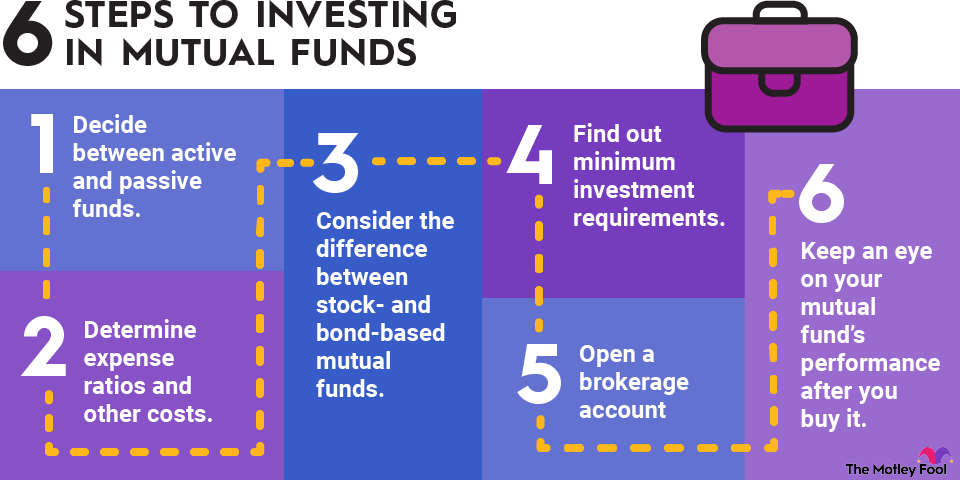

## Table of Contents

## What is a mutual fund?

A mutual fund is a type of investment where many people put their money together to buy a variety of stocks, bonds, or other assets. It's like a big basket where everyone's money goes in, and a professional manager decides what to buy and sell. This way, even if you don't have a lot of money, you can still invest in many different things.

When you invest in a mutual fund, you own a small part of the whole basket. This is good because it spreads out the risk. If one stock in the basket does badly, it won't hurt your investment as much because there are many other stocks in there too. Mutual funds are popular because they are easy to buy and can help you grow your money over time.

## What are the common methods used for pricing mutual funds?

Mutual funds are priced using something called the Net Asset Value (NAV). This is the total value of all the investments the fund holds, minus any expenses, divided by the number of shares. So, if a fund has $100 million in investments and 10 million shares, the NAV would be $10 per share. The NAV is calculated at the end of each trading day, so the price you see is always the latest value.

There are also different share classes within mutual funds, which can affect the price you pay. For example, some funds offer Class A shares, which might have a front-end sales charge, meaning you pay a fee when you buy the shares. Class B shares might have a back-end load, where you pay a fee when you sell the shares. Class C shares might have higher annual fees but no front-end or back-end loads. Each class can impact the overall cost and the NAV you end up paying.

In addition to the basic NAV and share class considerations, some mutual funds might also have additional fees, like management fees or 12b-1 fees, which are for marketing and distribution. These fees can change the effective price of the mutual fund shares. So, when you're looking at the price of a mutual fund, it's important to consider not just the NAV but also any extra costs that might come with it.

## How is the Net Asset Value (NAV) of a mutual fund calculated?

The Net Asset Value (NAV) of a mutual fund is like figuring out how much each piece of the big basket is worth. You start by adding up the value of all the stocks, bonds, and other things the fund owns. Then, you take away any money the fund owes, like fees or expenses. After that, you divide this total value by the number of shares people own in the fund. So, if the fund's total value is $100 million and there are 10 million shares, each share's NAV would be $10.

This calculation happens at the end of every trading day. That's why the NAV you see is always the latest price. It's important because it tells you what each share of the fund is worth at that moment. If you want to buy or sell shares, you'll do it at this price. Just remember, the NAV can go up or down depending on how the investments in the fund are doing.

## What is the difference between forward pricing and backward pricing in mutual funds?

Forward pricing and backward pricing are two different ways mutual funds can be priced. Forward pricing means that when you want to buy or sell shares, the price you get is based on the Net Asset Value (NAV) that will be calculated at the end of the trading day. So, if you put in an order to buy shares at 2 PM, you won't know the exact price until the market closes and the NAV is figured out. This method is fair because everyone gets the same price no matter what time they placed their order during the day.

Backward pricing, on the other hand, uses the NAV from the previous day to set the price for buying or selling shares. If you want to buy shares today, the price would be based on what the fund was worth at the end of yesterday. This method can be less common because it might not reflect the latest changes in the market. Most mutual funds use forward pricing because it's seen as more up-to-date and fair to all investors.

## How does the timing of buying and selling mutual fund units affect their pricing?

When you buy or sell mutual fund units, the timing can affect the price you get because of how the Net Asset Value (NAV) works. Most mutual funds use forward pricing, which means the price you pay or receive is based on the NAV calculated at the end of the trading day. So, if you place an order to buy or sell in the morning, you won't know the exact price until the market closes. This system is fair because everyone gets the same price no matter when they placed their order during the day.

Sometimes, funds might use backward pricing, where the price is based on the NAV from the previous day. This means if you want to buy or sell today, you'll get a price that was set at the end of yesterday. This method is less common because it might not reflect the latest market changes. Most funds stick with forward pricing because it's more up-to-date and fair to all investors.

## What are the implications of using different pricing methods on investor returns?

Using different pricing methods can affect how much money investors make or lose. With forward pricing, the price of mutual fund units is based on the Net Asset Value (NAV) at the end of the trading day. This means if you buy or sell units, you won't know the exact price until the market closes. This method is fair because everyone gets the same price, no matter when they placed their order during the day. But it can be a bit tricky for investors because they have to wait to see what their units are worth.

On the other hand, backward pricing uses the NAV from the day before to set the price. If you want to buy or sell units today, you'll get a price that was set at the end of yesterday. This method is less common because it might not reflect the latest market changes. If the market goes up a lot today, you might miss out on that gain if you're using backward pricing. So, forward pricing usually helps investors get a more accurate and fair price, which can lead to better returns over time.

## How do mutual fund companies handle transaction costs and how does this impact pricing?

Mutual fund companies have to pay for things like buying and selling stocks or bonds, and these costs are called transaction costs. These costs can come from trading fees, commissions, or the difference between the buying and selling price of a stock. When a mutual fund buys or sells a lot of stocks at once, it can affect the price of those stocks, which is known as market impact cost. To handle these costs, mutual fund companies might spread them out among all the investors in the fund. This means that every time someone buys or sells units in the fund, a small part of the transaction cost is added to the price they pay or get.

These transaction costs can affect the price of mutual fund units. When the fund has to pay more to buy or sell stocks, this can lower the fund's overall value. This lower value then gets divided by the number of units to find the Net Asset Value (NAV), which is the price of each unit. So, higher transaction costs can lead to a lower NAV, which means investors might get less money when they sell their units. But, mutual fund companies try to keep these costs as low as possible because they want to help their investors make more money over time.

## What role does the market play in determining mutual fund prices?

The market plays a big role in deciding the price of mutual funds. A mutual fund's price is based on something called the Net Asset Value (NAV), which is the total value of all the stocks, bonds, and other things the fund owns, minus any expenses. The value of these investments goes up and down every day because of what's happening in the market. If the stocks the fund owns do well and their prices go up, the NAV of the mutual fund will go up too. But if the stocks do badly and their prices drop, the NAV will go down.

Mutual funds are priced at the end of each trading day, so the market's performance that day directly affects the price investors see. If the market has a good day and stock prices rise, the mutual fund's NAV will be higher. If the market has a bad day and stock prices fall, the NAV will be lower. This means that when you buy or sell mutual fund units, you're really buying or selling at a price that reflects how the market did that day. So, the market's ups and downs are a big part of what makes mutual fund prices change.

## How do regulatory requirements influence mutual fund pricing methods?

Regulatory requirements can affect how mutual funds are priced. In many countries, rules are set to make sure that pricing is fair and clear for everyone. For example, regulators might say that mutual funds have to use forward pricing, where the price is based on the Net Asset Value (NAV) at the end of the trading day. This rule helps make sure that all investors get the same price, no matter when they place their order during the day. Regulators also want to make sure that any fees or costs are shown clearly, so investors know exactly what they're paying.

These rules can also affect how mutual funds handle transaction costs. Regulators might require that these costs be spread out fairly among all investors. This means that when someone buys or sells units, a small part of the transaction cost is added to the price they pay or get. By setting these rules, regulators help make sure that mutual fund pricing is fair and that investors are protected. This can lead to more trust in the market and help investors feel more confident about their investments.

## Can you explain the concept of swing pricing in mutual funds and its benefits?

Swing pricing is a way mutual funds try to be fair to everyone who invests in them. When a lot of people want to buy or sell units in a fund all at once, it can cost the fund more money. This is because the fund might have to buy or sell a lot of stocks quickly, which can change the prices of those stocks. With swing pricing, the fund changes its price a little bit to cover these extra costs. So, if a lot of people are selling, the price might go down a bit to cover the costs of selling stocks. If a lot of people are buying, the price might go up a bit to cover the costs of buying stocks.

The main benefit of swing pricing is that it helps protect the value of the fund for everyone who is already invested. Without swing pricing, the costs of buying or selling a lot of stocks at once could lower the value of the fund for everyone. By adjusting the price, swing pricing makes sure that these costs are paid by the people who are buying or selling, not by everyone else. This way, the fund stays fair and helps keep the value steady for all investors.

## What advanced strategies do fund managers use to optimize mutual fund pricing?

Fund managers use different smart strategies to make sure mutual fund prices are as good as they can be. One way they do this is by using something called "trade timing." This means they try to buy or sell stocks at the best times during the day to get the best prices. They also use "trade aggregation," where they put together a bunch of trades into one big order. This can help them save on costs because they might get a better deal when they buy or sell a lot of stocks at once.

Another strategy is called "portfolio rebalancing." This is when fund managers look at all the stocks and bonds in the fund and make changes to keep the mix just right. By doing this, they can make sure the fund stays in line with what it's supposed to do and keep the price steady. They also pay close attention to "transaction costs," trying to keep them as low as they can. Lower costs mean more money stays in the fund, which can help the price go up over time.

## How do global economic factors affect mutual fund pricing strategies?

Global economic factors can really change how mutual fund prices are set. Things like interest rates, inflation, and what's happening in different countries' economies can make the stocks and bonds in a mutual fund go up or down in value. For example, if interest rates go up in the U.S., it might make stocks less attractive because people can get better returns from savings accounts. This can lower the price of stocks in the mutual fund, which then affects the fund's overall price. Fund managers have to keep an eye on these global changes and adjust their strategies to protect the fund's value.

Another big [factor](/wiki/factor-investing) is what's happening in other countries' markets. If a big economy like China or Europe is doing well, it can make the stocks and bonds from those places go up in value. This can help boost the price of a mutual fund that invests in those areas. But if those economies are struggling, it can pull the fund's price down. Fund managers might decide to change what they invest in or how they buy and sell to try and make the best of these global shifts. By doing this, they can help keep the fund's price steady and protect the money of the people who invest in it.

## What is the process and importance of Mutual Fund Pricing and Valuation?

Mutual funds are financial vehicles that pool capital from numerous investors to purchase a diversified portfolio of securities. The price at which investors buy or sell shares in a mutual fund is based on the fund’s Net Asset Value (NAV). NAV is a critical financial metric calculated at the end of each trading day. It represents the per-share value of the mutual fund's assets, determined by the total market value of its portfolio minus any liabilities, divided by the number of outstanding shares.

The formula for calculating NAV is:

$$
\text{NAV} = \frac{\text{(Total Assets - Total Liabilities)}}{\text{Number of Outstanding Shares}}
$$

This calculation ensures that the value of a mutual fund's shares reflects the market value of the underlying assets. The daily computation aligns the fund's value with the current market conditions and guarantees that any investor transactions are executed at a fair market value.

The pricing mechanism followed by mutual funds adheres to the forward pricing model. This means that all buy or sell orders submitted during a trading day are processed at the NAV calculated at the close of that trading day. Investors, thereby, transact their shares at a price that reflects the fund's latest asset valuations. This forward pricing prevents any manipulation of price based on knowledge of intra-day price movements, ensuring transparency and equity among investors.

By choosing to price shares based on NAV, mutual funds offer a structured and transparent approach to valuation that maintains investor confidence and promotes sound financial management practices. This methodical approach to pricing underscores the operational integrity of mutual funds, ensuring that buying or selling of shares is conducted with adherence to the latest market insights and asset valuations.

## What is Understanding Fund Valuation?

Valuation within investment funds is the process of determining the market value of all assets contained in a fund's portfolio. This assessment is essential for calculating the Net Asset Value (NAV), which represents the per-share value of a mutual fund and forms the basis for pricing transactions.

Accurate asset valuation is crucial as it directly influences the perceived performance and attractiveness of a fund to investors. This process involves consistently monitoring market conditions to ensure valuations reflect current market realities. Market fluctuations, economic events, and company-specific information can all impact asset prices, requiring fund managers to frequently update their valuations to maintain accuracy.

A critical valuation method used when typical market prices are unavailable or unreliable is fair value pricing. This technique is particularly useful in situations where market disruptions or thin trading volumes occur, potentially leading to stale or inaccurate pricing data. Fair value pricing assigns a price to an asset based on the estimated sale price between willing parties in a normal market scenario.

The formula for calculating the NAV is:

$$
\text{NAV} = \frac{\text{Total Assets} - \text{Total Liabilities}}{\text{Number of Outstanding Shares}}
$$

Here, "Total Assets" includes the market value of all securities and cash owned by the fund, while "Total Liabilities" encompasses all debts and obligations. The result is divided by the number of outstanding shares to give the NAV per share.

Moreover, fund managers might employ statistical models or algorithms for valuation adjustments, especially during market closures or in different time zones where certain securities might not trade. These models utilize historical data and current market indicators to approximate fair values.

Regulatory bodies impose guidelines on valuation practices to ensure transparency and protection for investors. These regulations often require funds to disclose methodologies used for valuations and any assumptions that might affect asset pricing.

In summary, understanding and implementing precise fund valuation methods are fundamental to achieving accurate mutual fund pricing. The reliance on continuous market evaluation and alternative techniques like fair value pricing helps maintain fund integrity and investor confidence.

## What is the conclusion?

Investment funds and [algorithmic trading](/wiki/algorithmic-trading) have become integral components of contemporary investment strategies, reshaping how investors, both individual and institutional, approach the market. The landscape is no longer static, with mutual fund pricing and valuations playing a crucial role in the decision-making process. Grasping the principles of mutual fund pricing, which involves calculating the Net Asset Value (NAV), equips investors with the necessary insights to navigate investment avenues wisely.

NAV is pivotal in assessing the value of mutual fund shares, calculated as:

$$
\text{NAV} = \frac{\text{Total Assets} - \text{Total Liabilities}}{\text{Number of Outstanding Shares}}
$$

This valuation provides a transparent mechanism for ensuring transactions are fair and reflective of the fund's actual market position. Investors must understand these concepts to make strategic decisions that align with their risk tolerance and investment goals.

Simultaneously, the integration of algorithmic trading has introduced a new paradigm in investment fund management. This technology-driven approach enhances trading efficiency by utilizing automated systems to execute trades based on predefined criteria. Benefits include reduced costs, heightened accuracy, and improved [liquidity](/wiki/liquidity-risk-premium), all of which contribute to more agile and dynamic fund management.

However, the increasing reliance on technology in trading isn't without its challenges. There are inherent risks such as algorithm errors and heightened market [volatility](/wiki/volatility-trading-strategies). The evolving regulatory landscape seeks to mitigate these issues, ensuring that the advantages of algorithmic trading are leveraged while maintaining market stability.

In conclusion, a thorough comprehension of mutual fund pricing and valuation lays a robust foundation for informed investment decisions. The integration of technology, while presenting challenges, continues to transform the dynamics of financial markets, offering both opportunities and obstacles that investors must navigate with diligence and foresight. As these elements continue to evolve, staying informed and adaptable remains crucial for success in the ever-changing world of investing.

## References & Further Reading

[1]: Collins, P. J., & Fabozzi, F. J. (2017). ["Mutual Funds: Structure, Performance, Fees, and Expenses"](https://books.google.com/books/about/Bond_Markets_Analysis_and_Strategies_ten.html?id=bQpNEAAAQBAJ). Wiley.

[2]: Hasbrouck, J. (2018). ["The Empirical Dynamics of Algorithmic Trading"](https://searchworks.stanford.edu/view/6759272). The Journal of Finance, 73(5), 2231-2272.

[3]: Lopez de Prado, M. (2018). ["Advances in Financial Machine Learning"](https://www.amazon.com/Advances-Financial-Machine-Learning-Marcos/dp/1119482089). Wiley.

[4]: Jansen, S. (2020). ["Machine Learning for Algorithmic Trading: Predictive models to extract signals from market and alternative data for systematic trading strategies with Python and R"](https://www.amazon.com/Machine-Learning-Algorithmic-Trading-intelligence/dp/1789346467). Packt Publishing.

[5]: Chan, E. P. (2008). ["Quantitative Trading: How to Build Your Own Algorithmic Trading Business"](https://github.com/ftvision/quant_trading_echan_book). Wiley.