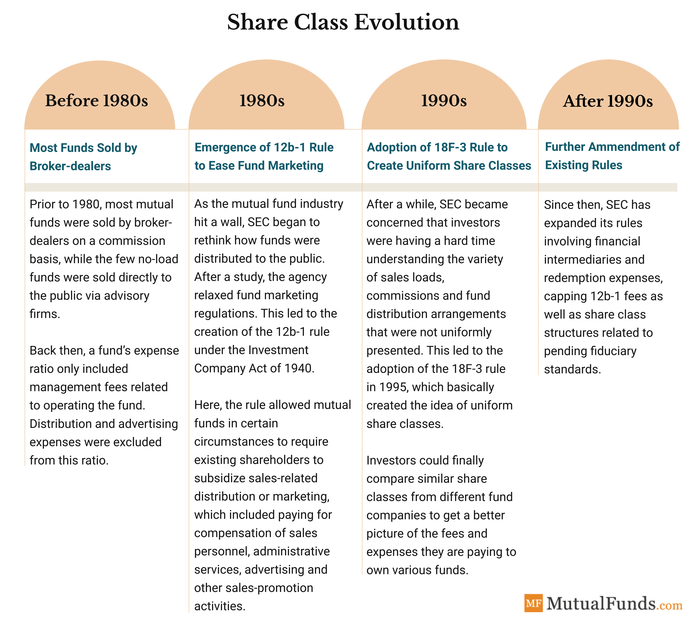

## Table of Contents

## What are mutual fund share classes?

Mutual fund share classes are different versions of the same mutual fund, each with its own fee structure and features. They allow investors to choose how they want to pay for the fund's management and services. The main types of share classes are Class A, Class B, and Class C shares. Each class may have different sales charges, expense ratios, and minimum investment requirements, which can affect the overall cost and suitability for different investors.

Class A shares typically have a front-end sales load, which means you pay a fee when you buy the shares. However, they often have lower annual expenses and may offer breakpoints, which are discounts for larger investments. Class B shares usually do not have a front-end load but come with a back-end load, or a fee you pay when you sell the shares. Over time, Class B shares may convert to Class A shares, which can lower the ongoing costs. Class C shares generally have no front-end load and a lower back-end load, but they have higher annual expenses. These shares are often best for short-term investors who might not stay invested long enough to benefit from the lower costs of other share classes.

## What are the most common types of mutual fund share classes?

The most common types of mutual fund share classes are Class A, Class B, and Class C shares. Each type has different fees and features that can affect how much you pay to invest in the fund. Class A shares usually have a front-end sales load, which means you pay a fee when you buy the shares. They often have lower yearly costs and may offer discounts if you invest a larger amount of money.

Class B shares typically do not have a front-end load, but they come with a back-end load, which is a fee you pay when you sell the shares. Over time, Class B shares might change into Class A shares, which can lower the ongoing costs. Class C shares usually have no front-end load and a smaller back-end load, but they have higher yearly costs. These shares are often good for people who plan to keep their money in the fund for a shorter time.

## How do the fees and expenses differ between mutual fund share classes?

The fees and expenses for mutual fund share classes can be quite different. Class A shares usually have a front-end sales load, which means you pay a fee when you buy the shares. This fee can be a percentage of the amount you invest. But Class A shares often have lower yearly costs, called expense ratios, which are the ongoing fees for managing the fund. They might also offer breakpoints, which are discounts if you invest a larger amount of money. This makes Class A shares a good choice if you plan to invest a lot and keep your money in the fund for a long time.

Class B shares work differently. They don't have a front-end load, but they come with a back-end load, which is a fee you pay when you sell the shares. This fee often goes down the longer you keep your money in the fund. Class B shares might also change into Class A shares after a certain time, which can lower the ongoing costs. Class C shares have no front-end load and a smaller back-end load, but they have higher yearly costs. These shares are often best for people who might not keep their money in the fund for very long because the higher yearly costs can add up quickly.

## What is the difference between Class A, Class B, and Class C shares?

Class A, Class B, and Class C shares are different ways to invest in the same mutual fund, but they come with different fees and rules. Class A shares have a front-end sales load, which means you pay a fee when you buy them. This fee is a percentage of your investment. But Class A shares usually have lower yearly costs, called expense ratios, and they might give you a discount if you invest a lot of money. These shares are good if you plan to keep your money in the fund for a long time and invest a big amount.

Class B shares don't have a front-end load, but they have a back-end load, which is a fee you pay when you sell the shares. This fee can get smaller the longer you keep your money in the fund. After some time, Class B shares might change into Class A shares, which can make the ongoing costs lower. Class C shares don't have a front-end load and have a smaller back-end load, but they have higher yearly costs. These shares are often better if you plan to keep your money in the fund for a shorter time because the higher yearly costs can add up quickly.

## How does the sales charge or load work for different share classes?

Class A shares have a front-end sales load. This means when you buy these shares, you pay a fee right away. The fee is a percentage of the money you invest. For example, if you want to invest $10,000 and the front-end load is 5%, you pay $500 as a fee and the rest, $9,500, goes into the fund. Class A shares might give you a discount if you invest a lot of money, which is called a breakpoint. These shares are good if you plan to keep your money in the fund for a long time and invest a big amount.

Class B shares don't have a front-end load, but they have a back-end load. This means you don't pay a fee when you buy the shares, but you pay a fee when you sell them. The back-end load can get smaller the longer you keep your money in the fund. For example, if you sell your shares after one year, you might pay a 5% fee, but if you wait five years, the fee might be only 1%. After some time, Class B shares might change into Class A shares, which can make the ongoing costs lower.

Class C shares have no front-end load and a smaller back-end load, but they have higher yearly costs. The back-end load for Class C shares is usually small and might go away after a short time, like one year. Because of the higher yearly costs, Class C shares are often better if you plan to keep your money in the fund for a shorter time. The higher yearly costs can add up quickly, so these shares are not as good for long-term investments.

## What are no-load share classes and how do they benefit investors?

No-load share classes are mutual fund shares that don't have any sales charges or loads. This means you don't pay a fee when you buy or sell the shares. These shares are often labeled as Class I, Class R, or Class Z shares. Because there are no sales charges, all of your money goes into the fund right away, which can help your investment grow faster.

No-load share classes can benefit investors in a few ways. First, since you don't pay any sales charges, you get to keep more of your money invested, which can lead to higher returns over time. Second, these shares are often a good choice for people who want to invest without the help of a financial advisor, as they can buy and sell the shares directly from the fund company. This can save money and give investors more control over their investments.

## How do share classes affect the returns on a mutual fund investment?

Share classes can change how much money you make from a mutual fund because they have different fees. For example, Class A shares have a front-end load, which means you pay a fee when you buy them. This fee can make your initial investment smaller, so you might not earn as much money as you would without the fee. Class B shares have a back-end load, which you pay when you sell the shares. This can also eat into your returns, especially if you sell the shares soon after buying them. Class C shares have higher yearly costs, which can add up over time and lower your overall returns.

No-load share classes, like Class I, Class R, or Class Z, don't have any sales charges. This means all your money goes into the fund right away, which can help your investment grow faster. Because there are no fees for buying or selling, you keep more of your returns. Over time, this can make a big difference in how much money you make from your mutual fund investment. Choosing the right share class can help you keep more of your money and earn better returns.

## What are the tax implications of choosing different share classes?

Choosing different share classes can affect your taxes because of the fees you pay. For example, Class A shares have a front-end load, which you pay when you buy the shares. This fee can lower the amount of money you invest, so you might have a smaller tax bill when you buy the shares. But if you sell these shares at a profit, you'll have to pay capital gains tax on the profit. Class B shares have a back-end load, which you pay when you sell the shares. This fee can lower the amount of money you get when you sell, which might reduce the capital gains tax you owe. But the higher yearly costs of Class B shares can add up and might not be as tax-friendly in the long run.

Class C shares have higher yearly costs, which can also affect your taxes. These yearly costs, or expense ratios, are taken out of the fund's earnings before they are paid out to you. This means you might get less money from the fund each year, which can lower the amount of income tax you pay on those earnings. But because Class C shares have higher yearly costs, you might end up with less money overall, which can affect your taxes when you sell the shares. No-load share classes, like Class I, Class R, or Class Z, don't have sales charges, so all your money goes into the fund right away. This can help your investment grow faster, and you might have to pay more in taxes when you sell the shares at a profit, but you'll have more money to work with.

## How can an investor choose the right share class for their investment goals?

Choosing the right share class depends on how long you plan to keep your money in the fund and how much you are investing. If you are putting in a big amount of money and plan to keep it in the fund for a long time, Class A shares might be the best choice. They have a front-end load, which means you pay a fee when you buy them, but they often have lower yearly costs and might give you a discount if you invest a lot. This can help your investment grow more over time. But if you are investing a smaller amount or might need to take your money out soon, Class C shares could be better. They don't have a front-end load and have a smaller back-end load, but they have higher yearly costs. This makes them good for shorter-term investments.

Class B shares are another option, but they work differently. They don't have a front-end load, but they have a back-end load, which you pay when you sell the shares. This fee can get smaller the longer you keep your money in the fund, and after some time, Class B shares might change into Class A shares, which can lower the ongoing costs. If you don't want to pay any sales charges, no-load share classes like Class I, Class R, or Class Z might be the best fit. These shares don't have any fees for buying or selling, so all your money goes into the fund right away, which can help your investment grow faster. Think about how long you'll keep your money in the fund and how much you're investing to pick the share class that will help you reach your goals.

## What are institutional share classes and who can invest in them?

Institutional share classes are a type of mutual fund share that is meant for big investors like banks, pension funds, and other big organizations. These shares are often called Class I, Class Y, or Class Z shares. They usually have lower yearly costs, called expense ratios, because they are made for people who can invest a lot of money at once. This means that big investors can save money on fees and might get better returns on their investments.

Regular people can't usually buy institutional share classes because they need to invest a lot of money to get them. The minimum amount you need to invest can be very high, like $100,000 or more. But some people might be able to buy these shares through their work if their company has a retirement plan that offers them. This way, even if you don't have a lot of money to invest on your own, you might still be able to get the benefits of lower fees and better returns.

## How do retirement share classes work and who are they designed for?

Retirement share classes are a type of mutual fund share that is made for people saving for retirement. These shares are often called Class R shares. They are designed for people who put their money into retirement plans like 401(k)s or 403(b)s at work. The fees for these shares are usually lower than other share classes because they are meant for people who are saving for the long term and might not have a lot of money to invest at once.

These shares help people save money on fees, which can make their retirement savings grow faster over time. Because they are part of retirement plans, they are easy for people to buy through their work. This makes it simpler for employees to invest in mutual funds without having to worry about high costs. Retirement share classes are a good choice for anyone who wants to save for retirement and keep more of their money working for them.

## What are the latest trends and regulatory changes affecting mutual fund share classes?

The latest trends in mutual fund share classes show that more people are choosing no-load and low-cost options. This is because investors want to keep more of their money working for them instead of paying high fees. No-load share classes, like Class I, Class R, and Class Z, are becoming more popular because they don't have any sales charges. This means all the money you invest goes into the fund right away, which can help your investment grow faster. Also, more people are using online platforms and robo-advisors to buy mutual funds, which often offer these low-cost share classes.

Regulatory changes are also affecting mutual fund share classes. The U.S. Securities and Exchange Commission (SEC) has been working to make sure investors get clear and fair information about the fees they pay. One big change is the introduction of the "clean share" class, which has no sales charges or 12b-1 fees. These clean shares make it easier for investors to see exactly what they are paying for. The SEC is also pushing for more transparency in how mutual funds report their costs, which can help investors pick the right share class for their needs.

## References & Further Reading

[1]: ["Mutual Funds: Risk and Performance Analysis for Decision Making"](https://www.amazon.com/Mutual-Funds-Performance-Analysis-Decision/dp/0631215611) by John A. Haslem

[2]: Naik, N. Y., & Yadav, P. K. (2003). ["Risk and Market Quality: Evidence from Equity Options."](https://papers.ssrn.com/sol3/papers.cfm?abstract_id=1294468) The Review of Financial Studies, 16(3), 799-838.

[3]: ["Algorithmic and High-Frequency Trading"](https://www.amazon.com/Algorithmic-High-Frequency-Trading-Mathematics-Finance/dp/1107091144) by Álvaro Cartea, Sebastian Jaimungal, and José Penalva

[4]: ["Professional Automated Trading: Theory and Practice"](https://www.amazon.com/Professional-Automated-Trading-Theory-Practice/dp/1118129857) by Eugene A. Durenard

[5]: ["Mutual Fund Industry Handbook: A Comprehensive Guide for Investment Professionals"](https://www.amazon.com/Mutual-Fund-Industry-Handbook-Comprehensive/dp/0471736244) by Lee Gremillion

[6]: Treynor, J. L. (1965). ["How to Rate Management of Investment Funds."](https://onlinelibrary.wiley.com/doi/10.1002/9781119196679.ch10) The Journal of Finance, 20(4), 582-599.