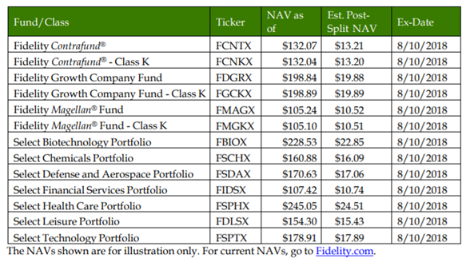

## Table of Contents

## What is a mutual fund?

A mutual fund is a type of investment where many people pool their money together to buy a variety of stocks, bonds, or other assets. This makes it easier for individuals to invest in a diversified portfolio without having to buy each investment separately. A professional manager runs the mutual fund, deciding which investments to buy and sell, aiming to grow the fund's value over time.

When you invest in a mutual fund, you buy shares of the fund, and the price of each share is based on the total value of all the investments the fund holds. This is called the net asset value (NAV). Mutual funds can be a good option for people who want to invest but don't have the time or knowledge to manage their investments themselves. They offer a way to spread out risk and potentially earn returns over the long term.

## What does splitting a mutual fund mean?

Splitting a mutual fund means the fund company decides to divide the price of each share into smaller parts. This is done to make the share price lower and more attractive to new investors. For example, if a share costs $100, a split might change it to $10 per share. The total value of your investment stays the same, but you now own more shares at a lower price per share.

When a mutual fund splits, it doesn't change the overall value of the fund or the value of your investment. It's just like cutting a pie into more slices; the pie is still the same size, but each slice is smaller. This can make the fund seem more accessible to people who might be put off by a high share price, even though the actual value of the fund hasn't changed.

## Why would an investor consider splitting their mutual fund?

An investor might consider splitting their mutual fund to make it easier to buy more shares. If the price of each share is high, splitting the fund lowers the price per share. This can make the fund seem more affordable and attractive to new investors. Even though the total value of the fund doesn't change, having a lower share price can encourage more people to invest.

Splitting a mutual fund doesn't change the value of an investor's current holdings. If you own shares before a split, you'll have more shares afterward, but they'll be worth less per share. The overall value of your investment stays the same. This can be a good strategy for a fund that wants to grow by attracting more investors without changing its investment strategy or performance.

## What are the benefits of splitting a mutual fund?

Splitting a mutual fund can make the price of each share lower. This can attract more people to invest in the fund because the shares seem cheaper. Even though the total value of the fund doesn't change, a lower share price can make the fund more appealing to new investors who might think a high price is too expensive.

For people who already own shares in the fund, a split doesn't change the value of their investment. They will just have more shares that are worth less per share. This can be a good way for a fund to grow by bringing in more investors without changing how the fund is managed or how well it performs.

## Are there any risks or drawbacks to splitting a mutual fund?

Splitting a mutual fund can make the price of each share lower, which might seem good. But it doesn't change the total value of the fund or how it's managed. So, if people think a lower price means the fund is a better deal, they might be disappointed. The fund's performance stays the same, and the lower price doesn't mean it's a better investment.

Another thing to think about is that splitting a fund can sometimes be seen as a sign that the fund isn't doing well. If the fund's managers think the price is too high and scaring people away, they might split it to bring in new investors. But if the fund's performance isn't good, new investors might not stay for long. So, it's important to look at why the fund is being split and not just at the new, lower price.

## How does the process of splitting a mutual fund work?

When a mutual fund decides to split, it means they are going to lower the price of each share. For example, if a share costs $100, after a split it might cost $10. To do this, the fund company decides on a split ratio, like 10:1. This means every share you own will turn into 10 shares, but each of those new shares will be worth less. The total value of your investment stays the same because you have more shares that are worth less each.

The process of splitting a mutual fund is pretty straightforward. The fund company announces the split and sets a date for when it will happen. On that date, they adjust the number of shares each investor owns based on the split ratio. The net asset value (NAV) of the fund, which is the total value of all the investments divided by the number of shares, goes down. But remember, the overall value of the fund doesn't change, just the price per share and the number of shares you own.

## What are the tax implications of splitting a mutual fund?

Splitting a mutual fund doesn't usually change your taxes right away. When a fund splits, it just changes the number of shares you have and the price per share. The total value of your investment stays the same, so you don't owe any taxes just because of the split. You only have to worry about taxes when you sell your shares and make a profit, or if the fund pays out dividends.

If you sell your shares after a split, the tax rules are the same as before the split. You need to figure out if you made a capital gain or loss. A capital gain happens if you sell your shares for more than you paid for them. You'll have to pay taxes on that gain. If you sell for less than you paid, you have a capital loss, which you can use to lower your taxes. The split itself doesn't change how you figure out these gains or losses, it just changes the number of shares you're dealing with.

## Can splitting a mutual fund affect the performance of the investment?

Splitting a mutual fund doesn't directly affect how well the fund performs. The split just changes the number of shares and the price per share, but the total value of the fund stays the same. The investments the fund holds and how the fund manager runs it don't change because of a split. So, the performance of the fund depends on the same things as before, like the stock market and the choices the fund manager makes.

However, splitting a fund can bring in more investors because the lower share price can seem more affordable. If more people invest, it can help the fund grow bigger. But if the fund isn't doing well, new investors might not stay for long, and that could hurt the fund's performance over time. So, while the split itself doesn't change the fund's performance, it can affect how many people want to invest in it.

## What should an investor consider before deciding to split their mutual fund?

Before deciding to split their mutual fund, an investor should think about why the fund is being split. If the fund's managers are splitting it to make the share price lower and attract more investors, that might be a good sign. But if the fund isn't doing well and they're trying to make it look more appealing, that could be a bad sign. It's important to look at the fund's performance and not just the new, lower price.

Another thing to consider is how the split affects the number of shares you own and the price per share. After a split, you'll have more shares, but they'll be worth less each. The total value of your investment won't change, but the lower price per share might make it easier to buy more shares in the future. Just remember, the split doesn't change how the fund is managed or how well it performs, so you should still look at those things before making a decision.

## How does mutual fund splitting compare to other investment strategies?

Splitting a mutual fund is different from other investment strategies because it doesn't change the value of the fund or how it's managed. It just makes the price of each share lower, which can attract more people to invest. This is different from strategies like buying more shares or switching to a different fund, which can change the value of your investment. Splitting a fund is more about making it look more affordable to new investors, not about changing the fund's performance or what it invests in.

Other investment strategies might focus on things like diversifying your portfolio by buying different types of investments, or trying to time the market to buy low and sell high. These strategies can change the risk and potential return of your investments. Splitting a mutual fund doesn't do that. It's a way for the fund to grow by bringing in more investors, but it doesn't change the risk or the potential return for the people who already own shares. So, it's important to think about what you want from your investments when deciding if a split is a good idea for you.

## What are the regulatory considerations for mutual fund splitting?

When a mutual fund decides to split, there are rules they need to follow. These rules come from places like the Securities and Exchange Commission (SEC) in the United States. The fund has to tell investors about the split before it happens. They do this by sending out a notice or updating their website. This way, everyone knows what's going on and can make choices about their investments.

The rules also make sure the split is fair for everyone. The fund can't just change the number of shares and the price without telling everyone. They have to do it in a way that doesn't hurt the people who already own shares. The total value of the fund stays the same, so no one loses money just because of the split. These rules help keep things honest and clear for all investors.

## How can advanced investors optimize their portfolio through mutual fund splitting?

Advanced investors can use mutual fund splitting to make their investments more flexible. When a mutual fund splits, the price per share goes down, which means it's easier to buy more shares. This can be helpful if an investor wants to put more money into a fund they like without spending a lot on each share. By buying more shares after a split, an investor can increase their stake in the fund without changing their overall investment strategy. This can help them keep a good mix of different investments in their portfolio.

Also, advanced investors can look at how a split might change other people's views of the fund. If a lot of new investors come in because of the lower price, it might make the fund more popular and stable. But if the fund isn't doing well, a split might just be a way to trick people into thinking it's a better deal. Smart investors will look at the fund's performance and management before deciding if a split is a good move for their portfolio. They'll think about how it fits with their long-term goals and not just jump in because the price looks good.

## What are some references and further reading materials?

Statman, M. "Investment Strategies and Performance: The Case of Index Funds and Index-Based Investment." Financial Analysts Journal. This article examines the performance of index funds, providing crucial insights into passive investment strategies. It highlights the advantages and limitations of index-based investment, offering a foundation for investors evaluating passive fund options.

Sharpe, W. F. "Capital Asset Prices: A Theory of Market Equilibrium Under Conditions of Risk." The Journal of Finance. This landmark paper introduces the Capital Asset Pricing Model (CAPM), a foundational theory in finance that describes the relationship between systematic risk and expected return. The CAPM equation is:

$$
E(R_i) = R_f + \beta_i (E(R_m) - R_f)
$$

where $E(R_i)$ is the expected return of the investment, $R_f$ is the risk-free rate, $\beta_i$ represents the beta of the investment, and $E(R_m)$ is the expected return of the market.

Elton, E. J., Gruber, M. J. "Modern Portfolio Theory and Investment Analysis." John Wiley & Sons. This comprehensive book covers the principles of modern portfolio theory, providing a detailed exploration of risk-reward trade-offs, diversification, and asset allocation. It serves as a valuable resource for understanding the theoretical underpinnings and practical applications of portfolio management.

For further understanding, these references are essential for grasping the strategic integration of mutual funds, investment strategies, and [algorithmic trading](/wiki/algorithmic-trading), offering both theoretical and practical insights into the dynamic field of investment management.

## References & Further Reading

Statman, M. "Investment Strategies and Performance: The Case of Index Funds and Index-Based Investment." Financial Analysts Journal. This article examines the performance of index funds, providing crucial insights into passive investment strategies. It highlights the advantages and limitations of index-based investment, offering a foundation for investors evaluating passive fund options.

Sharpe, W. F. "Capital Asset Prices: A Theory of Market Equilibrium Under Conditions of Risk." The Journal of Finance. This landmark paper introduces the Capital Asset Pricing Model (CAPM), a foundational theory in finance that describes the relationship between systematic risk and expected return. The CAPM equation is:

$$
E(R_i) = R_f + \beta_i (E(R_m) - R_f)
$$

where $E(R_i)$ is the expected return of the investment, $R_f$ is the risk-free rate, $\beta_i$ represents the beta of the investment, and $E(R_m)$ is the expected return of the market.

Elton, E. J., Gruber, M. J. "Modern Portfolio Theory and Investment Analysis." John Wiley & Sons. This comprehensive book covers the principles of modern portfolio theory, providing a detailed exploration of risk-reward trade-offs, diversification, and asset allocation. It serves as a valuable resource for understanding the theoretical underpinnings and practical applications of portfolio management.

For further understanding, these references are essential for grasping the strategic integration of mutual funds, investment strategies, and algorithmic trading, offering both theoretical and practical insights into the dynamic field of investment management.

