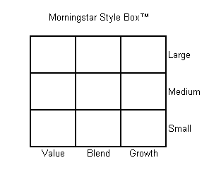

The investment landscape is vast and complex, providing a myriad of strategies and instruments designed to enhance returns and manage risk. Among these, mutual funds and algorithmic trading stand out as prominent tools for investors aiming to optimize their portfolios. Each offers distinct advantages and can be tailored to meet individual investment objectives and risk tolerance levels.

Mutual funds serve as a vehicle for pooling capital from diverse investors to purchase a diversified portfolio of stocks, bonds, or other securities. A critical aspect of mutual fund investment is understanding the style box categories, a framework developed by Morningstar. Style boxes classify mutual funds based on market capitalization (such as large-cap, mid-cap, and small-cap) and investment style (value, blend, growth). This classification aids investors in aligning their portfolio choices with their personal financial goals and risk tolerance, thereby fostering informed decision-making.



On the other hand, algorithmic trading introduces a dynamic, data-driven approach to asset management. This technique leverages sophisticated algorithms to execute trades at speeds and frequencies that are impossible for human traders. By integrating algorithmic trading into investment strategies, investors can enhance efficiency, reduce human error, and respond swiftly to market changes.

This article is designed to explore the integration of style box mutual funds and algorithmic trading, examining how these tools can be used individually and together to navigate the evolving investment landscape. By considering the nuances of style box categories and the impact of algorithmic trading, investors can develop a comprehensive understanding that enhances both strategic planning and execution in their investment endeavors.

## Table of Contents

## Understanding Style Box Mutual Funds

The style box, developed by Morningstar, serves as an instrumental tool for categorizing mutual funds based on distinct investment characteristics, thus offering clarity and guidance for investors. This classification system operates on two primary axes: market capitalization and investment style.

### Market Capitalization

Market capitalization, often abbreviated as market cap, is a measure of a company's value determined by multiplying the current share price by the total number of outstanding shares. Mutual funds are categorized into three market capitalization groups:

1. **Large-cap**: These funds invest in companies with a substantial market capitalization, typically over $10 billion. Large-cap stocks are generally well-established companies with a history of stable earnings and dividends.

2. **Mid-cap**: Mid-cap funds focus on companies with a market capitalization between $2 billion and $10 billion. These entities are usually in the midst of expansion and growth, offering a blend of stability and growth potential.

3. **Small-cap**: Small-cap funds target companies with a market capitalization of less than $2 billion. These firms are often in the early stages of development, presenting higher growth prospects with corresponding increased risks.

### Investment Style

Investment style is another critical component of the style box, categorizing funds into three distinct styles:

1. **Value**: Value funds invest in stocks perceived to be undervalued based on fundamental analysis. These stocks typically have lower price-to-book ratios and may offer attractive dividends.

2. **Blend**: Blend (or core) funds include a mix of growth and value stocks. This balanced approach aims to offer intermediate performance by capturing the benefits of both value and growth investing.

3. **Growth**: Growth funds focus on companies with above-average growth potential, often reflected in higher price-to-earnings ratios. These stocks may not pay dividends, as retained earnings are reinvested to fuel further growth.

The style box framework, by crossing these two dimensions—market capitalization and investment style—yields a nine-square grid, where each cell represents a unique category of funds. This visual depiction enables both retail and institutional investors to promptly evaluate and compare mutual fund characteristics, thus aligning investment decisions with specific financial objectives and risk tolerance.

By employing the style box system, investors can streamline the process of diversifying their portfolios, aiding in the selection of funds that align with their strategic goals, whether those involve stability, moderate growth, or aggressive expansion.

## Categories of Style Box Mutual Funds

The style box is an essential tool in categorizing mutual funds, offering investors a framework to make informed decisions based on their investment preferences. Originating from the domestic equity market, the style box also extends to international equities and fixed-income investments, providing a comprehensive guideline for evaluating potential investment opportunities.

### Domestic and International Equity Style Boxes

Within the domestic equity style box, the categorization hinges on two principal dimensions: market capitalization and investment style. Market capitalization typically divides funds into large-cap, mid-cap, and small-cap categories, each representing companies of varying sizes. Investment style, on the other hand, classifies funds as value, blend, or growth. This dual-axis classification creates a grid, allowing investors to assess and compare funds efficiently.

- **Large-Cap Growth**: This category targets large, established companies exhibiting potential for above-average revenue and earnings growth. Large-cap growth funds often appeal to investors seeking stability with the opportunity for reasonable growth.

- **Mid-Cap Blend**: Occupying a middle ground, mid-cap blend funds invest in medium-sized companies and mix value and growth investment styles. They offer a balanced risk-return ratio, appealing to investors looking for a combination of stability and moderate growth potential.

- **Small-Cap Value**: These funds focus on smaller companies perceived to be undervalued relative to their intrinsic worth. Small-cap value funds typically offer higher growth potential but come with increased volatility, making them suitable for investors with a higher risk tolerance.

### Fixed-Income Style Boxes

The style box framework also applies to fixed-income investments, classifying funds by credit quality (high, medium, low) and [interest rate](/wiki/interest-rate-trading-strategies) sensitivity (limited, moderate, extensive). This segmentation aids investors in understanding the risk and expected yield associated with different fixed-income securities.

Each category within the style box framework exhibits distinct risk and return characteristics. Large-cap investments, generally characterized by lower [volatility](/wiki/volatility-trading-strategies), appeal to risk-averse investors, while small-cap funds attract those willing to tolerate higher risk for potentially greater returns. Factors such as economic conditions, interest rate fluctuations, and market sentiment can influence the performance of these categories, impacting investment decisions and portfolio outcomes.

In summary, by aligning investment choices with their risk appetite and financial goals, investors can use the style box to construct diversified portfolios that balance risk and reward. Understanding these categories is pivotal in tailoring investment strategies to meet specific financial objectives.

## Algorithmic Trading in Mutual Funds

Algorithmic trading has become a transformative force in mutual fund management. It employs sophisticated computer algorithms to execute trades based on predetermined criteria, which enhances the efficiency of managing funds. By leveraging this technology-driven approach, mutual funds gain the ability to execute orders rapidly and with precision, minimizing the potential for human error and improving the execution quality overall.

In mutual fund management, [algorithmic trading](/wiki/algorithmic-trading) optimizes asset allocations, a process that involves systematically adjusting the proportions of various securities within a portfolio to meet specific objectives such as desired risk levels, expected returns, or [liquidity](/wiki/liquidity-risk-premium) needs. These algorithms can monitor multiple data streams, including market conditions, economic indicators, and security prices, to dynamically adjust a fund's holdings. This dynamic optimization can be expressed mathematically as:

$$

\text{Maximize:} \quad \sum_{i=1}^{n} ( \mu_i x_i - \frac{1}{2} \lambda \sum_{i=1}^{n} \sum_{j=1}^{n} \Sigma_{ij} x_i x_j ) 
$$

subject to constraints:

$$

\sum_{i=1}^{n} x_i = 1 
$$

Where:
- $\mu_i$ is the expected return of asset $i$,
- $x_i$ is the proportion of the portfolio invested in asset $i$,
- $\lambda$ reflects the risk tolerance of the portfolio,
- $\Sigma_{ij}$ represents the covariance between returns of assets $i$ and $j$.

This setup allows for an optimal balance between expected returns and risk, which is particularly advantageous in maintaining alignment with the extensive and complex portfolio goals of mutual funds.

Moreover, algorithms enable seamless portfolio rebalancing. This function ensures that a mutual fund's asset allocation stays consistent with its strategic investment plan, despite fluctuations in market conditions or security values. Through algorithmic trading, funds can swiftly respond to significant market shifts—facilitating a more agile investment approach compared to traditional methods.

Algorithms can also incorporate advanced predictive analytics to forecast market trends, thereby paving the way for proactive adjustments rather than reactive shifts. This capability significantly strengthens a fund's position to leverage opportunities or mitigate risks efficiently. Overall, algorithmic trading introduces an advanced level of strategic management into mutual funds, marrying the benefits of automated execution with data-driven decision-making processes.

## Integrating Style Box and Algorithmic Trading

Integrating style box analysis with algorithmic trading offers a sophisticated approach to investment strategy, enhancing both the fundamental assessment of mutual funds and the precision of automated trade execution. This synthesis allows investors to gain a comprehensive understanding of fund characteristics while leveraging advanced technological tools to implement trades efficiently.

Style box analysis classifies mutual funds based on market capitalization and investment style, providing a robust framework for evaluating potential investments. This strategic overview helps investors identify funds that align with their risk tolerance and return expectations, categorizing them into nine distinct segments. By understanding these categories, investors can make informed decisions about where to allocate their capital, balancing growth prospects with risk exposure.

On the other hand, algorithmic trading introduces automation into this strategic framework, offering tactical execution capabilities that are both sophisticated and precise. Algorithms can process vast amounts of financial data in real time, executing trades based on predefined criteria such as price movements, trading [volume](/wiki/volume-trading-strategy), or other market indicators. This automation minimizes human intervention, reducing the likelihood of errors and allowing for rapid response to market fluctuations.

When combined, style box analysis and algorithmic trading enhance the strategic alignment of investment portfolios with investor goals. Consider a scenario where an investor aims to maintain a balanced portfolio across different style box categories. An algorithm can monitor market conditions and rebalance the portfolio dynamically, ensuring it remains aligned with the investor's strategic intent, even amid market volatility. This ensures that the portfolio does not deviate from its intended target allocation due to market movements.

Additionally, this integration provides an opportunity for dynamic adjustment. For example, if market conditions suggest a potential downturn, an algorithm can reassess the style box allocations and adjust them proactively to mitigate risk. Conversely, during bullish markets, the algorithm can shift allocations to capitalize on growth opportunities. This dynamic aspect of algorithmic trading complements the static nature of style box analysis, creating a powerful synergy that enhances portfolio performance.

Moreover, algorithmic strategies can incorporate predictive analytics and [machine learning](/wiki/machine-learning) models to forecast market trends, adjusting style box allocations accordingly. Python, with its robust libraries such as NumPy and pandas, can be used to develop these models. For instance, using historical data on fund performance and market trends, a Python script could be designed to forecast future movements and optimize portfolio allocations in line with those forecasts.

In conclusion, the integration of style box analysis with algorithmic trading provides a nuanced approach to investment management. It combines a strategic overview with tactical execution, enabling investors to maintain alignment with their financial goals while effectively navigating market volatility. This integration empowers investors to harness both fundamental and technological advancements, enhancing the effectiveness of their investment strategies.

## Advantages of Algorithmic Trading in Mutual Fund Investment

Algorithmic trading provides remarkable scalability in mutual fund investment by enabling the processing of extensive data sets and executing trades at high speed. This scalability is achieved through the automation of trading processes, wherein algorithms can analyze and react to market conditions quicker than human traders. The automation reduces the time taken from decision-making to execution, allowing for more timely responses to market fluctuations. For instance, algorithms can be set to automatically execute buy or sell orders when certain market conditions or thresholds are met, optimizing the timing of trades to capitalize on favorable market movements.

An additional benefit of algorithmic trading is its enhancement of liquidity and price discovery. Liquidity refers to the ease with which an asset or security can be bought or sold in the market without affecting its price. Algorithms are capable of continuously scanning multiple market sources for liquidity, thereby discovering optimal prices for mutual fund transactions. By facilitating more frequent trading, algorithms contribute to a more active and liquid market, which in turn, can lead to better pricing and tighter bid-ask spreads for mutual funds. This continuous monitoring and rapid execution of trades help in aligning fund transactions with beneficial price points more effectively than manual trading.

Moreover, risk management strategies in mutual fund investment are significantly improved through the use of algorithmic trading. Algorithms can incorporate predictive analytics and data modeling to evaluate potential market risks continuously. For example, algorithms can compute the Value at Risk (VaR) by analyzing historical price movements and volatility patterns to estimate the maximum potential loss over a given period with a certain confidence level. This calculation allows fund managers to make informed decisions on asset allocations and hedging strategies to mitigate potential losses. Additionally, machine learning models can be developed to predict market trends and anomalies, enabling algorithms to adapt to new, unseen data and improving the fund’s risk management processes over time.

In Python, a simple algorithm for evaluating VaR using the historical method could be as follows:

```python
import numpy as np

def calculate_var(returns, confidence_level=0.95):
    """
    Calculate the Value at Risk (VaR) using the historical method.

    Parameters:
    returns (list or array): A list or array of historical returns.
    confidence_level (float): The confidence level for the VaR calculation (optional, default=0.95).

    Returns:
    float: The calculated Value at Risk.
    """
    sorted_returns = np.sort(returns)
    index = int((1 - confidence_level) * len(sorted_returns))
    return sorted_returns[index]

# Example usage
historical_returns = [-0.02, -0.01, 0.0, 0.01, 0.02, 0.03, 0.04]
var = calculate_var(historical_returns, confidence_level=0.95)
print(f"The Value at Risk at a 95% confidence level is: {var:.2%}")
```

This approach allows fund managers to continuously assess and adjust their strategies as market conditions change, ensuring that they remain aligned with investment objectives and risk tolerances.

## Challenges and Considerations

The implementation of algorithmic trading within mutual fund investment presents several challenges and considerations that necessitate careful assessment and strategic planning. The increasing reliance on sophisticated technology and data-driven processes introduces inherent risks, particularly if systems experience outages or malfunctions. This vulnerability can disrupt trading activities, potentially leading to financial losses and reputational damage. To mitigate these risks, robust systems with rigorous testing and failover protocols are essential to ensure continuous operation and data integrity.

Regulatory frameworks also present significant challenges as algorithmic trading strategies become more complex. Financial authorities globally are continually evolving their regulations to oversee the rapidly changing landscape of algorithmic investment strategies. This requires mutual funds to maintain strict compliance standards, which can increase operational complexity and costs. Funds must adapt to changing regulations by implementing comprehensive monitoring systems and maintaining transparency in their algorithmic processes to satisfy regulatory requirements.

Transparency is another critical consideration in maintaining investor trust and ensuring that algorithmic strategies are aligned with stated investment objectives. Investors require clarity on how algorithms operate, including the criteria and data inputs used in decision-making processes. This transparency helps investors understand potential risks and benefits, fostering greater confidence in algorithmic trading solutions. Providing detailed disclosures and ensuring that the strategies employed are consistent with the fund's investment goals are vital components in building and maintaining investor trust.

The fusion of technology and investment demands an ongoing commitment to addressing these challenges. By focusing on system robustness, regulatory compliance, and maintaining transparency, mutual funds can effectively leverage algorithmic trading while minimizing associated risks.

## Conclusion

The evolution of investment strategies has led to the convergence of style box mutual funds and algorithmic trading, creating a sophisticated approach that modern investors can leverage. By integrating these two tools, investors are equipped with a robust framework for gaining a clearer understanding of investment characteristics and executing precise, data-driven trades.

The style box provides a structured way to evaluate mutual funds, offering insights into market capitalization and investment style. This understanding allows investors to better align their portfolios with personal risk tolerances and financial goals. On the other hand, algorithmic trading introduces a layer of efficiency and speed, enabling rapid execution and real-time response to market fluctuations. This synergy fosters an environment where investors can maximize returns while minimizing risks and human errors.

As the investment landscape becomes increasingly dynamic, the ability to adapt and embrace technological advancements is crucial. Combining [fundamental analysis](/wiki/fundamental-analysis) from the style boxes with the cutting-edge execution capabilities of algorithmic trading offers a competitive edge. Investors who stay informed and open to these evolving tools are likely to navigate market challenges more successfully, ensuring that their investment strategies are not only modern but also maximally effective.

## References & Further Reading

[1]: [Morningstar's Style Box Methodology](https://www.morningstar.com/content/dam/marketing/shared/research/methodology/678263-StyleBoxMethodolgy.pdf) provides an overview of how the style box framework categorizes funds by market capitalization and investment style.

[2]: Lopez de Prado, M. (2018). ["Advances in Financial Machine Learning."](https://books.google.com/books/about/Advances_in_Financial_Machine_Learning.html?id=oU9KDwAAQBAJ) John Wiley & Sons. This book covers the intersection of machine learning and algorithmic trading in depth.

[3]: Chan, E. P. (2009). ["Quantitative Trading: How to Build Your Own Algorithmic Trading Business."](https://github.com/ftvision/quant_trading_echan_book) John Wiley & Sons. This book offers guidance on starting an algorithmic trading business, including tools and practical experiences.

[4]: Jansen, S. (2020). ["Machine Learning for Algorithmic Trading: Predictive Models to Extract Signals From Market and Alternative Data for Systematic Trading Strategies."](https://github.com/stefan-jansen/machine-learning-for-trading) Packt Publishing. This book explores the use of machine learning to enhance trading strategies.

[5]: Aronson, D. R. (2006). ["Evidence-Based Technical Analysis: Applying the Scientific Method and Statistical Inference to Trading Signals."](https://www.amazon.com/Evidence-Based-Technical-Analysis-Scientific-Statistical/dp/0470008741) Wiley. This book introduces a rigorous approach to evaluating trading signals through scientific methods.