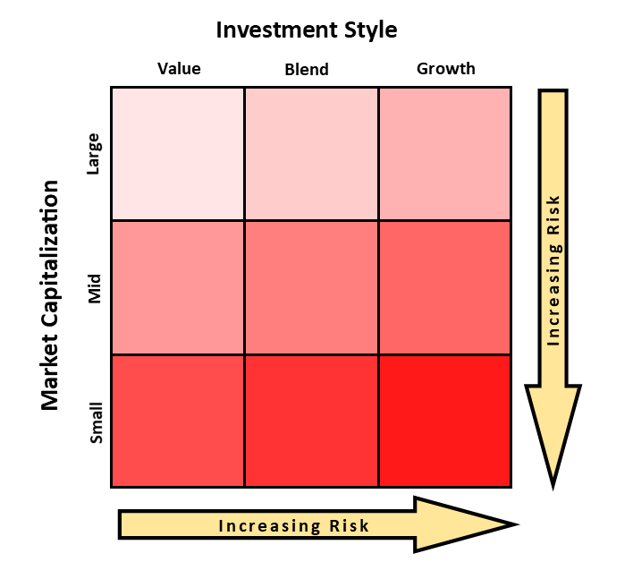

## Table of Contents

## What is a mutual fund style box?

A mutual fund style box is a tool used to show what kind of stocks or bonds a mutual fund invests in. It's like a map that helps you see if the fund focuses on big companies or small ones, and whether it looks for companies that are growing fast or ones that are more stable and pay dividends.

The style box is a grid with nine boxes. On one side, it shows size: large, medium, or small companies. On the other side, it shows investment style: growth, value, or a mix of both. By looking at where a fund falls in this grid, you can quickly understand its investment approach and decide if it matches your investment goals.

## Who developed the mutual fund style box?

The mutual fund style box was created by Morningstar, a company that helps people make smart choices about investing. They wanted to make it easier for people to see what kind of stocks or bonds a mutual fund was investing in. So, they came up with this simple grid that shows whether a fund focuses on big, medium, or small companies and if it looks for companies that are growing fast or ones that are more stable.

Morningstar introduced the style box in 1992. It quickly became a popular tool because it helped investors understand a fund's strategy at a glance. By using the style box, people could see if a fund matched their own investment goals and if it was different enough from other funds they already owned. This made it easier for everyone to build a well-rounded investment portfolio.

## What are the main components of a mutual fund style box?

A mutual fund style box is a helpful tool that shows what kind of companies a mutual fund invests in. It's like a map with nine squares. On one side, it shows the size of the companies the fund invests in: big, medium, or small. Big companies are called "large-cap," medium ones are "mid-cap," and small ones are "small-cap." On the other side, it shows the investment style: growth, value, or a mix of both called "blend." Growth companies are expected to grow fast, while value companies are often more stable and might pay dividends.

The style box helps you see at a glance where a mutual fund fits. If a fund is in the top left box, it invests in big companies that are growing fast. If it's in the bottom right, it focuses on small companies that might be undervalued. By looking at the style box, you can quickly understand if a fund matches what you're looking for in your investments. This can help you decide if you want to invest in it or if it's different enough from other funds you already own.

## How does the style box categorize equity funds?

The style box helps sort equity funds into different groups based on the size of the companies they invest in and the way they invest. On one side, it looks at the size of the companies: big, medium, or small. Big companies are called "large-cap," medium ones are "mid-cap," and small ones are "small-cap." This tells you if the fund focuses on big, established companies or smaller, up-and-coming ones.

On the other side, the style box shows the investment approach: growth, value, or a mix of both called "blend." Growth funds look for companies that are expected to grow fast. Value funds focus on companies that might be undervalued and could be good deals. Blend funds invest in a mix of growth and value companies. By looking at where a fund lands in the style box, you can quickly see if it's a good fit for what you want in your investments.

## How does the style box categorize fixed-income funds?

The style box also helps sort fixed-income funds, which are funds that invest in bonds. It looks at two main things: the credit quality of the bonds and how long it takes for the bonds to mature. Credit quality tells you how safe the bonds are, with high-quality bonds being safer and lower-quality bonds being riskier. Maturity shows if the bonds will pay back the money soon or after a long time. This helps you see if a fund is more focused on safety or on earning more money.

The style box for fixed-income funds has a grid with nine boxes. On one side, it shows the credit quality: high, medium, or low. High-quality bonds are less risky and are often from governments or big, stable companies. Medium and low-quality bonds are riskier and might come from smaller companies or ones with more debt. On the other side, it shows the maturity: short, intermediate, or long. Short-term bonds pay back money quickly, while long-term bonds take longer. By looking at where a fund fits in this grid, you can understand if it matches what you want in your investment, like safety or higher returns.

## What do the different sizes of the boxes in a style box represent?

The different sizes of the boxes in a style box don't actually change in size. Instead, the style box is a grid with nine equal-sized boxes. For equity funds, the grid shows the size of the companies the fund invests in on one side (large-cap, mid-cap, or small-cap) and the investment style on the other side (growth, value, or blend). This helps you see if the fund focuses on big, medium, or small companies, and if it looks for companies that are growing fast or ones that might be undervalued.

For fixed-income funds, the style box works a bit differently but still uses a grid with nine equal-sized boxes. One side shows the credit quality of the bonds (high, medium, or low), which tells you how safe the bonds are. The other side shows the maturity of the bonds (short, intermediate, or long), which tells you how long it will take for the bonds to pay back the money. This helps you understand if the fund focuses on safer bonds or riskier ones, and if it invests in bonds that pay back quickly or after a long time.

## How can investors use a mutual fund style box to make investment decisions?

Investors can use a mutual fund style box to make smart choices about where to put their money. The style box helps them see at a glance what kind of companies or bonds a mutual fund invests in. For equity funds, it shows if the fund focuses on big, medium, or small companies and if it looks for fast-growing companies or ones that might be a good deal. For fixed-income funds, it shows if the fund invests in safe or riskier bonds and if it wants money back quickly or is willing to wait longer. By looking at the style box, investors can pick funds that match their goals, like wanting to grow their money fast or wanting to keep it safe.

Using the style box also helps investors build a balanced portfolio. They can see if they have too many funds that are all the same type, like all big companies or all fast-growing ones. If they do, they might want to add funds that are different to spread out their risk. For example, if they already have a lot of funds that invest in big, fast-growing companies, they might choose a fund that invests in smaller, undervalued companies. This way, if one type of investment doesn't do well, the others might help balance it out. The style box makes it easy to see what they have and what they might need to add to their investments.

## What are the limitations of using a mutual fund style box for investment analysis?

Using a mutual fund style box can be helpful, but it has its limits. One big limit is that it only shows a snapshot of where the fund is investing right now. It doesn't tell you how the fund has done in the past or if the managers might change their strategy in the future. So, you might think you're getting a fund that invests in big, fast-growing companies, but if the managers start buying smaller or different kinds of companies, the style box won't show that change right away.

Another thing to keep in mind is that the style box doesn't tell you everything about a fund. It doesn't show you how much the fund costs to own, how much risk you're taking, or how well it's been doing compared to other funds. These are all important things to know before you decide to invest. So, while the style box is a good starting point to understand what a fund invests in, you need to look at other information too to make a smart choice.

## How has the use of the mutual fund style box evolved over time?

Since its introduction by Morningstar in 1992, the mutual fund style box has become a widely used tool for investors. At first, it was mainly used to help people understand what kinds of stocks a mutual fund was investing in, whether they were big, medium, or small companies, and if they were focused on growth or value. As more people started using it, the style box became a standard way to quickly see a fund's investment approach. This made it easier for people to compare different funds and pick the ones that matched their goals.

Over time, the style box has been adapted to help with more than just stock funds. It's now used for bond funds too, showing whether they invest in safe or riskier bonds and if they want their money back quickly or are willing to wait longer. As investing has gotten more complicated with new types of funds and strategies, the style box has stayed a simple but powerful tool. It helps investors build a balanced portfolio by making sure they don't have too many funds that are all the same type. Even though it has its limits, the style box keeps being a key part of how people make choices about where to put their money.

## Can the style box be applied to other types of investments beyond mutual funds?

Yes, the style box can be used for other types of investments too, not just mutual funds. For example, it can be helpful for looking at exchange-traded funds (ETFs). ETFs are like mutual funds but trade on the stock market like a stock. The style box can show you if an ETF focuses on big, medium, or small companies and if it's looking for fast-growing companies or ones that might be a good deal. This makes it easier to understand what an ETF invests in and decide if it fits your investment goals.

The style box can also be used to understand the investments of individual stocks or even portfolios. For individual stocks, you can see if a company is big or small and if it's more about growth or value. For portfolios, the style box helps you see if your investments are spread out well or if you have too many of the same type. While the style box is a simple tool, it can be used in many ways to help you make smart choices about different kinds of investments.

## What advanced techniques can be used to interpret the data within a mutual fund style box?

To get a deeper understanding of what a mutual fund style box shows, you can use some advanced techniques. One way is to look at the fund's holdings over time, not just at one moment. This can help you see if the fund's managers are sticking to the same strategy or if they're changing it. You might find that a fund that's supposed to invest in big, fast-growing companies is actually starting to buy smaller or different kinds of companies. This can give you a better idea of what to expect from the fund in the future.

Another technique is to compare the fund's performance with other funds in the same box. This can show you if the fund is doing better or worse than others with a similar strategy. You can also look at how the fund performs in different market conditions, like when the stock market is going up or down. This can help you understand how risky the fund might be and if it fits with your investment goals. By using these advanced techniques, you can get a fuller picture of what the style box is telling you and make smarter choices about where to put your money.

## How do financial advisors integrate the mutual fund style box into comprehensive portfolio management?

Financial advisors use the mutual fund style box to help them build a balanced portfolio for their clients. They look at where each fund fits in the style box to make sure the client's investments are spread out well. For example, if a client already has a lot of funds that invest in big, fast-growing companies, the advisor might suggest adding funds that invest in smaller or undervalued companies. This helps spread out the risk so that if one type of investment doesn't do well, the others might help balance it out. By using the style box, advisors can see at a glance what kinds of companies or bonds a fund invests in and make sure the client's investments match their goals.

Advisors also use the style box to help explain investments to their clients in a simple way. They can show clients where their money is going and why they picked certain funds. This makes it easier for clients to understand their portfolio and feel good about their investment choices. The style box is just one tool, though. Advisors also look at other things like how much the funds cost, how much risk they carry, and how they've done in the past. By combining the style box with this other information, advisors can build a strong, well-rounded portfolio that fits each client's needs.

## What is Algorithmic Trading in Mutual Funds?

Algorithmic trading has become a transformative force in mutual fund management. It employs sophisticated computer algorithms to execute trades based on predetermined criteria, which enhances the efficiency of managing funds. By leveraging this technology-driven approach, mutual funds gain the ability to execute orders rapidly and with precision, minimizing the potential for human error and improving the execution quality overall.

In mutual fund management, [algorithmic trading](/wiki/algorithmic-trading) optimizes asset allocations, a process that involves systematically adjusting the proportions of various securities within a portfolio to meet specific objectives such as desired risk levels, expected returns, or [liquidity](/wiki/liquidity-risk-premium) needs. These algorithms can monitor multiple data streams, including market conditions, economic indicators, and security prices, to dynamically adjust a fund's holdings. This dynamic optimization can be expressed mathematically as:

$$

\text{Maximize:} \quad \sum_{i=1}^{n} ( \mu_i x_i - \frac{1}{2} \lambda \sum_{i=1}^{n} \sum_{j=1}^{n} \Sigma_{ij} x_i x_j ) 
$$

subject to constraints:

$$

\sum_{i=1}^{n} x_i = 1 
$$

Where:
- $\mu_i$ is the expected return of asset $i$,
- $x_i$ is the proportion of the portfolio invested in asset $i$,
- $\lambda$ reflects the risk tolerance of the portfolio,
- $\Sigma_{ij}$ represents the covariance between returns of assets $i$ and $j$.

This setup allows for an optimal balance between expected returns and risk, which is particularly advantageous in maintaining alignment with the extensive and complex portfolio goals of mutual funds.

Moreover, algorithms enable seamless portfolio rebalancing. This function ensures that a mutual fund's asset allocation stays consistent with its strategic investment plan, despite fluctuations in market conditions or security values. Through algorithmic trading, funds can swiftly respond to significant market shifts—facilitating a more agile investment approach compared to traditional methods.

Algorithms can also incorporate advanced predictive analytics to forecast market trends, thereby paving the way for proactive adjustments rather than reactive shifts. This capability significantly strengthens a fund's position to leverage opportunities or mitigate risks efficiently. Overall, algorithmic trading introduces an advanced level of strategic management into mutual funds, marrying the benefits of automated execution with data-driven decision-making processes.

## References & Further Reading

[1]: [Morningstar's Style Box Methodology](https://www.morningstar.com/content/dam/marketing/shared/research/methodology/678263-StyleBoxMethodolgy.pdf) provides an overview of how the style box framework categorizes funds by market capitalization and investment style.

[2]: Lopez de Prado, M. (2018). ["Advances in Financial Machine Learning."](https://books.google.com/books/about/Advances_in_Financial_Machine_Learning.html?id=oU9KDwAAQBAJ) John Wiley & Sons. This book covers the intersection of machine learning and algorithmic trading in depth.

[3]: Chan, E. P. (2009). ["Quantitative Trading: How to Build Your Own Algorithmic Trading Business."](https://github.com/ftvision/quant_trading_echan_book) John Wiley & Sons. This book offers guidance on starting an algorithmic trading business, including tools and practical experiences.

[4]: Jansen, S. (2020). ["Machine Learning for Algorithmic Trading: Predictive Models to Extract Signals From Market and Alternative Data for Systematic Trading Strategies."](https://github.com/stefan-jansen/machine-learning-for-trading) Packt Publishing. This book explores the use of machine learning to enhance trading strategies.

[5]: Aronson, D. R. (2006). ["Evidence-Based Technical Analysis: Applying the Scientific Method and Statistical Inference to Trading Signals."](https://www.amazon.com/Evidence-Based-Technical-Analysis-Scientific-Statistical/dp/0470008741) Wiley. This book introduces a rigorous approach to evaluating trading signals through scientific methods.