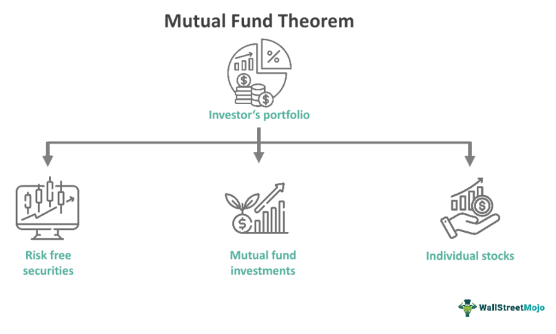

## Table of Contents

## What is a mutual fund?

A mutual fund is a type of investment where many people put their money together to buy a variety of stocks, bonds, or other assets. It's like a big basket where everyone's money goes in, and a professional manager decides what to buy and sell. This makes it easier for people who don't want to pick their own investments because they can rely on the expertise of the fund manager.

When you invest in a mutual fund, you buy shares of the fund, and the value of your shares goes up or down based on how well the investments in the fund are doing. Mutual funds are popular because they help spread out the risk. Instead of putting all your money into one company, your money is spread across many different investments. This can make it less risky than picking individual stocks on your own.

## What is the Mutual Fund Theorem?

The Mutual Fund Theorem is a big idea in finance that helps explain how people should invest their money. It says that if you want to spread out your risk without losing out on possible gains, you can do it by investing in just two mutual funds. One of these funds should be a safe one, like a bond fund, and the other should be a riskier one, like a stock fund. By mixing these two funds in the right way, you can make a portfolio that fits your comfort level with risk.

This theorem is important because it shows that you don't need to buy a lot of different stocks and bonds on your own to manage your risk. Instead, you can use mutual funds to do it more easily. The idea was first talked about by economists James Tobin and Harry Markowitz. They showed that by choosing the right mix of a safe and a risky fund, you can reach the same level of risk and reward as if you had picked a bunch of different investments yourself.

## How does the Mutual Fund Theorem relate to portfolio diversification?

The Mutual Fund Theorem is all about making it easier for people to spread out their investment risk. It says that instead of buying lots of different stocks and bonds yourself, you can just invest in two mutual funds. One fund should be safe, like a bond fund, and the other should be riskier, like a stock fund. By mixing these two funds in the right way, you can create a portfolio that matches how much risk you're okay with taking. This is a big help because it means you don't have to spend a lot of time and effort [picking](/wiki/asset-class-picking) individual investments.

This theorem is closely tied to the idea of portfolio diversification. Diversification means not putting all your eggs in one basket, and the Mutual Fund Theorem shows a simple way to do this. By investing in a mix of a safe and a risky mutual fund, you're spreading your money across many different types of investments without having to do all the work yourself. This can help you manage risk better and still have a chance to grow your money over time.

## What are the key assumptions of the Mutual Fund Theorem?

The Mutual Fund Theorem is based on some important ideas that help it work. One big idea is that investors can choose their level of risk. It says that people can mix a safe investment, like a bond fund, with a riskier one, like a stock fund, to find the right balance of risk and reward for them. This means that everyone can have a different mix of these two funds, depending on how much risk they want to take.

Another key idea is that markets work well and all investors have the same information. This means that prices in the market show what things are really worth, and no one has secret information that gives them an advantage. This is important because it helps make sure that the mutual funds are a good way to invest. If markets were not fair, then the theorem might not work as well.

Lastly, the theorem assumes that investors care about risk and reward in a certain way. They want to get the most reward for the amount of risk they take. This idea is called the mean-variance framework, which means that investors look at the average return (mean) and how much it can change (variance). By using this framework, the theorem shows that you can reach your investment goals just by mixing two mutual funds.

## Can you explain the mechanism behind the Mutual Fund Theorem?

The Mutual Fund Theorem is all about making investing easier and safer for people. It says that instead of buying lots of different stocks and bonds on your own, you can just invest in two mutual funds. One of these funds should be a safe one, like a bond fund, and the other should be a riskier one, like a stock fund. By mixing these two funds in the right way, you can create a portfolio that matches how much risk you're okay with taking. This means you don't need to spend a lot of time picking individual investments. You can just decide how much you want to put into the safe fund and how much into the risky fund, and you're all set.

The theorem works because it assumes that markets are fair and everyone has the same information. This means that the prices in the market show what things are really worth, and no one has secret information that gives them an advantage. It also assumes that investors want to get the most reward for the amount of risk they take. They look at the average return and how much it can change. By using these ideas, the theorem shows that you can reach your investment goals just by mixing a safe fund and a risky fund. This makes it easier for people to spread out their risk without losing out on possible gains.

## How does the Mutual Fund Theorem impact individual investment strategies?

The Mutual Fund Theorem makes it easier for people to plan how they want to invest their money. It says that instead of picking a lot of different stocks and bonds, you can just invest in two mutual funds. One should be a safe fund, like a bond fund, and the other should be a riskier fund, like a stock fund. By choosing how much to put into each fund, you can create a plan that matches how much risk you're okay with taking. This means you don't need to spend a lot of time and effort picking individual investments. You can just decide on the right mix of the safe and risky funds, and you're all set.

This theorem is helpful because it shows that you can spread out your risk without losing out on possible gains. It assumes that markets are fair and everyone has the same information. This means that the prices in the market show what things are really worth, and no one has secret information that gives them an advantage. By using this idea, you can reach your investment goals just by mixing a safe fund and a risky fund. This makes it easier for people to manage their risk and still have a chance to grow their money over time.

## What are the implications of the Mutual Fund Theorem for financial markets?

The Mutual Fund Theorem has big effects on how financial markets work. It says that people can reach their investment goals by just investing in two mutual funds, one safe and one risky. This makes it easier for people to invest without spending a lot of time picking individual stocks and bonds. Because of this, more people might choose to invest in mutual funds instead of trying to pick stocks on their own. This can lead to more money flowing into mutual funds, which can make them bigger and more important in the market.

This theorem also helps make markets more fair. It assumes that everyone has the same information and that prices show what things are really worth. When more people invest in mutual funds, it can help keep the market balanced. If lots of people are putting money into the same funds, it can help make sure that no one group has too much power over the market. This can lead to a more stable and fair market where everyone has a chance to do well with their investments.

## How does the Mutual Fund Theorem support the concept of market efficiency?

The Mutual Fund Theorem helps show that markets can be fair and efficient. It says that people can get the best mix of risk and reward just by investing in two mutual funds, one safe and one risky. This means that people don't need to spend a lot of time picking individual stocks and bonds. Instead, they can trust that the prices in the market are fair and show what things are really worth. When more people invest in mutual funds, it helps make sure that no one group has too much power over the market. This can lead to a more balanced and fair market where everyone has a chance to do well with their investments.

The theorem also assumes that everyone has the same information. This is important because it means that no one has secret information that gives them an advantage. When everyone is working with the same information, it helps keep the market efficient. The prices of stocks and bonds will change based on what everyone knows, not because some people know more than others. This makes it easier for people to trust the market and feel confident that they can reach their investment goals by just choosing the right mix of mutual funds.

## What are the criticisms or limitations of the Mutual Fund Theorem?

The Mutual Fund Theorem has some problems that people point out. One big issue is that it assumes everyone has the same information about the market. But in real life, some people might have secret information that gives them an advantage. This can make the market less fair and the theorem less useful. Another problem is that the theorem says you can reach your investment goals just by mixing a safe fund and a risky fund. But in real life, picking the right mix of funds can be hard, and it might not always work out the way you want.

Another criticism is that the theorem doesn't take into account all the costs of investing in mutual funds. There are fees and other costs that can eat into your returns. These costs can make it harder to reach your investment goals, even if you pick the right mix of funds. Also, the theorem assumes that markets are always fair and efficient, but sometimes they can be unpredictable. This means that even if you follow the theorem, you might still face surprises that can affect your investments.

## How has the Mutual Fund Theorem evolved since its inception?

Since it was first talked about, the Mutual Fund Theorem has changed a bit to fit better with how the world works now. When James Tobin and Harry Markowitz came up with it, they said you could reach your investment goals just by mixing a safe fund and a risky fund. But as time went on, people realized that the real world is more complicated. They started to think about things like fees, taxes, and how markets can be unpredictable. These new ideas helped make the theorem more useful for people today.

Even though the basic idea of the theorem is still the same, people have added new ways to use it. For example, they've come up with new types of funds that can help you spread out your risk even more. They've also made it easier to pick the right mix of funds by using computers and other tools. All these changes have made the Mutual Fund Theorem a better guide for people who want to invest their money wisely.

## Can you discuss any empirical evidence supporting the Mutual Fund Theorem?

There have been studies that looked at whether the Mutual Fund Theorem really works in real life. One big study found that when people invest in mutual funds, they can spread out their risk without losing out on possible gains. This study looked at a lot of data from different mutual funds and saw that people who mixed a safe fund and a risky fund did well. They were able to balance their risk and reward in a way that matched what the theorem said they should do. This gave some proof that the theorem can be useful for people who want to invest their money.

Another study looked at how well people did when they followed the theorem's advice. It found that people who used the theorem to pick their mix of funds often did better than people who picked their own stocks and bonds. This was because the theorem helped them spread out their risk in a smart way. The study showed that even though the real world is more complicated than the theorem assumes, it can still help people make good choices about their investments. This gave more support to the idea that the Mutual Fund Theorem can be a helpful guide for investors.

## What are the advanced applications of the Mutual Fund Theorem in modern portfolio management?

In modern portfolio management, the Mutual Fund Theorem has been used in new ways to help people invest their money better. One way is by using computer programs to pick the right mix of funds for each person. These programs can look at a lot of information and help you find the best balance of risk and reward. They can also take into account things like fees and taxes, which can make a big difference in how well your investments do. This makes it easier for people to follow the theorem and reach their investment goals.

Another way the theorem is used today is by creating new types of funds that can help you spread out your risk even more. For example, there are now funds that invest in different countries or different types of assets, like real estate or commodities. By mixing these new funds with the safe and risky funds that the theorem talks about, you can create a portfolio that is even more diversified. This can help you manage your risk better and still have a chance to grow your money over time.

## What is the Mutual Fund Theorem and how can it be understood?

The mutual fund theorem is a significant principle in financial theory that emphasizes the advantages of using mutual funds for achieving diversification and optimized mean-variance returns. This theorem was introduced by economist James Tobin, expanding on the pioneering work of Harry Markowitz who established the foundations of modern portfolio theory.

Essentially, the mutual fund theorem posits that all investors, regardless of their risk tolerance, can achieve an optimal investment portfolio by combining risk-free assets with a single mutual fund that represents a well-diversified portfolio of risky assets. This approach aligns with Markowitz's mean-variance optimization, which aims to balance risk and return in an investment portfolio.

In mathematical terms, the theorem suggests that the efficient frontier, which represents the set of optimal portfolios yielding the highest expected return for a given level of risk, can be constructed through a combination of a risk-free asset and a mutual fund consisting of a variety of securities. Consider an investor's portfolio return $R_p$, comprising a risk-free rate $R_f$ and a risky portfolio return $R_m$, weighted by the proportion $w$ invested in the risky portfolio. The expected return $E(R_p)$ can be expressed as:

$$
E(R_p) = w \cdot E(R_m) + (1 - w) \cdot R_f
$$

The variance $\sigma^2$ of the portfolio is determined solely by the variance of the risky asset:

$$
\sigma^2(R_p) = w^2 \cdot \sigma^2(R_m)
$$

By adjusting the weight $w$, investors can navigate along the capital market line, achieving different risk-return combinations according to their preferences. This aspect of the mutual fund theorem underscores the importance of mutual funds as investment vehicles, facilitating the simplification of the investment decision process. Instead of individually selecting a broad array of securities, investors can achieve diversified exposure through a single mutual fund.

Tobin's mutual fund theorem ultimately harmonizes with the principles of modern portfolio theory by providing a practical framework for constructing efficient portfolios. It highlights the role of mutual funds in streamlining investment strategies and underscores their relevance in contemporary finance by catering to the diverse risk appetites of investors.

## What are the steps to implement investment strategies from theory to practice?

Investment strategies are vital in the effective management of mutual funds, structured around two primary approaches: active and passive management. Active management requires fund managers to use strategic decision-making skills to outperform market indices. This strategy involves a comprehensive analysis of market trends, company performances, and economic indicators to select securities that are expected to deliver superior returns. Active managers may also engage in frequent trading and employ a variety of analytical tools to identify opportunities for alpha generation—excess returns relative to a benchmark index.

In contrast, passive management advocates a strategy that aims to replicate the performance of market indices, such as the S&P 500, at reduced costs. This approach is rooted in the Efficient Market Hypothesis (EMH), which suggests that all available information is already reflected in stock prices, making it challenging to consistently achieve higher returns than the market. As a result, passive management focuses on minimizing expenses and tracking error by maintaining a portfolio composition similar to that of a target index.

Diversification is a key principle in both active and passive strategies, aimed at minimizing risk while seeking potential returns. Portfolios are constructed across various asset classes—stocks, bonds, real estate, and others—to mitigate the impacts of market [volatility](/wiki/volatility-trading-strategies). The Capital Asset Pricing Model (CAPM) is often utilized to assess the risk-return trade-off, quantifying the expected return on an asset considering its risk relative to the market. The model is expressed as:

$$

E(R_i) = R_f + \beta_i (E(R_m) - R_f) 
$$

where $E(R_i)$ is the expected return of investment $i$, $R_f$ is the risk-free rate, $\beta_i$ is the beta of the investment, and $E(R_m)$ is the expected market return. The CAPM highlights the relationship between systematic risk—reflected by beta—and expected return, guiding investment decisions in both management styles.

The implementation of these strategies is further enhanced by leveraging technology and data analytics, allowing for more precise execution and enhanced decision-making capabilities. Technology plays a particularly pivotal role in active management as managers utilize advanced algorithms and data models to generate insights and optimize trading strategies. Conversely, passive management benefits from technological efficiencies in tracking indices and managing fund operations at lower costs. Overall, the synergy of these management styles with technological advancements facilitates the pursuit of optimized portfolio performance, tailored to meet investors' risk and return preferences.

## References & Further Reading

Statman, Meir. "Investment Strategies and Performance: The Case of Index Funds and Index-Based Investment." Financial Analysts Journal, vol. 52, no. 1, 1996. This paper examines the performance of index funds, emphasizing their role in diversification and efficient market representation. It provides insights into why index-based investments might be favorable for certain investment strategies.

Sharpe, William F. "Capital Asset Prices: A Theory of Market Equilibrium Under Conditions of Risk." The Journal of Finance, vol. 19, no. 3, 1964. Sharpe's work establishes the Capital Asset Pricing Model (CAPM), which introduces a method to assess the risk-return relationship of assets. This foundational theory assists in understanding market equilibria and optimal portfolios based on market risks.

Elton, Edwin J., and Gruber, Martin J. "Modern Portfolio Theory and Investment Analysis." John Wiley & Sons, 2011. This book offers comprehensive coverage of modern portfolio theory, delving into the principles of diversification, risk management, and portfolio optimization. It bridges theoretical concepts with practical applications, ensuring readers can implement effective investment strategies.

For further exploration of these topics, readers are encouraged to review recent academic journals and industry publications on investment strategies and [algorithmic trading](/wiki/algorithmic-trading). These sources not only expand on the foundational theories discussed but also provide updates on current trends and technological advances that are shaping the future of investment strategies and portfolio management.

