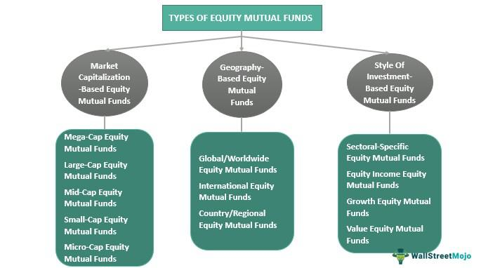

The financial landscape is characterized by continuous evolution, largely influenced by technological advancements and innovative strategies in investment management. Central to this transformation are the concepts of investment strategy, financial theory, the mutual fund theorem, and algorithmic trading. These elements significantly impact modern finance, particularly in how investors address diversification, risk management, and portfolio optimization.

Investment strategy plays a pivotal role in decision-making processes, shaping how assets are allocated and managed over time to achieve specific financial goals. Financial theory provides the underlying principles that guide these strategies, offering frameworks to evaluate risk and return. A key concept within financial theory is the mutual fund theorem, which suggests that investors can construct an optimal portfolio by investing in a diversified pool of securities. This approach, first introduced by James Tobin and expanded upon by Harry Markowitz, aligns with modern portfolio theory.

Algorithmic trading represents a technology-driven shift in investment strategies, utilizing computer algorithms to execute trades rapidly and efficiently. This method not only reduces human error but also increases market liquidity, offering a competitive edge through data-driven decision-making.

Together, these concepts underscore the dynamic landscape of contemporary finance, where the integration of traditional investment methods and technological innovation provides both challenges and opportunities for investors seeking to enhance portfolio performance.

## Table of Contents

## Understanding the Mutual Fund Theorem

The mutual fund theorem is a significant principle in financial theory that emphasizes the advantages of using mutual funds for achieving diversification and optimized mean-variance returns. This theorem was introduced by economist James Tobin, expanding on the pioneering work of Harry Markowitz who established the foundations of modern portfolio theory.

Essentially, the mutual fund theorem posits that all investors, regardless of their risk tolerance, can achieve an optimal investment portfolio by combining risk-free assets with a single mutual fund that represents a well-diversified portfolio of risky assets. This approach aligns with Markowitz's mean-variance optimization, which aims to balance risk and return in an investment portfolio.

In mathematical terms, the theorem suggests that the efficient frontier, which represents the set of optimal portfolios yielding the highest expected return for a given level of risk, can be constructed through a combination of a risk-free asset and a mutual fund consisting of a variety of securities. Consider an investor's portfolio return $R_p$, comprising a risk-free rate $R_f$ and a risky portfolio return $R_m$, weighted by the proportion $w$ invested in the risky portfolio. The expected return $E(R_p)$ can be expressed as:

$$
E(R_p) = w \cdot E(R_m) + (1 - w) \cdot R_f
$$

The variance $\sigma^2$ of the portfolio is determined solely by the variance of the risky asset:

$$
\sigma^2(R_p) = w^2 \cdot \sigma^2(R_m)
$$

By adjusting the weight $w$, investors can navigate along the capital market line, achieving different risk-return combinations according to their preferences. This aspect of the mutual fund theorem underscores the importance of mutual funds as investment vehicles, facilitating the simplification of the investment decision process. Instead of individually selecting a broad array of securities, investors can achieve diversified exposure through a single mutual fund.

Tobin's mutual fund theorem ultimately harmonizes with the principles of modern portfolio theory by providing a practical framework for constructing efficient portfolios. It highlights the role of mutual funds in streamlining investment strategies and underscores their relevance in contemporary finance by catering to the diverse risk appetites of investors.

## Investment Strategies: From Theory to Practice

Investment strategies are vital in the effective management of mutual funds, structured around two primary approaches: active and passive management. Active management requires fund managers to use strategic decision-making skills to outperform market indices. This strategy involves a comprehensive analysis of market trends, company performances, and economic indicators to select securities that are expected to deliver superior returns. Active managers may also engage in frequent trading and employ a variety of analytical tools to identify opportunities for alpha generation—excess returns relative to a benchmark index.

In contrast, passive management advocates a strategy that aims to replicate the performance of market indices, such as the S&P 500, at reduced costs. This approach is rooted in the Efficient Market Hypothesis (EMH), which suggests that all available information is already reflected in stock prices, making it challenging to consistently achieve higher returns than the market. As a result, passive management focuses on minimizing expenses and tracking error by maintaining a portfolio composition similar to that of a target index.

Diversification is a key principle in both active and passive strategies, aimed at minimizing risk while seeking potential returns. Portfolios are constructed across various asset classes—stocks, bonds, real estate, and others—to mitigate the impacts of market [volatility](/wiki/volatility-trading-strategies). The Capital Asset Pricing Model (CAPM) is often utilized to assess the risk-return trade-off, quantifying the expected return on an asset considering its risk relative to the market. The model is expressed as:

$$

E(R_i) = R_f + \beta_i (E(R_m) - R_f) 
$$

where $E(R_i)$ is the expected return of investment $i$, $R_f$ is the risk-free rate, $\beta_i$ is the beta of the investment, and $E(R_m)$ is the expected market return. The CAPM highlights the relationship between systematic risk—reflected by beta—and expected return, guiding investment decisions in both management styles.

The implementation of these strategies is further enhanced by leveraging technology and data analytics, allowing for more precise execution and enhanced decision-making capabilities. Technology plays a particularly pivotal role in active management as managers utilize advanced algorithms and data models to generate insights and optimize trading strategies. Conversely, passive management benefits from technological efficiencies in tracking indices and managing fund operations at lower costs. Overall, the synergy of these management styles with technological advancements facilitates the pursuit of optimized portfolio performance, tailored to meet investors' risk and return preferences.

## Algorithmic Trading: A Modern Investment Tool

Algorithmic trading, commonly referred to as algo trading, utilizes sophisticated computer algorithms to automate the process of trading financial instruments. This technology-driven approach allows for the swift and precise execution of trades, significantly enhancing decision-making capabilities. By analyzing vast amounts of market data in real-time, [algorithmic trading](/wiki/algorithmic-trading) can quickly adapt to market fluctuations and execute trades at optimal times, minimizing human error and reducing transactional delays.

The utilization of algorithmic trading plays a crucial role in improving market [liquidity](/wiki/liquidity-risk-premium). By executing a large [volume](/wiki/volume-trading-strategy) of trades efficiently, algo trading ensures that financial markets operate smoothly and continuously. One prominent strategy employed in algorithmic trading is trend-following, where algorithms analyze past price movements and trends to predict future price trajectories. This strategy enables traders to capitalize on market trends swiftly, thus increasing potential returns.

Arbitrage is another commonly used strategy within algorithmic trading. It involves exploiting price discrepancies of identical or similar assets across different markets or forms. By swiftly executing trades to take advantage of these inconsistencies, algo traders can secure a profit with minimal risk. The automated nature of algorithmic trading allows for these price inefficiencies to be identified and executed faster than by human traders.

The evolution of algorithmic trading reflects a broader shift towards data-driven investment strategies. As financial markets become increasingly competitive, leveraging advanced technology and data analytics provides traders with a significant advantage. Algorithms can evaluate extensive datasets that are beyond human capability to process in a timely manner, offering insights into market patterns and opportunities that would otherwise remain undiscovered.

Overall, algorithmic trading represents a modern and efficient tool in investment management, enhancing the ability to respond swiftly to market changes and optimize trading outcomes. Its integration into today’s financial markets underscores its importance as a tool for achieving a competitive edge, demonstrating the continued evolution of investment strategies in line with technological advancements.

## Integrating Mutual Funds with Algorithmic Trading

Combining mutual funds with algorithmic trading presents a unique opportunity to enhance portfolio management, mainly by executing large orders with minimal market impact. This synergy utilizes the strengths of both systems, fostering improved diversification and asset allocation.

Data-driven algorithms play a pivotal role in this integration. By analyzing vast datasets and leveraging [machine learning](/wiki/machine-learning) techniques, these algorithms can dynamically adjust asset allocations based on prevailing market conditions. This capacity allows mutual fund managers to respond swiftly and effectively to market changes, thus optimizing the risk-return balance of their portfolios.

One way data-driven algorithms support diversification is through rebalancing strategies. They can identify deviations from desired asset allocation targets and execute trades automatically to maintain the intended risk profile. For instance, if equities in a mutual fund appreciate significantly, the algorithm may suggest reallocating some capital to bonds or other asset classes to preserve the fund's risk tolerance.

Moreover, algorithmic trading systems can utilize advanced strategies such as statistical [arbitrage](/wiki/arbitrage), which involves exploiting price inefficiencies between correlated securities. This strategy helps in achieving consistent returns while ensuring that the fund's exposure to market volatility remains controlled.

The integration of mutual funds with algorithmic trading also allows for more precise execution of trades. Algorithms can break down large orders into smaller, less detectable transactions, reducing the likelihood of adverse market movements and achieving favorable execution prices. This method is particularly beneficial in maintaining the fund's performance and safeguarding against price slippage during volatile periods.

Overall, the fusion of traditional mutual fund management with cutting-edge algorithmic trading exemplifies a significant advancement in investment strategy. This integration not only harnesses the benefits of each system but also sets the stage for more sophisticated and responsive fund management in today's rapidly changing financial markets.

## Challenges and Considerations in Algo Trading

Algorithmic trading offers numerous advantages, including increased speed and efficiency. However, it also introduces several significant challenges that investors and financial institutions must address to optimize performance and mitigate risks.

One of the primary challenges in algorithmic trading is the potential for system failures. Given that algo trading relies heavily on complex software and hardware systems, any malfunction or glitch can lead to substantial financial losses. Ensuring robust and resilient systems requires rigorous testing and regular updates to software and hardware components. Implementing redundant systems can also minimize the impact of failures. Additionally, disaster recovery plans should be in place to quickly resume operations if disruptions occur.

Adhering to regulatory standards is another crucial consideration. Financial markets are subject to regulations that ensure fair trading practices and protect investors. Hence, algorithmic trading systems must comply with these regulations to avoid legal penalties and safeguard reputation. This involves maintaining transparency and implementing mechanisms for transaction reporting, as well as adhering to limits on market manipulation and other prohibited practices. Keeping abreast of regulatory changes is essential, as financial regulations frequently evolve.

Technological dependencies present another challenge. The reliance on advanced software and technologies means that algorithmic trading systems are susceptible to technological obsolescence. Continuous evaluation and integration of cutting-edge technologies are necessary to maintain a competitive edge. However, this necessity can result in increased operational costs and can strain resources, particularly for smaller institutions.

Investors engaging in algorithmic trading must remain informed about the specifics of algorithmic strategies and the associated risks. This entails not only understanding algorithm logic and the data feeding these systems but also regularly monitoring performance. Continuous monitoring can detect anomalies or deviations in expected performance, allowing for timely adjustments. It is also crucial to implement robust [backtesting](/wiki/backtesting) of trading strategies using historical data to evaluate potential risks before deploying algorithms in live markets.

In summary, algorithmic trading offers high efficiency, but with embedded challenges such as systems reliability, regulatory compliance, and technological dependencies. Addressing these effectively requires a combination of strong technical infrastructure, ongoing regulatory vigilance, and diligent risk management practices.

## Conclusion

The integration of mutual fund theorem principles, diverse investment strategies, and advanced algorithmic trading is transforming the investment landscape by significantly enhancing portfolio optimization. This convergence allows investors to efficiently manage risk and maximize returns by dynamically adjusting to market conditions. 

As the financial ecosystem continues to evolve, investors are compelled to adopt innovative techniques and technologies to maintain a competitive edge. The rapid advancements in computational power and data analytics facilitate the implementation of sophisticated algorithmic strategies, enabling more precise and timely execution of trades.

A proactive approach that embraces the synergy of these methodologies can effectively safeguard portfolios against market volatility. By leveraging algorithmic trading, fund managers can achieve superior diversification and execute complex strategies with minimal market impact, thus unlocking new efficiencies. This approach not only ensures stability in uncertain markets but also provides the opportunity for superior returns. Adapting to these changes is crucial for investors seeking to thrive in a rapidly shifting financial environment.

## References & Further Reading

Statman, Meir. "Investment Strategies and Performance: The Case of Index Funds and Index-Based Investment." Financial Analysts Journal, vol. 52, no. 1, 1996. This paper examines the performance of index funds, emphasizing their role in diversification and efficient market representation. It provides insights into why index-based investments might be favorable for certain investment strategies.

Sharpe, William F. "Capital Asset Prices: A Theory of Market Equilibrium Under Conditions of Risk." The Journal of Finance, vol. 19, no. 3, 1964. Sharpe's work establishes the Capital Asset Pricing Model (CAPM), which introduces a method to assess the risk-return relationship of assets. This foundational theory assists in understanding market equilibria and optimal portfolios based on market risks.

Elton, Edwin J., and Gruber, Martin J. "Modern Portfolio Theory and Investment Analysis." John Wiley & Sons, 2011. This book offers comprehensive coverage of modern portfolio theory, delving into the principles of diversification, risk management, and portfolio optimization. It bridges theoretical concepts with practical applications, ensuring readers can implement effective investment strategies.

For further exploration of these topics, readers are encouraged to review recent academic journals and industry publications on investment strategies and algorithmic trading. These sources not only expand on the foundational theories discussed but also provide updates on current trends and technological advances that are shaping the future of investment strategies and portfolio management.

