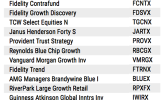

## Table of Contents

## What is a mutual fund ticker symbol?

A mutual fund ticker symbol is a unique set of letters that represents a specific mutual fund. It's like a nickname that makes it easy to find and talk about the fund. Just like how you might use a short name to quickly identify a friend, ticker symbols help investors quickly identify and track mutual funds.

These symbols are used on financial websites, in newspapers, and on trading platforms. They help investors keep an eye on how their mutual funds are doing without having to remember long, complicated names. For example, if you see "VFIAX" on a financial report, you'll know it's referring to the Vanguard 500 Index Fund Admiral Shares.

## Why do some mutual fund ticker symbols end with 'X'?

Some mutual fund ticker symbols end with 'X' to show that they are mutual funds and not other types of investments like stocks. This helps keep things organized and makes it easier for people to know what they are looking at. For example, if you see a symbol ending in 'X', you can be sure it's a mutual fund.

The 'X' at the end of a ticker symbol is a rule set by the places where these symbols are used, like stock exchanges. It's a simple way to tell mutual funds apart from other investments. So, when you're looking at a list of investments, the 'X' helps you quickly find the mutual funds.

## How can I identify a mutual fund ticker symbol that ends with 'X'?

To identify a mutual fund ticker symbol that ends with 'X', you just need to look at the last letter of the symbol. If it's an 'X', then you know it's a mutual fund. This is a simple rule that helps everyone tell mutual funds apart from other investments like stocks.

For example, if you see a symbol like 'VFIAX', the 'X' at the end tells you it's a mutual fund, specifically the Vanguard 500 Index Fund Admiral Shares. This makes it easy to spot mutual funds on financial websites, in newspapers, or on trading platforms.

## What types of mutual funds typically have ticker symbols ending with 'X'?

All types of mutual funds can have ticker symbols that end with 'X'. This includes stock mutual funds, which invest in stocks; bond mutual funds, which invest in bonds; and money market mutual funds, which invest in short-term, low-risk securities. No matter what kind of mutual fund it is, if it's listed on a financial exchange, it might have a ticker symbol ending in 'X'.

The 'X' at the end of a ticker symbol is just a way to show that it's a mutual fund and not something else like a stock. This helps people quickly tell the difference between different kinds of investments. So, whether you're looking at a growth fund, an income fund, or a balanced fund, if you see an 'X' at the end of the ticker symbol, you know it's a mutual fund.

## Are there any specific advantages to investing in mutual funds with ticker symbols ending in 'X'?

Investing in mutual funds with ticker symbols ending in 'X' doesn't give you any special advantages just because of the 'X'. The 'X' simply tells you that it's a mutual fund and not something else like a stock. What really matters is what the mutual fund invests in and how well it's managed. So, when [picking](/wiki/asset-class-picking) a mutual fund, look at things like its past performance, the fees it charges, and what it's trying to achieve.

That said, mutual funds in general can be a good choice for many people. They let you spread your money across lots of different investments, which can lower your risk. Plus, they're managed by professionals who know a lot about investing. So, even though the 'X' at the end of a ticker symbol doesn't make a mutual fund better or worse, choosing the right mutual fund can still help you reach your financial goals.

## How do mutual funds with 'X' at the end of their ticker symbols differ from other mutual funds?

Mutual funds with an 'X' at the end of their ticker symbols are not different from other mutual funds in terms of how they work or what they invest in. The 'X' is just a way to show that it's a mutual fund and not something else like a stock. So, whether a mutual fund's ticker symbol ends in 'X' or not, it's still a mutual fund that pools money from many investors to buy a variety of investments like stocks, bonds, or other securities.

The main thing to think about when choosing a mutual fund is what it invests in and how it's managed, not whether its ticker symbol ends in 'X'. Some mutual funds might focus on growth, trying to increase the value of your investment over time. Others might aim to provide regular income through dividends or interest. No matter what, the 'X' at the end of a ticker symbol doesn't make a mutual fund better or worse; it's just a label to help you know it's a mutual fund.

## Can you list some examples of mutual funds with ticker symbols ending in 'X'?

Here are some examples of mutual funds with ticker symbols ending in 'X'. One example is VFIAX, which stands for the Vanguard 500 Index Fund Admiral Shares. This fund tries to match the performance of the S&P 500, a big group of U.S. stocks. Another example is FXAIX, which is the Fidelity 500 Index Fund. Like VFIAX, it also aims to follow the S&P 500.

Another mutual fund with an 'X' at the end of its ticker symbol is VTSAX, or the Vanguard Total Stock Market Index Fund Admiral Shares. This fund tries to give investors a piece of the whole U.S. stock market, not just the big companies in the S&P 500. A different example is PRPFX, the Permanent Portfolio Fund. This fund spreads its money across stocks, bonds, gold, and other investments to try to balance risk and reward.

## What should investors consider before investing in mutual funds with ticker symbols ending in 'X'?

Before investing in mutual funds with ticker symbols ending in 'X', investors should think about what the fund invests in. Some funds might focus on stocks, which can grow a lot but can also go down in value. Others might invest in bonds, which are usually safer but might not grow as much. It's important to pick a fund that matches your goals, like saving for retirement or buying a house. Also, look at how the fund has done in the past. While past performance doesn't guarantee future results, it can give you an idea of how the fund might do.

Another thing to consider is the fees the fund charges. These can eat into your returns, so a fund with lower fees might be better over time. Also, think about how the fund is managed. Some funds are run by people who pick investments, while others just follow an index. Each type has its own pros and cons. Remember, the 'X' at the end of the ticker symbol just means it's a mutual fund, so focus on the fund's details, not just the symbol.

## How does the performance of mutual funds with 'X' ticker symbols compare to others?

The performance of mutual funds with ticker symbols ending in 'X' isn't different just because of the 'X'. The 'X' just means it's a mutual fund, not a stock or something else. What really matters for performance is what the fund invests in and how it's managed. Some mutual funds might do better than others because they pick good investments or because they have lower fees. But whether a fund's ticker symbol ends in 'X' or not doesn't make it perform better or worse.

When you're looking at how a mutual fund has done in the past, you're trying to see if it might do well in the future. But remember, past performance doesn't guarantee future results. So, it's important to look at a lot of things, like the fund's goals, the fees it charges, and how it's managed. No matter if the ticker symbol ends in 'X' or not, these are the things that really affect how a mutual fund performs.

## What are the tax implications of investing in mutual funds with ticker symbols ending in 'X'?

The tax implications of investing in mutual funds with ticker symbols ending in 'X' are the same as for any other mutual fund. The 'X' at the end of the ticker symbol just means it's a mutual fund, and it doesn't change how taxes work. When you invest in a mutual fund, you might have to pay taxes on any money the fund makes, like dividends or capital gains. Dividends are payments the fund might make to you from the earnings of the investments it holds. Capital gains are profits the fund makes when it sells investments for more than it paid for them.

The tax you pay depends on how long you hold the investment and your overall income. If you hold a mutual fund for more than a year before selling it, any profit you make might be taxed at a lower rate than if you sold it sooner. Also, if the mutual fund itself makes money by selling investments, it might pass those capital gains on to you, and you'll have to pay taxes on them. So, when thinking about taxes, focus on the type of mutual fund and how long you plan to keep it, not on whether its ticker symbol ends in 'X'.

## How do regulatory requirements affect mutual funds with ticker symbols ending in 'X'?

Regulatory requirements for mutual funds with ticker symbols ending in 'X' are the same as for any other mutual fund. The 'X' at the end of the ticker symbol just means it's a mutual fund, and it doesn't change the rules they have to follow. These rules come from places like the Securities and Exchange Commission (SEC) in the United States. They make sure mutual funds are honest about what they're doing and how they're doing it. This includes things like telling investors what the fund invests in, how much it costs to invest, and how well it's doing.

These rules are there to protect investors and make sure everyone plays fair. For example, mutual funds have to give out a prospectus, which is a big document that explains everything about the fund. They also have to report their performance regularly and follow rules about how they can advertise. So, whether a mutual fund's ticker symbol ends in 'X' or not, it still has to follow all these rules to keep things safe and fair for everyone investing in it.

## What future trends might impact mutual funds with ticker symbols ending in 'X'?

Future trends that might impact mutual funds with ticker symbols ending in 'X' include changes in technology and how people invest. More and more, people are using apps and online platforms to buy and sell investments. This could make it easier for people to invest in mutual funds, including those with 'X' at the end of their ticker symbols. Also, new technology like [artificial intelligence](/wiki/ai-artificial-intelligence) might help fund managers pick better investments, which could make mutual funds perform better.

Another trend is that people are paying more attention to things like environmental, social, and governance ([ESG](/wiki/esg-investing)) issues. This means they want to invest in companies that are good for the planet and society. Mutual funds that focus on ESG could become more popular, and this could affect how well mutual funds with 'X' ticker symbols do if they start to include more ESG-focused investments. So, even though the 'X' at the end of a ticker symbol doesn't change what the fund does, these trends could still impact how people choose to invest in them.

## References & Further Reading

1. Meir Statman, "Investment Strategies and Performance: The Case of Index Funds and Index-Based Investment," Financial Analysts Journal. This work explores the efficiency and reliability of various investment strategies within index funds, offering insights into their performance dynamics.

2. William F. Sharpe, "Capital Asset Prices: A Theory of Market Equilibrium Under Conditions of Risk," The Journal of Finance. Sharpe's seminal paper introduces the Capital Asset Pricing Model (CAPM), a foundational theory in understanding the relationship between risk and expected return, crucial for portfolio management.

3. Edwin J. Elton and Martin J. Gruber, "Modern Portfolio Theory and Investment Analysis," John Wiley & Sons. This book provides comprehensive coverage of modern portfolio theory, discussing techniques for asset allocation and risk management and their applications in investment analysis.

4. Marcos Lopez de Prado, "Advances in Financial Machine Learning." This text focuses on the implementation of machine learning techniques in finance, covering algorithms and strategies that enhance decision-making processes in investment management.

