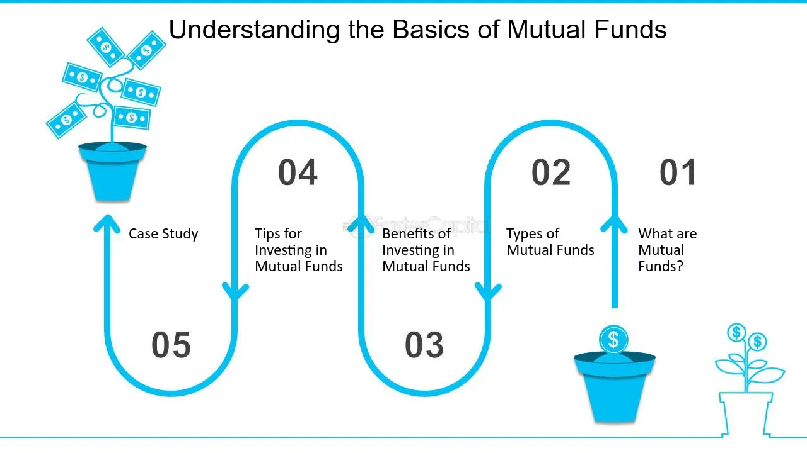

## Table of Contents

## What is mutual fund timing?

Mutual fund timing is when investors try to buy and sell mutual fund shares at the best times to make more money. They look at how the market is doing and try to guess when prices will go up or down. This is different from just keeping your money in a mutual fund for a long time, which is called a buy-and-hold strategy.

Timing can be risky because it's hard to predict the market correctly. If you guess wrong, you might lose money instead of making more. Some people think timing can help them beat the market, but it often doesn't work out that way. It's usually better for most people to stick with a long-term investment plan rather than trying to time the market.

## How does mutual fund timing differ from market timing?

Mutual fund timing and market timing are similar because they both involve trying to buy and sell at the right times to make more money. But they focus on different things. Mutual fund timing is all about picking the best times to buy and sell shares of mutual funds. These funds are made up of a mix of stocks, bonds, or other investments, and the goal is to move in and out of these funds to take advantage of changes in their value.

Market timing, on the other hand, is about trying to predict the overall direction of the stock market or a specific market index, like the S&P 500. People who do market timing might move their money into or out of the stock market based on their predictions about whether the market will go up or down. So, while mutual fund timing focuses on the performance of specific mutual funds, market timing looks at the broader market trends.

Both strategies can be risky because it's hard to predict the future of investments accurately. Many experts believe that trying to time the market or mutual funds often leads to worse results than simply holding onto investments for the long term. That's why most people are advised to stick with a long-term investment plan rather than trying to time their buys and sells.

## What are the basic principles behind mutual fund timing?

Mutual fund timing is about trying to buy and sell mutual fund shares at the best times to make more money. The basic idea is to look at how the market is doing and try to guess when the value of a mutual fund will go up or down. If you think the value will go up soon, you buy the shares. If you think it will go down, you sell them before that happens. This way, you hope to buy low and sell high, making a profit from the changes in the fund's value.

The main challenge with mutual fund timing is that it's really hard to predict the market correctly. Even experts often get it wrong. If you guess wrong and buy when the price is about to drop, or sell when it's about to rise, you could lose money instead of making more. Because of this, many people think it's better to keep your money in a mutual fund for a long time, rather than trying to time your buys and sells. This long-term approach, called a buy-and-hold strategy, is usually safer and can lead to better results over time.

## What are the potential benefits of mutual fund timing?

The main benefit of mutual fund timing is the chance to make more money. If you can guess when a mutual fund's value will go up, you can buy shares at a lower price and sell them at a higher price. This means you could make a bigger profit than if you just kept your money in the fund without trying to time it. It's like trying to catch a wave at the beach – if you time it right, you can ride it to the shore and have a great time.

However, mutual fund timing is risky. It's hard to predict the market, and if you get it wrong, you could lose money. But if you're good at it, or if you get lucky, you could end up with more money than if you didn't try to time the market at all. It's a bit like playing a game where the reward can be big, but so can the risk.

## What are the risks associated with mutual fund timing?

Mutual fund timing can be risky because it's hard to predict when the value of a mutual fund will go up or down. If you guess wrong and buy shares when the price is about to drop, you could lose money. It's like trying to jump on a moving train – if you miss the timing, you might get hurt. Even experts often get it wrong, so it's a big gamble.

Another risk is that you might miss out on good times in the market. If you sell your shares thinking the price will go down, but it actually goes up, you could lose out on those gains. It's like leaving a party early and missing the best part. Plus, trying to time the market can lead to more trading, which means more fees and taxes, which can eat into your profits.

Overall, the risks of mutual fund timing can outweigh the benefits for many people. It's usually safer to stick with a long-term investment plan, where you keep your money in the fund and let it grow over time. This way, you don't have to worry about guessing the market right, and you can avoid the stress and potential losses that come with trying to time it.

## How can an investor start practicing mutual fund timing?

If you want to start practicing mutual fund timing, you need to learn about the market and how mutual funds work. Start by reading up on different mutual funds and how they perform over time. You can look at financial news, websites, and reports to see what experts are saying about the market. It's important to understand the trends and patterns in the market so you can make educated guesses about when to buy and sell.

Once you feel ready, you can begin by choosing a mutual fund you think will do well. Keep an eye on its performance and any news that might affect it. When you think the fund's value is about to go up, buy shares. If you think it's going to drop, sell your shares before that happens. Remember, this is risky, and you might get it wrong, so start with a small amount of money that you can afford to lose. Keep track of your results and learn from your successes and mistakes.

Over time, you'll get better at understanding the market and making decisions. But always remember that mutual fund timing is not a sure thing. Many people find it safer and more reliable to stick with a long-term investment plan, where you hold onto your mutual fund shares for years and let them grow slowly but steadily. If you decide to try timing, do it carefully and be ready for the ups and downs that come with it.

## What tools and resources are essential for effective mutual fund timing?

To practice mutual fund timing effectively, you need good tools and resources. A reliable financial news website or app is important. These can give you up-to-date information on the market and specific mutual funds. You should also use a charting tool to see how a fund's value has changed over time. This can help you spot patterns and make better guesses about when to buy or sell. A good investment tracking platform is also helpful. It lets you keep an eye on your investments and see how they're doing in real time.

Another essential resource is educational material. Books, online courses, and financial blogs can teach you about the market and how to time your investments. Talking to a financial advisor can also be useful. They can give you advice and help you understand the risks and rewards of mutual fund timing. Remember, even with all these tools, timing the market is hard and risky. It's important to use these resources wisely and not to rely on them too much.

## How does mutual fund timing impact long-term investment strategies?

Mutual fund timing can mess up your long-term investment plans. If you keep trying to guess when to buy and sell, you might miss out on the good times in the market. When you're always moving your money around, you might sell your shares when the price is about to go up, and then you won't get those gains. Plus, every time you buy and sell, you might have to pay fees and taxes, which can eat into your profits. So, if you're always timing the market, you might end up with less money than if you just held onto your investments for a long time.

On the other hand, sticking to a long-term investment strategy usually means you keep your money in a mutual fund for many years. This way, you don't have to worry about guessing the market right all the time. Over the years, the market goes up and down, but it usually grows over time. By holding onto your investments, you can ride out the ups and downs and end up with more money in the end. Most experts say that a long-term plan is safer and can lead to better results than trying to time the market.

## Can you provide a case study where mutual fund timing was successfully implemented?

There's a story about a guy named John who tried mutual fund timing and did pretty well. John was always reading financial news and watching the market. He noticed that a certain mutual fund, which invested in tech companies, was doing really well. He decided to buy shares of that fund when he thought the price was about to go up. A few months later, the tech industry had a big boom, and the value of the fund went up a lot. John sold his shares at the right time and made a good profit.

But John knew that timing the market is risky. He didn't put all his money into that one fund. Instead, he only used a small part of his savings for timing, and he kept the rest in a long-term investment plan. This way, even if he got it wrong sometimes, he wouldn't lose too much. John's success with mutual fund timing came from a mix of good research, a bit of luck, and being careful not to risk too much. Even though he did well, he knew that it's hard to keep winning at timing the market, so he stuck with his long-term plan for most of his money.

## What are the regulatory considerations and ethical issues related to mutual fund timing?

When it comes to mutual fund timing, there are rules that investors need to follow. In the United States, the Securities and Exchange Commission (SEC) keeps an eye on how people trade mutual funds. They don't like it when people use timing to take advantage of other investors. For example, if someone keeps buying and selling shares very quickly, it can hurt the fund's performance and other investors who are in it for the long term. The SEC has rules to stop this kind of behavior, and they can punish people who break them. So, if you're thinking about timing mutual funds, you need to know these rules and make sure you're not doing anything that could get you in trouble.

There are also ethical issues to think about with mutual fund timing. It's not just about following the rules; it's about doing what's fair. If you're good at timing the market and you make a lot of money, that's great for you. But if your timing hurts other investors, that's not fair. Some people think that timing the market is like gambling, and it goes against the idea of investing for the long term. It can make the market less stable and can hurt people who are trying to save for their future. So, it's important to think about the impact your actions might have on others and to invest in a way that's honest and fair.

## How do advanced statistical models enhance mutual fund timing strategies?

Advanced statistical models can help investors with mutual fund timing by making better predictions about when to buy and sell. These models use a lot of data to find patterns and trends that might be hard for people to see. For example, they can look at past performance, economic indicators, and even news events to guess what might happen next. By using these models, investors can make more informed decisions about when to get into or out of a mutual fund, which could lead to better results.

But even with these fancy models, mutual fund timing is still risky. The models can help, but they're not perfect. The market can be unpredictable, and things can change quickly. So, while advanced statistical models can give you an edge, they don't take away all the risk. It's important for investors to use these models carefully and not to rely on them too much. Combining the models with a long-term investment plan might be the best way to go, so you can take advantage of the models without putting all your money at risk.

## What are the latest trends and future predictions in mutual fund timing?

The latest trends in mutual fund timing show that more people are using technology to help them make decisions. Apps and software that use [artificial intelligence](/wiki/ai-artificial-intelligence) and [machine learning](/wiki/machine-learning) are becoming popular. These tools can analyze a lot of data quickly and find patterns that might be hard for people to see. They can help investors guess when to buy and sell mutual fund shares. But even with these new tools, mutual fund timing is still risky because the market can be unpredictable.

In the future, experts think that technology will keep getting better and might make mutual fund timing easier. More advanced models and algorithms could help investors make even better guesses about the market. But it's important to remember that no tool can predict the future perfectly. So, even with all these new technologies, many experts still think it's safer to stick with a long-term investment plan. That way, you don't have to worry about trying to time the market and can let your investments grow slowly over time.

## References & Further Reading

[1]: Bergstra, J., Bardenet, R., Bengio, Y., & Kégl, B. (2011). ["Algorithms for Hyper-Parameter Optimization."](https://proceedings.neurips.cc/paper/2011/file/86e8f7ab32cfd12577bc2619bc635690-Paper.pdf) Advances in Neural Information Processing Systems 24.

[2]: ["Advances in Financial Machine Learning"](https://www.amazon.com/Advances-Financial-Machine-Learning-Marcos/dp/1119482089) by Marcos Lopez de Prado

[3]: ["Evidence-Based Technical Analysis: Applying the Scientific Method and Statistical Inference to Trading Signals"](https://www.amazon.com/Evidence-Based-Technical-Analysis-Scientific-Statistical/dp/0470008741) by David Aronson

[4]: ["Machine Learning for Algorithmic Trading"](https://github.com/stefan-jansen/machine-learning-for-trading) by Stefan Jansen

[5]: ["Quantitative Trading: How to Build Your Own Algorithmic Trading Business"](https://www.amazon.com/Quantitative-Trading-Build-Algorithmic-Business/dp/1119800064) by Ernest P. Chan